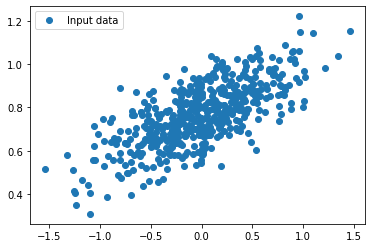
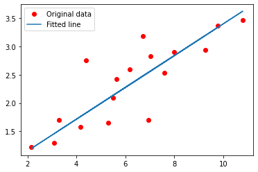
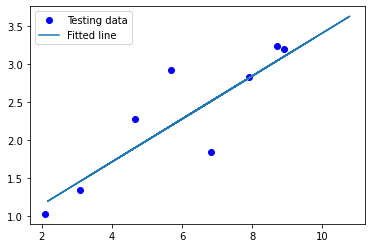
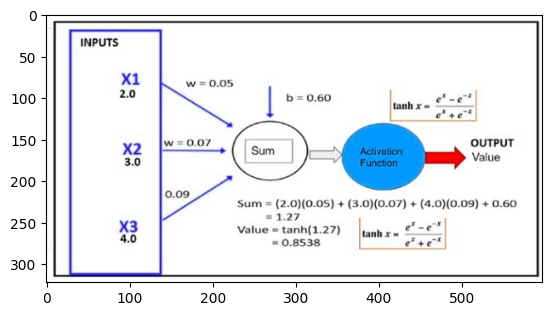
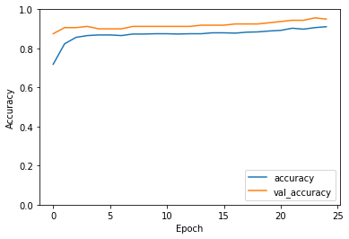

Nguyễn Tiến Anh - B20DCCN005
Bài 3: TENSORFLOW

# 3.1


## Example 1


```python
import tensorflow.compat.v1 as tf

# Tạo hai constant nodes node1 và node2 với kiểu dữ liệu là float32
node1 = tf.constant(3, dtype=tf.float32)
node2 = tf.constant(5, dtype=tf.float32)

# Tạo một node node3 là tổng của node1 và node2
node3 = tf.add(node1, node2)

# Tạo một TensorFlow Session
sess = tf.Session()

# In kết quả của phép cộng node1 và node2
print("Sum of node1 and node2 is: ", sess.run(node3))

# Đóng Session sau khi sử dụng
sess.close()
```

    Sum of node1 and node2 is:  8.0
    

Giải thích code:

- Dòng đầu tiên: Đây là bước đầu tiên, là gọi thư viện `tensorflow`


```python
import tensorflow.compat.v1 as tf
```

- Kế đến khai báo 2 hằng số (constants) `node1` và `node2` lần lượt mang các giá trị `3` và `5`, chúng được tạo ra bởi method `constant` của thư viện `tensorflow`, chúng đều được ắn kiểu dữ liệu là `float32`.


```python
node1 = tf.constant(3, dtype=tf.float32)
node2 = tf.constant(5, dtype=tf.float32)
```

- Sau khi tạo 2 hằng số trên xong, chúng ta tạo ra một phép cộng bằng method `add` và gán nó là `node3` chứa kết quả của phép cộng giữa `node1` và `node2` đã được tạo ở trên. Phép tính này vẫn chưa được thực hiện ngay mà sữ được thực hiện sau khi chúng ta tạo 1 phiên làm việc (session) Tensorflow và chạy nó.


```python
node3 = tf.add(node1, node2)
```

- Sau khi tạo `node3`, chúng ta mở 1 session bằng các sử dụng `tf.Session()`. Session này sẽ thực hiện tính toán cho các phép tính TensorFlow và duy trì trạng thái của các biến TensorFlow trong quá trình chạy.


```python
sess = tf.Session()
```

- Thực hiện in ra kết quả của phép cộng `node1` và `node2`. Chúng ta thực hiện method `run()` và truyền vào `node3` để thực hiện tính toán giá trị của nó


```python
print("Sum of node1 and node2 is: ", sess.run(node3))
```

    Sum of node1 and node2 is:  8.0
    

- Cuối cùng, chúng ta đóng phiên TensorFlow bằng cách sử dụng `sess.close()`. Điều này giúp giải phóng tài nguyên mà phiên TensorFlow sử dụng sau khi hoàn thành công việc.


```python
sess.close()
```

## Example 2


```python
import tensorflow.compat.v1 as tf

# Tạo một hằng số (constant) TensorFlow với giá trị 5 và kiểu dữ liệu float32
x = tf.constant(5, tf.float32)

# Tạo một hằng số TensorFlow là một mảng 1 chiều có giá trị [5] và kiểu dữ liệu float32
y = tf.constant([5], tf.float32)

# Tạo một hằng số TensorFlow là một mảng 1 chiều có giá trị [5, 3, 4] và kiểu dữ liệu float32
z = tf.constant([5, 3, 4], tf.float32)

# Tạo một hằng số TensorFlow là một ma trận có giá trị và kiểu dữ liệu float32
t = tf.constant([[5, 3, 4, 6], [2, 3, 4, 7]], tf.float32)

# Tạo một hằng số TensorFlow là một mảng 3 chiều với kiểu dữ liệu float32
u = tf.constant([[[5, 3, 4, 6], [2, 3, 4, 0]]], tf.float32)

# Tạo một hằng số TensorFlow là một mảng 3 chiều với kiểu dữ liệu float32
v = tf.constant([[[5, 3, 4, 6], [2, 3, 4, 0]],
                 [[5, 3, 4, 6], [2, 3, 4, 0]],
                 [[5, 3, 4, 6], [2, 3, 4, 0]]], tf.float32)

# Hiển thị các biến TensorFlow x, y, z, t, u, v
display(x, y, z, t, u, v)
```


    <tf.Tensor 'Const_4:0' shape=() dtype=float32>


    <tf.Tensor 'Const_5:0' shape=(1,) dtype=float32>


    <tf.Tensor 'Const_6:0' shape=(3,) dtype=float32>


    <tf.Tensor 'Const_7:0' shape=(2, 4) dtype=float32>


    <tf.Tensor 'Const_8:0' shape=(1, 2, 4) dtype=float32>


    <tf.Tensor 'Const_9:0' shape=(3, 2, 4) dtype=float32>


Khác với code đầu tiên, đoạn code này chỉ đơn giản là thực hiện việc gán giá trị cho các biến sử dụng method `constant` của thư viện tensorflow và in các giá trị được gán ra phục vụ cho việc hình dung rõ ràng hơn về method `constant` này.

- Đầu tiên, vẫn là gọi thư viện `tensorflow` và đặt alias cho nó là `tf`


```python
import tensorflow.compat.v1 as tf
```

- Tạo các hằng số lần lượt là `x`, `y`, `z`, `t`, `u`, `v`.
  - `x` là hằng số có giá trị là 5 và được đặt kiểu dữ liệu là float32. Đây là một số nguyên đơn giản được chuyển đổi sang kiểu dữ liệu float32.
  - `y` là một mảng (tensor) 1 chiều chứa một phần tử với giá trị 5 và kiểu dữ liệu float32.
  - `z` là một mảng 1 chiều chứa ba phần tử: 5, 3 và 4.
  - `t` là một ma trận (tensor) 2 chiều với hai hàng và bốn cột. Giá trị của ma trận này được chỉ định bởi danh sách các danh sách (list of lists).
  - `u` là một ma trận 3 chiều với một lớp (hoặc mảng 2D) chứa hai hàng và bốn cột. Ma trận này cũng được chỉ định bởi danh sách của danh sách của danh sách (list of list of lists).
  - `v` là một ma trận 3 chiều với ba lớp (hoặc mảng 2D) mỗi lớp chứa hai hàng và bốn cột. Ma trận này là một ví dụ về tensor 3 chiều.


```python
x = tf.constant(5, tf.float32)
y = tf.constant([5], tf.float32)
z = tf.constant([5,3,4], tf.float32) 
t = tf.constant([[5,3,4,6],[2,3,4,7]], tf.float32) 
u = tf.constant([[[5,3,4,6],[2,3,4,0]]], tf.float32) 
v = tf.constant([[[5,3,4,6],[2,3,4,0]], 
                 [[5,3,4,6],[2,3,4,0]], 
                 [[5,3,4,6],[2,3,4,0]] 
                ], tf.float32) 
```

- Sử dụng `display()` để hiển thị giá trị của các hằng số x, y, z, t, u, và v ra màn hình hoặc giao diện người dùng. Điều này giúp kiểm tra giá trị của các tensor với kích thước và kiểu dữ liệu khác nhau.


```python
display(x, y, z, t, u, v)
```


    <tf.Tensor 'Const_10:0' shape=() dtype=float32>


    <tf.Tensor 'Const_11:0' shape=(1,) dtype=float32>


    <tf.Tensor 'Const_12:0' shape=(3,) dtype=float32>


    <tf.Tensor 'Const_13:0' shape=(2, 4) dtype=float32>


    <tf.Tensor 'Const_14:0' shape=(1, 2, 4) dtype=float32>


    <tf.Tensor 'Const_15:0' shape=(3, 2, 4) dtype=float32>


# 3.2


## Example 1


```python
# Import thư viện TensorFlow phiên bản 1.x
import tensorflow.compat.v1 as tf

# Tạo hai biến x1 và x2 với giá trị ban đầu lần lượt là 5.3 và 4.3, kiểu dữ liệu là float32
x1 = tf.Variable(5.3, tf.float32)
x2 = tf.Variable(4.3, tf.float32)

# Tính tích của hai biến x1 và x2
x = tf.multiply(x1, x2)

# Khởi tạo các biến trong TensorFlow
init = tf.global_variables_initializer()

# Tạo một phiên làm việc (Session) để thực thi các phép tính
with tf.Session() as sess:
    # Thực thi phần khởi tạo biến
    sess.run(init)
    
    # Thực thi phép tính tích và lưu kết quả vào biến 't'
    t = sess.run(x)
    
    # In kết quả tích ra màn hình
    print(t)
```

    22.79
    

Đoạn mã trên là một ví dụ về cách sử dụng TensorFlow phiên bản 1.x để thực hiện các phép tính đơn giản. Dưới đây là giải thích từng phần của mã:

1. Import thư viện TensorFlow phiên bản 1.x:
   - Đầu tiên, mã nhập thư viện TensorFlow và sử dụng phiên bản 1.x của nó bằng cách sử dụng `import tensorflow.compat.v1 as tf`. Điều này đảm bảo rằng bạn đang sử dụng TensorFlow phiên bản 1.x thay vì phiên bản 2.x, vì có sự khác biệt trong cách thực hiện một số phép tính cơ bản.


```python
import tensorflow.compat.v1 as tf
```

2. Tạo hai biến x1 và x2:
   - `x1` và `x2` là hai biến được tạo ra trong TensorFlow. `tf.Variable(5.3, tf.float32)` và `tf.Variable(4.3, tf.float32)` tạo hai biến có giá trị ban đầu là 5.3 và 4.3, và kiểu dữ liệu của chúng là float32.


```python
x1 = tf.Variable(5.3, tf.float32)
x2 = tf.Variable(4.3, tf.float32)
```

3. Tính tích của hai biến x1 và x2:
   - Dòng `x = tf.multiply(x1, x2)` thực hiện phép tính tích của `x1` và `x2` và lưu kết quả vào biến `x`.


```python
x = tf.multiply(x1, x2)
```

4. Khởi tạo các biến trong TensorFlow:
   - Dòng `init = tf.global_variables_initializer()` tạo một biến `init` để khởi tạo tất cả các biến trong TensorFlow.


```python
init = tf.global_variables_initializer()
```

5. Tạo một phiên làm việc (Session) để thực thi các phép tính:

   - Dòng `with tf.Session() as sess` tạo một phiên làm việc TensorFlow và đặt tên nó là `sess`. Phiên làm việc là môi trường để thực thi các phép tính trong TensorFlow.

6. Thực thi phần khởi tạo biến:
   - Dòng `sess.run(init)` thực hiện việc khởi tạo tất cả các biến trong TensorFlow bằng cách chạy biểu thức `init` trong phiên làm việc.
7. Thực thi phép tính tích và lưu kết quả vào biến 't':

   - Dòng `t = sess.run(x)` thực hiện phép tính tích `x` trong phiên làm việc và lưu kết quả vào biến `t`.

8. In kết quả tích ra màn hình:
   - Dòng `print(t)` in giá trị của biến `t` ra màn hình, là kết quả của phép tính tích `x1` và `x2`.


```python
with tf.Session() as sess:
    sess.run(init)    
    t = sess.run(x)
    print(t)
```

    22.79
    

## Example 2


```python
# Import TensorFlow version 1.x
import tensorflow.compat.v1 as tf

# Tạo hai biến TensorFlow x1 và x2 với giá trị ban đầu là các ma trận 2x3 chứa số thực
x1 = tf.Variable([[5.3, 4.5, 6.0], [4.3, 4.3, 7.0]], tf.float32)
x2 = tf.Variable([[4.3, 4.3, 7.0], [5.3, 4.5, 6.0]], tf.float32)

# Thực hiện phép nhân element-wise (nhân từng phần tử tương ứng) giữa x1 và x2, kết quả sẽ là một biến TensorFlow
x = tf.multiply(x1, x2)

# Khởi tạo tất cả các biến trong đồ thị tính toán
init = tf.global_variables_initializer()

# Tạo một phiên (session) TensorFlow và chạy quá trình tính toán
with tf.Session() as sess:
    sess.run(init)  # Khởi tạo tất cả các biến
    t = sess.run(x)  # Thực hiện tính toán và lấy giá trị của biến x
    print(t)  # In ra kết quả của phép nhân element-wise
```

    [[22.79 19.35 42.  ]
     [22.79 19.35 42.  ]]
    

Code trên là một ví dụ về cách sử dụng TensorFlow để thực hiện phép nhân element-wise (nhân từng phần tử tương ứng) giữa hai ma trận `x1` và `x2`. Dưới đây là giải thích từng bước của code:

1. `import tensorflow.compat.v1 as tf`: Đoạn mã sử dụng TensorFlow phiên bản 1.x. TensorFlow là một thư viện mã nguồn mở phổ biến được sử dụng để xây dựng và huấn luyện các mô hình máy học.


```python
import tensorflow.compat.v1 as tf
```

2. `x1` và `x2` là hai biến TensorFlow. Mỗi biến này đại diện cho một ma trận 2x3 chứa số thực. `tf.Variable` được sử dụng để định nghĩa các biến TensorFlow và chỉ định giá trị ban đầu của chúng.


```python
x1 = tf.Variable([[5.3, 4.5, 6.0], [4.3, 4.3, 7.0]], tf.float32)
x2 = tf.Variable([[4.3, 4.3, 7.0], [5.3, 4.5, 6.0]], tf.float32)
```

3. `x = tf.multiply(x1, x2)`: Đây là bước thực hiện phép nhân element-wise giữa `x1` và `x2`. Kết quả là một biến TensorFlow `x` chứa kết quả của phép nhân element-wise này.


```python
x = tf.multiply(x1, x2)
```

4. `init = tf.global_variables_initializer()`: Đoạn mã này tạo một hoạt động để khởi tạo tất cả các biến trong đồ thị tính toán. Trong TensorFlow, bạn cần thực hiện bước khởi tạo trước khi có thể sử dụng giá trị của các biến.


```python
init = tf.global_variables_initializer()
```

5. `with tf.Session() as sess:`: Đây là bước tạo một phiên làm việc (session) TensorFlow. Một phiên TensorFlow là một môi trường thực thi để chạy các hoạt động tính toán và lấy giá trị của các biến.

6. `sess.run(init)`: Bước này chạy hoạt động `init` để khởi tạo tất cả các biến.

7. `t = sess.run(x)`: Bước này chạy hoạt động `x` để thực hiện tính toán phép nhân element-wise và lấy giá trị của biến `x`. Kết quả của phép nhân element-wise được lưu trong biến `t`.

8. `print(t)`: Bước này in ra kết quả của phép nhân element-wise, tức là giá trị của biến `t`.

Kết quả in ra màn hình sẽ là một ma trận 2x3 chứa kết quả của phép nhân element-wise giữa `x1` và `x2`.


```python
with tf.Session() as sess:
    sess.run(init)  
    t = sess.run(x)  
    print(t) 
```

    [[22.79 19.35 42.  ]
     [22.79 19.35 42.  ]]
    

## Example 3


```python
# Import thư viện TensorFlow phiên bản 1.x
import tensorflow.compat.v1 as tf

# Tạo một biến TensorFlow có kích thước 2x2 và khởi tạo giá trị ban đầu là ma trận 2x2 chứa toàn số 0
node = tf.Variable(tf.zeros([2, 2]))

# Bắt đầu một phiên làm việc TensorFlow
with tf.Session() as sess:
    # Khởi chạy toàn bộ biến trong đồ thị tính toán
    sess.run(tf.global_variables_initializer())

    # In giá trị của biến 'node' trước khi thực hiện phép cộng
    print("Tensor value before addition:\n", sess.run(node))

    # Thực hiện phép cộng, gán giá trị mới cho biến 'node'
    node = node.assign(node + tf.ones([2, 2]))

    # In giá trị của biến 'node' sau khi thực hiện phép cộng
    print("Tensor value after addition:\n", sess.run(node))

    # Đóng phiên làm việc TensorFlow
    sess.close()
```

    Tensor value before addition:
     [[0. 0.]
     [0. 0.]]
    Tensor value after addition:
     [[1. 1.]
     [1. 1.]]
    

Code trên là một ví dụ về cách sử dụng TensorFlow để thực hiện phép cộng. Dưới đây là giải thích từng bước của code:

1. Import thư viện TensorFlow phiên bản 1.x:
   ```python
   import tensorflow.compat.v1 as tf
   ```
   Đoạn này import thư viện TensorFlow và sử dụng phiên bản 1.x của nó với tên định danh `tf`.


```python
import tensorflow.compat.v1 as tf
```

2. Tạo một biến TensorFlow có kích thước 2x2 và khởi tạo giá trị ban đầu là ma trận 2x2 chứa toàn số 0:
   ```python
   node = tf.Variable(tf.zeros([2, 2]))
   ```
   Đoạn này tạo một biến TensorFlow có tên `node` với giá trị ban đầu là một ma trận 2x2 chứa toàn số 0.


```python
node = tf.Variable(tf.zeros([2, 2]))
```

3. Bắt đầu một phiên làm việc TensorFlow bằng cách sử dụng `with tf.Session() as sess:`:

   ```python
   with tf.Session() as sess:
   ```

   Đoạn này bắt đầu một phiên làm việc TensorFlow sử dụng `tf.Session()`, và đặt phiên làm việc này trong một khối `with` để tự động đóng phiên sau khi hoàn thành công việc.

4. Khởi chạy toàn bộ biến trong đồ thị tính toán:

   ```python
   sess.run(tf.global_variables_initializer())
   ```

   Dòng này chạy toàn bộ biến trong đồ thị tính toán và khởi tạo giá trị ban đầu cho chúng. Trong trường hợp này, biến `node` được khởi tạo thành ma trận 2x2 chứa toàn số 0.

5. In giá trị của biến 'node' trước khi thực hiện phép cộng:

   ```python
   print("Tensor value before addition:\n", sess.run(node))
   ```

   Dòng này in giá trị của biến `node` trước khi thực hiện phép cộng. Ban đầu, giá trị của `node` là ma trận 2x2 chứa toàn số 0.

6. Thực hiện phép cộng, gán giá trị mới cho biến 'node':

   ```python
   node = node.assign(node + tf.ones([2, 2]))
   ```

   Dòng này thực hiện phép cộng trên biến `node` bằng cách cộng nó với ma trận 2x2 chứa toàn số 1, sau đó gán giá trị mới cho `node`.

7. In giá trị của biến 'node' sau khi thực hiện phép cộng:

   ```python
   print("Tensor value after addition:\n", sess.run(node))
   ```

   Dòng này in giá trị của biến `node` sau khi đã thực hiện phép cộng. Bây giờ, giá trị của `node` đã được cập nhật sau phép cộng.

8. Đóng phiên làm việc TensorFlow bằng cách kết thúc khối `with`:
   ```python
   sess.close()
   ```
   Dòng này đóng phiên làm việc TensorFlow, giải phóng tài nguyên và kết thúc chương trình.


```python
with tf.Session() as sess:
    sess.run(tf.global_variables_initializer())

    print("Tensor value before addition:\n", sess.run(node))

    node = node.assign(node + tf.ones([2, 2]))

    print("Tensor value after addition:\n", sess.run(node))

    sess.close()
```

    Tensor value before addition:
     [[0. 0.]
     [0. 0.]]
    Tensor value after addition:
     [[1. 1.]
     [1. 1.]]
    

# 3.3


## Example 1


```python
import tensorflow.compat.v1 as tf

tf.compat.v1.disable_eager_execution()

x = tf.placeholder(tf.float32, None)
y = tf.add(x, x)

with tf.Session() as sess:
    x_data = 5
    result = sess.run(y, feed_dict={x: x_data})
    print(result)
```

    10.0
    

Code trên sử dụng thư viện TensorFlow (phiên bản 1.x) để thực hiện một số phép tính đơn giản. Dưới đây là các comment giải thích từng phần của mã:

```python
# Nhập thư viện TensorFlow phiên bản 1.x và đặt tên viết tắt là tf
import tensorflow.compat.v1 as tf

# Tắt tính năng eager execution (chế độ chạy ngay lập tức) của TensorFlow
tf.compat.v1.disable_eager_execution()

# Tạo một placeholder (nơi chứa dữ liệu) có kiểu dữ liệu là float32, không xác định kích thước
x = tf.placeholder(tf.float32, None)

# Tạo một phép tính, trong trường hợp này là phép cộng của x với chính nó
y = tf.add(x, x)

# Bắt đầu một phiên làm việc với TensorFlow
with tf.Session() as sess:
    # Đặt giá trị cho biến x_data là 5
    x_data = 5

    # Chạy phép tính y và truyền giá trị của x_data vào placeholder x thông qua feed_dict
    result = sess.run(y, feed_dict={x: x_data})

    # In ra kết quả của phép tính y
    print(result)
```

Code này thực hiện các bước sau:

1. Import TensorFlow phiên bản 1.x và đặt tên viết tắt là `tf`.
2. Tắt tính năng eager execution của TensorFlow, điều này làm cho TensorFlow thực hiện tính toán theo cách truyền thống (được sử dụng trong TensorFlow 1.x) thay vì chế độ tính toán ngay lập tức (eager execution) của TensorFlow 2.x.
3. Tạo một placeholder `x` với kiểu dữ liệu là `float32` và không xác định kích thước. Placeholder là một cơ chế để truyền dữ liệu vào trong đồ thị tính toán của TensorFlow.
4. Tạo một phép tính `y` bằng cách cộng biến `x` với chính nó.
5. Bắt đầu một phiên làm việc với TensorFlow (`with tf.Session() as sess:`). Phiên làm việc này sẽ thực hiện các phép tính trong đồ thị tính toán của TensorFlow.
6. Đặt giá trị cho biến `x_data` là 5.
7. Chạy phép tính `y` bằng cách truyền giá trị của `x_data` vào placeholder `x` thông qua `feed_dict`.
8. In ra kết quả của phép tính `y`, kết quả sẽ là 10 (vì `y` bằng `x + x`, và `x_data` bằng 5).


## Example 2


```python
import tensorflow.compat.v1 as tf

tf.compat.v1.disable_eager_execution()

x = tf.placeholder(tf.float32, [None, 3])
y = tf.add(x, x)

with tf.Session() as sess:
    x_data = [[1.5, 2.0, 3.3]]
    result = sess.run(y, feed_dict={x: x_data})
    print(result)
```

    [[3.  4.  6.6]]
    

Code này sử dụng TensorFlow 1.x để tạo một đồ thị tính toán đơn giản. Dưới đây là một số comment để giải thích từng phần của mã code:

```python
# Import thư viện TensorFlow 1.x và đặt tên viết tắt là 'tf'
import tensorflow.compat.v1 as tf

# Tắt tính năng eager execution trong TensorFlow 2.x để sử dụng được phiên bản 1.x
tf.compat.v1.disable_eager_execution()

# Định nghĩa một placeholder (điểm dừng) x là một tensor chứa các số thực (float32) với kích thước [None, 3].
# [None, 3] có nghĩa là bạn có thể cung cấp bất kỳ số hàng nào, nhưng mỗi hàng phải có 3 giá trị.
x = tf.placeholder(tf.float32, [None, 3])

# Tạo một phép tính tensor y bằng cách cộng tensor x với chính nó.
y = tf.add(x, x)

# Bắt đầu một phiên làm việc TensorFlow.
with tf.Session() as sess:
    # Tạo một dữ liệu mẫu cho tensor x_data là một danh sách gồm một danh sách con chứa 3 giá trị float.
    x_data = [[1.5, 2.0, 3.3]]

    # Chạy phép tính trong đồ thị với dữ liệu đầu vào được cung cấp thông qua feed_dict.
    result = sess.run(y, feed_dict={x: x_data})

    # In kết quả ra màn hình.
    print(result)
```

Code này thực hiện các bước sau:

1. `import tensorflow.compat.v1 as tf`: Dòng này nhập thư viện TensorFlow và sử dụng phiên bản tương thích v1 của nó. Có thể cần sử dụng phiên bản tương thích khi bạn đang sử dụng TensorFlow 2.x, nhưng muốn sử dụng một số tính năng từ TensorFlow 1.x.

2. `tf.compat.v1.disable_eager_execution()`: Hàm này tắt tính năng "eager execution" trong TensorFlow 2.x, chuyển về cách thực hiện tính toán theo cách truyền thống với TensorFlow 1.x. Trong eager execution, các phép tính được thực hiện ngay khi chúng được gọi, trong khi trong TensorFlow 1.x, bạn xây dựng đồ thị tính toán trước và thực hiện chúng trong một phiên TensorFlow riêng biệt.

3. `x = tf.placeholder(tf.float32, [None, 3])`: Đây là một node trong đồ thị tính toán, nơi bạn có thể cung cấp dữ liệu đầu vào sau này. `tf.placeholder` được sử dụng để tạo một vị trí trống trong đồ thị để truyền dữ liệu vào. Trong trường hợp này, `x` là một tensor với kiểu dữ liệu `float32` và có hình dạng `[None, 3]`. `[None, 3]` có nghĩa là `x` có 3 cột (hoặc phần tử) và số hàng (batch size) có thể là bất kỳ (do `None`).

4. `y = tf.add(x, x)`: Đây là một phần khác của đồ thị tính toán. Nó tạo ra một node mới `y`, là kết quả của phép cộng của `x` với chính nó. Nói cách khác, nó sẽ double mỗi phần tử trong `x`.

5. `with tf.Session() as sess`: Đây là một cách để bắt đầu một phiên tính toán TensorFlow. Bên trong khối này, bạn có thể thực hiện các phép tính trong đồ thị tính toán.

6. `x_data = [[1.5, 2.0, 3.3]]`: Đây là dữ liệu bạn muốn cung cấp cho biến `x`. Trong trường hợp này, bạn đang cung cấp một danh sách có một phần tử, và mỗi phần tử là một danh sách với 3 giá trị float.

7. `result = sess.run(y, feed_dict={x: x_data})`: Dòng này thực hiện phép tính `y` (kết quả của phép cộng `x` với chính nó) trong phiên tính toán `sess`. Biến `x` được cung cấp với dữ liệu từ `x_data` thông qua tham số `feed_dict`. Kết quả của phép tính được lưu vào biến `result`.

8. `print(result)`: In kết quả ra màn hình, trong trường hợp này, nó sẽ hiển thị kết quả của phép cộng `x` với chính nó với dữ liệu `x_data`. Kết quả này sẽ là một tensor chứa các giá trị gấp đôi của từng phần tử trong `x_data`.


## Example 3


```python
import tensorflow.compat.v1 as tf

tf.compat.v1.disable_eager_execution()

x = tf.placeholder(tf.float32, [None, None, 3])
y = tf.add(x, x)

with tf.Session() as sess:
    x_data = [[[1, 2, 3]]]
    result = sess.run(y, feed_dict={x: x_data})
    print(result)
```

    [[[2. 4. 6.]]]
    

Code này sử dụng TensorFlow 1.x để định nghĩa và chạy một phép tính đơn giản cộng tensor `x` với chính nó, sử dụng một placeholder `x` để nhận dữ liệu đầu vào. Kết quả của phép tính này được in ra màn hình:

```python
import tensorflow.compat.v1 as tf

# Tắt tính năng eager execution của TensorFlow 2.x
tf.compat.v1.disable_eager_execution()

# Định nghĩa một placeholder để nhận dữ liệu đầu vào là tensor 3 chiều với 3 phần tử
x = tf.placeholder(tf.float32, [None, None, 3])

# Tạo một phép tính TensorFlow để cộng tensor x với chính nó
y = tf.add(x, x)

# Tạo một phiên làm việc TensorFlow
with tf.Session() as sess:
    # Tạo dữ liệu đầu vào x_data là một tensor 3 chiều
    x_data = [[[1, 2, 3]]]

    # Chạy phép tính y và cung cấp dữ liệu đầu vào bằng feed_dict
    result = sess.run(y, feed_dict={x: x_data})

    # In kết quả
    print(result)
```

Code này tạo một biểu đồ tính toán sử dụng TensorFlow 1, sử dụng placeholder để chứa dữ liệu đầu vào, và sau đó tính tổng của dữ liệu đầu vào với chính nó và in ra kết quả:

1. `import tensorflow.compat.v1 as tf`: Đây là dòng import TensorFlow phiên bản 1. TensorFlow phiên bản 2 đã thay đổi một số cú pháp và API so với phiên bản 1.

2. `tf.compat.v1.disable_eager_execution()`: Dòng này tắt tính năng eager execution của TensorFlow 2, để sử dụng API theo cách truyền thống của TensorFlow 1.

3. `x = tf.placeholder(tf.float32, [None, None, 3])`: Tạo một placeholder (điểm dừng) tensor `x` có kiểu dữ liệu là float32 và kích thước là `[None, None, 3]`. `None` ở đây cho phép bạn đặt kích thước tensor sau này.

4. `y = tf.add(x, x)`: Tạo một tensor `y` bằng cách thực hiện phép cộng giữa tensor `x` và chính nó. Kết quả này sẽ đơn giản là `x + x`.

5. `with tf.Session() as sess:`: Tạo một phiên làm việc TensorFlow bằng cách sử dụng `tf.Session()`. Cú pháp này được sử dụng trong TensorFlow 1 để thực hiện các phép tính.

6. `x_data = [[[1, 2, 3]]]`: Tạo dữ liệu đầu vào `x_data`, một tensor 3D với giá trị là `[[[1, 2, 3]]]`.

7. `result = sess.run(y, feed_dict={x: x_data})`: Thực hiện phép tính `y` bằng cách sử dụng `sess.run()`. Giá trị của `x_data` được cung cấp thông qua `feed_dict`, và kết quả được lưu vào biến `result`.

8. `print(result)`: In kết quả của phép tính `y`, trong trường hợp này, nó sẽ là kết quả của phép cộng `x + x` với `x_data`, cho nên kết quả in ra sẽ là `[[[2. 4. 6.]]]`.


## Example 4


```python
import tensorflow.compat.v1 as tf

tf.compat.v1.disable_eager_execution()

x = tf.placeholder(tf.float32, [None, 4, 3])
y = tf.add(x, x)

with tf.Session() as sess:
    x_data = [[[1, 2, 3], [2, 3, 4], [2, 3, 5], [0, 1, 2]]]
    result = sess.run(y, feed_dict={x: x_data})
    print(result)
```

    [[[ 2.  4.  6.]
      [ 4.  6.  8.]
      [ 4.  6. 10.]
      [ 0.  2.  4.]]]
    

Code sử dụng TensorFlow để thực hiện một số phép tính trên tensors và tạo một phiên làm việc TensorFlow để thực hiện các phép tính đó. Code này tạo một tensor mới "y" bằng cách cộng tensor "x" với chính nó, sau đó tính giá trị của "y" với dữ liệu đầu vào được cung cấp thông qua biến "x_data". Dưới đây là code đã được bổ sung thêm comment và giải thích:

```python
import tensorflow.compat.v1 as tf

# Tắt tính năng eager execution của TensorFlow
tf.compat.v1.disable_eager_execution()

# Tạo một placeholder tensor "x" với dtype là float32 và kích thước [None, 4, 3]
x = tf.placeholder(tf.float32, [None, 4, 3])

# Tạo tensor "y" bằng cách cộng tensor "x" với chính nó
y = tf.add(x, x)

# Bắt đầu một phiên làm việc TensorFlow
with tf.Session() as sess:
    # Tạo dữ liệu đầu vào "x_data" là một tensor 3 chiều (1x4x3)
    x_data = [[[1, 2, 3], [2, 3, 4], [2, 3, 5], [0, 1, 2]]]

    # Thực hiện tính toán bằng cách chạy "y" với dữ liệu đầu vào được cung cấp thông qua feed_dict
    result = sess.run(y, feed_dict={x: x_data})

    # In kết quả ra màn hình
    print(result)
```

Giải thích code:

1. import TensorFlow và tắt tính năng eager execution để sử dụng phiên bản cũ của TensorFlow 1.x.

2. Tạo một placeholder tensor "x" với dtype là float32 và kích thước [None, 4, 3]. Placeholder tensor này sẽ được sử dụng để chứa dữ liệu đầu vào sau này.

3. Tạo tensor "y" bằng cách cộng tensor "x" với chính nó. Điều này tạo ra một tensor mới "y" có cùng kích thước và kiểu dữ liệu như "x".

4. Bắt đầu một phiên làm việc TensorFlow bằng cách sử dụng `tf.Session()`.

5. Dữ liệu đầu vào "x_data" được tạo thành một tensor 3 chiều với kích thước (1x4x3).

6. Thực hiện tính toán bằng cách chạy tensor "y" với dữ liệu đầu vào được cung cấp thông qua `feed_dict`, và kết quả được lưu trong biến "result".

7. Cuối cùng, kết quả của phép tính được in ra màn hình.


## Example 5


```python
import tensorflow.compat.v1 as tf

tf.compat.v1.disable_eager_execution()

x = tf.placeholder(tf.float32, [2, 4, 3])
y = tf.add(x, x)

with tf.Session() as sess:
    x_data = [
        [[1, 2, 3], [2, 3, 4], [2, 3, 5], [0, 1, 2]],
        [[1, 2, 3], [2, 3, 4], [2, 3, 5], [0, 1, 2]],
    ]
    result = sess.run(y, feed_dict={x: x_data})
    print(result)
```

    [[[ 2.  4.  6.]
      [ 4.  6.  8.]
      [ 4.  6. 10.]
      [ 0.  2.  4.]]
    
     [[ 2.  4.  6.]
      [ 4.  6.  8.]
      [ 4.  6. 10.]
      [ 0.  2.  4.]]]
    

Code sử dụng TensorFlow để thực hiện một số phép tính trên tensors và tạo một phiên làm việc TensorFlow để thực hiện các phép tính đó. Code này tạo một tensor mới "y" bằng cách cộng tensor "x" với chính nó, sau đó tính giá trị của "y" với dữ liệu đầu vào được cung cấp thông qua biến "x_data". Dưới đây là code đã được bổ sung thêm comment và giải thích:

```python
import tensorflow.compat.v1 as tf

# Tắt tính năng eager execution của TensorFlow
tf.compat.v1.disable_eager_execution()

# Tạo một placeholder tensor "x" với dtype là float32 và kích thước [2, 4, 3]
x = tf.placeholder(tf.float32, [2, 4, 3])

# Tạo tensor "y" bằng cách cộng tensor "x" với chính nó
y = tf.add(x, x)

# Bắt đầu một phiên làm việc TensorFlow
with tf.Session() as sess:
    # Tạo dữ liệu đầu vào "x_data" là một danh sách gồm hai tensor 3 chiều (2x4x3)
    x_data = [
        [[1, 2, 3], [2, 3, 4], [2, 3, 5], [0, 1, 2]],
        [[1, 2, 3], [2, 3, 4], [2, 3, 5], [0, 1, 2]],
    ]

    # Thực hiện tính toán bằng cách chạy "y" với dữ liệu đầu vào được cung cấp thông qua feed_dict
    result = sess.run(y, feed_dict={x: x_data})

    # In kết quả ra màn hình
    print(result)
```

Giải thích mã:

1. Mã import TensorFlow và tắt tính năng eager execution để sử dụng phiên bản cũ của TensorFlow 1.x.

2. Mã tạo một placeholder tensor "x" với dtype là float32 và kích thước [2, 4, 3]. Placeholder tensor này có kích thước cố định.

3. Mã tạo tensor "y" bằng cách cộng tensor "x" với chính nó. Điều này tạo ra một tensor mới "y" có cùng kích thước và kiểu dữ liệu như "x".

4. Mã bắt đầu một phiên làm việc TensorFlow bằng cách sử dụng `tf.Session()`.

5. Dữ liệu đầu vào "x_data" được tạo thành một danh sách gồm hai tensor 3 chiều (2x4x3).

6. Mã thực hiện tính toán bằng cách chạy tensor "y" với dữ liệu đầu vào được cung cấp thông qua `feed_dict`, và kết quả được lưu trong biến "result".

7. Cuối cùng, kết quả của phép tính được in ra màn hình.


## Example 6


```python
import tensorflow.compat.v1 as tf

tf.compat.v1.disable_eager_execution()

x = tf.placeholder(tf.float32, [2, 4, 3])
y = tf.placeholder(tf.float32, [2, 4, 3])

z = tf.add(x, y)
u = tf.multiply(x, y)

with tf.Session() as sess:
    x_data = [
        [[1, 2, 3], [2, 3, 4], [2, 3, 5], [0, 1, 2]],
        [[1, 2, 3], [2, 3, 4], [2, 3, 5], [0, 1, 2]],
    ]
    y_data = [
        [[1, 2, 3], [2, 3, 4], [2, 3, 5], [0, 1, 2]],
        [[1, 2, 3], [2, 3, 4], [2, 3, 5], [0, 1, 2]],
    ]
    result1 = sess.run(z, feed_dict={x: x_data, y: y_data})
    result2 = sess.run(u, feed_dict={x: x_data, y: y_data})
    print("result1 =", result1)
    print("result2 =", result2)
```

    result1 = [[[ 2.  4.  6.]
      [ 4.  6.  8.]
      [ 4.  6. 10.]
      [ 0.  2.  4.]]
    
     [[ 2.  4.  6.]
      [ 4.  6.  8.]
      [ 4.  6. 10.]
      [ 0.  2.  4.]]]
    result2 = [[[ 1.  4.  9.]
      [ 4.  9. 16.]
      [ 4.  9. 25.]
      [ 0.  1.  4.]]
    
     [[ 1.  4.  9.]
      [ 4.  9. 16.]
      [ 4.  9. 25.]
      [ 0.  1.  4.]]]
    

Code sử dụng TensorFlow để thực hiện một số phép tính trên tensors và tạo một phiên làm việc TensorFlow để thực hiện các phép tính đó. Dưới đây là phiên bản đã được bổ sung comment và giải thích cho mã Python sử dụng TensorFlow:

```python
import tensorflow.compat.v1 as tf

# Tắt tính năng eager execution của TensorFlow
tf.compat.v1.disable_eager_execution()

# Tạo hai placeholder tensors "x" và "y" với dtype là float32 và kích thước [2, 4, 3]
x = tf.placeholder(tf.float32, [2, 4, 3])
y = tf.placeholder(tf.float32, [2, 4, 3])

# Tạo tensor "z" bằng cách cộng tensor "x" và "y"
z = tf.add(x, y)

# Tạo tensor "u" bằng cách nhân tensor "x" và "y"
u = tf.multiply(x, y)

# Bắt đầu một phiên làm việc TensorFlow
with tf.Session() as sess:
    # Tạo dữ liệu đầu vào "x_data" và "y_data" là danh sách gồm hai tensor 3 chiều (2x4x3)
    x_data = [
        [[1, 2, 3], [2, 3, 4], [2, 3, 5], [0, 1, 2]],
        [[1, 2, 3], [2, 3, 4], [2, 3, 5], [0, 1, 2]],
    ]
    y_data = [
        [[1, 2, 3], [2, 3, 4], [2, 3, 5], [0, 1, 2]],
        [[1, 2, 3], [2, 3, 4], [2, 3, 5], [0, 1, 2]],
    ]

    # Thực hiện tính toán tensor "z" và tensor "u" bằng cách chạy chúng với dữ liệu đầu vào được cung cấp thông qua feed_dict
    result1 = sess.run(z, feed_dict={x: x_data, y: y_data})
    result2 = sess.run(u, feed_dict={x: x_data, y: y_data})

    # In kết quả ra màn hình
    print("result1 =", result1)
    print("result2 =", result2)
```

Giải thích mã:

1. import TensorFlow và tắt tính năng eager execution để sử dụng phiên bản cũ của TensorFlow 1.x.

2. Tạo hai placeholder tensors "x" và "y" với dtype là float32 và kích thước [2, 4, 3]. Placeholder tensors này có kích thước cố định.

3. Tạo tensor "z" bằng cách cộng tensor "x" và "y" và tạo tensor "u" bằng cách nhân tensor "x" và "y".

4. Bắt đầu một phiên làm việc TensorFlow bằng cách sử dụng `tf.Session()`.

5. Dữ liệu đầu vào "x_data" và "y_data" được tạo thành danh sách gồm hai tensor 3 chiều (2x4x3) tương ứng.

6. Thực hiện tính toán tensor "z" và tensor "u" bằng cách chạy chúng với dữ liệu đầu vào được cung cấp thông qua `feed_dict`, và kết quả được lưu trong biến "result1" và "result2".

7. Cuối cùng, kết quả của cả hai phép tính được in ra màn hình.


# 3.4


## Example 1


```python
import tensorflow.compat.v1 as tf

tf.compat.v1.disable_eager_execution()

x1 = tf.constant(5.3, tf.float32)
x2 = tf.constant(1.5, tf.float32)
w1 = tf.Variable(0.7, tf.float32)
w2 = tf.Variable(0.5, tf.float32)
u = tf.multiply(x1, w1)
v = tf.multiply(x2, w2)
z = tf.add(u, v)
result = tf.sigmoid(z)
init = tf.global_variables_initializer()

with tf.Session() as sess:
    sess.run(init)
    print(sess.run(result))
```

    0.98856974
    

Code sử dụng TensorFlow để thực hiện một số phép tính trên tensors và tạo một session làm việc TensorFlow để thực hiện các phép tính đó. Dưới đây là phiên bản đã được bổ sung comment và giải thích cho code Python sử dụng TensorFlow:

```python
import tensorflow.compat.v1 as tf

# Tắt eager execution của TensorFlow
tf.compat.v1.disable_eager_execution()

# Tạo các constant nodes x1, x2 với kiểu dữ liệu là float32
x1 = tf.constant(5.3, tf.float32)
x2 = tf.constant(1.5, tf.float32)

# Tạo các variable nodes w1, w2 với kiểu dữ liệu là float32
w1 = tf.Variable(0.7, tf.float32)
w2 = tf.Variable(0.5, tf.float32)

# Thực hiện phép nhân element-wise giữa x1 và w1, kết quả là một variable node và gán vào biến u, kiểu dữ liệu là float32
u = tf.multiply(x1, w1)
# Thực hiện phép nhân element-wise giữa x2 và w2, kết quả là một variable node và gán vào biến v, kiểu dữ liệu là float32
v = tf.multiply(x2, w2)
# Thực hiện phép cộng giữa u và v, kết quả là một variable node và gán vào biến z, kiểu dữ liệu là float32
z = tf.add(u, v)
# Thực hiện phép sigmoid trên z, kết quả là một variable node và gán vào biến result, kiểu dữ liệu là float32
result = tf.sigmoid(z)
# Khởi tạo tất cả các biến trong đồ thị tính toán
init = tf.global_variables_initializer()

# Tạo một phiên làm việc (Session) để thực thi các phép tính
with tf.Session() as sess:
    # Thực thi phần khởi tạo biến
    sess.run(init)
    # Thực thi phép tính sigmoid và lưu kết quả vào biến 'result' và in ra màn hình
    print(sess.run(result))
```

Giải thích code:

1. import TensorFlow và tắt tính năng eager execution để sử dụng phiên bản cũ của TensorFlow 1.x.
2. Tạo các constant nodes x1, x2 với kiểu dữ liệu là float32.
3. Tạo các variable nodes w1, w2 với kiểu dữ liệu là float32.
4. Thực hiện phép nhân element-wise giữa x1 với w1 và x2 với w2, kết quả là một variable node và gán vào biến u và v, kiểu dữ liệu là float32.
5. Thực hiện phép cộng giữa u và v, kết quả là một variable node và gán vào biến z, kiểu dữ liệu là float32.
6. Thực hiện phép sigmoid trên z, kết quả là một variable node và gán vào biến result, kiểu dữ liệu là float32.
7. Khởi tạo tất cả các biến trong đồ thị tính toán.
8. Tạo một phiên làm việc (Session) để thực thi các phép tính.
9. Thực thi phần khởi tạo biến.
10. Thực thi phép tính sigmoid và lưu kết quả vào biến 'result' và in ra màn hình.


## Example 2


```python
import numpy as np
import matplotlib.pyplot as plt

number_of_points = 500
x_point = []
y_point = []
a = 0.22
b = 0.78

for i in range(number_of_points):
    x = np.random.normal(0.0, 0.5)
    y = a * x + b + np.random.normal(0.0, 0.1)
    x_point.append([x])
    y_point.append([y])

plt.plot(x_point, y_point, "o", label="Input data")
plt.legend()
plt.show()
```


    

    


Code trên được sử dụng để tạo và hiển thị dữ liệu mô phỏng cho một mô hình tuyến tính đơn giản. Mục đích chính của code này là:

1. Tạo dữ liệu mô phỏng: Sử dụng các tham số `a` và `b`, code tạo ra `number_of_points` điểm dữ liệu `(x, y)` sao cho `y` được tính theo phương trình tuyến tính `y = ax + b` với một lượng nhiễu ngẫu nhiên.

2. Hiển thị dữ liệu trên đồ thị: Sau khi tạo dữ liệu, code sử dụng thư viện `matplotlib` để vẽ đồ thị biểu diễn các điểm dữ liệu. Các điểm dữ liệu được đánh dấu bằng "o" trên đồ thị.

Mục đích chính của việc này là để kiểm tra và hiểu mối quan hệ giữa `x` và `y` trong một mô hình tuyến tính. Mô hình tuyến tính là một mô hình đơn giản trong machine learning và thống kê, và code này giúp bạn xem dữ liệu mô phỏng và mối quan hệ tuyến tính giữa các biến.

Dưới đây là code đã được chú thích và giải thích:

```python
import numpy as np
import matplotlib.pyplot as plt

# Số lượng điểm dữ liệu
number_of_points = 500

# Khởi tạo các danh sách để lưu trữ dữ liệu x và y
x_point = []
y_point = []

# Định nghĩa các hệ số a và b cho phương trình tuyến tính y = ax + b
a = 0.22
b = 0.78

# Tạo dữ liệu mô phỏng
for i in range(number_of_points):
    # Tạo một điểm dữ liệu x ngẫu nhiên từ phân phối chuẩn với giá trị trung bình 0 và độ lệch chuẩn 0.5
    x = np.random.normal(0.0, 0.5)

    # Tính giá trị y tương ứng với x bằng cách sử dụng phương trình tuyến tính y = ax + b
    # và thêm nhiễu ngẫu nhiên từ phân phối chuẩn với giá trị trung bình 0 và độ lệch chuẩn 0.1
    y = a * x + b + np.random.normal(0.0, 0.1)

    # Thêm x và y vào danh sách
    x_point.append([x])
    y_point.append([y])

# Vẽ dữ liệu trên đồ thị
plt.plot(x_point, y_point, "o", label="Input data")
plt.legend()
plt.show()
```

Giải thích:

1. `import numpy as np` và `import matplotlib.pyplot as plt`: Import thư viện numpy để làm việc với mảng và tính toán và thư viện matplotlib để vẽ đồ thị.

2. `number_of_points = 500`: Định nghĩa số lượng điểm dữ liệu mà chúng ta muốn tạo.

3. `x_point = []` và `y_point = []`: Khởi tạo danh sách trống để lưu trữ dữ liệu x và y.

4. `a = 0.22` và `b = 0.78`: Định nghĩa hệ số a và b cho phương trình tuyến tính y = ax + b.

5. Trong vòng lặp `for`, chúng ta tạo dữ liệu mô phỏng:

   - Tạo một điểm dữ liệu x ngẫu nhiên từ phân phối chuẩn với giá trị trung bình 0 và độ lệch chuẩn 0.5.
   - Tính giá trị y tương ứng với x bằng cách sử dụng phương trình tuyến tính y = ax + b và thêm nhiễu ngẫu nhiên từ phân phối chuẩn với giá trị trung bình 0 và độ lệch chuẩn 0.1.
   - Thêm x và y vào danh sách `x_point` và `y_point`.

6. Cuối cùng, chúng ta vẽ dữ liệu trên đồ thị sử dụng `plt.plot`, đánh dấu các điểm dữ liệu bằng "o" và đặt nhãn cho đồ thị. Sau đó, hiển thị đồ thị bằng `plt.show()`. Điều này giúp chúng ta thấy cách dữ liệu được phân phối và có thể quan sát mối quan hệ tuyến tính giữa x và y.


## Example 3


```python
import tensorflow.compat.v1 as tf

tf.compat.v1.disable_eager_execution()

x1 = tf.placeholder(tf.float32, [None, 3])
x2 = tf.placeholder(tf.float32, [None, 3])

w1 = tf.Variable([0.5, 0.4, 0.7], tf.float32)
w2 = tf.Variable([0.8, 0.5, 0.6], tf.float32)

u1 = tf.multiply(w1, x1)
u2 = tf.multiply(w2, x2)
v = tf.add(u1, u2)
z = tf.sigmoid(v)

init = tf.global_variables_initializer()

with tf.Session() as sess:
    x1_data = [[1, 2, 3]]
    x2_data = [[1, 2, 3]]
    sess.run(init)
    result = sess.run(z, feed_dict={x1: x1_data, x2: x2_data})
    print(result)
```

    [[0.7858349  0.85814893 0.9801597 ]]
    

Code Python trên sử dụng TensorFlow để thực hiện tính toán một mạng neuron đơn giản và giải thích cách code hoạt động:

```python
import tensorflow.compat.v1 as tf

# Tắt tính năng eager execution
tf.compat.v1.disable_eager_execution()

# Định nghĩa placeholder để chứa dữ liệu đầu vào
x1 = tf.placeholder(tf.float32, [None, 3])
x2 = tf.placeholder(tf.float32, [None, 3])

# Định nghĩa các trọng số (weights)
w1 = tf.Variable([0.5, 0.4, 0.7], tf.float32)
w2 = tf.Variable([0.8, 0.5, 0.6], tf.float32)

# Tính tổng trọng số nhân với dữ liệu đầu vào
u1 = tf.multiply(w1, x1)
u2 = tf.multiply(w2, x2)

# Tính tổng trọng số đã tính cho cả hai đầu vào
v = tf.add(u1, u2)

# Áp dụng hàm sigmoid để tính giá trị đầu ra
z = tf.sigmoid(v)

# Khởi tạo biến toàn cục
init = tf.global_variables_initializer()

# Bắt đầu một phiên làm việc TensorFlow
with tf.Session() as sess:
    x1_data = [[1, 2, 3]]
    x2_data = [[1, 2, 3]]

    # Khởi tạo các biến toàn cục
    sess.run(init)

    # Đưa dữ liệu vào placeholder và tính giá trị đầu ra
    result = sess.run(z, feed_dict={x1: x1_data, x2: x2_data})

    # In kết quả
    print(result)
```

Giải thích code:

1. Import thư viện TensorFlow và tắt eager execution để sử dụng các phiên bản cũ hơn của TensorFlow.
2. Định nghĩa hai placeholder `x1` và `x2` để chứa dữ liệu đầu vào. Placeholder này sẽ được sử dụng để cung cấp dữ liệu đầu vào vào mạng neuron.
3. Định nghĩa hai biến `w1` và `w2` để lưu trữ trọng số của mạng neuron.
4. Tính tích của trọng số `w1` và `x1` và lưu vào biến `u1`, tương tự cho `w2` và `x2` được lưu vào biến `u2`.
5. Tính tổng của `u1` và `u2` và lưu vào biến `v`.
6. Áp dụng hàm sigmoid để tính giá trị đầu ra `z` của mạng neuron.
7. Khởi tạo biến toàn cục.
8. Bắt đầu một phiên làm việc TensorFlow (`with tf.Session() as sess`).
9. Đưa dữ liệu vào placeholder bằng cách sử dụng `feed_dict` và tính giá trị đầu ra `z`.
10. In giá trị đầu ra.


## Example 4


```python
import tensorflow.compat.v1 as tf 
import numpy as np 

matrix1 = np.array([(2,2,2),(2,2,2),(2,2,2)],dtype = 'int32') 
matrix2 = np.array([(1,1,1),(1,1,1),(1,1,1)],dtype = 'int32') 

print (matrix1) 
print (matrix2) 

matrix1 = tf.constant(matrix1) 
matrix2 = tf.constant(matrix2) 
matrix_product = tf.matmul(matrix1, matrix2) 
matrix_sum = tf.add(matrix1,matrix2) 
matrix_3 = np.array([(2,7,2),(1,4,2),(9,0,2)],dtype = 'float32') 
print (matrix_3) 

matrix_det = tf.linalg.det(matrix_3) 
with tf.Session() as sess: 
  result1 = sess.run(matrix_product) 
  result2 = sess.run(matrix_sum) 
  result3 = sess.run(matrix_det) 

print ('result1: ', result1) 
print ('result2: ', result2) 
print ('result3: ', result3)
```

    [[2 2 2]
     [2 2 2]
     [2 2 2]]
    [[1 1 1]
     [1 1 1]
     [1 1 1]]
    [[2. 7. 2.]
     [1. 4. 2.]
     [9. 0. 2.]]
    result1:  [[6 6 6]
     [6 6 6]
     [6 6 6]]
    result2:  [[3 3 3]
     [3 3 3]
     [3 3 3]]
    result3:  55.999992
    

Code trên được sử dụng để thực hiện các phép tính trên ma trận sử dụng thư viện TensorFlow và NumPy. Cụ thể, nó thực hiện các công việc sau:

1. Tạo và in ra giá trị của hai ma trận numpy `matrix1` và `matrix2`. Hai ma trận này có giá trị bằng nhau và có kiểu dữ liệu là `int32`.

2. Chuyển đổi `matrix1` và `matrix2` thành các constant TensorFlow để sử dụng chúng trong tính toán TensorFlow.

3. Thực hiện phép nhân ma trận `matrix_product` và phép cộng ma trận `matrix_sum` bằng cách sử dụng các hàm TensorFlow `tf.matmul` và `tf.add`.

4. Tạo một ma trận numpy `matrix_3` khác với kiểu dữ liệu là `float32` và in ra giá trị của nó.

5. Tính định thức của `matrix_3` sử dụng hàm TensorFlow `tf.linalg.det`.

6. Bắt đầu một phiên làm việc TensorFlow và thực hiện các phép tính trên các constant TensorFlow đã được tạo trước đó.

7. In ra kết quả của phép nhân ma trận, phép cộng ma trận và định thức trên màn hình.

```python
# Import TensorFlow và NumPy
import tensorflow.compat.v1 as tf
import numpy as np

# Khởi tạo hai ma trận numpy có kiểu dữ liệu là int32
matrix1 = np.array([(2, 2, 2), (2, 2, 2), (2, 2, 2)], dtype='int32')
matrix2 = np.array([(1, 1, 1), (1, 1, 1), (1, 1, 1)], dtype='int32')

# In ra giá trị của hai ma trận
print(matrix1)
print(matrix2)

# Chuyển đổi hai ma trận numpy thành các constant TensorFlow
matrix1 = tf.constant(matrix1)
matrix2 = tf.constant(matrix2)

# Thực hiện phép nhân ma trận
matrix_product = tf.matmul(matrix1, matrix2)

# Thực hiện phép cộng hai ma trận
matrix_sum = tf.add(matrix1, matrix2)

# Khởi tạo một ma trận numpy khác với kiểu dữ liệu là float32
matrix_3 = np.array([(2, 7, 2), (1, 4, 2), (9, 0, 2)], dtype='float32')

# In ra giá trị của ma trận mới
print(matrix_3)

# Tính định thức của ma trận matrix_3 bằng TensorFlow
matrix_det = tf.linalg.det(matrix_3)

# Bắt đầu một phiên làm việc TensorFlow
with tf.Session() as sess:
    # Thực hiện phép nhân ma trận và lưu kết quả vào result1
    result1 = sess.run(matrix_product)
    
    # Thực hiện phép cộng ma trận và lưu kết quả vào result2
    result2 = sess.run(matrix_sum)
    
    # Tính định thức của ma trận và lưu kết quả vào result3
    result3 = sess.run(matrix_det)

# In ra kết quả của phép nhân, phép cộng, và định thức
print ('result1: ', result1) 
print ('result2: ', result2) 
print ('result3: ', result3)
```

# 3.5


## Code


```python
# Import thư viện TensorFlow phiên bản 1.x và các thư viện khác cần thiết
import tensorflow.compat.v1 as tf
import numpy as np
import matplotlib.pyplot as plt

tf.disable_eager_execution()

# Thiết lập các tham số cho quá trình huấn luyện
learning_rate = 0.01
training_epochs = 2000
display_step = 200

# Dữ liệu huấn luyện, gồm các điểm dữ liệu X và nhãn y tương ứng
train_X = np.asarray(
    [
        3.3,
        4.4,
        5.5,
        6.71,
        6.93,
        4.168,
        9.779,
        6.182,
        7.59,
        2.167,
        7.042,
        10.791,
        5.313,
        7.997,
        5.654,
        9.27,
        3.1,
    ]
)
train_y = np.asarray(
    [
        1.7,
        2.76,
        2.09,
        3.19,
        1.694,
        1.573,
        3.366,
        2.596,
        2.53,
        1.221,
        2.827,
        3.465,
        1.65,
        2.904,
        2.42,
        2.94,
        1.3,
    ]
)

# Số lượng mẫu dữ liệu huấn luyện
n_samples = train_X.shape[0]

# Dữ liệu kiểm tra
test_X = np.asarray([6.83, 4.668, 8.9, 7.91, 5.7, 8.7, 3.1, 2.1])
test_y = np.asarray([1.84, 2.273, 3.2, 2.831, 2.92, 3.24, 1.35, 1.03])

# Khai báo biến đầu tiên (weight) và biến thứ hai (bias) của mô hình
W = tf.Variable(np.random.randn(), name="weight")
b = tf.Variable(np.random.randn(), name="bias")

X = tf.placeholder(tf.float32) 
y = tf.placeholder(tf.float32)

# Xây dựng mô hình tuyến tính: linear_model = W * X + b
linear_model = W * X + b

# Tính toán hàm mất mát bằng cách tính bình phương sai số và lấy trung bình
cost = tf.reduce_sum(tf.square(linear_model - y)) / (2 * n_samples)

# Sử dụng tối ưu hóa gradient descent để cập nhật weight (W) và bias (b)
optimizer = tf.train.GradientDescentOptimizer(learning_rate).minimize(cost)

# Khởi tạo tất cả các biến trong mô hình
init = tf.global_variables_initializer()

# Bắt đầu phiên làm việc với TensorFlow
with tf.Session() as sess:
    sess.run(init)
    for epoch in range(training_epochs):
        # Thực hiện một vòng lặp huấn luyện
        sess.run(optimizer, feed_dict={X: train_X, y: train_y})
        if (epoch + 1) % display_step == 0:
            # In thông tin về tiến trình huấn luyện
            c = sess.run(cost, feed_dict={X: train_X, y: train_y})
            print(
                "Epoch:{0:6} \t Cost:{1:10.4} \t W:{2:6.4} \t b:{3:6.4}".format(
                    epoch + 1, c, sess.run(W), sess.run(b)
                )
            )
    print("Optimization Finished!")

    # Tính giá trị mất mát trên tập huấn luyện cuối cùng
    training_cost = sess.run(cost, feed_dict={X: train_X, y: train_y})
    print(
        "Final training cost:",
        training_cost,
        "W:",
        sess.run(W),
        "b:",
        sess.run(b),
        "\n",
    )

    # Hiển thị đồ thị dữ liệu và đường tuyến tính tìm được
    plt.plot(train_X, train_y, "ro", label="Original data")
    plt.plot(train_X, sess.run(W) * train_X + sess.run(b), label="Fitted line")
    plt.legend()
    plt.show()

    # Kiểm tra mô hình trên dữ liệu kiểm tra
    testing_cost = sess.run(
        tf.reduce_sum(tf.square(linear_model - y)) / (2 * test_X.shape[0]),
        feed_dict={X: test_X, y: test_y},
    )

    print("Final testing cost:", testing_cost)
    print("Absolute mean square loss difference:", abs(training_cost - testing_cost))

    # Hiển thị đường tuyến tính trên dữ liệu kiểm tra
    plt.plot(test_X, test_y, "bo", label="Testing data")
    plt.plot(train_X, sess.run(W) * train_X + sess.run(b), label="Fitted line")
    plt.legend()
    plt.show()

```

    Epoch:   200 	 Cost:    0.2964 	 W:0.5172 	 b:-1.084
    Epoch:   400 	 Cost:    0.2119 	 W:0.4599 	 b:-0.6781
    Epoch:   600 	 Cost:      0.16 	 W: 0.415 	 b:-0.3596
    Epoch:   800 	 Cost:     0.128 	 W:0.3798 	 b:-0.1097
    Epoch:  1000 	 Cost:    0.1084 	 W:0.3522 	 b:0.08619
    Epoch:  1200 	 Cost:   0.09627 	 W:0.3305 	 b:0.2399
    Epoch:  1400 	 Cost:   0.08882 	 W:0.3135 	 b:0.3604
    Epoch:  1600 	 Cost:   0.08425 	 W:0.3001 	 b: 0.455
    Epoch:  1800 	 Cost:   0.08143 	 W:0.2897 	 b:0.5291
    Epoch:  2000 	 Cost:    0.0797 	 W:0.2815 	 b:0.5873
    Optimization Finished!
    Final training cost: 0.07969851 W: 0.28147176 b: 0.5872716 
    
    


    

    


    Final testing cost: 0.075300016
    Absolute mean square loss difference: 0.004398495
    


    

    


## Giải thích


Code trên là một ví dụ đơn giản về việc sử dụng TensorFlow để tạo và huấn luyện một mô hình hồi quy tuyến tính trên dữ liệu giả định. Dưới đây là sự giải thích chi tiết cho từng phần của mã:

1. **Import thư viện và khai báo tham số**: 

   ```python
   import tensorflow.compat.v1 as tf
   import numpy as np
   import matplotlib.pyplot as plt
   ```

   Đầu tiên, các thư viện TensorFlow, NumPy và Matplotlib được import để sử dụng trong mã. TensorFlow phiên bản 1.x được sử dụng ở đây.

   ```python
   learning_rate = 0.01
   training_epochs = 2000
   display_step = 200
   ```

   Các tham số huấn luyện được định nghĩa ở đây, bao gồm tỷ lệ học (learning_rate), số lượng epoch (training_epochs) và bước hiển thị thông tin trong quá trình huấn luyện (display_step).

2. **Dữ liệu huấn luyện và kiểm tra**:

   ```python
   train_X = np.asarray([...])
   train_y = np.asarray([...])
   ```

   Dữ liệu huấn luyện và kiểm tra được định nghĩa ở đây. `train_X` là danh sách các giá trị đầu vào của dữ liệu huấn luyện, và `train_y` là các nhãn tương ứng. Tương tự, `test_X` và `test_y` đại diện cho dữ liệu kiểm tra.

3. **Khai báo biến và mô hình**:

   ```python
   W = tf.Variable(np.random.randn(), name="weight")
   b = tf.Variable(np.random.randn(), name="bias")
   ```

   Các biến weight (W) và bias (b) của mô hình được khai báo và khởi tạo với các giá trị ngẫu nhiên ban đầu.

   ```python
   X = tf.placeholder(tf.float32)
   y = tf.placeholder(tf.float32)
   ```

   Hai placeholder `X` và `y` được sử dụng để đặt giá trị đầu vào và đầu ra của mô hình.

   ```python
   linear_model = W * X + b
   ```

   Mô hình tuyến tính được định nghĩa ở đây: `linear_model = W * X + b`.

4. **Hàm mất mát và tối ưu hóa**:

   ```python
   cost = tf.reduce_sum(tf.square(linear_model - y)) / (2 * n_samples)
   ```

   Hàm mất mát (cost) được định nghĩa là bình phương sai số giữa giá trị dự đoán và giá trị thực tế, được chia cho hai lần số lượng mẫu huấn luyện.

   ```python
   optimizer = tf.train.GradientDescentOptimizer(learning_rate).minimize(cost)
   ```

   Một tối ưu hóa gradient descent được tạo để cập nhật weight (W) và bias (b) sao cho hàm mất mát được giảm thiểu.

5. **Khởi tạo biến và phiên làm việc TensorFlow**:

   ```python
   init = tf.global_variables_initializer()
   ```

   Một toán tử khởi tạo được tạo để khởi tạo tất cả các biến trong mô hình.

   ```python
   with tf.Session() as sess:
   ```

   Sử dụng `tf.Session()` để bắt đầu phiên làm việc với TensorFlow.

6. **Huấn luyện mô hình**:

   ```python
   for epoch in range(training_epochs):
       sess.run(optimizer, feed_dict={X: train_X, y: train_y})
       if (epoch + 1) % display_step == 0:
           c = sess.run(cost, feed_dict={X: train_X, y: train_y})
           print("Epoch:{0:6} \t Cost:{1:10.4} \t W:{2:6.4} \t b:{3:6.4}".format(epoch + 1, c, sess.run(W), sess.run(b)))
   ```

   Mô hình được huấn luyện qua nhiều epoch, trong mỗi epoch, weight và bias được cập nhật dựa trên dữ liệu huấn luyện. Thông tin về tiến trình huấn luyện được in ra màn hình sau mỗi `display_step` epoch.

7. **Hiển thị đồ thị**:

   ```python
   plt.plot(train_X, train_y, "ro", label="Original data")
   plt.plot(train_X, sess.run(W) * train_X + sess.run(b), label="Fitted line")
   plt.legend()
   plt.show()
   ```

   Sau khi huấn luyện, đồ thị dữ liệu gốc và đường tuyến tính tìm được được hiển thị để thấy mức độ phù hợp của mô hình.

8. **Kiểm tra mô hình trên dữ liệu kiểm tra**:

   ```python
   testing_cost = sess.run(tf.reduce_sum(tf.square(linear_model - y)) / (2 * test_X.shape[0]), feed_dict={X: test_X, y: test_y})
   ```

   Mô hình được kiểm tra trên dữ liệu kiểm tra, và giá trị mất mát trên dữ liệu kiểm tra được tính.

9. **Hiển thị đường tuyến tính trên dữ liệu kiểm tra**:

   ```python
   plt.plot(test_X, test_y, "bo", label="Testing data")
   plt.plot(train_X, sess.run(W) * train_X + sess.run(b), label="Fitted line")
   plt.legend()
   plt.show()
   ```

   Đồ thị dữ liệu kiểm tra và đường tuyến tính được hiển thị để đánh giá hiệu suất của mô hình trên dữ liệu kiểm tra.

# 3.6

## a. Đọc và hiểu


```python
import matplotlib.pyplot as plt
import cv2

img = cv2.imread("./anh/SharedScreenshot.png")

plt.imshow(img)
# plt.show()
```


    <matplotlib.image.AxesImage at 0x1fb631dd040>


    

    


Ý tưởng về **Activation functions** xuất phát từ việc phân tích các neuron trong não người hoạt động như nào. Các neuron trở nên tích cực (hoạt động) khi nhận được một tín hiệu đầu vào lớn hơn một ngưỡng nhất định. Tín hiệu này được truyền qua các neuron khác và cuối cùng được truyền đến các neuron đầu ra. Tương tự, trong mạng neuron nhân tạo, các neuron đầu ra cũng được tính toán dựa trên các neuron đầu vào. Tuy nhiên, các neuron trong mạng neuron nhân tạo không phải lúc nào cũng hoạt động như các neuron trong não người. Thay vào đó, các neuron trong mạng neuron nhân tạo được kích hoạt bằng các hàm kích hoạt (activation functions). Các hàm kích hoạt này có thể là các hàm tuyến tính hoặc phi tuyến tính. Các hàm kích hoạt phi tuyến tính được sử dụng phổ biến hơn vì chúng có thể giúp mô hình học được các mối quan hệ phức tạp hơn giữa các đặc trưng đầu vào và đầu ra.

Trong sơ đồ ví dụ ở trên, chúng ta có thể thấy rằng mạng neuron này được chia ra làm 3 layer chính:
1. Input layer: Layer đầu tiên của mạng neuron, nhận đầu vào là các đặc trưng của dữ liệu.
2. Hidden layer: Layer ẩn, nhận đầu vào là đầu ra của layer trước đó và tính toán các giá trị ẩn.
3. Output layer: Layer đầu ra, nhận đầu vào là đầu ra của layer trước đó và tính toán các giá trị đầu ra.

Mỗi layer trong mạng neuron nhân tạo có thể có nhiều neuron. Các neuron trong một layer được kết nối với các neuron trong layer trước đó và layer sau đó. Các kết nối này được gọi là các trọng số (weights). Các trọng số này được cập nhật trong quá trình huấn luyện mô hình. Các neuron trong một layer được kích hoạt bằng các hàm kích hoạt (activation functions). Các hàm kích hoạt này có thể là các hàm tuyến tính hoặc phi tuyến tính. Các hàm kích hoạt phi tuyến tính được sử dụng phổ biến hơn vì chúng có thể giúp mô hình học được các mối quan hệ phức tạp hơn giữa các đặc trưng đầu vào và đầu ra.

Các hàm kích hoạt phi tuyến tính phổ biến nhất được sử dụng trong mạng neuron nhân tạo là hàm sigmoid, hàm tanh, hàm ReLU và hàm softmax.

1. **Hàm sigmoid**: Hàm sigmoid được định nghĩa là `f(x) = 1 / (1 + e^(-x))`. Hàm này có giá trị nằm trong khoảng (0, 1). Hàm sigmoid được sử dụng phổ biến trong các mạng neuron nhân tạo để tính toán xác suất của một điểm dữ liệu thuộc vào một lớp nào đó. Hàm sigmoid có đạo hàm dễ tính là `f'(x) = f(x) * (1 - f(x))`. Hàm sigmoid có dạng như sau:

    

2. **Hàm tanh**: Hàm tanh được định nghĩa là `f(x) = (e^x - e^(-x)) / (e^x + e^(-x))`. Hàm này có giá trị nằm trong khoảng (-1, 1). Hàm tanh có đạo hàm dễ tính là `f'(x) = 1 - f(x)^2`. Hàm tanh có dạng như sau:

    

3. **Hàm ReLU**: Hàm ReLU được định nghĩa là `f(x) = max(0, x)`. Hàm này có giá trị nằm trong khoảng [0, +∞). Hàm ReLU có đạo hàm dễ tính là `f'(x) = 1 nếu x > 0, và 0 nếu x <= 0`. Hàm ReLU có dạng như sau:

    

4. **Hàm softmax**: Hàm softmax được định nghĩa là `f(x) = e^x / sum(e^x)`. Hàm này có giá trị nằm trong khoảng (0, 1). Hàm softmax được sử dụng phổ biến trong các mạng neuron nhân tạo để tính toán xác suất của một điểm dữ liệu thuộc vào một lớp nào đó. Hàm softmax có dạng như sau:

    

### Code mẫu


```python
import tensorflow.compat.v1 as tf
import numpy as np

tf.disable_eager_execution()

sess = tf.Session()
```

#### Hàm tanh


```python
E = tf.nn.tanh([10, 2, 1, 0.5, 0, -0.5, -1., -2., -10.])
print(sess.run(E))
```

    [ 1.          0.9640276   0.7615942   0.46211717  0.         -0.46211717
     -0.7615942  -0.9640276  -1.        ]
    

#### Hàm sigmoid


```python
J = tf.nn.sigmoid([10, 2, 1, 0.5, 0, -0.5, -1., -2., -10.])
print(sess.run(J))
```

    [9.9995458e-01 8.8079709e-01 7.3105860e-01 6.2245929e-01 5.0000000e-01
     3.7754071e-01 2.6894143e-01 1.1920291e-01 4.5399931e-05]
    

#### Hàm ReLU


```python
A = tf.nn.relu([-2, 1, -2, 13])
print(sess.run(A))
```

    [ 0  1  0 13]
    

## b. Thiết kế mạng neuron ví dụ

Mạng Neuron Đơn Giản
-----------------------

1. Đầu vào (input):
    - Kích thước đầu vào: input_shape

2. Lớp ẩn (Hidden Layer):
    - Loại hàm kích hoạt: ReLU
    - Số đơn vị ẩn: 32

3. Lớp đầu ra (Output Layer):
    - Loại hàm kích hoạt: Sigmoid
    - Số đơn vị đầu ra: 1

4. Biên dịch (Compilation):
    - Hàm mất mát: binary_crossentropy
    - Trình tối ưu: Adam
    - Độ đo: accuracy


```python
import tensorflow as tf
from tensorflow.keras.models import Sequential
from tensorflow.keras.layers import Dense
# Đặt kích thước của input_shape là (10,) nếu có 10 đặc trưng.
input_shape = (10,)

# Tạo một mô hình Sequential
model = Sequential()

# Thêm một lớp ẩn với hàm kích hoạt ReLU và 32 đơn vị ẩn
model.add(Dense(32, activation='relu', input_shape=input_shape))

# Thêm lớp đầu ra với hàm kích hoạt Sigmoid 
# (phù hợp cho bài toán phân loại nhị phân)
model.add(Dense(1, activation='sigmoid'))

# Biên dịch mô hình với hàm mất mát và trình tối ưu
model.compile(loss='binary_crossentropy', optimizer='adam', metrics=['accuracy'])

# Hiển thị thông tin về mô hình
model.summary()
```

    Model: "sequential"
    _________________________________________________________________
    Layer (type)                 Output Shape              Param #   
    =================================================================
    dense (Dense)                (None, 32)                352       
    _________________________________________________________________
    dense_1 (Dense)              (None, 1)                 33        
    =================================================================
    Total params: 385
    Trainable params: 385
    Non-trainable params: 0
    _________________________________________________________________
    

Mạng Neuron Sigmoid Đơn Giản
------------------------------

1. Khởi tạo một mạng neuron Sigmoid:
    - Đầu vào (input_size): Số lượng trọng số (weights) của neuron.

2. Trong khởi tạo:
    - Khởi tạo ngẫu nhiên trọng số (weights) cho mỗi đầu vào.
    - Khởi tạo ngẫu nhiên một độ lệch (bias).

3. Hàm Sigmoid:
    - Hàm sigmoid được định nghĩa như sau:
      Sigmoid(x) = 1 / (1 + exp(-x))

4. Quá trình tiến (forward):
    - Nhận đầu vào (inputs).
    - Tính tổng có trọng số của các đầu vào và áp dụng hàm Sigmoid.
    - Trả về giá trị đầu ra của neuron.

5. Tạo một mẫu neuron với 3 trọng số đầu vào (input weights).

6. Đầu vào (inputs):
    - Một mảng chứa giá trị đầu vào với 3 phần tử.

7. Tính toán đầu ra của neuron:
    - Sử dụng hàm forward để tính toán đầu ra của neuron dựa trên đầu vào đã cho.

8. Hiển thị kết quả:
    - In ra giá trị đầu vào và giá trị đầu ra của neuron.


```python
import numpy as np

class SigmoidNeuron:
    def __init__(self, input_size):
        # Initialize weights and bias
        self.weights = np.random.rand(input_size)
        self.bias = np.random.rand()
    
    def sigmoid(self, x):
        # Sigmoid activation function
        return 1 / (1 + np.exp(-x))
    
    def forward(self, inputs):
        # Calculate the weighted sum of inputs and apply the sigmoid activation function
        weighted_sum = np.dot(inputs, self.weights) + self.bias
        return self.sigmoid(weighted_sum)

# Create a sample neuron with 3 input weights
neuron = SigmoidNeuron(3)

# Input values
inputs = np.array([0.5, 0.7, 0.2])

# Calculate the output of the neuron
output = neuron.forward(inputs)

print("Input:", inputs)
print("Output:", output)

```

    Input: [0.5 0.7 0.2]
    Output: 0.6682353380446576
    

# 3.7

1. Import các thư viện cần thiết:
   - `numpy` và `pandas` để làm việc với dữ liệu.
   - `make_classification` từ `sklearn.datasets` để tạo dữ liệu giả lập cho bài toán phân loại nhị phân.

2. Tạo dữ liệu mẫu:
   - Sử dụng hàm `make_classification`, code tạo ra dữ liệu giả lập với các thông số sau:
     - `n_samples=1000`: Số lượng mẫu dữ liệu sẽ được tạo.
     - `n_features=5`: Số lượng đặc trưng (features) trong dữ liệu.
     - `random_state=42`: Seed để có thể tái tạo dữ liệu giả lập.
     - `n_classes=2`: Số lớp/classes của bài toán phân loại (2 lớp cho phân loại nhị phân).
     - `weights=[0.7, 0.3]`: Tỷ lệ của các lớp, trong trường hợp này, lớp 0 có tỷ lệ 70% và lớp 1 có tỷ lệ 30%.
   - Kết quả của hàm `make_classification` là dữ liệu và nhãn tương ứng.

3. Đặt tên cho các features và nhãn:
   - Dữ liệu và nhãn từ bước trước được lưu vào một DataFrame của pandas.
   - Các cột của DataFrame được đặt tên tương ứng với từng feature, gồm 'tuoi', 'gioi_tinh', 'chieu_cao', 'can_nang', và 'luong_calo'.
   - Cột 'giam_can' được thêm vào DataFrame để lưu nhãn của bài toán phân loại.

4. Lưu dữ liệu vào file CSV


```python
import numpy as np
import pandas as pd
from sklearn.datasets import make_classification

# Tạo dữ liệu giả lập với tên đặc trưng được đặt tên cụ thể
X, y = make_classification(
    n_samples=1000,
    n_features=5,
    random_state=42,
    n_classes=2,
    weights=[0.7, 0.3],
)

# Đặt tên cho các đặc trưng
data = pd.DataFrame(data=X,columns=['tuoi', 'gioi_tinh', 
                                    'chieu_cao', 'can_nang', 
                                    'luong_calo'])
data['giam_can'] = y

# Lưu dữ liệu vào file CSV
data.to_csv('./data/du-lieu-giam-can.csv', index=False)

```

1. Import các thư viện cần thiết:
   - `numpy` và `pandas` để làm việc với dữ liệu.
   - `matplotlib.pyplot` để vẽ biểu đồ.
   - `Sequential` và `Dense` từ `keras.models` để xây dựng mạng nơ-ron sâu (feedforward neural network).
   - `train_test_split` từ `sklearn.model_selection` để chia dữ liệu thành tập huấn luyện và tập kiểm tra.
   - `StandardScaler` từ `sklearn.preprocessing` để chuẩn hóa dữ liệu.

2. Đọc dữ liệu từ file CSV:
   - Dữ liệu được đọc từ một file CSV có tên "du-lieu-giam-can.csv" 
   - Dữ liệu này là dữ liệu về các đặc trưng (features) và kết quả (target) của việc giảm cân.

3. Xác định features (đặc trưng) và target (kết quả):
   - Cột "giam_can" được xác định là target (kết quả) và được lưu trong biến `y`.
   - Các cột còn lại được lưu trong biến `X` là các đặc trưng.

4. Chia dữ liệu thành tập huấn luyện và tập kiểm tra:
   - Dữ liệu được chia thành tập huấn luyện và tập kiểm tra sử dụng hàm `train_test_split`. Tỷ lệ kiểm tra là 20% của tổng số dữ liệu.
   - Dữ liệu huấn luyện được lưu trong `X_train` và `y_train`, còn dữ liệu kiểm tra được lưu trong `X_test` và `y_test`.

5. Chuẩn hóa dữ liệu:
   - Dữ liệu đầu vào (`X_train` và `X_test`) được chuẩn hóa bằng cách sử dụng `StandardScaler`. Quá trình chuẩn hóa này giúp đưa các đặc trưng về cùng một phạm vi giá trị để mô hình mạng nơ-ron học tốt hơn.

6. Xây dựng mô hình mạng neuron sâu:
   - Mô hình được xây dựng sử dụng một `Sequential` model, cho phép thêm các lớp một cách tuần tự.
   - Các lớp ẩn được thêm vào mô hình sử dụng `model.add(Dense(...))`. Trong ví dụ này, có ba lớp ẩn với 128, 64, và 32 đơn vị kích hoạt "relu" tương ứng.
   - Lớp đầu ra có một đơn vị với kích hoạt "sigmoid" để thực hiện phân loại nhị phân.

7. Biên dịch mô hình:
   - Mô hình được biên dịch bằng cách chỉ định optimizer (ở đây là "adam"), hàm mất mát (loss function, ở đây là "binary_crossentropy" cho bài toán phân loại nhị phân), và các metric để đánh giá mô hình (ở đây là "accuracy").

8. Huấn luyện mô hình:
   - Mô hình được huấn luyện trên dữ liệu huấn luyện sử dụng `model.fit()`. Trong ví dụ này, huấn luyện được thực hiện trong 50 epochs với batch size là 64.
   - Lịch sử của quá trình huấn luyện (các giá trị của accuracy và val_accuracy trong từng epoch) được lưu trong biến `history`.

9. Trực quan hóa đồ thị độ chính xác:
   - Biểu đồ độ chính xác trên tập huấn luyện và tập kiểm tra được vẽ để đánh giá hiệu suất của mô hình trong quá trình huấn luyện.

10. Đánh giá mô hình trên tập kiểm tra:
    - Mô hình được đánh giá trên dữ liệu kiểm tra sử dụng hàm `model.evaluate()`, và giá trị loss và accuracy trên tập kiểm tra được lưu trong `test_loss` và `test_accuracy`.

11. Dự đoán trên dữ liệu ngẫu nhiên:
    - Dữ liệu ngẫu nhiên được tạo ra và chuẩn hóa để dự đoán khả năng giảm cân sử dụng mô hình đã huấn luyện. Dự đoán được lưu trong biến `prediction`.


```python
import numpy as np
import pandas as pd
import matplotlib.pyplot as plt
from keras.models import Sequential
from keras.layers import Dense
from sklearn.model_selection import train_test_split
from sklearn.preprocessing import StandardScaler

# Đọc dữ liệu từ file CSV
data = pd.read_csv('./data/du-lieu-giam-can.csv')

# Xác định features (đặc trưng) và target (kết quả)
X = data.drop('giam_can', axis=1)  # Loại bỏ cột kết quả 'giam_can'
y = data['giam_can']

# Chia dữ liệu thành tập huấn luyện và tập kiểm tra
X_train,X_test,\
y_train,y_test = train_test_split(X, y, 
                                  test_size=0.2, 
                                  random_state=42)

# Chuẩn hóa dữ liệu
scaler = StandardScaler()
X_train = scaler.fit_transform(X_train)
X_test = scaler.transform(X_test)

# Xây dựng mô hình mạng neuron sâu
model = Sequential()

# Thêm các lớp ẩn (hidden layers)
model.add(Dense(128, activation='relu', 
                input_shape=(X_train.shape[1],)))
model.add(Dense(64, activation='relu'))
model.add(Dense(32, activation='relu'))

# Lớp đầu ra
model.add(Dense(1, activation='sigmoid'))  

# Biên dịch mô hình
model.compile(optimizer='adam', 
              loss='binary_crossentropy', 
              metrics=['accuracy'])

# Huấn luyện mô hình và lưu lại lịch sử (history) của quá trình huấn luyện
history = model.fit(X_train, y_train, 
                    epochs=25, batch_size=64, 
                    validation_split=0.2)
```

    Train on 640 samples, validate on 160 samples
    Epoch 1/25
    640/640 [==============================] - 0s 328us/sample - loss: 0.5779 - accuracy: 0.7188 - val_loss: 0.4654 - val_accuracy: 0.8750
    Epoch 2/25
    640/640 [==============================] - 0s 33us/sample - loss: 0.4486 - accuracy: 0.8234 - val_loss: 0.3503 - val_accuracy: 0.9062
    Epoch 3/25
    640/640 [==============================] - 0s 38us/sample - loss: 0.3696 - accuracy: 0.8562 - val_loss: 0.2874 - val_accuracy: 0.9062
    Epoch 4/25
    640/640 [==============================] - 0s 33us/sample - loss: 0.3262 - accuracy: 0.8656 - val_loss: 0.2596 - val_accuracy: 0.9125
    Epoch 5/25
    640/640 [==============================] - 0s 41us/sample - loss: 0.3122 - accuracy: 0.8687 - val_loss: 0.2490 - val_accuracy: 0.9000
    Epoch 6/25
    640/640 [==============================] - 0s 33us/sample - loss: 0.3058 - accuracy: 0.8687 - val_loss: 0.2463 - val_accuracy: 0.9000
    

    c:\Users\tien2\miniconda3\envs\intel3.6\lib\site-packages\keras\engine\training.py:2470: UserWarning: `Model.state_updates` will be removed in a future version. This property should not be used in TensorFlow 2.0, as `updates` are applied automatically.
      warnings.warn('`Model.state_updates` will be removed in a future version. '
    

    Epoch 7/25
    640/640 [==============================] - 0s 36us/sample - loss: 0.3002 - accuracy: 0.8656 - val_loss: 0.2430 - val_accuracy: 0.9000
    Epoch 8/25
    640/640 [==============================] - 0s 31us/sample - loss: 0.2981 - accuracy: 0.8734 - val_loss: 0.2396 - val_accuracy: 0.9125
    Epoch 9/25
    640/640 [==============================] - 0s 28us/sample - loss: 0.2935 - accuracy: 0.8734 - val_loss: 0.2377 - val_accuracy: 0.9125
    Epoch 10/25
    640/640 [==============================] - 0s 44us/sample - loss: 0.2910 - accuracy: 0.8750 - val_loss: 0.2358 - val_accuracy: 0.9125
    Epoch 11/25
    640/640 [==============================] - 0s 41us/sample - loss: 0.2865 - accuracy: 0.8750 - val_loss: 0.2339 - val_accuracy: 0.9125
    Epoch 12/25
    640/640 [==============================] - 0s 36us/sample - loss: 0.2840 - accuracy: 0.8734 - val_loss: 0.2301 - val_accuracy: 0.9125
    Epoch 13/25
    640/640 [==============================] - 0s 36us/sample - loss: 0.2810 - accuracy: 0.8750 - val_loss: 0.2288 - val_accuracy: 0.9125
    Epoch 14/25
    640/640 [==============================] - 0s 31us/sample - loss: 0.2779 - accuracy: 0.8750 - val_loss: 0.2262 - val_accuracy: 0.9187
    Epoch 15/25
    640/640 [==============================] - 0s 34us/sample - loss: 0.2734 - accuracy: 0.8797 - val_loss: 0.2243 - val_accuracy: 0.9187
    Epoch 16/25
    640/640 [==============================] - 0s 34us/sample - loss: 0.2696 - accuracy: 0.8797 - val_loss: 0.2231 - val_accuracy: 0.9187
    Epoch 17/25
    640/640 [==============================] - 0s 33us/sample - loss: 0.2665 - accuracy: 0.8781 - val_loss: 0.2194 - val_accuracy: 0.9250
    Epoch 18/25
    640/640 [==============================] - 0s 34us/sample - loss: 0.2607 - accuracy: 0.8828 - val_loss: 0.2141 - val_accuracy: 0.9250
    Epoch 19/25
    640/640 [==============================] - 0s 33us/sample - loss: 0.2560 - accuracy: 0.8844 - val_loss: 0.2098 - val_accuracy: 0.9250
    Epoch 20/25
    640/640 [==============================] - 0s 33us/sample - loss: 0.2498 - accuracy: 0.8891 - val_loss: 0.2076 - val_accuracy: 0.9312
    Epoch 21/25
    640/640 [==============================] - 0s 44us/sample - loss: 0.2472 - accuracy: 0.8922 - val_loss: 0.2037 - val_accuracy: 0.9375
    Epoch 22/25
    640/640 [==============================] - 0s 47us/sample - loss: 0.2417 - accuracy: 0.9031 - val_loss: 0.2018 - val_accuracy: 0.9438
    Epoch 23/25
    640/640 [==============================] - 0s 42us/sample - loss: 0.2347 - accuracy: 0.8984 - val_loss: 0.1971 - val_accuracy: 0.9438
    Epoch 24/25
    640/640 [==============================] - 0s 36us/sample - loss: 0.2308 - accuracy: 0.9062 - val_loss: 0.1948 - val_accuracy: 0.9563
    Epoch 25/25
    640/640 [==============================] - 0s 30us/sample - loss: 0.2267 - accuracy: 0.9109 - val_loss: 0.1914 - val_accuracy: 0.9500
    


```python
# Trực quan hóa đồ thị độ chính xác trên tập huấn luyện và tập kiểm tra
plt.plot(history.history['accuracy'], label='accuracy')
plt.plot(history.history['val_accuracy'], label = 'val_accuracy')
plt.xlabel('Epoch')
plt.ylabel('Accuracy')
plt.ylim([0, 1])
plt.legend(loc='lower right')
plt.show()
```


    

    


```python
# Đánh giá mô hình trên tập kiểm tra
test_loss, test_accuracy = model.evaluate(X_test, y_test)
print("Độ chính xác trên tập kiểm tra:", test_accuracy)

# Tạo dữ liệu ngẫu nhiên để dự đoán
random_data = np.random.rand(1, X_train.shape[1])  # Tạo dữ liệu ngẫu nhiên với số đặc trưng tương tự
random_data = scaler.transform(random_data)  # Chuẩn hóa dữ liệu
prediction = model.predict(random_data)
print("Dự đoán khả năng giảm cân của dữ liệu ngẫu nhiên là:", prediction[0][0])
```

    Độ chính xác trên tập kiểm tra: 0.925
    Dự đoán khả năng giảm cân của dữ liệu ngẫu nhiên là: 0.52783
    

    c:\Users\tien2\miniconda3\envs\intel3.6\lib\site-packages\keras\engine\training.py:2470: UserWarning: `Model.state_updates` will be removed in a future version. This property should not be used in TensorFlow 2.0, as `updates` are applied automatically.
      warnings.warn('`Model.state_updates` will be removed in a future version. '
    
