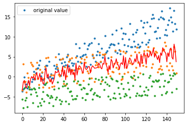

**Nguyễn Tiến Anh - B20DCCN005**
**Bài 4: Deeplearning**

# 4.1


- TensorFlow là một thư viện phần mềm mã nguồn mở dành cho máy học trong nhiều loại hình tác vụ nhận thức và hiểu ngôn ngữ.

- Nó hiện đang được sử dụng cho cả nghiên cứu lẫn sản xuất bởi 50 đội khác nhau trong hàng tá sản phẩm thương mại của Google, như nhận dạng giọng nói, Gmail, Google Photos, và tìm kiếm, nhiều trong số đó đã từng sử dụng chương trình tiền nhiệm DistBelief của nó.

- TensorFlow nguyên thủy được phát triển bởi đội Google Brain cho mục đích nghiên cứu và sản xuất của Google và sau đó được phát hành theo giấy phép mã nguồn mở Apache 2.0 vào ngày 9/11/2015.

- TensorFlow cung cấp các API cho Python, C++, Haskell, Java, Go và R, và cũng cung cấp một API không chính thức cho Swift, Julia, và JavaScript (thông qua TensorFlow.js).

- Các chương trình TensorFlow được xây dựng bằng cách sử dụng một đồ thị dữ liệu có hướng.

  - Các nút (nodes) trong đồ thị biểu diễn các phép tính.
  - Trong khi các cạnh (edges) biểu diễn dữ liệu được truyền giữa các nút (hay còn gọi là tensor).
  - Các biến giữ trạng thái trừu tượng trên các nút và có thể được chia sẻ bởi các nút có cùng phạm vi.

- Nguyên lý hoạt động:

  TensorFlow là một thư viện mã nguồn mở được sử dụng để xây dựng và huấn luyện mạng nơ-ron và thực hiện các nhiệm vụ liên quan đến máy học và trí tuệ nhân tạo. Nguyên lý hoạt động của TensorFlow dựa trên việc định nghĩa và tính toán các biểu đồ tính toán dưới dạng các đồ thị luồng dữ liệu (dataflow graphs). Dưới đây là một số khái niệm và nguyên tắc hoạt động quan trọng của TensorFlow:

  1. **Tensor**: TensorFlow sử dụng tensor làm cơ sở cho việc biểu diễn dữ liệu. Tensor là một đối tượng nhiều chiều tương tự như mảng hoặc ma trận. Các dữ liệu đầu vào và đầu ra của mạng nơ-ron thường được biểu diễn dưới dạng tensor.

  2. **Biểu đồ tính toán (Computational Graph)**: Một chương trình TensorFlow thường bao gồm việc xây dựng một biểu đồ tính toán, trong đó các phép tính và các biến số được định nghĩa dưới dạng các nút và cạnh trong đồ thị. Đây là cách TensorFlow biểu diễn một chuỗi các phép tính.

  3. **Phạm vi (Scope) và Biến (Variable)**: Trong TensorFlow, các biến là các đối tượng có giá trị thay đổi trong quá trình huấn luyện. Chúng được sử dụng để lưu trữ và cập nhật trọng số của mạng nơ-ron. Phạm vi giúp quản lý và tổ chức các biến và phép tính trong biểu đồ tính toán.

  4. **Session**: Để thực thi các phép tính trong biểu đồ tính toán, bạn cần tạo một phiên làm việc (session). Phiên làm việc là môi trường thực thi để tính toán giá trị các biến và nút trong biểu đồ.

  5. **Quá trình huấn luyện (Training)**: TensorFlow cung cấp các công cụ và API để xác định mô hình máy học và huấn luyện nó trên dữ liệu đào tạo. Quá trình này thường bao gồm tiến trình lan truyền ngược (backpropagation) để cập nhật trọng số mạng nơ-ron.

  6. **Lưu trữ mô hình và triển khai (Saving and Deployment)**: Sau khi huấn luyện mô hình, bạn có thể lưu trữ mô hình đã huấn luyện để sau này triển khai hoặc sử dụng nó cho các ứng dụng thực tế.

  7. **Tích hợp với thiết bị cơ sở (Hardware Integration)**: TensorFlow có thể tận dụng các tài nguyên tính toán từ nhiều thiết bị, bao gồm CPU, GPU và TPU (Tensor Processing Unit) để gia tăng tốc độ tính toán.

  TensorFlow cung cấp một cách mạnh mẽ để xây dựng, huấn luyện và triển khai các mô hình máy học và mạng nơ-ron. Nguyên tắc hoạt động cơ bản của nó liên quan đến định nghĩa các biểu đồ tính toán và thực thi chúng trong một môi trường tính toán phân tán.

- Tại sao nên dùng TensorFlow:

  TensorFlow là một thư viện mã nguồn mở mạnh mẽ cho việc phát triển và triển khai các mô hình máy học và mạng nơ-ron. Dưới đây là một số ưu điểm của việc sử dụng TensorFlow:

  1. **Khả năng tích hợp cùng các phần cứng**: TensorFlow hỗ trợ tích hợp với nhiều loại phần cứng tính toán như CPU, GPU và TPU (Tensor Processing Unit), giúp tối ưu hóa hiệu suất tính toán và tăng tốc quá trình huấn luyện mô hình.

  2. **Dự án mã nguồn mở và cộng đồng lớn**: TensorFlow là một dự án mã nguồn mở phát triển bởi Google, nên nó có sự ủng hộ mạnh mẽ từ cộng đồng phát triển. Điều này đồng nghĩa với việc có nhiều tài liệu, ví dụ và giải pháp sẵn có, cũng như việc sửa lỗi và phát triển liên tục.

  3. **Công cụ trực quan hóa (TensorBoard)**: TensorFlow cung cấp TensorBoard, một công cụ giúp bạn theo dõi và hiểu rõ hơn về quá trình huấn luyện mô hình. Bạn có thể sử dụng TensorBoard để theo dõi biểu đồ đào tạo, đánh giá hiệu suất, và kiểm tra các đặc điểm của mô hình.

  4. **Hỗ trợ cho nhiều nền tảng**: TensorFlow hỗ trợ nhiều nền tảng, bao gồm Windows, macOS và Linux. Điều này cho phép bạn phát triển ứng dụng trên nhiều hệ điều hành khác nhau.

  5. **Tích hợp với các công cụ khác**: TensorFlow có thể tích hợp dễ dàng với các thư viện và công cụ khác trong hệ sinh thái máy học như Keras, scikit-learn, và OpenCV.

  6. **Khả năng triển khai trên nhiều nền tảng**: Sau khi huấn luyện mô hình, TensorFlow cho phép bạn triển khai mô hình này trên nhiều nền tảng khác nhau, bao gồm di động (Android và iOS), trình duyệt web, và các hệ thống nhúng.

  7. **Hỗ trợ đa ngôn ngữ**: TensorFlow hỗ trợ nhiều ngôn ngữ lập trình như Python, C++, Java và Go, giúp bạn có sự linh hoạt trong việc phát triển ứng dụng máy học.

  8. **Phạm vi ứng dụng đa dạng**: TensorFlow không chỉ được sử dụng cho việc xây dựng mạng nơ-ron sâu (deep learning) mà còn cho nhiều loại nhiệm vụ khác như phân loại ảnh, xử lý ngôn ngữ tự nhiên, dự đoán dãy thời gian, và nhiều ứng dụng khác.

  9. **Hỗ trợ cộng tác và triển khai trực tuyến**: TensorFlow có khả năng hỗ trợ cộng tác giữa nhiều nhà phát triển và cung cấp các dịch vụ triển khai mô hình máy học trực tuyến, giúp bạn tích hợp mô hình vào sản phẩm và dịch vụ của mình.

  Tóm lại, TensorFlow là một công cụ rất mạnh mẽ và linh hoạt cho việc phát triển ứng dụng máy học và trí tuệ nhân tạo, đặc biệt là trong ngữ cảnh của dự án mã nguồn mở và cộng đồng phát triển đông đảo.

- Các loại API của TensorFlow:

  TensorFlow cung cấp nhiều loại API để phát triển mô hình máy học và trí tuệ nhân tạo dựa trên nhu cầu và trình độ của người sử dụng. Dưới đây là một số loại API chính trong TensorFlow:

  1. **Low-Level API (API cấp thấp)**:

  - **TensorFlow Core (tf.Module, tf.Tensor, tf.Graph)**: Đây là cơ sở của toàn bộ TensorFlow. Bạn có thể sử dụng TensorFlow Core để xây dựng và tùy chỉnh mạng nơ-ron và các phép tính cơ bản. API này đòi hỏi bạn phải làm việc với biểu đồ tính toán và quản lý biến và phạm vi một cách tự động.

  2. **High-Level APIs (API cấp cao)**:

  - **Keras**: Keras là một API mạnh mẽ và dễ sử dụng cho việc xây dựng và huấn luyện các mô hình máy học. TensorFlow tích hợp sâu Keras và bạn có thể sử dụng `tf.keras` để tạo và huấn luyện mô hình một cách dễ dàng.

  - **Estimators**: TensorFlow Estimators là một API cao cấp dùng cho việc xây dựng mô hình máy học cũng như triển khai chúng cho các tác vụ sản xuất. Estimators giúp bạn xây dựng các mô hình ứng dụng cùng với các tính năng quản lý huấn luyện và triển khai.

  3. **Specialized APIs (API đặc biệt)**:

  - **TensorFlow Lite**: TensorFlow Lite là một phiên bản nhẹ của TensorFlow được tối ưu hóa cho các ứng dụng di động và thiết bị nhúng.

  - **TensorFlow.js**: TensorFlow.js là một phiên bản của TensorFlow chạy trực tiếp trong trình duyệt web, cho phép xây dựng các ứng dụng trí tuệ nhân tạo trên trình duyệt.

  - **TensorFlow Serving**: TensorFlow Serving là một dự án chuyên về triển khai mô hình máy học trong môi trường sản xuất. Nó giúp bạn dễ dàng triển khai các mô hình đã huấn luyện để phục vụ các ứng dụng và dịch vụ.

  4. **Contrib APIs (API đóng góp)**:

  - TensorFlow cũng có một số API đóng góp được cung cấp bởi cộng đồng, cho phép bạn sử dụng các tính năng và mô hình đặc biệt.

  Mỗi loại API có nhược điểm và ưu điểm riêng, và sự lựa chọn phụ thuộc vào mục tiêu của bạn và trình độ kỹ thuật. High-Level APIs như Keras thường được ưa chuộng cho tính dễ sử dụng, trong khi Low-Level APIs cho phép bạn có sự linh hoạt lớn hơn trong việc tinh chỉnh và tùy biến mô hình của mình.


## Ví dụ


### Ví dụ 1: Tạo một mạng neural nơ-ron đơn giản với một lớp nơ-ron, sử dụng dữ liệu đầu vào x và y để huấn luyện mô hình để dự đoán mối quan hệ tuyến tính giữa chúng.


```python
import tensorflow as tf

x = tf.constant([1.0, 2.0, 3.0, 4.0, 5.0], dtype=tf.float32)
y = tf.constant([2.0, 4.0, 6.0, 8.0, 10.0], dtype=tf.float32)

model = tf.keras.models.Sequential([tf.keras.layers.Dense(units=1, input_shape=[1])])

model.compile(optimizer='sgd', loss='mean_squared_error')

model.fit(x, y, epochs=100, steps_per_epoch=10)
```

    Train on 10 samples
    Epoch 1/100
    10/10 [==============================] - 0s 2ms/step - batch: 4.5000 - size: 1.0000 - loss: 34.6981 
    Epoch 2/100
    10/10 [==============================] - 0s 2ms/step - batch: 4.5000 - size: 1.0000 - loss: 0.2999
    Epoch 3/100
    10/10 [==============================] - 0s 2ms/step - batch: 4.5000 - size: 1.0000 - loss: 0.1352
    Epoch 4/100
    10/10 [==============================] - 0s 2ms/step - batch: 4.5000 - size: 1.0000 - loss: 0.1257
    Epoch 5/100
    10/10 [==============================] - 0s 1ms/step - batch: 4.5000 - size: 1.0000 - loss: 0.1174
    Epoch 6/100
    10/10 [==============================] - 0s 1ms/step - batch: 4.5000 - size: 1.0000 - loss: 0.1097
    Epoch 7/100
    10/10 [==============================] - 0s 1ms/step - batch: 4.5000 - size: 1.0000 - loss: 0.1026
    Epoch 8/100
    10/10 [==============================] - 0s 1ms/step - batch: 4.5000 - size: 1.0000 - loss: 0.0958
    Epoch 9/100
    10/10 [==============================] - 0s 1ms/step - batch: 4.5000 - size: 1.0000 - loss: 0.0896
    Epoch 10/100
    10/10 [==============================] - 0s 2ms/step - batch: 4.5000 - size: 1.0000 - loss: 0.0837
    Epoch 11/100
    10/10 [==============================] - 0s 2ms/step - batch: 4.5000 - size: 1.0000 - loss: 0.0782
    Epoch 12/100
    10/10 [==============================] - 0s 2ms/step - batch: 4.5000 - size: 1.0000 - loss: 0.0731
    Epoch 13/100
    10/10 [==============================] - 0s 2ms/step - batch: 4.5000 - size: 1.0000 - loss: 0.0683
    Epoch 14/100
    10/10 [==============================] - 0s 2ms/step - batch: 4.5000 - size: 1.0000 - loss: 0.0638
    Epoch 15/100
    10/10 [==============================] - 0s 1ms/step - batch: 4.5000 - size: 1.0000 - loss: 0.0597
    Epoch 16/100
    10/10 [==============================] - 0s 2ms/step - batch: 4.5000 - size: 1.0000 - loss: 0.0557
    Epoch 17/100
    10/10 [==============================] - 0s 5ms/step - batch: 4.5000 - size: 1.0000 - loss: 0.0521
    Epoch 18/100
    10/10 [==============================] - 0s 2ms/step - batch: 4.5000 - size: 1.0000 - loss: 0.0487
    Epoch 19/100
    10/10 [==============================] - 0s 2ms/step - batch: 4.5000 - size: 1.0000 - loss: 0.0455
    Epoch 20/100
    10/10 [==============================] - 0s 2ms/step - batch: 4.5000 - size: 1.0000 - loss: 0.0425
    Epoch 21/100
    10/10 [==============================] - 0s 2ms/step - batch: 4.5000 - size: 1.0000 - loss: 0.0397
    Epoch 22/100
    10/10 [==============================] - 0s 1ms/step - batch: 4.5000 - size: 1.0000 - loss: 0.0371
    Epoch 23/100
    10/10 [==============================] - 0s 2ms/step - batch: 4.5000 - size: 1.0000 - loss: 0.0347
    Epoch 24/100
    10/10 [==============================] - 0s 2ms/step - batch: 4.5000 - size: 1.0000 - loss: 0.0324
    Epoch 25/100
    10/10 [==============================] - 0s 3ms/step - batch: 4.5000 - size: 1.0000 - loss: 0.0303
    Epoch 26/100
    10/10 [==============================] - 0s 2ms/step - batch: 4.5000 - size: 1.0000 - loss: 0.0283
    Epoch 27/100
    10/10 [==============================] - 0s 2ms/step - batch: 4.5000 - size: 1.0000 - loss: 0.0265
    Epoch 28/100
    10/10 [==============================] - 0s 2ms/step - batch: 4.5000 - size: 1.0000 - loss: 0.0247
    Epoch 29/100
    10/10 [==============================] - 0s 2ms/step - batch: 4.5000 - size: 1.0000 - loss: 0.0231
    Epoch 30/100
    10/10 [==============================] - 0s 1ms/step - batch: 4.5000 - size: 1.0000 - loss: 0.0216
    Epoch 31/100
    10/10 [==============================] - 0s 2ms/step - batch: 4.5000 - size: 1.0000 - loss: 0.0202
    Epoch 32/100
    10/10 [==============================] - 0s 1ms/step - batch: 4.5000 - size: 1.0000 - loss: 0.0189
    Epoch 33/100
    10/10 [==============================] - 0s 1ms/step - batch: 4.5000 - size: 1.0000 - loss: 0.0176
    Epoch 34/100
    10/10 [==============================] - 0s 1ms/step - batch: 4.5000 - size: 1.0000 - loss: 0.0165
    Epoch 35/100
    10/10 [==============================] - 0s 1ms/step - batch: 4.5000 - size: 1.0000 - loss: 0.0154
    Epoch 36/100
    10/10 [==============================] - 0s 1ms/step - batch: 4.5000 - size: 1.0000 - loss: 0.0144
    Epoch 37/100
    10/10 [==============================] - 0s 2ms/step - batch: 4.5000 - size: 1.0000 - loss: 0.0134
    Epoch 38/100
    10/10 [==============================] - 0s 2ms/step - batch: 4.5000 - size: 1.0000 - loss: 0.0126
    Epoch 39/100
    10/10 [==============================] - 0s 1000us/step - batch: 4.5000 - size: 1.0000 - loss: 0.0117
    Epoch 40/100
    10/10 [==============================] - 0s 1ms/step - batch: 4.5000 - size: 1.0000 - loss: 0.0110
    Epoch 41/100
    10/10 [==============================] - 0s 2ms/step - batch: 4.5000 - size: 1.0000 - loss: 0.0103
    Epoch 42/100
    10/10 [==============================] - 0s 1ms/step - batch: 4.5000 - size: 1.0000 - loss: 0.0096
    Epoch 43/100
    10/10 [==============================] - 0s 2ms/step - batch: 4.5000 - size: 1.0000 - loss: 0.0090
    Epoch 44/100
    10/10 [==============================] - 0s 2ms/step - batch: 4.5000 - size: 1.0000 - loss: 0.0084
    Epoch 45/100
    10/10 [==============================] - 0s 2ms/step - batch: 4.5000 - size: 1.0000 - loss: 0.0078
    Epoch 46/100
    10/10 [==============================] - 0s 1ms/step - batch: 4.5000 - size: 1.0000 - loss: 0.0073
    Epoch 47/100
    10/10 [==============================] - 0s 1ms/step - batch: 4.5000 - size: 1.0000 - loss: 0.0068
    Epoch 48/100
    10/10 [==============================] - 0s 1ms/step - batch: 4.5000 - size: 1.0000 - loss: 0.0064
    Epoch 49/100
    10/10 [==============================] - 0s 1ms/step - batch: 4.5000 - size: 1.0000 - loss: 0.0060
    Epoch 50/100
    10/10 [==============================] - 0s 1ms/step - batch: 4.5000 - size: 1.0000 - loss: 0.0056
    Epoch 51/100
    10/10 [==============================] - 0s 1ms/step - batch: 4.5000 - size: 1.0000 - loss: 0.0052
    Epoch 52/100
    10/10 [==============================] - 0s 1ms/step - batch: 4.5000 - size: 1.0000 - loss: 0.0049
    Epoch 53/100
    10/10 [==============================] - 0s 1ms/step - batch: 4.5000 - size: 1.0000 - loss: 0.0045
    Epoch 54/100
    10/10 [==============================] - 0s 1ms/step - batch: 4.5000 - size: 1.0000 - loss: 0.0043
    Epoch 55/100
    10/10 [==============================] - 0s 1ms/step - batch: 4.5000 - size: 1.0000 - loss: 0.0040
    Epoch 56/100
    10/10 [==============================] - 0s 2ms/step - batch: 4.5000 - size: 1.0000 - loss: 0.0037
    Epoch 57/100
    10/10 [==============================] - 0s 5ms/step - batch: 4.5000 - size: 1.0000 - loss: 0.0035
    Epoch 58/100
    10/10 [==============================] - 0s 6ms/step - batch: 4.5000 - size: 1.0000 - loss: 0.0032
    Epoch 59/100
    10/10 [==============================] - 0s 1ms/step - batch: 4.5000 - size: 1.0000 - loss: 0.0030
    Epoch 60/100
    10/10 [==============================] - 0s 1ms/step - batch: 4.5000 - size: 1.0000 - loss: 0.0028
    Epoch 61/100
    10/10 [==============================] - 0s 3ms/step - batch: 4.5000 - size: 1.0000 - loss: 0.0026
    Epoch 62/100
    10/10 [==============================] - 0s 2ms/step - batch: 4.5000 - size: 1.0000 - loss: 0.0025
    Epoch 63/100
    10/10 [==============================] - 0s 1ms/step - batch: 4.5000 - size: 1.0000 - loss: 0.0023
    Epoch 64/100
    10/10 [==============================] - 0s 2ms/step - batch: 4.5000 - size: 1.0000 - loss: 0.0022
    Epoch 65/100
    10/10 [==============================] - 0s 1ms/step - batch: 4.5000 - size: 1.0000 - loss: 0.0020
    Epoch 66/100
    10/10 [==============================] - 0s 1ms/step - batch: 4.5000 - size: 1.0000 - loss: 0.0019
    Epoch 67/100
    10/10 [==============================] - 0s 1ms/step - batch: 4.5000 - size: 1.0000 - loss: 0.0018
    Epoch 68/100
    10/10 [==============================] - 0s 1ms/step - batch: 4.5000 - size: 1.0000 - loss: 0.0016
    Epoch 69/100
    10/10 [==============================] - 0s 1ms/step - batch: 4.5000 - size: 1.0000 - loss: 0.0015
    Epoch 70/100
    10/10 [==============================] - 0s 1ms/step - batch: 4.5000 - size: 1.0000 - loss: 0.0014
    Epoch 71/100
    10/10 [==============================] - 0s 1ms/step - batch: 4.5000 - size: 1.0000 - loss: 0.0013
    Epoch 72/100
    10/10 [==============================] - 0s 1ms/step - batch: 4.5000 - size: 1.0000 - loss: 0.0013
    Epoch 73/100
    10/10 [==============================] - 0s 1ms/step - batch: 4.5000 - size: 1.0000 - loss: 0.0012
    Epoch 74/100
    10/10 [==============================] - 0s 1ms/step - batch: 4.5000 - size: 1.0000 - loss: 0.0011
    Epoch 75/100
    10/10 [==============================] - 0s 2ms/step - batch: 4.5000 - size: 1.0000 - loss: 0.0010
    Epoch 76/100
    10/10 [==============================] - 0s 2ms/step - batch: 4.5000 - size: 1.0000 - loss: 9.5774e-04
    Epoch 77/100
    10/10 [==============================] - 0s 3ms/step - batch: 4.5000 - size: 1.0000 - loss: 8.9502e-04
    Epoch 78/100
    10/10 [==============================] - 0s 2ms/step - batch: 4.5000 - size: 1.0000 - loss: 8.3640e-04
    Epoch 79/100
    10/10 [==============================] - 0s 2ms/step - batch: 4.5000 - size: 1.0000 - loss: 7.8162e-04
    Epoch 80/100
    10/10 [==============================] - 0s 2ms/step - batch: 4.5000 - size: 1.0000 - loss: 7.3044e-04
    Epoch 81/100
    10/10 [==============================] - 0s 1ms/step - batch: 4.5000 - size: 1.0000 - loss: 6.8260e-04
    Epoch 82/100
    10/10 [==============================] - 0s 1ms/step - batch: 4.5000 - size: 1.0000 - loss: 6.3789e-04
    Epoch 83/100
    10/10 [==============================] - 0s 1ms/step - batch: 4.5000 - size: 1.0000 - loss: 5.9612e-04
    Epoch 84/100
    10/10 [==============================] - 0s 1ms/step - batch: 4.5000 - size: 1.0000 - loss: 5.5708e-04
    Epoch 85/100
    10/10 [==============================] - 0s 1000us/step - batch: 4.5000 - size: 1.0000 - loss: 5.2059e-04
    Epoch 86/100
    10/10 [==============================] - 0s 1ms/step - batch: 4.5000 - size: 1.0000 - loss: 4.8650e-04
    Epoch 87/100
    10/10 [==============================] - 0s 2ms/step - batch: 4.5000 - size: 1.0000 - loss: 4.5464e-04
    Epoch 88/100
    10/10 [==============================] - 0s 1ms/step - batch: 4.5000 - size: 1.0000 - loss: 4.2486e-04
    Epoch 89/100
    10/10 [==============================] - 0s 1ms/step - batch: 4.5000 - size: 1.0000 - loss: 3.9704e-04
    Epoch 90/100
    10/10 [==============================] - 0s 1ms/step - batch: 4.5000 - size: 1.0000 - loss: 3.7104e-04
    Epoch 91/100
    10/10 [==============================] - 0s 2ms/step - batch: 4.5000 - size: 1.0000 - loss: 3.4674e-04
    Epoch 92/100
    10/10 [==============================] - 0s 2ms/step - batch: 4.5000 - size: 1.0000 - loss: 3.2403e-04
    Epoch 93/100
    10/10 [==============================] - 0s 2ms/step - batch: 4.5000 - size: 1.0000 - loss: 3.0281e-04
    Epoch 94/100
    10/10 [==============================] - 0s 2ms/step - batch: 4.5000 - size: 1.0000 - loss: 2.8298e-04
    Epoch 95/100
    10/10 [==============================] - 0s 2ms/step - batch: 4.5000 - size: 1.0000 - loss: 2.6445e-04
    Epoch 96/100
    10/10 [==============================] - 0s 2ms/step - batch: 4.5000 - size: 1.0000 - loss: 2.4713e-04
    Epoch 97/100
    10/10 [==============================] - 0s 8ms/step - batch: 4.5000 - size: 1.0000 - loss: 2.3094e-04
    Epoch 98/100
    10/10 [==============================] - 0s 2ms/step - batch: 4.5000 - size: 1.0000 - loss: 2.1582e-04
    Epoch 99/100
    10/10 [==============================] - 0s 2ms/step - batch: 4.5000 - size: 1.0000 - loss: 2.0168e-04
    Epoch 100/100
    10/10 [==============================] - 0s 2ms/step - batch: 4.5000 - size: 1.0000 - loss: 1.8847e-04
    


    <keras.callbacks.History at 0x2b045349e10>


### Ví dụ 2: Minh họa cách xây dựng và huấn luyện một mạng neural convolutional (CNN) để phân loại các hình ảnh trong bộ dữ liệu MNIST.


```python
import tensorflow as tf

mnist = tf.keras.datasets.mnist
(X_train, y_train), (X_test, y_test) = mnist.load_data()

X_train, X_test = X_train / 255.0, X_test / 255.0

model = tf.keras.models.Sequential([
  tf.keras.layers.Flatten(input_shape=(28, 28)),
  tf.keras.layers.Dense(128, activation='relu'),
  tf.keras.layers.Dropout(0.2),
  tf.keras.layers.Dense(10)
])

model.compile(optimizer='adam',
              loss=tf.keras.losses.SparseCategoricalCrossentropy(from_logits=True),
              metrics=['accuracy']
              )

model.fit(X_train, y_train, epochs=5)

test_loss, test_acc = model.evaluate(X_test,  y_test, verbose=2)
print(f"Độ chính xác trên tập kiểm tra: {test_acc}")
```

    Train on 60000 samples
    Epoch 1/5
    60000/60000 [==============================] - 5s 75us/sample - loss: 0.2964 - accuracy: 0.9144
    Epoch 2/5
    60000/60000 [==============================] - 4s 68us/sample - loss: 0.1408 - accuracy: 0.9589
    Epoch 3/5
    60000/60000 [==============================] - 5s 78us/sample - loss: 0.1060 - accuracy: 0.9675
    Epoch 4/5
    60000/60000 [==============================] - 4s 69us/sample - loss: 0.0881 - accuracy: 0.9732
    Epoch 5/5
    60000/60000 [==============================] - 4s 67us/sample - loss: 0.0733 - accuracy: 0.9773
    

    c:\Users\tien2\miniconda3\envs\intel3.6\lib\site-packages\keras\engine\training.py:2470: UserWarning: `Model.state_updates` will be removed in a future version. This property should not be used in TensorFlow 2.0, as `updates` are applied automatically.
      warnings.warn('`Model.state_updates` will be removed in a future version. '
    

    Độ chính xác trên tập kiểm tra: 0.9782999753952026
    

### Ví dụ 3: Minh họa cách xây dựng một Mạng GAN đơn giản bằng tập data MNIST.


```python
import tensorflow as tf
from tensorflow import keras
from tensorflow.keras import layers

# Load dữ liệu MNIST
mnist = keras.datasets.mnist
(train_images, train_labels), (test_images, test_labels) = mnist.load_data()

# Chuẩn hóa dữ liệu
train_images, test_images = train_images / 255.0, test_images / 255.0

# Xây dựng mạng nơ-ron
model = keras.Sequential([
    layers.Flatten(input_shape=(28, 28)),      # Lớp nhập dữ liệu và làm phẳng các ma trận 28x28 thành một vector 1D có 784 phần tử
    layers.Dense(128, activation='relu'),      # Lớp ẩn với 128 đơn vị và hàm kích hoạt ReLU
    layers.Dropout(0.2),                       # Lớp dropout với tỷ lệ 20% để tránh overfitting
    layers.Dense(10, activation='softmax')    # Lớp đầu ra với 10 đơn vị (số lượng lớp đầu ra) và hàm kích hoạt softmax
])

# Compile mô hình
model.compile(optimizer='adam',
              loss='sparse_categorical_crossentropy',
              metrics=['accuracy'])

# Huấn luyện mô hình
model.fit(train_images, train_labels, epochs=5)

# Đánh giá hiệu suất của mô hình trên tập kiểm tra
test_loss, test_acc = model.evaluate(test_images, test_labels)
print(f'Độ chính xác trên tập kiểm tra: {test_acc}')
```

    Epoch 1/5
    1875/1875 [==============================] - 5s 2ms/step - loss: 0.2990 - accuracy: 0.9124
    Epoch 2/5
    1875/1875 [==============================] - 4s 2ms/step - loss: 0.1457 - accuracy: 0.9571
    Epoch 3/5
    1875/1875 [==============================] - 5s 3ms/step - loss: 0.1080 - accuracy: 0.9672
    Epoch 4/5
    1875/1875 [==============================] - 5s 3ms/step - loss: 0.0907 - accuracy: 0.9720
    Epoch 5/5
    1875/1875 [==============================] - 4s 2ms/step - loss: 0.0756 - accuracy: 0.9761
    313/313 [==============================] - 1s 1ms/step - loss: 0.0771 - accuracy: 0.9770
    Độ chính xác trên tập kiểm tra: 0.9769999980926514
    

### Ví dụ 4: Mô hình học máy sử dụng TensorFlow và Keras để phân loại hình ảnh. Trong ví dụ này, chúng ta sẽ sử dụng bộ dữ liệu CIFAR-10, một tập dữ liệu chứa 60,000 hình ảnh thuộc 10 lớp khác nhau (ví dụ: xe hơi, máy bay, chó, mèo, v.v.).


```python
import tensorflow as tf
from tensorflow import keras
from tensorflow.keras import layers

# Tải dữ liệu CIFAR-10
(x_train, y_train), (x_test, y_test) = keras.datasets.cifar10.load_data()

# Tiền xử lý dữ liệu
x_train = x_train.astype("float32") / 255.0
x_test = x_test.astype("float32") / 255.0

# Xây dựng mô hình
model = keras.Sequential([
    layers.Input(shape=(32, 32, 3)),
    layers.Conv2D(32, (3, 3), activation="relu"),
    layers.MaxPooling2D((2, 2)),
    layers.Conv2D(64, (3, 3), activation="relu"),
    layers.MaxPooling2D((2, 2)),
    layers.Conv2D(64, (3, 3), activation="relu"),
    layers.Flatten(),
    layers.Dense(64, activation="relu"),
    layers.Dense(10),
])

# Biên dịch mô hình
model.compile(optimizer="adam",
              loss=tf.keras.losses.SparseCategoricalCrossentropy(from_logits=True),
              metrics=["accuracy"])

# Huấn luyện mô hình
model.fit(x_train, y_train, epochs=10, validation_data=(x_test, y_test))

# Đánh giá mô hình trên dữ liệu kiểm tra
test_loss, test_acc = model.evaluate(x_test, y_test, verbose=2)
print(f"\nĐộ chính xác trên dữ liệu kiểm tra: {test_acc*100:.2f}%")
```

    Downloading data from https://www.cs.toronto.edu/~kriz/cifar-10-python.tar.gz
    170500096/170498071 [==============================] - 28s 0us/step
    170508288/170498071 [==============================] - 28s 0us/step
    Epoch 1/10
    1563/1563 [==============================] - 54s 34ms/step - loss: 1.5036 - accuracy: 0.4544 - val_loss: 1.2517 - val_accuracy: 0.5476
    Epoch 2/10
    1563/1563 [==============================] - 55s 35ms/step - loss: 1.1496 - accuracy: 0.5931 - val_loss: 1.1043 - val_accuracy: 0.6144
    Epoch 3/10
    1563/1563 [==============================] - 54s 34ms/step - loss: 1.0025 - accuracy: 0.6460 - val_loss: 0.9788 - val_accuracy: 0.6563
    Epoch 4/10
    1563/1563 [==============================] - 52s 33ms/step - loss: 0.9045 - accuracy: 0.6834 - val_loss: 0.9353 - val_accuracy: 0.6743
    Epoch 5/10
    1563/1563 [==============================] - 54s 35ms/step - loss: 0.8228 - accuracy: 0.7110 - val_loss: 0.8896 - val_accuracy: 0.6904
    Epoch 6/10
    1563/1563 [==============================] - 54s 35ms/step - loss: 0.7593 - accuracy: 0.7333 - val_loss: 0.8723 - val_accuracy: 0.7046
    Epoch 7/10
    1563/1563 [==============================] - 51s 33ms/step - loss: 0.7103 - accuracy: 0.7498 - val_loss: 0.8799 - val_accuracy: 0.7041
    Epoch 8/10
    1563/1563 [==============================] - 51s 33ms/step - loss: 0.6620 - accuracy: 0.7688 - val_loss: 0.9050 - val_accuracy: 0.7006
    Epoch 9/10
    1563/1563 [==============================] - 50s 32ms/step - loss: 0.6180 - accuracy: 0.7842 - val_loss: 0.8573 - val_accuracy: 0.7141
    Epoch 10/10
    1563/1563 [==============================] - 50s 32ms/step - loss: 0.5818 - accuracy: 0.7940 - val_loss: 0.8660 - val_accuracy: 0.7203
    313/313 - 2s - loss: 0.8660 - accuracy: 0.7203
    
    Độ chính xác trên dữ liệu kiểm tra: 72.03%
    

### Ví dụ 5: Sử dụng TensorFlow và Keras để phân loại hoa Iris vào ba loài khác nhau trong bộ dữ liệu Iris.


```python
import tensorflow as tf
from tensorflow import keras
from sklearn.model_selection import train_test_split
from sklearn.preprocessing import LabelEncoder
from sklearn.datasets import load_iris

# Tải dữ liệu Iris
iris = load_iris()
X = iris.data
y = iris.target

# Tiền xử lý dữ liệu
encoder = LabelEncoder()
y = encoder.fit_transform(y)
X_train, X_test, y_train, y_test = train_test_split(X, y, test_size=0.2, random_state=42)

# Xây dựng mô hình
model = keras.Sequential([
    keras.layers.Input(shape=(4,)),
    keras.layers.Dense(64, activation='relu'),
    keras.layers.Dense(32, activation='relu'),
    keras.layers.Dense(3, activation='softmax')
])

# Biên dịch mô hình
model.compile(optimizer='adam',
              loss='sparse_categorical_crossentropy',
              metrics=['accuracy'])

# Huấn luyện mô hình
model.fit(X_train, y_train, epochs=50, batch_size=16, validation_split=0.2)

# Đánh giá mô hình trên dữ liệu kiểm tra
test_loss, test_acc = model.evaluate(X_test, y_test, verbose=2)
print(f"\nĐộ chính xác trên dữ liệu kiểm tra: {test_acc*100:.2f}%")

```

    Epoch 1/50
    6/6 [==============================] - 1s 45ms/step - loss: 2.3385 - accuracy: 0.3542 - val_loss: 1.9225 - val_accuracy: 0.2917
    Epoch 2/50
    6/6 [==============================] - 0s 18ms/step - loss: 1.5437 - accuracy: 0.3542 - val_loss: 1.2138 - val_accuracy: 0.2917
    Epoch 3/50
    6/6 [==============================] - 0s 12ms/step - loss: 1.1634 - accuracy: 0.2812 - val_loss: 0.9605 - val_accuracy: 0.5000
    Epoch 4/50
    6/6 [==============================] - 0s 9ms/step - loss: 1.1095 - accuracy: 0.2812 - val_loss: 0.9232 - val_accuracy: 0.5000
    Epoch 5/50
    6/6 [==============================] - 0s 8ms/step - loss: 1.0412 - accuracy: 0.2812 - val_loss: 0.9039 - val_accuracy: 0.5000
    Epoch 6/50
    6/6 [==============================] - 0s 8ms/step - loss: 0.9662 - accuracy: 0.4583 - val_loss: 0.9186 - val_accuracy: 0.5000
    Epoch 7/50
    6/6 [==============================] - 0s 11ms/step - loss: 0.9054 - accuracy: 0.7292 - val_loss: 0.9233 - val_accuracy: 0.5000
    Epoch 8/50
    6/6 [==============================] - 0s 11ms/step - loss: 0.8513 - accuracy: 0.7188 - val_loss: 0.8799 - val_accuracy: 0.5000
    Epoch 9/50
    6/6 [==============================] - 0s 8ms/step - loss: 0.7978 - accuracy: 0.7188 - val_loss: 0.8228 - val_accuracy: 0.5000
    Epoch 10/50
    6/6 [==============================] - 0s 8ms/step - loss: 0.7532 - accuracy: 0.7396 - val_loss: 0.7584 - val_accuracy: 0.7917
    Epoch 11/50
    6/6 [==============================] - 0s 7ms/step - loss: 0.7076 - accuracy: 0.7917 - val_loss: 0.7235 - val_accuracy: 0.5833
    Epoch 12/50
    6/6 [==============================] - 0s 9ms/step - loss: 0.6691 - accuracy: 0.7188 - val_loss: 0.7072 - val_accuracy: 0.5000
    Epoch 13/50
    6/6 [==============================] - 0s 9ms/step - loss: 0.6325 - accuracy: 0.7188 - val_loss: 0.6709 - val_accuracy: 0.5417
    Epoch 14/50
    6/6 [==============================] - 0s 10ms/step - loss: 0.5987 - accuracy: 0.7396 - val_loss: 0.6390 - val_accuracy: 0.6667
    Epoch 15/50
    6/6 [==============================] - 0s 9ms/step - loss: 0.5692 - accuracy: 0.8542 - val_loss: 0.5935 - val_accuracy: 0.9583
    Epoch 16/50
    6/6 [==============================] - 0s 8ms/step - loss: 0.5441 - accuracy: 0.9375 - val_loss: 0.5730 - val_accuracy: 0.9583
    Epoch 17/50
    6/6 [==============================] - 0s 8ms/step - loss: 0.5197 - accuracy: 0.8646 - val_loss: 0.5588 - val_accuracy: 0.9167
    Epoch 18/50
    6/6 [==============================] - 0s 9ms/step - loss: 0.4972 - accuracy: 0.8542 - val_loss: 0.5424 - val_accuracy: 0.9167
    Epoch 19/50
    6/6 [==============================] - 0s 9ms/step - loss: 0.4748 - accuracy: 0.9167 - val_loss: 0.5078 - val_accuracy: 0.9583
    Epoch 20/50
    6/6 [==============================] - 0s 9ms/step - loss: 0.4585 - accuracy: 0.9583 - val_loss: 0.4775 - val_accuracy: 1.0000
    Epoch 21/50
    6/6 [==============================] - 0s 8ms/step - loss: 0.4397 - accuracy: 0.9583 - val_loss: 0.4747 - val_accuracy: 0.9583
    Epoch 22/50
    6/6 [==============================] - 0s 7ms/step - loss: 0.4378 - accuracy: 0.8646 - val_loss: 0.5104 - val_accuracy: 0.7083
    Epoch 23/50
    6/6 [==============================] - ETA: 0s - loss: 0.4582 - accuracy: 0.81 - 0s 9ms/step - loss: 0.4085 - accuracy: 0.8854 - val_loss: 0.4353 - val_accuracy: 0.9583
    Epoch 24/50
    6/6 [==============================] - 0s 13ms/step - loss: 0.3927 - accuracy: 0.9271 - val_loss: 0.4025 - val_accuracy: 1.0000
    Epoch 25/50
    6/6 [==============================] - 0s 9ms/step - loss: 0.3797 - accuracy: 0.9375 - val_loss: 0.3930 - val_accuracy: 1.0000
    Epoch 26/50
    6/6 [==============================] - 0s 8ms/step - loss: 0.3691 - accuracy: 0.9271 - val_loss: 0.4184 - val_accuracy: 0.9583
    Epoch 27/50
    6/6 [==============================] - 0s 8ms/step - loss: 0.3579 - accuracy: 0.8958 - val_loss: 0.4031 - val_accuracy: 0.9583
    Epoch 28/50
    6/6 [==============================] - 0s 8ms/step - loss: 0.3429 - accuracy: 0.9583 - val_loss: 0.3457 - val_accuracy: 1.0000
    Epoch 29/50
    6/6 [==============================] - 0s 20ms/step - loss: 0.3338 - accuracy: 0.9479 - val_loss: 0.3434 - val_accuracy: 1.0000
    Epoch 30/50
    6/6 [==============================] - 0s 8ms/step - loss: 0.3213 - accuracy: 0.9688 - val_loss: 0.3423 - val_accuracy: 1.0000
    Epoch 31/50
    6/6 [==============================] - 0s 10ms/step - loss: 0.3118 - accuracy: 0.9583 - val_loss: 0.3298 - val_accuracy: 1.0000
    Epoch 32/50
    6/6 [==============================] - 0s 8ms/step - loss: 0.3024 - accuracy: 0.9479 - val_loss: 0.3259 - val_accuracy: 0.9583
    Epoch 33/50
    6/6 [==============================] - 0s 8ms/step - loss: 0.2934 - accuracy: 0.9479 - val_loss: 0.3050 - val_accuracy: 1.0000
    Epoch 34/50
    6/6 [==============================] - 0s 9ms/step - loss: 0.2848 - accuracy: 0.9688 - val_loss: 0.2967 - val_accuracy: 1.0000
    Epoch 35/50
    6/6 [==============================] - 0s 10ms/step - loss: 0.2836 - accuracy: 0.9375 - val_loss: 0.2921 - val_accuracy: 1.0000
    Epoch 36/50
    6/6 [==============================] - 0s 9ms/step - loss: 0.2748 - accuracy: 0.9688 - val_loss: 0.2565 - val_accuracy: 1.0000
    Epoch 37/50
    6/6 [==============================] - 0s 7ms/step - loss: 0.2629 - accuracy: 0.9688 - val_loss: 0.2765 - val_accuracy: 0.9583
    Epoch 38/50
    6/6 [==============================] - 0s 6ms/step - loss: 0.2554 - accuracy: 0.9583 - val_loss: 0.2729 - val_accuracy: 0.9583
    Epoch 39/50
    6/6 [==============================] - 0s 7ms/step - loss: 0.2533 - accuracy: 0.9479 - val_loss: 0.2388 - val_accuracy: 1.0000
    Epoch 40/50
    6/6 [==============================] - 0s 9ms/step - loss: 0.2413 - accuracy: 0.9583 - val_loss: 0.2499 - val_accuracy: 0.9583
    Epoch 41/50
    6/6 [==============================] - 0s 7ms/step - loss: 0.2377 - accuracy: 0.9583 - val_loss: 0.2454 - val_accuracy: 0.9583
    Epoch 42/50
    6/6 [==============================] - 0s 8ms/step - loss: 0.2295 - accuracy: 0.9583 - val_loss: 0.2123 - val_accuracy: 1.0000
    Epoch 43/50
    6/6 [==============================] - 0s 7ms/step - loss: 0.2248 - accuracy: 0.9583 - val_loss: 0.2109 - val_accuracy: 1.0000
    Epoch 44/50
    6/6 [==============================] - 0s 9ms/step - loss: 0.2181 - accuracy: 0.9583 - val_loss: 0.2263 - val_accuracy: 0.9583
    Epoch 45/50
    6/6 [==============================] - 0s 7ms/step - loss: 0.2132 - accuracy: 0.9583 - val_loss: 0.2064 - val_accuracy: 1.0000
    Epoch 46/50
    6/6 [==============================] - 0s 6ms/step - loss: 0.2071 - accuracy: 0.9583 - val_loss: 0.1949 - val_accuracy: 1.0000
    Epoch 47/50
    6/6 [==============================] - 0s 7ms/step - loss: 0.2035 - accuracy: 0.9583 - val_loss: 0.1796 - val_accuracy: 1.0000
    Epoch 48/50
    6/6 [==============================] - 0s 10ms/step - loss: 0.1980 - accuracy: 0.9583 - val_loss: 0.1928 - val_accuracy: 1.0000
    Epoch 49/50
    6/6 [==============================] - 0s 10ms/step - loss: 0.1975 - accuracy: 0.9479 - val_loss: 0.2007 - val_accuracy: 0.9583
    Epoch 50/50
    6/6 [==============================] - 0s 10ms/step - loss: 0.1896 - accuracy: 0.9583 - val_loss: 0.1593 - val_accuracy: 1.0000
    1/1 - 0s - loss: 0.1870 - accuracy: 1.0000
    
    Độ chính xác trên dữ liệu kiểm tra: 100.00%
    

# 4.2


## 3.5 bài 3


```python
# importing the dependencies 
import tensorflow.compat.v1 as tf
import numpy as np 
import matplotlib.pyplot as plt 
  
tf.disable_eager_execution()

# Model Parameters 
learning_rate = 0.01 
training_epochs = 2000 
display_step = 200 
  
# Training Data 
train_X = np.asarray([3.3,4.4,5.5,6.71,6.93,4.168,9.779,6.182,7.59,2.167, 
                      7.042,10.791,5.313,7.997,5.654,9.27,3.1]) 
train_y = np.asarray([1.7,2.76,2.09,3.19,1.694,1.573,3.366,2.596,2.53,1.221,
                      2.827,3.465,1.65,2.904,2.42,2.94,1.3]) 
n_samples = train_X.shape[0] 
  
# Test Data 
test_X = np.asarray([6.83, 4.668, 8.9, 7.91, 5.7, 8.7, 3.1, 2.1]) 
  
# Set placeholders for feature and target vectors 
X = tf.placeholder(tf.float32) 
y = tf.placeholder(tf.float32) 

# Set model weights and bias) 
test_y = np.asarray([1.84, 2.273, 3.2, 2.831, 2.92, 3.24, 1.35, 1.03]) 
W = tf.Variable(np.random.randn(), name="weight") 
b = tf.Variable(np.random.randn(), name="bias") 
  
# Construct a linear model 
linear_model = W*X + b 
  
# Mean squared error 
cost = tf.reduce_sum(tf.square(linear_model - y)) / (2*n_samples) 
  
# Gradient descent 
optimizer = tf.train.GradientDescentOptimizer(learning_rate).minimize(cost) 
  
# Initializing the variables 
init = tf.global_variables_initializer() 
  
# Launch the graph
with tf.Session() as sess: 
    # Load initialized variables in current session 
    sess.run(init) 
    # Fit all training data 
    for epoch in range(training_epochs): 
  
        # perform gradient descent step 
        sess.run(optimizer, feed_dict={X: train_X, y: train_y}) 
          
        # Display logs per epoch step 
        if (epoch+1) % display_step == 0: 
            c = sess.run(cost, feed_dict={X: train_X, y: train_y}) 
            print("Epoch:{0:6} \t Cost:{1:10.4} \t W:{2:6.4} \t b:{3:6.4}". 
                  format(epoch+1, c, sess.run(W), sess.run(b))) 
              
    # Print final parameter values 
    print("Optimization Finished!") 
    training_cost = sess.run(cost, feed_dict={X: train_X, y: train_y}) 
    print("Final training cost:", training_cost, "W:", sess.run(W), "b:", sess.run(b), '\n') 
      
    # Graphic display 
    plt.plot(train_X, train_y, 'ro', label='Original data') 
    plt.plot(train_X, sess.run(W) * train_X + sess.run(b), label='Fitted line') 
    plt.legend() 
    plt.show() 
    
    # Testing the model 
    testing_cost = sess.run(tf.reduce_sum(tf.square(linear_model - y)) / (2 * test_X.shape[0]), feed_dict={X: test_X, y: test_y}) 
      
    print("Final testing cost:", testing_cost) 
    print("Absolute mean square loss difference:", abs(training_cost - testing_cost)) 
  
    # Display fitted line on test data 
    plt.plot(test_X, test_y, 'bo', label='Testing data') 
    plt.plot(train_X, sess.run(W) * train_X + sess.run(b), label='Fitted line') 
    plt.legend() 
    plt.show()
```

    Epoch:   200 	 Cost:   0.09251 	 W:0.1809 	 b:   1.3
    Epoch:   400 	 Cost:   0.08651 	 W:0.1961 	 b: 1.192
    Epoch:   600 	 Cost:   0.08282 	 W:0.2081 	 b: 1.107
    Epoch:   800 	 Cost:   0.08056 	 W:0.2175 	 b: 1.041
    Epoch:  1000 	 Cost:   0.07916 	 W:0.2249 	 b:0.9887
    Epoch:  1200 	 Cost:    0.0783 	 W:0.2306 	 b:0.9477
    Epoch:  1400 	 Cost:   0.07777 	 W:0.2352 	 b:0.9156
    Epoch:  1600 	 Cost:   0.07745 	 W:0.2387 	 b:0.8904
    Epoch:  1800 	 Cost:   0.07725 	 W:0.2415 	 b:0.8707
    Epoch:  2000 	 Cost:   0.07713 	 W:0.2437 	 b:0.8552
    Optimization Finished!
    Final training cost: 0.07712544 W: 0.24368568 b: 0.8551579 
    
    


    

    


    Final testing cost: 0.08012026
    Absolute mean square loss difference: 0.0029948205
    


    

    


- Code với comment tiếng Việt

```python
# Import thư viện TensorFlow phiên bản 1.x và các thư viện khác cần thiết
import tensorflow.compat.v1 as tf
import numpy as np
import matplotlib.pyplot as plt

tf.disable_eager_execution()

# Thiết lập các tham số cho quá trình huấn luyện
learning_rate = 0.01
training_epochs = 2000
display_step = 200

# Dữ liệu huấn luyện, gồm các điểm dữ liệu X và nhãn y tương ứng
train_X = np.asarray(
    [
        3.3,4.4,5.5,
        6.71,6.93,4.168,
        9.779,6.182,7.59,
        2.167,7.042,10.791,
        5.313,7.997,5.654,
        9.27,3.1,
    ]
)
train_y = np.asarray(
    [
        1.7,2.76,2.09,
        3.19,1.694,1.573,
        3.366,2.596,2.53,
        1.221,2.827,3.465,
        1.65,2.904,2.42,
        2.94,1.3,
    ]
)

# Số lượng mẫu dữ liệu huấn luyện
n_samples = train_X.shape[0]

# Dữ liệu kiểm tra
test_X = np.asarray([6.83, 4.668, 8.9, 7.91, 
                     5.7, 8.7, 3.1, 2.1])
test_y = np.asarray([1.84, 2.273, 3.2, 2.831, 
                     2.92, 3.24, 1.35, 1.03])

# Khai báo biến đầu tiên (weight) và biến thứ hai (bias) của mô hình
W = tf.Variable(np.random.randn(), name="weight")
b = tf.Variable(np.random.randn(), name="bias")

X = tf.placeholder(tf.float32) 
y = tf.placeholder(tf.float32)

# Xây dựng mô hình tuyến tính: linear_model = W * X + b
linear_model = W * X + b

# Tính toán hàm mất mát bằng cách tính bình phương sai số và lấy trung bình
cost = tf.reduce_sum(tf.square(linear_model - y)) / (2 * n_samples)

# Sử dụng tối ưu hóa gradient descent để cập nhật weight (W) và bias (b)
optimizer = tf.train.GradientDescentOptimizer(learning_rate).minimize(cost)

# Khởi tạo tất cả các biến trong mô hình
init = tf.global_variables_initializer()

# Bắt đầu phiên làm việc với TensorFlow
with tf.Session() as sess:
    sess.run(init)
    for epoch in range(training_epochs):
        # Thực hiện một vòng lặp huấn luyện
        sess.run(optimizer, feed_dict={X: train_X, y: train_y})
        if (epoch + 1) % display_step == 0:
            # In thông tin về tiến trình huấn luyện
            c = sess.run(cost, feed_dict={X: train_X, y: train_y})
            print(
                "Epoch:{0:6} \t Cost:{1:10.4} \t W:{2:6.4} \t b:{3:6.4}".format(
                    epoch + 1, c, sess.run(W), sess.run(b)
                )
            )
    print("Optimization Finished!")

    # Tính giá trị mất mát trên tập huấn luyện cuối cùng
    training_cost = sess.run(cost, feed_dict={X: train_X, y: train_y})
    print(
        "Final training cost:",
        training_cost,
        "W:",
        sess.run(W),
        "b:",
        sess.run(b),
        "\n",
    )

    # Hiển thị đồ thị dữ liệu và đường tuyến tính tìm được
    plt.plot(train_X, train_y, "ro", label="Original data")
    plt.plot(train_X, sess.run(W) * train_X + sess.run(b), label="Fitted line")
    plt.legend()
    plt.show()

    # Kiểm tra mô hình trên dữ liệu kiểm tra
    testing_cost = sess.run(
        tf.reduce_sum(tf.square(linear_model - y)) / (2 * test_X.shape[0]),
        feed_dict={X: test_X, y: test_y},
    )

    print("Final testing cost:", testing_cost)
    print("Absolute mean square loss difference:", abs(training_cost - testing_cost))

    # Hiển thị đường tuyến tính trên dữ liệu kiểm tra
    plt.plot(test_X, test_y, "bo", label="Testing data")
    plt.plot(train_X, sess.run(W) * train_X + sess.run(b), label="Fitted line")
    plt.legend()
    plt.show()
```


## Giải thích


Code trên là một ví dụ đơn giản về việc sử dụng TensorFlow để tạo và huấn luyện một mô hình hồi quy tuyến tính trên dữ liệu giả định. Dưới đây là sự giải thích chi tiết cho từng phần của mã:

1. **Import thư viện và khai báo tham số**:

   ```python
   import tensorflow.compat.v1 as tf
   import numpy as np
   import matplotlib.pyplot as plt
   ```

   Đầu tiên, các thư viện TensorFlow, NumPy và Matplotlib được import để sử dụng trong mã. TensorFlow phiên bản 1.x được sử dụng ở đây.

   ```python
   learning_rate = 0.01
   training_epochs = 2000
   display_step = 200
   ```

   Các tham số huấn luyện được định nghĩa ở đây, bao gồm tỷ lệ học (learning_rate), số lượng epoch (training_epochs) và bước hiển thị thông tin trong quá trình huấn luyện (display_step).

2. **Dữ liệu huấn luyện và kiểm tra**:

   ```python
   train_X = np.asarray([...])
   train_y = np.asarray([...])
   ```

   Dữ liệu huấn luyện và kiểm tra được định nghĩa ở đây. `train_X` là danh sách các giá trị đầu vào của dữ liệu huấn luyện, và `train_y` là các nhãn tương ứng. Tương tự, `test_X` và `test_y` đại diện cho dữ liệu kiểm tra.

3. **Khai báo biến và mô hình**:

   ```python
   W = tf.Variable(np.random.randn(), name="weight")
   b = tf.Variable(np.random.randn(), name="bias")
   ```

   Các biến weight (W) và bias (b) của mô hình được khai báo và khởi tạo với các giá trị ngẫu nhiên ban đầu.

   ```python
   X = tf.placeholder(tf.float32)
   y = tf.placeholder(tf.float32)
   ```

   Hai placeholder `X` và `y` được sử dụng để đặt giá trị đầu vào và đầu ra của mô hình.

   ```python
   linear_model = W * X + b
   ```

   Mô hình tuyến tính được định nghĩa ở đây: `linear_model = W * X + b`.

4. **Hàm mất mát và tối ưu hóa**:

   ```python
   cost = tf.reduce_sum(tf.square(linear_model - y)) / (2 * n_samples)
   ```

   Hàm mất mát (cost) được định nghĩa là bình phương sai số giữa giá trị dự đoán và giá trị thực tế, được chia cho hai lần số lượng mẫu huấn luyện.

   ```python
   optimizer = tf.train.GradientDescentOptimizer(learning_rate).minimize(cost)
   ```

   Một tối ưu hóa gradient descent được tạo để cập nhật weight (W) và bias (b) sao cho hàm mất mát được giảm thiểu.

5. **Khởi tạo biến và phiên làm việc TensorFlow**:

   ```python
   init = tf.global_variables_initializer()
   ```

   Một toán tử khởi tạo được tạo để khởi tạo tất cả các biến trong mô hình.

   ```python
   with tf.Session() as sess:
   ```

   Sử dụng `tf.Session()` để bắt đầu phiên làm việc với TensorFlow.

6. **Huấn luyện mô hình**:

   ```python
   for epoch in range(training_epochs):
       sess.run(optimizer, feed_dict={X: train_X, y: train_y})
       if (epoch + 1) % display_step == 0:
           c = sess.run(cost, feed_dict={X: train_X, y: train_y})
           print("Epoch:{0:6} \t Cost:{1:10.4} \t W:{2:6.4} \t b:{3:6.4}".format(epoch + 1, c, sess.run(W), sess.run(b)))
   ```

   Mô hình được huấn luyện qua nhiều epoch, trong mỗi epoch, weight và bias được cập nhật dựa trên dữ liệu huấn luyện. Thông tin về tiến trình huấn luyện được in ra màn hình sau mỗi `display_step` epoch.

7. **Hiển thị đồ thị**:

   ```python
   plt.plot(train_X, train_y, "ro", label="Original data")
   plt.plot(train_X, sess.run(W) * train_X + sess.run(b), label="Fitted line")
   plt.legend()
   plt.show()
   ```

   Sau khi huấn luyện, đồ thị dữ liệu gốc và đường tuyến tính tìm được được hiển thị để thấy mức độ phù hợp của mô hình.

8. **Kiểm tra mô hình trên dữ liệu kiểm tra**:

   ```python
   testing_cost = sess.run(tf.reduce_sum(tf.square(linear_model - y)) / (2 * test_X.shape[0]), feed_dict={X: test_X, y: test_y})
   ```

   Mô hình được kiểm tra trên dữ liệu kiểm tra, và giá trị mất mát trên dữ liệu kiểm tra được tính.

9. **Hiển thị đường tuyến tính trên dữ liệu kiểm tra**:

   ```python
   plt.plot(test_X, test_y, "bo", label="Testing data")
   plt.plot(train_X, sess.run(W) * train_X + sess.run(b), label="Fitted line")
   plt.legend()
   plt.show()
   ```

   Đồ thị dữ liệu kiểm tra và đường tuyến tính được hiển thị để đánh giá hiệu suất của mô hình trên dữ liệu kiểm tra.


# 4.3

Keras là một thư viện mã nguồn mở phát triển bởi François Chollet, được tích hợp vào TensorFlow từ phiên bản TensorFlow 2.0 trở đi. Nó cung cấp một giao diện cao cấp và dễ sử dụng để xây dựng và huấn luyện các mạng nơ-ron (neural networks). Keras được thiết kế để giúp người dùng dễ dàng xây dựng các mô hình máy học và deep learning một cách nhanh chóng, đồng thời cung cấp mức độ linh hoạt để tùy chỉnh mô hình theo nhu cầu của họ.

* Dưới đây là một số điểm quan trọng về Keras:

1. **Interface dễ sử dụng**: Keras được thiết kế để đơn giản và dễ hiểu. Nó cung cấp một API mạnh mẽ để xây dựng, tùy chỉnh và huấn luyện các mô hình mạng nơ-ron mà không cần phải viết mã nhiều.

2. **Tích hợp với TensorFlow**: Khi TensorFlow 2.0 ra mắt, Keras trở thành một phần của thư viện TensorFlow. Điều này có nghĩa là bạn có thể sử dụng Keras như một phần của TensorFlow mà không cần cài đặt riêng biệt.

3. **Hỗ trợ đa lớp mạng nơ-ron**: Keras cho phép bạn xây dựng các mô hình deep learning đa lớp với các lớp khác nhau như lớp kết nối đầy đủ (fully connected), lớp tích chập (convolutional), lớp Gated Recurrent Unit (GRU), lớp Long Short-Term Memory (LSTM), và nhiều lớp khác.

4. **Hỗ trợ học chuyển giao (transfer learning)**: Keras đi kèm với các pre-trained model, giúp bạn tận dụng kiến thức đã học từ dữ liệu lớn để giải quyết các vấn đề nhỏ hơn hoặc tùy chỉnh mô hình cho mục đích cụ thể.

5. **Hỗ trợ tích hợp với các dữ liệu và quá trình tiền xử lý**: Keras cho phép bạn dễ dàng tiền xử lý dữ liệu trước khi đưa chúng vào mô hình, thông qua tích hợp với các công cụ xử lý dữ liệu như TensorFlow Data API hoặc NumPy.

6. **Hỗ trợ GPU và TPU**: Keras được tối ưu hóa để làm việc trên các thiết bị tính toán cơ động (GPU và TPU), giúp tăng tốc quá trình huấn luyện mô hình deep learning.

7. **Hồi quy và phân loại**: Keras có thể được sử dụng cho nhiều loại tác vụ machine learning, bao gồm hồi quy (regression), phân loại (classification), phát hiện bất thường (anomaly detection), và nhiều tác vụ khác.

8. **Cộng đồng lớn và tài liệu phong phú**: Cộng đồng người dùng Keras rất lớn và có nhiều tài liệu, ví dụ và nguồn học tập trực tuyến để bạn có thể tìm hiểu và giải quyết các vấn đề trong quá trình sử dụng Keras.

* Khi nào sử dụng Tensorflow và Keras
  - TensorFlow cung cấp một nền tảng học máy toàn diện, cung cấp cả khả năng cấp cao và cấp thấp để xây dựng và triển khai các mô hình học máy. Nó được sử dụng tốt nhất khi bạn có nhu cầu:
    +	Nghiên cứu học sâu
    +	Mạng lưới thần kinh phức tạp
    +	Làm việc với tập dữ liệu lớn
    +	Mô hình hiệu suất cao
  - Keras hoàn hảo cho những người không có nền tảng vững chắc về Deep Learning nhưng vẫn muốn làm việc với mạng lưới thần kinh. Sử dụng Keras, bạn có thể xây dựng mô hình mạng thần kinh một cách nhanh chóng và dễ dàng bằng cách sử dụng mã tối thiểu, cho phép tạo nguyên mẫu nhanh chóng.
  -	Keras ít xảy ra lỗi hơn TensorFlow và các mô hình có nhiều khả năng chính xác hơn với Keras so với TensorFlow. Điều này là do Keras hoạt động trong các giới hạn của khuôn khổ của nó, bao gồm:
    +	Tốc độ tính toán: Keras hy sinh tốc độ để thân thiện với người dùng.
    +	Lỗi cấp độ thấp: đôi khi bạn sẽ nhận được thông báo lỗi phụ trợ TensorFlow mà Keras không được thiết kế để xử lý.
    +	Hỗ trợ thuật toán – Keras không phù hợp để làm việc với một số thuật toán và mô hình học máy cơ bản nhất định như phân cụm và Phân tích thành phần chính (PCM).
    +	Biểu đồ động – Keras không hỗ trợ tạo biểu đồ động.
  -	Mô Hình Keras
    +	Mô hình là thực thể cốt lõi mà bạn sẽ làm việc khi sử dụng Keras. Các mô hình này được sử dụng để xác định mạng thần kinh TensorFlow bằng cách chỉ định các thuộc tính, chức năng và lớp mà bạn muốn.
    +	Keras cung cấp một số API mà bạn có thể sử dụng để xác định mạng thần kinh của mình, bao gồm:
      +	API tuần tự, cho phép bạn tạo từng lớp mô hình cho hầu hết các vấn đề. Nó đơn giản (chỉ là một danh sách các lớp đơn giản), nhưng nó bị giới hạn ở các lớp lớp một đầu vào, một đầu ra.
      +	API chức năng, là API đầy đủ tính năng hỗ trợ các kiến trúc mô hình tùy ý. Nó linh hoạt và phức tạp hơn API tuần tự.
      +	Phân lớp mô hình, cho phép bạn triển khai mọi thứ từ đầu. Thích hợp cho nghiên cứu và các trường hợp sử dụng có độ phức tạp cao nhưng hiếm khi được sử dụng trong thực tế.

* Cách xác định mạng neuron bằng API tuần tự của Keras:
  - API tuần tự là một khung để tạo các mô hình dựa trên các phiên bản của lớp tuần tự(). Mô hình có một biến đầu vào, một lớp ẩn có hai nơ-ron và một lớp đầu ra có một đầu ra nhị phân. Các lớp bổ sung có thể được tạo và thêm vào mô hình.

  
  
  -	Mô hình bao gồm các thông tin sau:
    +	Các lớp và thứ tự của chúng trong mô hình.
    +	Hình dạng đầu ra (số phần tử trong mỗi chiều của dữ liệu đầu ra)  của mỗi lớp.
    +	Số lượng tham số (trọng lượng) trong mỗi lớp.
    +	Tổng số tham số trong mô hình.

* Cách xác định mạng neuron bằng API chức năng của Keras:
  -	Keras functional API cho phép:
    +	Xác định nhiều mô hình đầu vào hoặc đầu ra
    +	Xác định các mô hình chia sẻ các lớp
    +	Tạo biểu đồ mạng theo chu kỳ
  -	Functional API được xác định bằng cách tạo các phiên bản của các lớp và kết nối chúng trực tiếp với nhau theo cặp. Sau đó, một mô hình được xác định để chỉ định các lớp đóng vai trò là đầu vào và đầu ra cho mô hình.
    1. Tạo một lớp imput
        -	Trong mô hình API chức năng, không giống như mô hình API tuần tự, trước tiên bạn phải tạo và xác định lớp đầu vào độc lập chỉ định hình dạng của dữ liệu đầu vào.
        -	Lớp đầu vào lấy một đối số hình dạng là một bộ dữ liệu biểu thị kích thước của dữ liệu đầu vào. Khi dữ liệu đầu vào là một chiều, hình dạng phải chừa chỗ rõ ràng cho hình dạng có kích thước lô nhỏ được sử dụng khi phân tách dữ liệu khi huấn luyện mạng
        -	Các lớp trong mô hình được kết nối theo cặp bằng cách chỉ định nguồn đầu vào đến từ đâu khi xác định từng lớp mới. Ký hiệu ngoặc được sử dụng, chỉ định lớp đầu vào.
        ```python
        # Define the input layer:
        from keras.layers import Input
        visible = Input(shape=(2,))
        # Connect the layers, then create a hidden layer as a Dense 
        # that receives input only from the input layer:
        from keras.layers import Dense
        visible = Input(shape=(2,))
        hidden = Dense(2)(visible)
        ```
    2. Tạo model
        -	API chức năng cung cấp lớp model() để tạo mô hình từ các lớp của bạn. Nó yêu cầu bạn chỉ định các lớp đầu vào và đầu ra.
        ```python
        # Define a Functional API model:
        from keras.models import Model
        from keras.layers import Input
        from keras.layers import Dense
        visible = Input(shape=(2,))
        hidden = Dense(2)(visible)
        model = Model(inputs=visible, outputs=hidden)
        ```

* Sử dụng Keras để đưa ra dự đoán

  - Sau khi một mô hình được xác định bằng API tuần tự hoặc API chức năng, nhiều chức năng khác nhau cần được tạo để chuẩn bị cho việc đào tạo và điều chỉnh mô hình trước khi chúng ta có thể sử dụng mô hình đó để đưa ra dự đoán: 

  - Trong ví dụ này, mô hình Keras Sequential được triển khai để phù hợp và dự đoán dữ liệu hồi quy:


```python
# PREPARE THE DATA
# Import libraries required in this example:
import random
import numpy as np
import matplotlib.pyplot as plt
from keras.models import Sequential
from keras.layers import Dense
from keras.wrappers.scikit_learn import KerasRegressor
from sklearn.metrics import mean_squared_error
# Generate a sample dataset from random data: 
random.seed(123)
def CreateDataset(N):
  a,b,c,y = [],[],[],[]
  for i in range(N):    
    aa = i/10+random.uniform(-4,3)
    bb = i/30+random.uniform(-4,4)
    cc = i/40+random.uniform(-3,3)-5
    yy = (aa+bb+cc/2)/3
    a.append([aa])
    b.append([bb])
    c.append([cc])
    y.append([yy])
  return np.hstack([a,b,c]), np.array(y)
N = 150
x,y = CreateDataset(N)
x_ax = range(N)
plt.plot(x_ax, x, 'o', label="original value", markersize=3)
plt.plot(x_ax, y, lw=1.5, color="red", label="y")
plt.legend(['original value'])
plt.show()
```


    

    


## Ví dụ:

### Ví dụ 1: keras cho bài toán phân loại sử dụng mnist


```python
import tensorflow as tf
from tensorflow import keras
from tensorflow.keras import layers

# Tải dữ liệu MNIST
mnist = keras.datasets.mnist
(train_images, train_labels), (test_images, test_labels) = mnist.load_data()

# Chuẩn hóa dữ liệu
train_images = train_images / 255.0
test_images = test_images / 255.0

# Xây dựng mô hình
model = keras.Sequential([
    layers.Flatten(input_shape=(28, 28)),          # Lớp đầu tiên: làm phẳng ảnh 28x28 thành mảng 1D có 784 phần tử
    layers.Dense(128, activation='relu'),          # Lớp ẩn với 128 nơ-ron và hàm kích hoạt ReLU
    layers.Dense(10, activation='softmax')         # Lớp đầu ra với 10 nơ-ron (mỗi nơ-ron đại diện cho một số từ 0 đến 9) và hàm kích hoạt softmax
])

# Biên dịch mô hình
model.compile(optimizer='adam',
              loss='sparse_categorical_crossentropy',
              metrics=['accuracy'])

# Đào tạo mô hình
model.fit(train_images, train_labels, epochs=5)

# Đánh giá mô hình trên dữ liệu kiểm tra
test_loss, test_acc = model.evaluate(test_images, test_labels)
print("Độ chính xác trên dữ liệu kiểm tra:", test_acc*100, "%")

```

    Train on 60000 samples
    Epoch 1/5
    60000/60000 [==============================] - 5s 87us/sample - loss: 0.2570 - accuracy: 0.9268
    Epoch 2/5
    60000/60000 [==============================] - 5s 76us/sample - loss: 0.1133 - accuracy: 0.9665
    Epoch 3/5
    60000/60000 [==============================] - 4s 63us/sample - loss: 0.0787 - accuracy: 0.9763
    Epoch 4/5
    60000/60000 [==============================] - 4s 72us/sample - loss: 0.0582 - accuracy: 0.9821
    Epoch 5/5
    60000/60000 [==============================] - 5s 76us/sample - loss: 0.0443 - accuracy: 0.9861
    

    c:\Users\tien2\miniconda3\envs\intel3.6\lib\site-packages\keras\engine\training.py:2470: UserWarning: `Model.state_updates` will be removed in a future version. This property should not be used in TensorFlow 2.0, as `updates` are applied automatically.
      warnings.warn('`Model.state_updates` will be removed in a future version. '
    

    Độ chính xác trên dữ liệu kiểm tra: 97.2599983215332 %
    

### Ví dụ 2: keras cho bài toán sử dụng cnn phân loại ảnh


```python
import tensorflow as tf
from tensorflow.keras import layers, models
from tensorflow.keras.datasets import mnist
from tensorflow.keras.utils import to_categorical

# Tải dữ liệu MNIST và chia thành tập huấn luyện và tập kiểm tra
(train_images, train_labels), (test_images, test_labels) = mnist.load_data()

# Chuẩn hóa dữ liệu và chuyển đổi nhãn thành one-hot encoding
train_images = train_images.reshape((60000, 28, 28, 1))
test_images = test_images.reshape((10000, 28, 28, 1))

train_images = train_images.astype('float32') / 255
test_images = test_images.astype('float32') / 255

train_labels = to_categorical(train_labels)
test_labels = to_categorical(test_labels)

# Xây dựng mô hình CNN
model = models.Sequential()
model.add(layers.Conv2D(32, (3, 3), activation='relu', input_shape=(28, 28, 1)))
model.add(layers.MaxPooling2D((2, 2)))
model.add(layers.Conv2D(64, (3, 3), activation='relu'))
model.add(layers.MaxPooling2D((2, 2)))
model.add(layers.Conv2D(64, (3, 3), activation='relu'))

model.add(layers.Flatten())
model.add(layers.Dense(64, activation='relu'))
model.add(layers.Dense(10, activation='softmax'))

# Biên dịch mô hình
model.compile(optimizer='adam',
              loss='categorical_crossentropy',
              metrics=['accuracy'])

# Huấn luyện mô hình
model.fit(train_images, train_labels, epochs=5, batch_size=64, validation_split=0.2)

# Đánh giá mô hình trên tập kiểm tra
test_loss, test_acc = model.evaluate(test_images, test_labels)
print("Độ chính xác trên tập kiểm tra:", test_acc)

```

    Train on 48000 samples, validate on 12000 samples
    Epoch 1/5
    48000/48000 [==============================] - 34s 709us/sample - loss: 0.2182 - accuracy: 0.9327 - val_loss: 0.0661 - val_accuracy: 0.9809
    Epoch 2/5
    48000/48000 [==============================] - 32s 675us/sample - loss: 0.0576 - accuracy: 0.9817 - val_loss: 0.0481 - val_accuracy: 0.9853
    Epoch 3/5
    48000/48000 [==============================] - 44s 908us/sample - loss: 0.0395 - accuracy: 0.9879 - val_loss: 0.0485 - val_accuracy: 0.9850
    Epoch 4/5
    48000/48000 [==============================] - 38s 781us/sample - loss: 0.0313 - accuracy: 0.9903 - val_loss: 0.0481 - val_accuracy: 0.9852
    Epoch 5/5
    48000/48000 [==============================] - 33s 686us/sample - loss: 0.0250 - accuracy: 0.9921 - val_loss: 0.0379 - val_accuracy: 0.9890
    Độ chính xác trên tập kiểm tra: 0.9919
    

### Ví dụ 3: dùng keras xây dựng siamese network đơn giản cho so sánh hình ảnh


```python
import tensorflow as tf
from tensorflow.keras.layers import Input, Flatten, Dense
from tensorflow.keras.models import Model

# Hàm để xây dựng một nhánh của mạng
def create_base_network(input_shape):
    model = tf.keras.Sequential([
        Flatten(input_shape=input_shape),
        Dense(128, activation='relu'),
        Dense(64, activation='relu'),
        Dense(32, activation='relu'),
        Dense(16, activation='relu')
    ])
    return model

# Tạo hai đầu vào cho hai hình ảnh cần so sánh
input_shape = (28, 28, 1)  # Điều chỉnh kích thước hình ảnh tùy theo dữ liệu thực tế
input_a = Input(shape=input_shape)
input_b = Input(shape=input_shape)

# Tạo hai nhánh của mạng Siamese
base_network = create_base_network(input_shape)
encoded_a = base_network(input_a)
encoded_b = base_network(input_b)

# Tính khoảng cách Euclidean giữa hai mã hóa
distance = tf.keras.layers.Lambda(lambda x: tf.abs(x[0] - x[1]))([encoded_a, encoded_b])

# Tạo mô hình Siamese
siamese_model = Model(inputs=[input_a, input_b], outputs=distance)

# In thông tin về mô hình
siamese_model.summary()

```

    Model: "model_3"
    __________________________________________________________________________________________________
    Layer (type)                    Output Shape         Param #     Connected to                     
    ==================================================================================================
    input_5 (InputLayer)            [(None, 28, 28, 1)]  0                                            
    __________________________________________________________________________________________________
    input_6 (InputLayer)            [(None, 28, 28, 1)]  0                                            
    __________________________________________________________________________________________________
    sequential_11 (Sequential)      (None, 16)           111344      input_5[0][0]                    
                                                                     input_6[0][0]                    
    __________________________________________________________________________________________________
    lambda_2 (Lambda)               (None, 16)           0           sequential_11[0][0]              
                                                                     sequential_11[1][0]              
    ==================================================================================================
    Total params: 111,344
    Trainable params: 111,344
    Non-trainable params: 0
    __________________________________________________________________________________________________
    

### Ví dụ 4: dùng keras xây dựng GAN đơn giản cho sinh ảnh mới


```python
import numpy as np
import matplotlib.pyplot as plt
from tensorflow.keras.layers import Dense, Flatten, Reshape
from tensorflow.keras.models import Sequential
from tensorflow.keras.optimizers import Adam

# Định nghĩa mô hình generator
def build_generator(latent_dim):
    model = Sequential()
    model.add(Dense(128, input_dim=latent_dim, activation='relu'))
    model.add(Dense(784, activation='sigmoid'))
    model.add(Reshape((28, 28, 1)))
    return model

# Định nghĩa mô hình discriminator
def build_discriminator(image_shape):
    model = Sequential()
    model.add(Flatten(input_shape=image_shape))
    model.add(Dense(128, activation='relu'))
    model.add(Dense(1, activation='sigmoid'))
    return model

# Định nghĩa và biên dịch mô hình GAN
def build_gan(generator, discriminator):
    discriminator.trainable = False
    model = Sequential()
    model.add(generator)
    model.add(discriminator)
    model.compile(loss='binary_crossentropy', 
                  optimizer=Adam(learning_rate=0.0002, beta_1=0.5))
    return model

# Chuẩn bị dữ liệu MNIST
from tensorflow.keras.datasets import mnist
(X_train, _), (_, _) = mnist.load_data()
X_train = (X_train.astype(np.float32) - 127.5) / 127.5
X_train = X_train.reshape(X_train.shape[0], 28, 28, 1)

# Kích thước của vector nhiễu đầu vào cho generator
latent_dim = 100

# Xây dựng và biên dịch các mô hình
generator = build_generator(latent_dim)
discriminator = build_discriminator(X_train[0].shape)
gan = build_gan(generator, discriminator)

# Huấn luyện GAN
epochs = 30000
batch_size = 128

# Biên dịch mô hình discriminator
discriminator.compile(loss='binary_crossentropy', 
                      optimizer=Adam(lr=0.0002, beta_1=0.5))

# Biên dịch mô hình GAN
# Đảm bảo rằng discriminator không được cập nhật trong quá trình huấn luyện GAN
discriminator.trainable = False  
gan.compile(loss='binary_crossentropy', 
            optimizer=Adam(lr=0.0002, beta_1=0.5))


for epoch in range(epochs):
    # Huấn luyện discriminator
    idx = np.random.randint(0, X_train.shape[0], batch_size)
    real_images = X_train[idx]
    noise = np.random.normal(0, 1, (batch_size, latent_dim))
    fake_images = generator.predict(noise)
    real_labels = np.ones((batch_size, 1))
    fake_labels = np.zeros((batch_size, 1))

    d_loss_real = discriminator.train_on_batch(real_images, real_labels)
    d_loss_fake = discriminator.train_on_batch(fake_images, fake_labels)
    d_loss = 0.5 * np.add(d_loss_real, d_loss_fake)

    # Huấn luyện generator
    noise = np.random.normal(0, 1, (batch_size, latent_dim))
    valid_labels = np.ones((batch_size, 1))
    g_loss = gan.train_on_batch(noise, valid_labels)

    # In ra tiến trình huấn luyện sau mỗi 1000 epoch
    if epoch % 1000 == 0:
        print(f"Epoch {epoch}/{epochs} - D loss: {d_loss} - G loss: {g_loss}")

    # Lưu ảnh sinh ra sau mỗi 1000 epoch
    if epoch % 1000 == 0:
        noise = np.random.normal(0, 1, (1, latent_dim))
        generated_image = generator.predict(noise)
        # Đảm bảo rằng giá trị pixel nằm trong khoảng [0, 1]
        generated_image = 0.5 * generated_image + 0.5  
        plt.imshow(generated_image[0, :, :, 0], cmap='gray')
        plt.axis('off')
        plt.show()

```

    Epoch 0/30000 - D loss: 0.9263118505477905 - G loss: 0.6109105348587036
    


    

    


    Epoch 1000/30000 - D loss: 4.171206474304199 - G loss: 0.0007480849744752049
    


    

    


    Epoch 2000/30000 - D loss: 4.7668657302856445 - G loss: 0.00023678744037169963
    


    

    


    Epoch 3000/30000 - D loss: 5.141373634338379 - G loss: 0.00012459710706025362
    


    

    


    Epoch 4000/30000 - D loss: 5.400897026062012 - G loss: 6.554869469255209e-05
    


    

    


    Epoch 5000/30000 - D loss: 5.712767124176025 - G loss: 4.1853272705338895e-05
    


    

    


    Epoch 6000/30000 - D loss: 5.8704681396484375 - G loss: 2.4537450372008607e-05
    


    

    


    Epoch 7000/30000 - D loss: 6.097893238067627 - G loss: 1.5772935512359254e-05
    


    

    


    Epoch 8000/30000 - D loss: 6.272985935211182 - G loss: 1.1011083188350312e-05
    


    

    


    Epoch 9000/30000 - D loss: 6.480489730834961 - G loss: 7.684193406021222e-06
    


    

    


    Epoch 10000/30000 - D loss: 6.634116172790527 - G loss: 5.32189324076171e-06
    


    

    


    Epoch 11000/30000 - D loss: 6.825554370880127 - G loss: 3.8438497540482786e-06
    


    

    


    Epoch 12000/30000 - D loss: 6.9401702880859375 - G loss: 2.829437562468229e-06
    


    

    


    Epoch 13000/30000 - D loss: 7.058740615844727 - G loss: 2.1501757601072313e-06
    


    

    


    Epoch 14000/30000 - D loss: 7.2251667976379395 - G loss: 1.7291395124630071e-06
    


    

    


    Epoch 15000/30000 - D loss: 7.276871681213379 - G loss: 1.3741253042098833e-06
    


    

    


    Epoch 16000/30000 - D loss: 7.40761137008667 - G loss: 1.0958483471767977e-06
    


    

    


    Epoch 17000/30000 - D loss: 7.463827610015869 - G loss: 9.675504770711996e-07
    


    

    


    Epoch 18000/30000 - D loss: 7.534672737121582 - G loss: 8.566569249524036e-07
    


    

    


    Epoch 19000/30000 - D loss: 7.535425186157227 - G loss: 7.647645361430477e-07
    


    

    


    Epoch 20000/30000 - D loss: 7.594409942626953 - G loss: 7.125096317395219e-07
    


    

    


    Epoch 21000/30000 - D loss: 7.673154830932617 - G loss: 6.735781425959431e-07
    


    

    


    Epoch 22000/30000 - D loss: 7.654244899749756 - G loss: 6.409236448234878e-07
    


    

    


    Epoch 23000/30000 - D loss: 7.680244445800781 - G loss: 6.15590465713467e-07
    


    

    


    Epoch 24000/30000 - D loss: 7.720977783203125 - G loss: 5.943612677583587e-07
    


    

    


    Epoch 25000/30000 - D loss: 7.731238842010498 - G loss: 5.699418466065254e-07
    


    

    


    Epoch 26000/30000 - D loss: 7.737087249755859 - G loss: 5.544552550418302e-07
    


    

    


    Epoch 27000/30000 - D loss: 7.7568840980529785 - G loss: 5.4039151109464e-07
    


    

    


    Epoch 28000/30000 - D loss: 7.743015766143799 - G loss: 5.372889404497982e-07
    


    

    


    Epoch 29000/30000 - D loss: 7.758645534515381 - G loss: 5.288973170536337e-07
    


    

    


### Ví dụ 5: sử dụng Keras kết hợp với TensorFlow để xây dựng một mạng nơ-ron đơn giản để huấn luyện một mô hình phân loại ảnh đơn giản


```python
import tensorflow as tf
from tensorflow import keras
import numpy as np

# Load and preprocess the MNIST dataset
mnist = keras.datasets.mnist
(train_images, train_labels), (test_images, test_labels) = mnist.load_data()

# Normalize pixel values to be between 0 and 1
train_images, test_images = train_images / 255.0, test_images / 255.0

# Build a simple neural network model
model = keras.Sequential([
    keras.layers.Flatten(input_shape=(28, 28)),  # Flatten the 28x28 input images
    keras.layers.Dense(128, activation='relu'),  # Fully connected layer with 128 units and ReLU activation
    keras.layers.Dropout(0.2),  # Dropout layer to reduce overfitting
    keras.layers.Dense(10)  # Output layer with 10 units (one for each digit)
])

# Compile the model
model.compile(optimizer='adam',
              loss=tf.keras.losses.SparseCategoricalCrossentropy(from_logits=True),
              metrics=['accuracy'])

# Train the model
model.fit(train_images, train_labels, epochs=5)

# Evaluate the model on test data
test_loss, test_accuracy = model.evaluate(test_images, test_labels, verbose=2)
print("\nTest accuracy:", test_accuracy)

```

    Train on 60000 samples
    Epoch 1/5
    60000/60000 [==============================] - 8s 136us/sample - loss: 0.2949 - accuracy: 0.9146
    Epoch 2/5
    60000/60000 [==============================] - 11s 187us/sample - loss: 0.1412 - accuracy: 0.9579
    Epoch 3/5
    60000/60000 [==============================] - 11s 175us/sample - loss: 0.1076 - accuracy: 0.9671
    Epoch 4/5
    60000/60000 [==============================] - 11s 190us/sample - loss: 0.0869 - accuracy: 0.9731- loss: 0.0868 - accuracy: 0.97
    Epoch 5/5
    60000/60000 [==============================] - 9s 145us/sample - loss: 0.0750 - accuracy: 0.9763
    
    Test accuracy: 0.9786
    

# 4.4


## Ví dụ 1:


```python
import tensorflow as tf 
import numpy as np 
#print("TensorFlow version:", tf.__version__) 

mnist = tf.keras.datasets.mnist 

(x_train, y_train), (x_test, y_test) = mnist.load_data() 
x_train, x_test = x_train / 255.0, x_test / 255.0 

model = tf.keras.models.Sequential([ 
  tf.keras.layers.Flatten(input_shape=(28, 28)), 
  tf.keras.layers.Dense(128, activation='relu'), 
  tf.keras.layers.Dropout(0.2), 
  tf.keras.layers.Dense(10) 
]) 
predictions = model(x_train[:1]) 
predictions 
loss_fn = tf.keras.losses.SparseCategoricalCrossentropy(from_logits=True) 
loss_fn(y_train[:1], predictions) 
model.compile(optimizer='adam', 
              loss=loss_fn, 
              metrics=['accuracy']) 
model.fit(x_train, y_train, epochs=5) 
model.evaluate(x_test,  y_test, verbose=2) 
```

    Train on 60000 samples
    Epoch 1/5
    60000/60000 [==============================] - 5s 76us/sample - loss: 0.2980 - accuracy: 0.9146
    Epoch 2/5
    60000/60000 [==============================] - 5s 89us/sample - loss: 0.1422 - accuracy: 0.9575
    Epoch 3/5
    60000/60000 [==============================] - 5s 89us/sample - loss: 0.1053 - accuracy: 0.9675
    Epoch 4/5
    60000/60000 [==============================] - 5s 79us/sample - loss: 0.0847 - accuracy: 0.9729
    Epoch 5/5
    60000/60000 [==============================] - 5s 88us/sample - loss: 0.0733 - accuracy: 0.9771
    

    c:\Users\tien2\miniconda3\envs\intel3.6\lib\site-packages\keras\engine\training.py:2470: UserWarning: `Model.state_updates` will be removed in a future version. This property should not be used in TensorFlow 2.0, as `updates` are applied automatically.
      warnings.warn('`Model.state_updates` will be removed in a future version. '
    


    [0.06876599620268681, 0.9791]


**Giải thích:**

Code trên là một ví dụ của một mô hình mạng nơ-ron sử dụng thư viện TensorFlow để huấn luyện và đánh giá bộ dữ liệu MNIST, một bộ dữ liệu chứa các hình ảnh chữ số viết tay từ 0 đến 9.

Dưới đây là giải thích từng phần của mã:

1. Import các thư viện:

   - `import tensorflow as tf`: Import thư viện TensorFlow để sử dụng cho việc xây dựng và huấn luyện mạng nơ-ron.
   - `import numpy as np`: Import thư viện NumPy để thao tác với mảng và dữ liệu số học.

2. Tải dữ liệu MNIST:

   - `mnist = tf.keras.datasets.mnist`: Tạo một biến `mnist` để đại diện cho bộ dữ liệu MNIST.

3. Tải và chia dữ liệu thành tập huấn luyện và tập kiểm tra:

   - `(x_train, y_train), (x_test, y_test) = mnist.load_data()`: Tải dữ liệu MNIST và chia thành hai tập dữ liệu huấn luyện và kiểm tra, với `x_train` và `x_test` là hình ảnh và `y_train` và `y_test` là nhãn tương ứng của chúng.

4. Chuẩn hóa dữ liệu:

   - `x_train, x_test = x_train / 255.0, x_test / 255.0`: Chuẩn hóa dữ liệu hình ảnh bằng cách chia tất cả các giá trị pixel cho 255 để đưa chúng về khoảng từ 0 đến 1.

5. Xây dựng mô hình mạng nơ-ron:

   - `model = tf.keras.models.Sequential([...])`: Xây dựng một mô hình tuần tự (`Sequential`) bằng cách thêm các lớp liên tiếp.
   - Lớp đầu tiên là `Flatten`, nó biến đổi hình ảnh 2D thành một vector 1D (28x28 pixel thành 784 pixel).
   - Lớp thứ hai là `Dense` với 128 đơn vị nơ-ron và hàm kích hoạt ReLU.
   - Lớp thứ ba là `Dropout` với tỷ lệ dropout là 0.2, giúp ngăn overfitting.
   - Lớp cuối cùng là `Dense` với 10 đơn vị nơ-ron, đại diện cho 10 lớp chữ số (0 đến 9).

6. Tính toán dự đoán:

   - `predictions = model(x_train[:1])`: Tính toán dự đoán của mô hình trên một ví dụ đầu tiên từ tập huấn luyện.

7. Tính toán hàm mất mát:

   - `loss_fn = tf.keras.losses.SparseCategoricalCrossentropy(from_logits=True)`: Định nghĩa hàm mất mát là Sparse Categorical Cross-Entropy để đo lường sự khác biệt giữa các dự đoán và nhãn thực tế.

8. Biểu diễn mất mát trên ví dụ đầu tiên:

   - `loss_fn(y_train[:1], predictions)`: Tính giá trị hàm mất mát trên ví dụ đầu tiên từ tập huấn luyện.

9. Compile mô hình:

   - `model.compile(...)`: Cấu hình mô hình để chuẩn bị cho quá trình huấn luyện.
   - Sử dụng trình tối ưu hóa 'adam'.
   - Sử dụng hàm mất mát là hàm đã được định nghĩa ở bước trước.
   - Theo dõi chỉ số độ chính xác trong quá trình huấn luyện.

10. Huấn luyện mô hình:

    - `model.fit(x_train, y_train, epochs=5)`: Huấn luyện mô hình trên tập huấn luyện với 5 epoch (vòng lặp qua toàn bộ dữ liệu huấn luyện).

11. Đánh giá mô hình trên tập kiểm tra:
    - `model.evaluate(x_test,  y_test, verbose=2)`: Đánh giá mô hình trên tập kiểm tra và in ra giá trị mất mát và độ chính xác trên tập kiểm tra.


**Code với comment:**

```python
import tensorflow as tf
import numpy as np

# Tải dữ liệu mnist từ Keras
mnist = tf.keras.datasets.mnist

# Tải dữ liệu huấn luyện và kiểm tra từ dữ liệu mnist
(x_train, y_train), (x_test, y_test) = mnist.load_data()

# Chuẩn hóa dữ liệu bằng cách chia cho 255 để đảm bảo rằng giá trị nằm trong khoảng từ 0 đến 1
x_train, x_test = x_train / 255.0, x_test / 255.0

# Xây dựng mô hình Sequential
model = tf.keras.models.Sequential([
    tf.keras.layers.Flatten(input_shape=(28, 28)),  # Lớp này biến đổi ma trận hình ảnh 2D thành một vectơ 1D
    tf.keras.layers.Dense(128, activation='relu'),  # Lớp kết nối đầy đủ với 128 đơn vị và hàm kích hoạt ReLU
    tf.keras.layers.Dropout(0.2),  # Lớp này áp dụng Dropout với tỷ lệ 0.2 để ngăn overfitting
    tf.keras.layers.Dense(10)  # Lớp đầu ra với 10 đơn vị, tương ứng với 10 lớp đầu ra của mnist
])

# Tính toán dự đoán cho một ví dụ trong tập huấn luyện
predictions = model(x_train[:1])
predictions

# Xác định hàm mất mát là Sparse Categorical Crossentropy
loss_fn = tf.keras.losses.SparseCategoricalCrossentropy(from_logits=True)

# Tính giá trị mất mát cho một ví dụ trong tập huấn luyện và các dự đoán tương ứng
loss_fn(y_train[:1], predictions)

# Compile mô hình với trình tối ưu hóa 'adam', hàm mất mát và độ đo 'accuracy'
model.compile(optimizer='adam',
              loss=loss_fn,
              metrics=['accuracy'])

# Huấn luyện mô hình trên tập huấn luyện trong 5 epoch
model.fit(x_train, y_train, epochs=5)

# Đánh giá mô hình trên tập kiểm tra
model.evaluate(x_test,  y_test, verbose=2)
```

## Ví dụ 2:


```python
import tensorflow as tf
from tensorflow.keras import datasets, layers, models
import matplotlib.pyplot as plt
(train_images, train_labels), (test_images, test_labels) = datasets.cifar10.load_data()

# Normalize pixel values to be between 0 and 1

train_images, test_images = train_images / 255.0, test_images / 255.0

class_names = ['airplane', 'automobile', 'bird', 'cat', 'deer',
'dog', 'frog', 'horse', 'ship', 'truck']

plt.figure(figsize=(10,10))
for i in range(25):
  plt.subplot(5,5,i+1)
  plt.xticks([])
  plt.yticks([])
  plt.grid(False)
  plt.imshow(train_images[i]) # The CIFAR labels happen to be arrays,  
  # which is why you need the extra index
  plt.xlabel(class_names[train_labels[i][0]])
plt.show()

```


    

    


**Giải thích:**

Code trên là một ví dụ đơn giản về việc sử dụng TensorFlow và Keras để xây dựng và hiển thị một số hình ảnh từ tập dữ liệu CIFAR-10. Dưới đây là giải thích từng phần của mã:

1. Import các thư viện cần thiết:
   - `tensorflow as tf`: Import TensorFlow để sử dụng cho việc xây dựng mô hình học máy.
   - `from tensorflow.keras import datasets, layers, models`: Import một số thành phần cụ thể của Keras, một giao diện cao cấp cho việc xây dựng và đào tạo mô hình học máy.
   - `import matplotlib.pyplot as plt`: Import Matplotlib để hiển thị hình ảnh.

2. Tải dữ liệu CIFAR-10:
   - `datasets.cifar10.load_data()`: Tải tập dữ liệu CIFAR-10, bao gồm dữ liệu huấn luyện và dữ liệu kiểm tra. Tập dữ liệu này chứa hình ảnh của 10 loại đối tượng khác nhau.

3. Chuẩn hóa giá trị pixel:
   - `train_images, test_images = train_images / 255.0, test_images / 255.0`: Chuẩn hóa giá trị các pixel trong hình ảnh của tập huấn luyện và tập kiểm tra để chúng nằm trong khoảng từ 0 đến 1. Điều này giúp cho việc đào tạo mô hình học máy diễn ra hiệu quả hơn.

4. Định nghĩa danh sách tên lớp:
   - `class_names`: Danh sách các tên lớp tương ứng với các số nguyên trong tập dữ liệu CIFAR-10. Ví dụ: lớp số 0 tương ứng với 'airplane', lớp số 1 tương ứng với 'automobile', và cứ tiếp tục.

5. Hiển thị ảnh từ tập huấn luyện:
   - Sử dụng Matplotlib để tạo một bảng 5x5 với 25 ô hiển thị hình ảnh từ tập huấn luyện.
   - Trong vòng lặp `for i in range(25)`, mỗi ảnh được hiển thị trong một ô của bảng:
     - `plt.subplot(5, 5, i+1)`: Tạo một ô trong bảng 5x5.
     - `plt.xticks([])` và `plt.yticks([])`: Tắt các dấu tick trên trục x và y của đồ thị để làm đẹp.
     - `plt.grid(False)`: Tắt lưới đồ thị.
     - `plt.imshow(train_images[i])`: Hiển thị hình ảnh từ tập huấn luyện thứ i lên ô đồ thị.
     - `plt.xlabel(class_names[train_labels[i][0]])`: Đặt nhãn cho ảnh dựa trên tên lớp tương ứng với nhãn của ảnh trong tập huấn luyện.

6. `plt.show()`: Hiển thị bảng chứa các hình ảnh và nhãn tương ứng lên màn hình.

**Code với comment:**

```python
import tensorflow as tf
from tensorflow.keras import datasets, layers, models
import matplotlib.pyplot as plt

# Tải dữ liệu CIFAR-10 và chia thành tập huấn luyện và tập kiểm tra
(train_images, train_labels), (test_images, test_labels) = datasets.cifar10.load_data()

# Chuẩn hóa giá trị pixel để nằm trong khoảng từ 0 đến 1
train_images, test_images = train_images / 255.0, test_images / 255.0

# Danh sách tên lớp tương ứng với các chỉ số
class_names = ['airplane', 'automobile', 'bird', 'cat', 'deer',
'dog', 'frog', 'horse', 'ship', 'truck']

# Tạo một hình ảnh 10x10 để hiển thị các ví dụ từ tập huấn luyện
plt.figure(figsize=(10,10))
for i in range(25):
  plt.subplot(5,5,i+1)
  plt.xticks([])
  plt.yticks([])
  plt.grid(False)
  plt.imshow(train_images[i]) # Hiển thị hình ảnh từ tập huấn luyện
  plt.xlabel(class_names[train_labels[i][0]]) # Đặt nhãn cho hình ảnh dựa trên lớp tương ứng
plt.show()
```

## Ví dụ 3:


```python
import tensorflow as tf 
# Helper libraries 
import numpy as np 
import matplotlib.pyplot as plt 

print(tf.__version__) 
fashion_mnist = tf.keras.datasets.fashion_mnist 
(train_images, train_labels), (test_images, test_labels) = fashion_mnist.load_data() 

class_names=['T-shirt/top', 'Trouser', 'Pullover', 'Dress', 'Coat', 
              'Sandal', 'Shirt', 'Sneaker', 'Bag', 'Ankle boot'] 

train_images.shape 
plt.figure() 
plt.imshow(train_images[0]) 
plt.colorbar() 
plt.grid(False)
plt.show() 

train_images = train_images / 255.0 
test_images = test_images / 255.0 
plt.figure(figsize=(10,10)) 
for i in range(25): 
    plt.subplot(5,5,i+1) 
    plt.xticks([]) 
    plt.yticks([]) 
    plt.grid(False) 
    plt.imshow(train_images[i], cmap=plt.cm.binary) 
    plt.xlabel(class_names[train_labels[i]]) 
plt.show()
```

    2.6.2
    Downloading data from https://storage.googleapis.com/tensorflow/tf-keras-datasets/train-labels-idx1-ubyte.gz
    32768/29515 [=================================] - 0s 1us/step
    40960/29515 [=========================================] - 0s 1us/step
    Downloading data from https://storage.googleapis.com/tensorflow/tf-keras-datasets/train-images-idx3-ubyte.gz
    26427392/26421880 [==============================] - 4s 0us/step
    26435584/26421880 [==============================] - 4s 0us/step
    Downloading data from https://storage.googleapis.com/tensorflow/tf-keras-datasets/t10k-labels-idx1-ubyte.gz
    16384/5148 [===============================================================================================] - 0s 0s/step
    Downloading data from https://storage.googleapis.com/tensorflow/tf-keras-datasets/t10k-images-idx3-ubyte.gz
    4423680/4422102 [==============================] - 1s 0us/step
    4431872/4422102 [==============================] - 1s 0us/step
    


    

    


    

    


**Giải thích:**

Code trên là một ví dụ minh họa về việc sử dụng TensorFlow để xây dựng mạng nơ-ron để phân loại các hình ảnh từ bộ dữ liệu Fashion MNIST. Dưới đây là giải thích từng phần của mã:

1. Import thư viện:
   - `import tensorflow as tf`: Import thư viện TensorFlow, một thư viện mã nguồn mở được sử dụng rộng rãi cho việc xây dựng và huấn luyện mạng nơ-ron.
   - `import numpy as np`: Import thư viện NumPy để làm việc với các mảng và ma trận dễ dàng hơn.
   - `import matplotlib.pyplot as plt`: Import thư viện Matplotlib để hiển thị hình ảnh và biểu đồ.

2. In phiên bản TensorFlow:
   - `print(tf.__version__)`: In ra phiên bản của TensorFlow.

3. Tải bộ dữ liệu Fashion MNIST:
   - `fashion_mnist = tf.keras.datasets.fashion_mnist`: Tạo một biến `fashion_mnist` và tải bộ dữ liệu Fashion MNIST từ thư viện TensorFlow Datasets.
   - `(train_images, train_labels), (test_images, test_labels) = fashion_mnist.load_data()`: Tải dữ liệu huấn luyện và kiểm tra từ `fashion_mnist` và chia thành dữ liệu huấn luyện (`train_images` và `train_labels`) và dữ liệu kiểm tra (`test_images` và `test_labels`).

4. Định nghĩa `class_names`:
   - `class_names` là một danh sách chứa tên các lớp (loại quần áo) trong bộ dữ liệu Fashion MNIST.

5. Hiển thị hình ảnh đầu tiên:
   - `train_images.shape`: In ra kích thước của mảng `train_images`, nhằm kiểm tra số lượng và kích thước của hình ảnh trong tập huấn luyện.
   - `plt.figure()`: Tạo một hình ảnh mới bằng Matplotlib.
   - `plt.imshow(train_images[0])`: Hiển thị hình ảnh đầu tiên trong tập huấn luyện.
   - `plt.colorbar()`: Hiển thị thanh màu để biểu thị giá trị màu sắc của các điểm ảnh.
   - `plt.grid(False)`: Tắt lưới đối tượng trên hình ảnh.
   - `plt.show()`: Hiển thị hình ảnh lên màn hình.

6. Chuẩn hóa dữ liệu:
   - `train_images = train_images / 255.0`: Chuẩn hóa giá trị các điểm ảnh trong tập huấn luyện bằng cách chia cho 255.0 để đưa giá trị pixel về khoảng [0, 1].
   - `test_images = test_images / 255.0`: Chuẩn hóa giá trị các điểm ảnh trong tập kiểm tra tương tự.

7. Hiển thị một lưới 25 hình ảnh và nhãn tương ứng:
   - `plt.figure(figsize=(10,10))`: Tạo một hình ảnh mới với kích thước 10x10 inch.
   - Vòng lặp `for i in range(25)` sẽ lặp qua 25 hình ảnh đầu tiên trong tập huấn luyện.
   - `plt.subplot(5,5,i+1)`: Tạo một ô con trong lưới 5x5 để hiển thị hình ảnh.
   - `plt.xticks([])` và `plt.yticks([])`: Loại bỏ các dấu chấm trục x và y.
   - `plt.grid(False)`: Tắt lưới đối tượng trên hình ảnh.
   - `plt.imshow(train_images[i], cmap=plt.cm.binary)`: Hiển thị hình ảnh trong màu sắc nhị phân (đen trắng).
   - `plt.xlabel(class_names[train_labels[i]])`: Đặt nhãn của hình ảnh bằng tên lớp tương ứng từ danh sách `class_names`.
   - `plt.show()`: Hiển thị lưới hình ảnh lên màn hình.

**Code với comment:**

```python
import tensorflow as tf 
# Thư viện hỗ trợ
import numpy as np 
import matplotlib.pyplot as plt 

# In phiên bản TensorFlow
print(tf.__version__) 

# Tải bộ dữ liệu Fashion MNIST
fashion_mnist = tf.keras.datasets.fashion_mnist 
(train_images, train_labels), (test_images, test_labels) = fashion_mnist.load_data() 

# Tên của các lớp trong bộ dữ liệu
class_names=['Áo thun', 'Quần', 'Áo len', 'Váy', 'Áo khoác', 
              'Sandal', 'Áo sơ mi', 'Giày thể thao', 'Túi xách', 'Giày bốt'] 

# Kích thước của tập huấn luyện
train_images.shape 

# Hiển thị một hình ảnh từ tập huấn luyện
plt.figure() 
plt.imshow(train_images[0]) 
plt.colorbar() 
plt.grid(False)
plt.show() 

# Chuẩn hóa giá trị pixel về khoảng [0, 1]
train_images = train_images / 255.0 
test_images = test_images / 255.0 

# Hiển thị một lưới ảnh từ tập huấn luyện
plt.figure(figsize=(10,10)) 
for i in range(25): 
    plt.subplot(5,5,i+1) 
    plt.xticks([]) 
    plt.yticks([]) 
    plt.grid(False) 
    plt.imshow(train_images[i], cmap=plt.cm.binary) 
    plt.xlabel(class_names[train_labels[i]]) 
plt.show()
```
