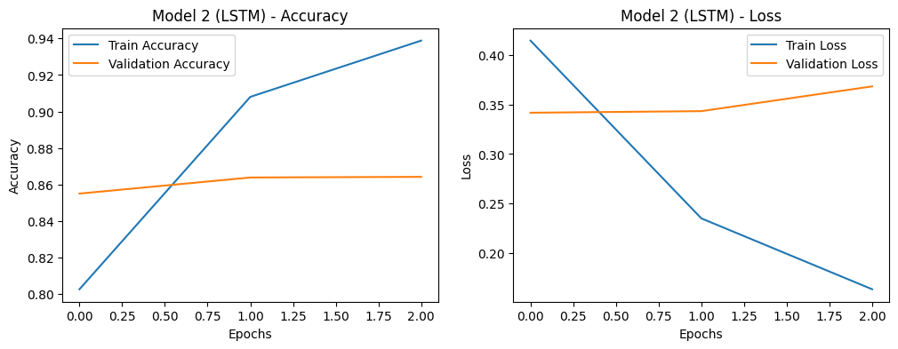

# 6.1

**Word Embedding** là một khái niệm quan trọng trong lĩnh vực xử lý ngôn ngữ tự nhiên (NLP) và học máy. Nó là một phương pháp biểu diễn từ vựng ngôn ngữ bằng các vector số học trong không gian nhiều chiều. Word Embedding giúp chúng ta biểu diễn từ vựng dưới dạng số học để máy tính có thể hiểu được và làm việc với chúng.

**Các loại Word Embedding**

**Word Embedding** được phân ra chủ yếu làm hai loại:
  - Frequency-based Embedding:
  
    Là các phương pháp dựa trên tần suất xuất hiện của từ trong văn bản. Các phương pháp này sử dụng ma trận thống kê từ vựng để tạo ra các vector biểu diễn từ. Trong đó có 3 loại phổ biến nhất:
      - Count Vector: là một phương pháp đơn giản nhất để biểu diễn từ vựng. Nó sử dụng một vector đếm để đếm số lần xuất hiện của từ trong văn bản. Ví dụ: "I love to eat pizza" sẽ được biểu diễn bằng vector đếm [1, 1, 1, 1, 1, 1].
      - TF-IDF Vector: là một phương pháp biểu diễn từ vựng dựa trên tần suất nhiều hơn so với Count Vector. Nó sử dụng một vector đếm để đếm số lần xuất hiện của từ trong văn bản nhưng nó cũng tính toán trọng số của từ đó trong văn bản. Ví dụ: "I love to eat pizza" sẽ được biểu diễn bằng vector đếm [0.6, 0.6, 0.6, 0.6, 0.6, 0.6].
      - Co-occurrence Vector: là một phương pháp biểu diễn từ vựng dựa trên tần suất nhiều hơn so với TF-IDF Vector. Nó sử dụng một vector đếm để đếm số lần xuất hiện của từ trong văn bản nhưng nó cũng tính toán trọng số của từ đó trong văn bản. Ví dụ: "I love to eat pizza" sẽ được biểu diễn bằng vector đếm [0.6, 0.6, 0.6, 0.6, 0.6, 0.6].

  - Prediction-based Embedding:
  
    Là các phương pháp dựa trên việc dự đoán từ dựa trên các từ xung quanh nó. Các phương pháp này sử dụng mạng nơ-ron để học các vector biểu diễn từ. Trong đó có 3 loại phổ biến nhất:
      - **Word2Vec**: là một mô hình mạng nơ-ron sử dụng để học Word Embedding từ một tập dữ liệu văn bản lớn. Nó có thể học được các mối quan hệ giữa các từ và các từ đồng tham chiếu với nhau. **Word2Vec** có thể tạo ra các vector từ vựng có độ dài cố định.
      - **GloVe**: là một mô hình Word Embedding dựa trên ma trận thống kê từ. Sử dụng ma trận thống kê từ vựng để tạo ra các vector biểu diễn từ.
      - **FastText**: là một mô hình Word Embedding dựa trên các n-gram. Nó có thể tạo ra các vector từ vựng có độ dài thay đổi. Tương tự **Word2Vec** nhưng biểu diễn từng từ dưới dạng các sub-word (các phần nhỏ hơn của từ). Ví dụ: từ "apple" có thể được biểu diễn bằng các sub-word là "ap", "app", "appl", "apple", "ppl", "pple", "ple", "le".

**Một chút so sánh giữa Word2Vec và GloVe**

  - **Word2Vec**: là một mô hình Word Embedding dựa trên mạng nơ-ron. Nó có thể học được các mối quan hệ giữa các từ và các từ đồng tham chiếu với nhau. **Word2Vec** có thể tạo ra các vector từ vựng có độ dài cố định.
  - **GloVe**: là một mô hình Word Embedding dựa trên ma trận thống kê từ. Sử dụng ma trận thống kê từ vựng để tạo ra các vector biểu diễn từ.

    Về bản chất, rõ ràng **Word2vec** và **GloVe** khác nhau do thuộc 2 loại Embedding khác nhau nhưng đều bắt nguồn từ Context Window, **Word2vec** sử dụng Context Window để tạo ra các tập train cho mạng neuron còn **GloVe** sử dụng nó để tạo ra Co-occurrence Matrix. Để ý kĩ một chút, ta thấy rằng **GloVe** mang tính “toàn cục” hơn là **Word2vec** vì **GloVe** tính toán xác suất từ dựa trên toàn bộ tập dữ liệu còn **Word2vec** học dựa trên các ngữ cảnh đơn lẻ, cũng chính vì lý do này mà **GloVe** có trội hơn **Word2vec** cũng như vài mô hình khác trong một số task về ngữ nghĩa, nhận dạng thực thể có gắn tên,vv… Ngoài ra, **GloVe** có độ ổn định trung bình tốt hơn **Word2vec**, độ ổn định ở đây chính là độ biến thiên của kết quả giữa hai lần ta thực hiện việc học với cùng một điều kiện xác định (cùng bộ dữ liệu, cùng tham số, cùng điều kiện phần cứng,…).

**Ứng dụng:**

  **1. Xử Lý Ngôn Ngữ Tự Nhiên (NLP):**

  - *Phân Loại Văn Bản:* Word Embedding giúp máy tính hiểu ngữ cảnh và ngữ nghĩa của các từ, dễ dàng phân loại văn bản vào các danh mục khác nhau. Ví dụ, phân loại email là thư rác hoặc thư quan trọng.

  - *Dự Đoán Từ:* Mô hình Word2Vec cho phép dự đoán từ tiếp theo trong văn bản dựa trên từ trước đó, có thể ứng dụng trong việc dự đoán câu kế tiếp trong văn bản hoặc tạo văn bản tự động.

  - *Tạo Tiêu Đề Tự Động:* Word Embedding được sử dụng để tạo tiêu đề tự động cho bài báo hoặc ảnh bằng cách tổng hợp ngữ nghĩa của nội dung.

  **2. Tìm Kiếm Thông Tin:**

  - *Tìm Kiếm Trực Tuyến:* Word Embedding cải thiện tính chính xác của các công cụ tìm kiếm trực tuyến. Thay vì tìm kiếm dựa trên chuỗi ký tự, chúng ta có thể tìm kiếm dựa trên ngữ nghĩa và ngữ cảnh.

  - *E-commerce và Gợi Ý Sản Phẩm:* Word Embedding giúp xác định sự tương tự giữa sản phẩm và gợi ý cho người dùng các sản phẩm liên quan dựa trên lịch sử mua sắm và tìm kiếm của họ.

  **3. Phân Tích Ý Kiến và Tư Duy Người Dùng:**

  - *Phân Tích Ý Kiến:* Word Embedding được sử dụng để xác định cảm xúc và ý kiến của người dùng về sản phẩm hoặc dịch vụ dựa trên các bài đánh giá và bình luận trên mạng xã hội.

  - *Tư Duy Người Dùng:* Word Embedding có thể giúp xây dựng hồ sơ tư duy của người dùng dựa trên nội dung mà họ đã tiêu thụ, từ đó cá nhân hóa nội dung và dịch vụ.

  **4. Dịch Máy và Tự Động Hóa:**

  - *Dịch Máy:* Word Embedding cải thiện khả năng dịch máy bằng cách hiểu ngữ cảnh và ngữ nghĩa của từ trong văn bản nguồn và văn bản đích.

  - *Tự Động Hóa:* Các ứng dụng tự động hóa có thể sử dụng Word Embedding để hiểu và tự động xử lý thông tin từ văn bản, ví dụ như chatbot hoặc tự động phản hồi email.

  **5. Tóm Tắt và Trích Xuất Thông Tin:**

  - *Tóm Tắt:* Word Embedding giúp tóm tắt nội dung văn bản một cách tự động bằng cách xác định các câu quan trọng và nội dung chính.

  - *Trích Xuất Thông Tin:* Word Embedding có thể sử dụng để trích xuất thông tin quan trọng từ tài liệu, đặc biệt là trong nghiên cứu và ngành tin tức.

    Các ứng dụng của Word Embedding đa dạng và không ngừng phát triển, giúp cải thiện hiệu suất và hiểu biết máy tính trong nhiều lĩnh vực khác nhau.

**Tiềm năng và thách thức của Word Embedding**

  **1. Tiềm Năng:**

  - **Tăng Hiểu Biết:** Word Embedding giúp máy tính hiểu ngôn ngữ tự nhiên một cách gần giống con người, cải thiện các ứng dụng NLP và tương tác người-máy.

  - **Tiết Kiệm Tài Nguyên:** Biểu diễn từ bằng vector giúp tiết kiệm tài nguyên tính toán và bộ nhớ so với lưu trữ từ vựng nguyên bản.

  - **Tích hợp tri thức:** Word Embedding có thể tích hợp tri thức từ dữ liệu văn bản lớn, giúp máy tính hiểu sâu hơn về thế giới.

  **2. Thách thức:**

  - **Kích thước dữ liệu lớn:** Cần một lượng dữ liệu lớn để tạo Word Embedding hiệu quả.

  - **Khái niệm của từ:** Word Embedding có thể bị hạn chế trong việc biểu diễn các từ có nhiều ý nghĩa hoặc phụ thuộc vào ngữ cảnh.

  - **Đảm bảo tính toàn vẹn và quyền riêng tư:** Sử dụng Word Embedding có thể dẫn đến vấn đề liên quan đến quyền riêng tư và nội dung độc hại.

# 6.2

Word embedding là một kỹ thuật quan trọng trong xử lý ngôn ngữ tự nhiên (NLP), được sử dụng rộng rãi trong các bài toán phân loại văn bản. Mục tiêu của word embedding là biểu diễn từng từ trong văn bản bằng một vectơ số học, thường là một vectơ nhiều chiều, để có thể sử dụng chúng cho các mô hình học máy hoặc mạng nơ-ron. Đây là một số khía cạnh chi tiết về word embedding cho bài toán phân loại văn bản:

1. **Khái niệm cơ bản**: Word embedding là quá trình ánh xạ từng từ trong văn bản sang một không gian vectơ số học. Mỗi từ sẽ có một biểu diễn vectơ tương ứng, và những từ có ý nghĩa tương tự thường sẽ có biểu diễn gần nhau trong không gian vectơ.

2. **Word2Vec**: Word2Vec là một trong những phương pháp word embedding phổ biến nhất. Nó sử dụng một mô hình mạng nơ-ron để học biểu diễn từ, dựa trên ngữ cảnh (context) của từ đó trong văn bản. Word2Vec tạo ra hai kiểu biểu diễn: Continuous Bag of Words (CBOW) và Skip-gram. Trong CBOW, cố gắng dự đoán từ tiền đề (context) từ các từ lân cận. Trong Skip-gram, cố gắng dự đoán các từ lân cận dựa trên từ tiền đề.

3. **GloVe**: GloVe (Global Vectors for Word Representation) là một phương pháp khác để học word embedding. Nó kết hợp thông tin về xác suất xuất hiện của các từ trong cùng một văn bản để tạo ra các biểu diễn vectơ. GloVe thường cho kết quả tốt trong việc hiểu ý nghĩa của các từ.

4. **Sử dụng pre-trained embeddings**: Thay vì huấn luyện word embedding từ đầu trên dữ liệu của mình, bạn có thể sử dụng pre-trained embeddings. Các mô hình như Word2Vec, GloVe và FastText đã được huấn luyện trên dữ liệu lớn và có thể được tải về và sử dụng ngay lập tức. Điều này giúp giảm thời gian và nguồn lực cần thiết để xây dựng mô hình của bạn.

5. **Fine-tuning embeddings**: Trong một số trường hợp, bạn có thể muốn fine-tuning pre-trained embeddings cho bài toán cụ thể của mình. Điều này có thể thực hiện bằng cách đặt lại các trọng số của embeddings trong quá trình huấn luyện mô hình phân loại văn bản của bạn.

6. **Sử dụng embeddings trong mô hình phân loại**: Sau khi có các biểu diễn word embedding cho các từ trong văn bản, bạn có thể sử dụng chúng trong mô hình phân loại văn bản của mình. Mô hình này có thể là một mạng nơ-ron, một máy học cơ học, hoặc bất kỳ mô hình nào phù hợp cho bài toán phân loại cụ thể của bạn.

Word embedding là một phần quan trọng của xử lý ngôn ngữ tự nhiên và giúp cải thiện hiệu suất của các mô hình NLP trong nhiều bài toán khác nhau, bao gồm phân loại văn bản.


```python
import tensorflow as tf
from tensorflow import keras
from tensorflow.keras.layers import Embedding, Flatten, LSTM, Conv1D, GlobalMaxPooling1D, Dense
from tensorflow.keras.datasets import imdb
from tensorflow.keras.preprocessing.sequence import pad_sequences
import matplotlib.pyplot as plt

# Load dữ liệu IMDb
max_words = 10000
maxlen = 200
(X_train, y_train), (X_test, y_test) = imdb.load_data(num_words=max_words)
X_train = pad_sequences(X_train, maxlen=maxlen)
X_test = pad_sequences(X_test, maxlen=maxlen)
```

    Downloading data from https://storage.googleapis.com/tensorflow/tf-keras-datasets/imdb.npz
    17464789/17464789 [==============================] - 0s 0us/step
    


```python
# Kiến trúc 1: Mạng nơ-ron đơn giản
model1 = keras.Sequential([
    Embedding(max_words, 128, input_length=maxlen),
    Flatten(),
    Dense(128, activation='relu'),
    Dense(1, activation='sigmoid')
])
model1.compile(optimizer='adam', loss='binary_crossentropy', metrics=['accuracy'])

history1 = model1.fit(X_train, y_train, epochs=3, batch_size=64, validation_data=(X_test, y_test))
```

    Epoch 1/3
    391/391 [==============================] - 38s 95ms/step - loss: 0.4071 - accuracy: 0.7965 - val_loss: 0.3073 - val_accuracy: 0.8677
    Epoch 2/3
    391/391 [==============================] - 37s 96ms/step - loss: 0.0741 - accuracy: 0.9750 - val_loss: 0.4305 - val_accuracy: 0.8487
    Epoch 3/3
    391/391 [==============================] - 43s 110ms/step - loss: 0.0072 - accuracy: 0.9984 - val_loss: 0.5803 - val_accuracy: 0.8541
    


```python
# Kiến trúc 2: Mạng nơ-ron sử dụng LSTM
model2 = keras.Sequential([
    Embedding(max_words, 128, input_length=maxlen),
    LSTM(128, return_sequences=True),
    LSTM(128),
    Dense(1, activation='sigmoid')
])
model2.compile(optimizer='adam', loss='binary_crossentropy', metrics=['accuracy'])

history2 = model2.fit(X_train, y_train, epochs=3, batch_size=64, validation_data=(X_test, y_test))
```

    Epoch 1/3
    391/391 [==============================] - 524s 1s/step - loss: 0.4149 - accuracy: 0.8027 - val_loss: 0.3419 - val_accuracy: 0.8551
    Epoch 2/3
    391/391 [==============================] - 532s 1s/step - loss: 0.2349 - accuracy: 0.9080 - val_loss: 0.3435 - val_accuracy: 0.8639
    Epoch 3/3
    391/391 [==============================] - 542s 1s/step - loss: 0.1631 - accuracy: 0.9388 - val_loss: 0.3686 - val_accuracy: 0.8642
    


```python
# Kiến trúc 3: Mạng nơ-ron sử dụng CNN
model3 = keras.Sequential([
    Embedding(max_words, 128, input_length=maxlen),
    Conv1D(128, 5, activation='relu'),
    GlobalMaxPooling1D(),
    Dense(128, activation='relu'),
    Dense(1, activation='sigmoid')
])
model3.compile(optimizer='adam', loss='binary_crossentropy', metrics=['accuracy'])

history3 = model3.fit(X_train, y_train, epochs=3, batch_size=64, validation_data=(X_test, y_test))
```

    Epoch 1/3
    391/391 [==============================] - 91s 230ms/step - loss: 0.4077 - accuracy: 0.8032 - val_loss: 0.2924 - val_accuracy: 0.8741
    Epoch 2/3
    391/391 [==============================] - 93s 239ms/step - loss: 0.1647 - accuracy: 0.9390 - val_loss: 0.2770 - val_accuracy: 0.8848
    Epoch 3/3
    391/391 [==============================] - 89s 228ms/step - loss: 0.0375 - accuracy: 0.9906 - val_loss: 0.3482 - val_accuracy: 0.8821
    


```python
def plot_history(history, model_name):
    plt.figure(figsize=(12, 4))
    plt.subplot(1, 2, 1)
    plt.plot(history.history['accuracy'], label='Train Accuracy')
    plt.plot(history.history['val_accuracy'], label='Validation Accuracy')
    plt.xlabel('Epochs')
    plt.ylabel('Accuracy')
    plt.title(f'{model_name} - Accuracy')
    plt.legend()

    plt.subplot(1, 2, 2)
    plt.plot(history.history['loss'], label='Train Loss')
    plt.plot(history.history['val_loss'], label='Validation Loss')
    plt.xlabel('Epochs')
    plt.ylabel('Loss')
    plt.title(f'{model_name} - Loss')
    plt.legend()

    plt.show()

plot_history(history1, "Model 1 (Simple NN)")
plot_history(history2, "Model 2 (LSTM)")
plot_history(history3, "Model 3 (CNN)")
```


    

    


    

    


    

    


```python
import numpy as np
from tensorflow.keras.preprocessing.text import one_hot
from tensorflow.keras.preprocessing.sequence import pad_sequences
from tensorflow.keras.models import Sequential
from tensorflow.keras.layers import Embedding, Flatten, Dense, Conv1D, GlobalMaxPooling1D, LSTM
import matplotlib.pyplot as plt

# define documents
docs = [
    "Well done!",
    "Good work",
    "Great effort",
    "nice work",
    "Excellent!",
    "Weak",
    "Poor effort!",
    "not good",
    "poor work",
    "Could have done better.",
]

# define class labels
labels = np.array([1, 1, 1, 1, 1, 0, 0, 0, 0, 0])

# integer encode the documents
vocab_size = 50
encoded_docs = [one_hot(d, vocab_size) for d in docs]

# pad documents to a max length of 4 words
max_length = 4
padded_docs = pad_sequences(encoded_docs, maxlen=max_length, padding="post")

# List to store accuracy values for each model
accuracies = []

# List of model architectures
model_architectures = [
    "Simple NN",
    "Conv1D",
    "LSTM"
]

# Loop through each model architecture
for i, model_name in enumerate(model_architectures):
    # Create the model
    if model_name == "Simple NN":
        model = Sequential()
        model.add(Embedding(vocab_size, 8, input_length=max_length))
        model.add(Flatten())
        model.add(Dense(8, activation="relu"))
        model.add(Dense(1, activation="sigmoid"))
    elif model_name == "Conv1D":
        model = Sequential()
        model.add(Embedding(vocab_size, 8, input_length=max_length))
        model.add(Conv1D(16, 3, activation="relu"))
        model.add(GlobalMaxPooling1D())
        model.add(Dense(1, activation="sigmoid"))
    elif model_name == "LSTM":
        model = Sequential()
        model.add(Embedding(vocab_size, 8, input_length=max_length))
        model.add(LSTM(8))
        model.add(Dense(1, activation="sigmoid"))

    # Compile the model
    model.compile(optimizer="adam", loss="binary_crossentropy", metrics=["accuracy"])

    # Fit the model
    history = model.fit(padded_docs, labels, epochs=50, verbose=0)

    # Evaluate the model
    loss, accuracy = model.evaluate(padded_docs, labels, verbose=0)
    accuracies.append(accuracy * 100)

    # Plot accuracy history
    plt.plot(history.history['accuracy'], label=model_name)

# Display the final accuracy results
for i, acc in enumerate(accuracies):
    print(f"{model_architectures[i]} Accuracy: {acc:.2f}%")

# Plot accuracy comparison
plt.title('Model Accuracy Comparison')
plt.xlabel('Epoch')
plt.ylabel('Accuracy')
plt.legend()
plt.show()

```

    Simple NN Accuracy: 80.00%
    Conv1D Accuracy: 70.00%
    LSTM Accuracy: 80.00%
    


    

    


# 6.3

Trong học sâu (deep learning), lớp nhúng (embedding layer) có vẻ như một ẩn số cho đến khi bạn nắm được nó. Vì lớp nhúng là một phần quan trọng của mạng nơ-ron, nên việc hiểu cách nó hoạt động là rất quan trọng. Trong bài viết này, tôi sẽ cố gắng giải thích lớp nhúng là gì, tại sao cần nó và cách nó hoạt động, cùng với một số ví dụ về mã hóa. Vậy thì bắt đầu thôi.

**Lớp Nhúng Là Gì**
Lớp nhúng (Embedding layer) là một trong những lớp có sẵn trong Keras. Đây chủ yếu làm việc trong các ứng dụng liên quan đến xử lý ngôn ngữ tự nhiên (Natural Language Processing) như mô hình ngôn ngữ, nhưng cũng có thể được sử dụng trong các nhiệm vụ khác liên quan đến mạng nơ-ron. Trong việc giải quyết các vấn đề liên quan đến NLP, chúng ta có thể sử dụng các lớp nhúng từ tiền huấn luyện như GloVe. Hoặc chúng ta cũng có thể tự huấn luyện các lớp nhúng riêng bằng cách sử dụng lớp nhúng của Keras.

**Sự Cần Thiết Của Lớp Nhúng**
Có thể nghĩ đến các lớp nhúng (word embeddings) như là một phương thức thay thế cho mã hóa one-hot cùng với việc giảm chiều dữ liệu.

Như chúng ta biết, khi xử lý dữ liệu văn bản, chúng ta cần chuyển đổi chúng thành dạng số trước khi đưa vào bất kỳ mô hình học máy nào, bao gồm cả mạng nơ-ron. Đơn giản, từ có thể được so sánh với các biến phân loại. Chúng ta sử dụng mã hóa one-hot để chuyển đổi các đặc trưng phân loại thành số. Để làm điều này, chúng ta tạo các đặc trưng giả cho mỗi phân loại và điền chúng bằng 0 và 1.

Tương tự, nếu chúng ta sử dụng mã hóa one-hot cho các từ trong dữ liệu văn bản, chúng ta sẽ có một đặc trưng giả cho mỗi từ, điều đó có nghĩa là 10.000 đặc trưng cho một từ điển có 10.000 từ. Đây không phải là một cách tiếp cận nhúng hợp lý vì nó đòi hỏi không gian lưu trữ lớn cho các vectơ từ và làm giảm hiệu suất mô hình.

Lớp nhúng cho phép chúng ta chuyển đổi mỗi từ thành một vectơ có độ dài cố định. Vectơ kết quả là một vectơ dày đặc với các giá trị thực sự thay vì chỉ là 0 và 1. Độ dài cố định của vectơ từ giúp chúng ta biểu diễn các từ một cách tốt hơn cùng với việc giảm kích thước.

Cách làm này, lớp nhúng hoạt động giống như một bảng tra cứu. Các từ là các khóa trong bảng này, trong khi các vectơ từ dày đặc là các giá trị. Để hiểu rõ hơn, hãy xem xét cách triển khai của lớp nhúng trong Keras.

**Triển Khai Trong Keras**
Hãy bắt đầu bằng cách nhập các thư viện cần thiết.

```python
from tensorflow.keras.models import Sequential
from tensorflow.keras.layers import Embedding
import numpy as np
```

Chúng ta có thể tạo một mô hình Keras đơn giản bằng cách thêm một lớp nhúng.

```python
model = Sequential()
embedding_layer = Embedding(input_dim=10, output_dim=4, input_length=2)
model.add(embedding_layer)
model.compile('adam', 'mse')
```

Có ba tham số cho lớp nhúng:

- `input_dim`: Kích thước của từ vựng (vocabulary).
- `output_dim`: Độ dài của vectơ cho mỗi từ.
- `input_length`: Độ dài tối đa của một chuỗi.

Trong ví dụ trên, chúng ta đặt 10 là kích thước từ vựng, vì chúng ta sẽ mã hóa các số từ 0 đến 9. Chúng ta muốn độ dài của vectơ từ là 4, vì vậy `output_dim` được đặt là 4. Độ dài của chuỗi đầu vào cho lớp nhúng sẽ là 2.

Bây giờ, hãy truyền một đầu vào mẫu vào mô hình của chúng ta và xem kết quả.

```python
input_data = np.array([[1, 2]])
pred = model.predict(input_data)
print(input_data.shape)
print(pred)
```

Kết quả của đoạn mã trên sẽ như sau.

```shell
(1, 2)
[[[ 0.04502351  0.00151128  0.01764284 -0.0089057 ]
  [-0.04007018  0.028743
```


```python
import numpy as np
from numpy import array
from tensorflow.keras.preprocessing.text import one_hot
from tensorflow.keras.preprocessing.sequence import pad_sequences
from tensorflow.keras.models import Sequential
from tensorflow.keras.layers import Flatten, Embedding, Dense
import matplotlib.pyplot as plt

# Define 10 restaurant reviews
reviews = [
    'Never coming back!',
    'horrible service',
    'rude waitress',
    'cold food',
    'horrible food!',
    'awesome',
    'awesome services!',
    'rocks',
    'poor work',
    'couldn\'t have done better'
]

# Define labels
labels = array([1, 1, 1, 1, 1, 0, 0, 0, 0, 0])

# Define vocabulary size
Vocab_size = 50

# Encode reviews
encoded_reviews = [one_hot(d, Vocab_size) for d in reviews]

# Define max sequence length
max_length = 4

# Pad sequences
padded_reviews = pad_sequences(encoded_reviews, maxlen=max_length, padding='post')

# Initialize an empty list to store embedding weights
embedding_weights_list = []

# Create a list of output_dim values for the three architectures
output_dims = [8, 16, 4]

# Create an empty list to store accuracies
accuracies = []

# Create models and plot embeddings for each architecture
for output_dim in output_dims:
    model = Sequential()
    embedding_layer = Embedding(input_dim=Vocab_size, output_dim=output_dim, input_length=max_length)
    model.add(embedding_layer)
    model.add(Flatten())
    model.add(Dense(1, activation='sigmoid'))
    model.compile(optimizer='adam', loss='binary_crossentropy', metrics=['acc'])
    
    # Fit the model
    model.fit(padded_reviews, labels, epochs=100, verbose=0)
    
    # Get embedding weights and append them to the list
    embedding_weights = embedding_layer.get_weights()[0]
    embedding_weights_list.append(embedding_weights)
    
    # Evaluate accuracy
    _, accuracy = model.evaluate(padded_reviews, labels)
    accuracies.append(accuracy)
    
    # Plot the embedding of the first word
    first_word_embedding = embedding_weights[0]
    plt.plot(np.arange(len(first_word_embedding)), first_word_embedding, label=f'Output Dim = {output_dim}')

# Customize the plot
plt.xlabel('Dimension')
plt.ylabel('Embedding Value')
plt.title('Embedding of First Word')
plt.legend()
plt.show()

# Print accuracies for each architecture
for i, output_dim in enumerate(output_dims):
    print(f"Accuracy for Output Dim = {output_dim}: {accuracies[i]*100:.2f}%")

```

    1/1 [==============================] - 0s 203ms/step - loss: 0.4351 - acc: 1.0000
    1/1 [==============================] - 0s 208ms/step - loss: 0.3034 - acc: 1.0000
    1/1 [==============================] - 0s 174ms/step - loss: 0.5088 - acc: 1.0000
    


    

    


    Accuracy for Output Dim = 8: 100.00%
    Accuracy for Output Dim = 16: 100.00%
    Accuracy for Output Dim = 4: 100.00%
    
