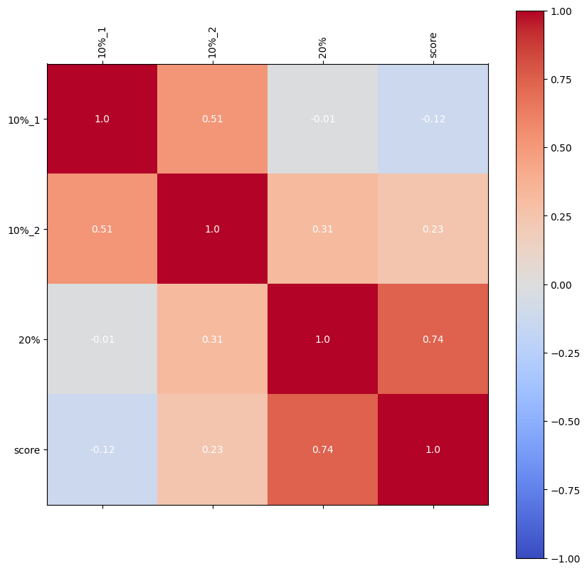
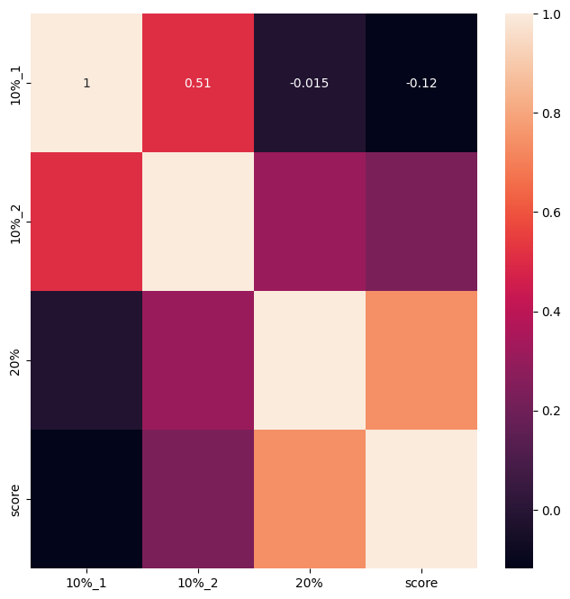
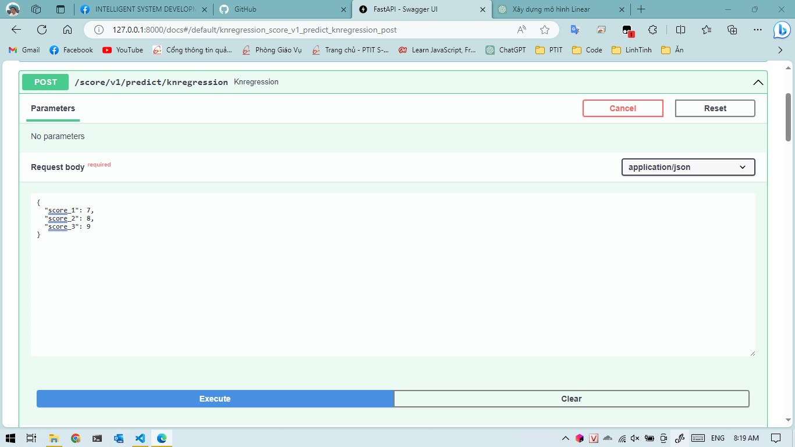

## Sử dụng pandas để chuyển các file excel sang csv

**File 1**


```python
import pandas as pd

df1 = pd.read_excel("./DATA_DIEMTHI/data_pttk_1.xlsx")

# Save to CSV
df1.to_csv("./DATA_DIEMTHI/data_pttk_1.csv", index=False)

df1
```


<div>
<style scoped>
    .dataframe tbody tr th:only-of-type {
        vertical-align: middle;
    }

    .dataframe tbody tr th {
        vertical-align: top;
    }

    .dataframe thead th {
        text-align: right;
    }
</style>
<table border="1" class="dataframe">
  <thead>
    <tr style="text-align: right;">
      <th></th>
      <th>mã sv</th>
      <th>0.1</th>
      <th>0.1.1</th>
      <th>Unnamed: 3</th>
      <th>0.2</th>
      <th>Unnamed: 5</th>
      <th>điểm thi</th>
      <th>Unnamed: 7</th>
    </tr>
  </thead>
  <tbody>
    <tr>
      <th>0</th>
      <td>b1</td>
      <td>9</td>
      <td>7</td>
      <td>NaN</td>
      <td>6.0</td>
      <td>NaN</td>
      <td>6.00</td>
      <td>sáu điểm</td>
    </tr>
    <tr>
      <th>1</th>
      <td>b2</td>
      <td>9</td>
      <td>7</td>
      <td>NaN</td>
      <td>6.0</td>
      <td>NaN</td>
      <td>6.00</td>
      <td>sáu điểm</td>
    </tr>
    <tr>
      <th>2</th>
      <td>b3</td>
      <td>10</td>
      <td>9</td>
      <td>NaN</td>
      <td>7.0</td>
      <td>NaN</td>
      <td>7.25</td>
      <td>bảy hai lăm</td>
    </tr>
    <tr>
      <th>3</th>
      <td>b4</td>
      <td>9</td>
      <td>7</td>
      <td>NaN</td>
      <td>6.0</td>
      <td>NaN</td>
      <td>6.00</td>
      <td>sáu điểm</td>
    </tr>
    <tr>
      <th>4</th>
      <td>b5</td>
      <td>10</td>
      <td>8</td>
      <td>NaN</td>
      <td>7.0</td>
      <td>NaN</td>
      <td>7.50</td>
      <td>bảy rưỡi</td>
    </tr>
    <tr>
      <th>5</th>
      <td>b6</td>
      <td>9</td>
      <td>7</td>
      <td>NaN</td>
      <td>6.5</td>
      <td>NaN</td>
      <td>6.50</td>
      <td>sáu rưỡi</td>
    </tr>
    <tr>
      <th>6</th>
      <td>b7</td>
      <td>0</td>
      <td>0</td>
      <td>NaN</td>
      <td>0.0</td>
      <td>NaN</td>
      <td>NaN</td>
      <td>NaN</td>
    </tr>
    <tr>
      <th>7</th>
      <td>b8</td>
      <td>10</td>
      <td>8</td>
      <td>NaN</td>
      <td>6.0</td>
      <td>NaN</td>
      <td>7.25</td>
      <td>bảy hai lăm</td>
    </tr>
    <tr>
      <th>8</th>
      <td>b9</td>
      <td>10</td>
      <td>8</td>
      <td>NaN</td>
      <td>8.0</td>
      <td>NaN</td>
      <td>8.00</td>
      <td>tám điểm</td>
    </tr>
    <tr>
      <th>9</th>
      <td>b10</td>
      <td>10</td>
      <td>8</td>
      <td>NaN</td>
      <td>7.5</td>
      <td>NaN</td>
      <td>8.75</td>
      <td>tám bảy lăm</td>
    </tr>
    <tr>
      <th>10</th>
      <td>b11</td>
      <td>9</td>
      <td>7</td>
      <td>NaN</td>
      <td>6.0</td>
      <td>NaN</td>
      <td>5.50</td>
      <td>năm rưỡi</td>
    </tr>
    <tr>
      <th>11</th>
      <td>b12</td>
      <td>9</td>
      <td>7</td>
      <td>NaN</td>
      <td>6.0</td>
      <td>NaN</td>
      <td>6.00</td>
      <td>sáu điểm</td>
    </tr>
    <tr>
      <th>12</th>
      <td>b13</td>
      <td>10</td>
      <td>8</td>
      <td>NaN</td>
      <td>7.0</td>
      <td>NaN</td>
      <td>7.50</td>
      <td>bảy rưỡi</td>
    </tr>
    <tr>
      <th>13</th>
      <td>b14</td>
      <td>0</td>
      <td>0</td>
      <td>NaN</td>
      <td>0.0</td>
      <td>NaN</td>
      <td>NaN</td>
      <td>NaN</td>
    </tr>
    <tr>
      <th>14</th>
      <td>b15</td>
      <td>10</td>
      <td>8</td>
      <td>NaN</td>
      <td>7.0</td>
      <td>NaN</td>
      <td>7.00</td>
      <td>bảy điểm</td>
    </tr>
    <tr>
      <th>15</th>
      <td>b16</td>
      <td>10</td>
      <td>8</td>
      <td>NaN</td>
      <td>6.0</td>
      <td>NaN</td>
      <td>7.50</td>
      <td>bảy rưỡi</td>
    </tr>
    <tr>
      <th>16</th>
      <td>b17</td>
      <td>10</td>
      <td>9</td>
      <td>NaN</td>
      <td>7.0</td>
      <td>NaN</td>
      <td>7.25</td>
      <td>bảy hai lăm</td>
    </tr>
    <tr>
      <th>17</th>
      <td>b18</td>
      <td>6</td>
      <td>5</td>
      <td>NaN</td>
      <td>5.0</td>
      <td>NaN</td>
      <td>5.00</td>
      <td>năm diểm</td>
    </tr>
    <tr>
      <th>18</th>
      <td>b19</td>
      <td>9</td>
      <td>7</td>
      <td>NaN</td>
      <td>6.0</td>
      <td>NaN</td>
      <td>6.00</td>
      <td>sáu điểm</td>
    </tr>
    <tr>
      <th>19</th>
      <td>b20</td>
      <td>10</td>
      <td>9</td>
      <td>NaN</td>
      <td>7.0</td>
      <td>NaN</td>
      <td>6.50</td>
      <td>sáu rưỡi</td>
    </tr>
    <tr>
      <th>20</th>
      <td>b21</td>
      <td>9</td>
      <td>7</td>
      <td>NaN</td>
      <td>6.0</td>
      <td>NaN</td>
      <td>6.00</td>
      <td>sáu điểm</td>
    </tr>
    <tr>
      <th>21</th>
      <td>b22</td>
      <td>9</td>
      <td>7</td>
      <td>NaN</td>
      <td>6.0</td>
      <td>NaN</td>
      <td>3.50</td>
      <td>ba rưỡi</td>
    </tr>
    <tr>
      <th>22</th>
      <td>b23</td>
      <td>10</td>
      <td>8</td>
      <td>NaN</td>
      <td>7.0</td>
      <td>NaN</td>
      <td>8.00</td>
      <td>tám điểm</td>
    </tr>
    <tr>
      <th>23</th>
      <td>b24</td>
      <td>9</td>
      <td>6</td>
      <td>NaN</td>
      <td>6.0</td>
      <td>NaN</td>
      <td>6.50</td>
      <td>sáu rưỡi</td>
    </tr>
    <tr>
      <th>24</th>
      <td>b25</td>
      <td>10</td>
      <td>7</td>
      <td>NaN</td>
      <td>6.0</td>
      <td>NaN</td>
      <td>6.00</td>
      <td>sáu điểm</td>
    </tr>
    <tr>
      <th>25</th>
      <td>b26</td>
      <td>10</td>
      <td>7</td>
      <td>NaN</td>
      <td>6.0</td>
      <td>NaN</td>
      <td>7.00</td>
      <td>bảy điểm</td>
    </tr>
    <tr>
      <th>26</th>
      <td>b27</td>
      <td>10</td>
      <td>6</td>
      <td>NaN</td>
      <td>6.0</td>
      <td>NaN</td>
      <td>6.00</td>
      <td>sáu điểm</td>
    </tr>
    <tr>
      <th>27</th>
      <td>b28</td>
      <td>10</td>
      <td>7</td>
      <td>NaN</td>
      <td>6.0</td>
      <td>NaN</td>
      <td>7.00</td>
      <td>bảy điểm</td>
    </tr>
    <tr>
      <th>28</th>
      <td>b29</td>
      <td>10</td>
      <td>8</td>
      <td>NaN</td>
      <td>6.5</td>
      <td>NaN</td>
      <td>7.50</td>
      <td>bảy rưỡi</td>
    </tr>
    <tr>
      <th>29</th>
      <td>b30</td>
      <td>9</td>
      <td>8</td>
      <td>NaN</td>
      <td>6.0</td>
      <td>NaN</td>
      <td>5.50</td>
      <td>năm rưỡi</td>
    </tr>
    <tr>
      <th>30</th>
      <td>b30</td>
      <td>9</td>
      <td>7</td>
      <td>NaN</td>
      <td>6.0</td>
      <td>NaN</td>
      <td>6.50</td>
      <td>sáu rưỡi</td>
    </tr>
    <tr>
      <th>31</th>
      <td>b31</td>
      <td>10</td>
      <td>7</td>
      <td>NaN</td>
      <td>6.0</td>
      <td>NaN</td>
      <td>6.00</td>
      <td>sáu điểm</td>
    </tr>
    <tr>
      <th>32</th>
      <td>b32</td>
      <td>9</td>
      <td>7</td>
      <td>NaN</td>
      <td>6.0</td>
      <td>NaN</td>
      <td>5.50</td>
      <td>năm rưỡi</td>
    </tr>
    <tr>
      <th>33</th>
      <td>b34</td>
      <td>9</td>
      <td>7</td>
      <td>NaN</td>
      <td>6.0</td>
      <td>NaN</td>
      <td>4.50</td>
      <td>bốn rưỡi</td>
    </tr>
    <tr>
      <th>34</th>
      <td>b35</td>
      <td>9</td>
      <td>7</td>
      <td>NaN</td>
      <td>6.0</td>
      <td>NaN</td>
      <td>NaN</td>
      <td>NaN</td>
    </tr>
    <tr>
      <th>35</th>
      <td>b36</td>
      <td>0</td>
      <td>0</td>
      <td>NaN</td>
      <td>0.0</td>
      <td>NaN</td>
      <td>NaN</td>
      <td>NaN</td>
    </tr>
    <tr>
      <th>36</th>
      <td>b37</td>
      <td>10</td>
      <td>9</td>
      <td>NaN</td>
      <td>7.0</td>
      <td>NaN</td>
      <td>7.50</td>
      <td>bảy rưỡi</td>
    </tr>
    <tr>
      <th>37</th>
      <td>b38</td>
      <td>10</td>
      <td>8</td>
      <td>NaN</td>
      <td>7.0</td>
      <td>NaN</td>
      <td>7.00</td>
      <td>bảy điểm</td>
    </tr>
    <tr>
      <th>38</th>
      <td>b39</td>
      <td>10</td>
      <td>8</td>
      <td>NaN</td>
      <td>7.5</td>
      <td>NaN</td>
      <td>7.25</td>
      <td>bảy hai lăm</td>
    </tr>
    <tr>
      <th>39</th>
      <td>b40</td>
      <td>0</td>
      <td>0</td>
      <td>NaN</td>
      <td>0.0</td>
      <td>NaN</td>
      <td>NaN</td>
      <td>NaN</td>
    </tr>
    <tr>
      <th>40</th>
      <td>b41</td>
      <td>9</td>
      <td>7</td>
      <td>NaN</td>
      <td>6.0</td>
      <td>NaN</td>
      <td>6.50</td>
      <td>sáu rưỡi</td>
    </tr>
    <tr>
      <th>41</th>
      <td>b42</td>
      <td>0</td>
      <td>0</td>
      <td>NaN</td>
      <td>0.0</td>
      <td>NaN</td>
      <td>NaN</td>
      <td>NaN</td>
    </tr>
    <tr>
      <th>42</th>
      <td>b43</td>
      <td>10</td>
      <td>8</td>
      <td>NaN</td>
      <td>7.0</td>
      <td>NaN</td>
      <td>7.25</td>
      <td>bẩy hai lăm</td>
    </tr>
    <tr>
      <th>43</th>
      <td>b44</td>
      <td>10</td>
      <td>8</td>
      <td>NaN</td>
      <td>7.0</td>
      <td>NaN</td>
      <td>7.25</td>
      <td>bảy hai lăm</td>
    </tr>
    <tr>
      <th>44</th>
      <td>b45</td>
      <td>10</td>
      <td>7</td>
      <td>NaN</td>
      <td>6.0</td>
      <td>NaN</td>
      <td>6.00</td>
      <td>sáu điểm</td>
    </tr>
    <tr>
      <th>45</th>
      <td>b46</td>
      <td>10</td>
      <td>8</td>
      <td>NaN</td>
      <td>7.5</td>
      <td>NaN</td>
      <td>7.00</td>
      <td>bảy điểm</td>
    </tr>
    <tr>
      <th>46</th>
      <td>b47</td>
      <td>0</td>
      <td>0</td>
      <td>NaN</td>
      <td>0.0</td>
      <td>NaN</td>
      <td>NaN</td>
      <td>NaN</td>
    </tr>
    <tr>
      <th>47</th>
      <td>b48</td>
      <td>10</td>
      <td>8</td>
      <td>NaN</td>
      <td>7.0</td>
      <td>NaN</td>
      <td>7.00</td>
      <td>bảy điểm</td>
    </tr>
    <tr>
      <th>48</th>
      <td>b49</td>
      <td>9</td>
      <td>7</td>
      <td>NaN</td>
      <td>6.0</td>
      <td>NaN</td>
      <td>6.00</td>
      <td>sáu điểm</td>
    </tr>
    <tr>
      <th>49</th>
      <td>b50</td>
      <td>7</td>
      <td>6</td>
      <td>NaN</td>
      <td>5.0</td>
      <td>NaN</td>
      <td>5.00</td>
      <td>năm điểm</td>
    </tr>
    <tr>
      <th>50</th>
      <td>b51</td>
      <td>9</td>
      <td>7</td>
      <td>NaN</td>
      <td>6.0</td>
      <td>NaN</td>
      <td>6.00</td>
      <td>sáu điểm</td>
    </tr>
    <tr>
      <th>51</th>
      <td>b52</td>
      <td>9</td>
      <td>7</td>
      <td>NaN</td>
      <td>6.0</td>
      <td>NaN</td>
      <td>5.50</td>
      <td>năm rưỡi</td>
    </tr>
    <tr>
      <th>52</th>
      <td>b53</td>
      <td>10</td>
      <td>8</td>
      <td>NaN</td>
      <td>7.0</td>
      <td>NaN</td>
      <td>6.75</td>
      <td>sáu bảy lăm</td>
    </tr>
    <tr>
      <th>53</th>
      <td>b54</td>
      <td>10</td>
      <td>8</td>
      <td>NaN</td>
      <td>6.0</td>
      <td>NaN</td>
      <td>7.00</td>
      <td>bảy điểm</td>
    </tr>
  </tbody>
</table>
</div>


**File 2**


```python
import pandas as pd

df2 = pd.read_excel("./DATA_DIEMTHI/data_pttk_2.xlsx")

# Save to CSV
df2.to_csv("./DATA_DIEMTHI/data_pttk_2.csv", index=False)

df2
```


<div>
<style scoped>
    .dataframe tbody tr th:only-of-type {
        vertical-align: middle;
    }

    .dataframe tbody tr th {
        vertical-align: top;
    }

    .dataframe thead th {
        text-align: right;
    }
</style>
<table border="1" class="dataframe">
  <thead>
    <tr style="text-align: right;">
      <th></th>
      <th>mã sv</th>
      <th>0.1</th>
      <th>0.1.1</th>
      <th>Unnamed: 3</th>
      <th>0.2</th>
      <th>Unnamed: 5</th>
      <th>điểm thi</th>
    </tr>
  </thead>
  <tbody>
    <tr>
      <th>0</th>
      <td>a1</td>
      <td>9</td>
      <td>7</td>
      <td>NaN</td>
      <td>6.0</td>
      <td>NaN</td>
      <td>6.00</td>
    </tr>
    <tr>
      <th>1</th>
      <td>a2</td>
      <td>9</td>
      <td>7</td>
      <td>NaN</td>
      <td>6.0</td>
      <td>NaN</td>
      <td>5.50</td>
    </tr>
    <tr>
      <th>2</th>
      <td>a3</td>
      <td>10</td>
      <td>8</td>
      <td>NaN</td>
      <td>7.0</td>
      <td>NaN</td>
      <td>6.75</td>
    </tr>
    <tr>
      <th>3</th>
      <td>a4</td>
      <td>10</td>
      <td>8</td>
      <td>NaN</td>
      <td>6.0</td>
      <td>NaN</td>
      <td>7.00</td>
    </tr>
    <tr>
      <th>4</th>
      <td>a5</td>
      <td>9</td>
      <td>7</td>
      <td>NaN</td>
      <td>6.0</td>
      <td>NaN</td>
      <td>6.00</td>
    </tr>
    <tr>
      <th>5</th>
      <td>a6</td>
      <td>10</td>
      <td>8</td>
      <td>NaN</td>
      <td>7.0</td>
      <td>NaN</td>
      <td>6.50</td>
    </tr>
    <tr>
      <th>6</th>
      <td>a7</td>
      <td>9</td>
      <td>7</td>
      <td>NaN</td>
      <td>6.0</td>
      <td>NaN</td>
      <td>6.00</td>
    </tr>
    <tr>
      <th>7</th>
      <td>a8</td>
      <td>9</td>
      <td>7</td>
      <td>NaN</td>
      <td>6.0</td>
      <td>NaN</td>
      <td>5.00</td>
    </tr>
    <tr>
      <th>8</th>
      <td>a9</td>
      <td>10</td>
      <td>7</td>
      <td>NaN</td>
      <td>6.0</td>
      <td>NaN</td>
      <td>7.00</td>
    </tr>
    <tr>
      <th>9</th>
      <td>a10</td>
      <td>9</td>
      <td>7</td>
      <td>NaN</td>
      <td>6.0</td>
      <td>NaN</td>
      <td>5.50</td>
    </tr>
    <tr>
      <th>10</th>
      <td>a11</td>
      <td>9</td>
      <td>7</td>
      <td>NaN</td>
      <td>6.0</td>
      <td>NaN</td>
      <td>6.00</td>
    </tr>
    <tr>
      <th>11</th>
      <td>a12</td>
      <td>9</td>
      <td>7</td>
      <td>NaN</td>
      <td>6.0</td>
      <td>NaN</td>
      <td>4.50</td>
    </tr>
    <tr>
      <th>12</th>
      <td>a13</td>
      <td>9</td>
      <td>7</td>
      <td>NaN</td>
      <td>6.5</td>
      <td>NaN</td>
      <td>6.50</td>
    </tr>
    <tr>
      <th>13</th>
      <td>a14</td>
      <td>7</td>
      <td>7</td>
      <td>NaN</td>
      <td>6.0</td>
      <td>NaN</td>
      <td>6.75</td>
    </tr>
    <tr>
      <th>14</th>
      <td>a15</td>
      <td>9</td>
      <td>7</td>
      <td>NaN</td>
      <td>6.0</td>
      <td>NaN</td>
      <td>5.00</td>
    </tr>
    <tr>
      <th>15</th>
      <td>a16</td>
      <td>10</td>
      <td>8</td>
      <td>NaN</td>
      <td>7.0</td>
      <td>NaN</td>
      <td>6.75</td>
    </tr>
    <tr>
      <th>16</th>
      <td>a17</td>
      <td>10</td>
      <td>8</td>
      <td>NaN</td>
      <td>7.0</td>
      <td>NaN</td>
      <td>5.50</td>
    </tr>
    <tr>
      <th>17</th>
      <td>a18</td>
      <td>10</td>
      <td>8</td>
      <td>NaN</td>
      <td>7.0</td>
      <td>NaN</td>
      <td>7.50</td>
    </tr>
    <tr>
      <th>18</th>
      <td>a19</td>
      <td>9</td>
      <td>7</td>
      <td>NaN</td>
      <td>6.0</td>
      <td>NaN</td>
      <td>6.50</td>
    </tr>
    <tr>
      <th>19</th>
      <td>a20</td>
      <td>7</td>
      <td>6</td>
      <td>NaN</td>
      <td>5.0</td>
      <td>NaN</td>
      <td>4.50</td>
    </tr>
    <tr>
      <th>20</th>
      <td>a21</td>
      <td>9</td>
      <td>7</td>
      <td>NaN</td>
      <td>6.0</td>
      <td>NaN</td>
      <td>7.75</td>
    </tr>
    <tr>
      <th>21</th>
      <td>a22</td>
      <td>0</td>
      <td>0</td>
      <td>NaN</td>
      <td>0.0</td>
      <td>NaN</td>
      <td>NaN</td>
    </tr>
    <tr>
      <th>22</th>
      <td>a23</td>
      <td>9</td>
      <td>7</td>
      <td>NaN</td>
      <td>6.0</td>
      <td>NaN</td>
      <td>6.75</td>
    </tr>
    <tr>
      <th>23</th>
      <td>a24</td>
      <td>9</td>
      <td>7</td>
      <td>NaN</td>
      <td>6.0</td>
      <td>NaN</td>
      <td>5.50</td>
    </tr>
    <tr>
      <th>24</th>
      <td>a25</td>
      <td>9</td>
      <td>7</td>
      <td>NaN</td>
      <td>6.0</td>
      <td>NaN</td>
      <td>7.50</td>
    </tr>
    <tr>
      <th>25</th>
      <td>a26</td>
      <td>0</td>
      <td>0</td>
      <td>NaN</td>
      <td>0.0</td>
      <td>NaN</td>
      <td>NaN</td>
    </tr>
    <tr>
      <th>26</th>
      <td>a27</td>
      <td>10</td>
      <td>8</td>
      <td>NaN</td>
      <td>7.0</td>
      <td>NaN</td>
      <td>7.50</td>
    </tr>
    <tr>
      <th>27</th>
      <td>a28</td>
      <td>10</td>
      <td>8</td>
      <td>NaN</td>
      <td>7.0</td>
      <td>NaN</td>
      <td>6.00</td>
    </tr>
    <tr>
      <th>28</th>
      <td>a29</td>
      <td>9</td>
      <td>7</td>
      <td>NaN</td>
      <td>6.0</td>
      <td>NaN</td>
      <td>7.00</td>
    </tr>
    <tr>
      <th>29</th>
      <td>a30</td>
      <td>10</td>
      <td>8</td>
      <td>NaN</td>
      <td>7.0</td>
      <td>NaN</td>
      <td>6.50</td>
    </tr>
    <tr>
      <th>30</th>
      <td>a31</td>
      <td>9</td>
      <td>7</td>
      <td>NaN</td>
      <td>6.0</td>
      <td>NaN</td>
      <td>6.00</td>
    </tr>
  </tbody>
</table>
</div>


## Gộp lại thành 1 file csv `data_pttk.csv`

**Gộp file 1 và file 2**


```python
import pandas as pd

string_columns = ["msv",
                  {"header":"10%_1", "value": 0.1},
                  {"header":"10%_2", "value": 0.1},
                  {"header":"20%", "value": 0.2},
                  "score"
  ]

df1 = pd.read_csv("./DATA_DIEMTHI/data_pttk_1.csv")
df2 = pd.read_csv("./DATA_DIEMTHI/data_pttk_2.csv")

merge_df = pd.concat([df1, df2], ignore_index=True)

# Drop columns with all NaN values
merge_df = merge_df.dropna(axis=1, how='all')

# Drop rows with 0 values
merge_df = merge_df[(merge_df != 0).all(1)]

# Remove the last column
merge_df = merge_df.iloc[:, :-1]

# Use integer indices to access elements in the list
merge_df.columns = [string_columns[0], 
               string_columns[1]['header'], 
               string_columns[2]['header'], 
               string_columns[3]['header'], 
               string_columns[4]]

merge_df.to_csv("./DATA_DIEMTHI/data_pttk_1_2.csv", index=False)

merge_df
```


<div>
<style scoped>
    .dataframe tbody tr th:only-of-type {
        vertical-align: middle;
    }

    .dataframe tbody tr th {
        vertical-align: top;
    }

    .dataframe thead th {
        text-align: right;
    }
</style>
<table border="1" class="dataframe">
  <thead>
    <tr style="text-align: right;">
      <th></th>
      <th>msv</th>
      <th>10%_1</th>
      <th>10%_2</th>
      <th>20%</th>
      <th>score</th>
    </tr>
  </thead>
  <tbody>
    <tr>
      <th>0</th>
      <td>b1</td>
      <td>9</td>
      <td>7</td>
      <td>6.0</td>
      <td>6.00</td>
    </tr>
    <tr>
      <th>1</th>
      <td>b2</td>
      <td>9</td>
      <td>7</td>
      <td>6.0</td>
      <td>6.00</td>
    </tr>
    <tr>
      <th>2</th>
      <td>b3</td>
      <td>10</td>
      <td>9</td>
      <td>7.0</td>
      <td>7.25</td>
    </tr>
    <tr>
      <th>3</th>
      <td>b4</td>
      <td>9</td>
      <td>7</td>
      <td>6.0</td>
      <td>6.00</td>
    </tr>
    <tr>
      <th>4</th>
      <td>b5</td>
      <td>10</td>
      <td>8</td>
      <td>7.0</td>
      <td>7.50</td>
    </tr>
    <tr>
      <th>...</th>
      <td>...</td>
      <td>...</td>
      <td>...</td>
      <td>...</td>
      <td>...</td>
    </tr>
    <tr>
      <th>80</th>
      <td>a27</td>
      <td>10</td>
      <td>8</td>
      <td>7.0</td>
      <td>7.50</td>
    </tr>
    <tr>
      <th>81</th>
      <td>a28</td>
      <td>10</td>
      <td>8</td>
      <td>7.0</td>
      <td>6.00</td>
    </tr>
    <tr>
      <th>82</th>
      <td>a29</td>
      <td>9</td>
      <td>7</td>
      <td>6.0</td>
      <td>7.00</td>
    </tr>
    <tr>
      <th>83</th>
      <td>a30</td>
      <td>10</td>
      <td>8</td>
      <td>7.0</td>
      <td>6.50</td>
    </tr>
    <tr>
      <th>84</th>
      <td>a31</td>
      <td>9</td>
      <td>7</td>
      <td>6.0</td>
      <td>6.00</td>
    </tr>
  </tbody>
</table>
<p>77 rows × 5 columns</p>
</div>


**Đồng bộ header file 3**


```python
import pandas as pd

string_columns = ["msv",
                  {"header":"10%_1", "value": 0.1},
                  {"header":"10%_2", "value": 0.1},
                  {"header":"20%", "value": 0.2},
                  "score"
  ]

df3 = pd.read_csv("./DATA_DIEMTHI/data_pttk_3.csv")

df3.columns = [string_columns[0], 
               string_columns[1]['header'], 
               string_columns[2]['header'], 
               string_columns[3]['header'], 
               string_columns[4]]

df3.to_csv("./DATA_DIEMTHI/data_pttk_3_changed.csv", index=False)
df3
```


<div>
<style scoped>
    .dataframe tbody tr th:only-of-type {
        vertical-align: middle;
    }

    .dataframe tbody tr th {
        vertical-align: top;
    }

    .dataframe thead th {
        text-align: right;
    }
</style>
<table border="1" class="dataframe">
  <thead>
    <tr style="text-align: right;">
      <th></th>
      <th>msv</th>
      <th>10%_1</th>
      <th>10%_2</th>
      <th>20%</th>
      <th>score</th>
    </tr>
  </thead>
  <tbody>
    <tr>
      <th>0</th>
      <td>31_011</td>
      <td>8.375</td>
      <td>7.25</td>
      <td>8.50</td>
      <td>9.0</td>
    </tr>
    <tr>
      <th>1</th>
      <td>31_012</td>
      <td>8.250</td>
      <td>7.25</td>
      <td>8.50</td>
      <td>9.0</td>
    </tr>
    <tr>
      <th>2</th>
      <td>31_013</td>
      <td>8.500</td>
      <td>7.50</td>
      <td>8.50</td>
      <td>10.0</td>
    </tr>
    <tr>
      <th>3</th>
      <td>31_014</td>
      <td>4.000</td>
      <td>7.25</td>
      <td>8.50</td>
      <td>9.0</td>
    </tr>
    <tr>
      <th>4</th>
      <td>31_015</td>
      <td>8.750</td>
      <td>7.50</td>
      <td>8.50</td>
      <td>9.5</td>
    </tr>
    <tr>
      <th>...</th>
      <td>...</td>
      <td>...</td>
      <td>...</td>
      <td>...</td>
      <td>...</td>
    </tr>
    <tr>
      <th>70</th>
      <td>31_151</td>
      <td>8.250</td>
      <td>7.75</td>
      <td>8.25</td>
      <td>8.0</td>
    </tr>
    <tr>
      <th>71</th>
      <td>31_152</td>
      <td>3.500</td>
      <td>3.25</td>
      <td>6.00</td>
      <td>6.5</td>
    </tr>
    <tr>
      <th>72</th>
      <td>31_153</td>
      <td>7.250</td>
      <td>6.50</td>
      <td>6.00</td>
      <td>6.5</td>
    </tr>
    <tr>
      <th>73</th>
      <td>31_154</td>
      <td>7.750</td>
      <td>3.50</td>
      <td>7.50</td>
      <td>7.5</td>
    </tr>
    <tr>
      <th>74</th>
      <td>31_155</td>
      <td>0.000</td>
      <td>0.00</td>
      <td>0.00</td>
      <td>0.0</td>
    </tr>
  </tbody>
</table>
<p>75 rows × 5 columns</p>
</div>


**Merge file 3 changed với file 1 + 2**


```python
import pandas as pd

string_columns = ["msv",
                  {"header":"10%_1", "value": 0.1},
                  {"header":"10%_2", "value": 0.1},
                  {"header":"20%", "value": 0.2},
                  "score"
  ]

df = pd.read_csv("./DATA_DIEMTHI/data_pttk_1_2.csv")
df3 = pd.read_csv("./DATA_DIEMTHI/data_pttk_3_changed.csv")

merge_df = pd.concat([df, df3], ignore_index=True)

merge_df.columns = [string_columns[0], 
               string_columns[1]['header'], 
               string_columns[2]['header'], 
               string_columns[3]['header'], 
               string_columns[4]]

merge_df.to_csv("./DATA_DIEMTHI/data_pttk.csv", index=False)
merge_df
```


<div>
<style scoped>
    .dataframe tbody tr th:only-of-type {
        vertical-align: middle;
    }

    .dataframe tbody tr th {
        vertical-align: top;
    }

    .dataframe thead th {
        text-align: right;
    }
</style>
<table border="1" class="dataframe">
  <thead>
    <tr style="text-align: right;">
      <th></th>
      <th>msv</th>
      <th>10%_1</th>
      <th>10%_2</th>
      <th>20%</th>
      <th>score</th>
    </tr>
  </thead>
  <tbody>
    <tr>
      <th>0</th>
      <td>b1</td>
      <td>9.00</td>
      <td>7.00</td>
      <td>6.00</td>
      <td>6.00</td>
    </tr>
    <tr>
      <th>1</th>
      <td>b2</td>
      <td>9.00</td>
      <td>7.00</td>
      <td>6.00</td>
      <td>6.00</td>
    </tr>
    <tr>
      <th>2</th>
      <td>b3</td>
      <td>10.00</td>
      <td>9.00</td>
      <td>7.00</td>
      <td>7.25</td>
    </tr>
    <tr>
      <th>3</th>
      <td>b4</td>
      <td>9.00</td>
      <td>7.00</td>
      <td>6.00</td>
      <td>6.00</td>
    </tr>
    <tr>
      <th>4</th>
      <td>b5</td>
      <td>10.00</td>
      <td>8.00</td>
      <td>7.00</td>
      <td>7.50</td>
    </tr>
    <tr>
      <th>...</th>
      <td>...</td>
      <td>...</td>
      <td>...</td>
      <td>...</td>
      <td>...</td>
    </tr>
    <tr>
      <th>147</th>
      <td>31_151</td>
      <td>8.25</td>
      <td>7.75</td>
      <td>8.25</td>
      <td>8.00</td>
    </tr>
    <tr>
      <th>148</th>
      <td>31_152</td>
      <td>3.50</td>
      <td>3.25</td>
      <td>6.00</td>
      <td>6.50</td>
    </tr>
    <tr>
      <th>149</th>
      <td>31_153</td>
      <td>7.25</td>
      <td>6.50</td>
      <td>6.00</td>
      <td>6.50</td>
    </tr>
    <tr>
      <th>150</th>
      <td>31_154</td>
      <td>7.75</td>
      <td>3.50</td>
      <td>7.50</td>
      <td>7.50</td>
    </tr>
    <tr>
      <th>151</th>
      <td>31_155</td>
      <td>0.00</td>
      <td>0.00</td>
      <td>0.00</td>
      <td>0.00</td>
    </tr>
  </tbody>
</table>
<p>152 rows × 5 columns</p>
</div>


## Tiền xử lý data


```python
import pandas as pd
import numpy as np

df = pd.read_csv("./DATA_DIEMTHI/data_pttk.csv")

df
```


<div>
<style scoped>
    .dataframe tbody tr th:only-of-type {
        vertical-align: middle;
    }

    .dataframe tbody tr th {
        vertical-align: top;
    }

    .dataframe thead th {
        text-align: right;
    }
</style>
<table border="1" class="dataframe">
  <thead>
    <tr style="text-align: right;">
      <th></th>
      <th>msv</th>
      <th>10%_1</th>
      <th>10%_2</th>
      <th>20%</th>
      <th>score</th>
    </tr>
  </thead>
  <tbody>
    <tr>
      <th>0</th>
      <td>b1</td>
      <td>9.00</td>
      <td>7.00</td>
      <td>6.00</td>
      <td>6.00</td>
    </tr>
    <tr>
      <th>1</th>
      <td>b2</td>
      <td>9.00</td>
      <td>7.00</td>
      <td>6.00</td>
      <td>6.00</td>
    </tr>
    <tr>
      <th>2</th>
      <td>b3</td>
      <td>10.00</td>
      <td>9.00</td>
      <td>7.00</td>
      <td>7.25</td>
    </tr>
    <tr>
      <th>3</th>
      <td>b4</td>
      <td>9.00</td>
      <td>7.00</td>
      <td>6.00</td>
      <td>6.00</td>
    </tr>
    <tr>
      <th>4</th>
      <td>b5</td>
      <td>10.00</td>
      <td>8.00</td>
      <td>7.00</td>
      <td>7.50</td>
    </tr>
    <tr>
      <th>...</th>
      <td>...</td>
      <td>...</td>
      <td>...</td>
      <td>...</td>
      <td>...</td>
    </tr>
    <tr>
      <th>147</th>
      <td>31_151</td>
      <td>8.25</td>
      <td>7.75</td>
      <td>8.25</td>
      <td>8.00</td>
    </tr>
    <tr>
      <th>148</th>
      <td>31_152</td>
      <td>3.50</td>
      <td>3.25</td>
      <td>6.00</td>
      <td>6.50</td>
    </tr>
    <tr>
      <th>149</th>
      <td>31_153</td>
      <td>7.25</td>
      <td>6.50</td>
      <td>6.00</td>
      <td>6.50</td>
    </tr>
    <tr>
      <th>150</th>
      <td>31_154</td>
      <td>7.75</td>
      <td>3.50</td>
      <td>7.50</td>
      <td>7.50</td>
    </tr>
    <tr>
      <th>151</th>
      <td>31_155</td>
      <td>0.00</td>
      <td>0.00</td>
      <td>0.00</td>
      <td>0.00</td>
    </tr>
  </tbody>
</table>
<p>152 rows × 5 columns</p>
</div>


```python
df = df.drop(columns=['msv'])

df.to_csv("./DATA_DIEMTHI/data_pttk.csv", index=False)

df
```


<div>
<style scoped>
    .dataframe tbody tr th:only-of-type {
        vertical-align: middle;
    }

    .dataframe tbody tr th {
        vertical-align: top;
    }

    .dataframe thead th {
        text-align: right;
    }
</style>
<table border="1" class="dataframe">
  <thead>
    <tr style="text-align: right;">
      <th></th>
      <th>10%_1</th>
      <th>10%_2</th>
      <th>20%</th>
      <th>score</th>
    </tr>
  </thead>
  <tbody>
    <tr>
      <th>0</th>
      <td>9.00</td>
      <td>7.00</td>
      <td>6.00</td>
      <td>6.00</td>
    </tr>
    <tr>
      <th>1</th>
      <td>9.00</td>
      <td>7.00</td>
      <td>6.00</td>
      <td>6.00</td>
    </tr>
    <tr>
      <th>2</th>
      <td>10.00</td>
      <td>9.00</td>
      <td>7.00</td>
      <td>7.25</td>
    </tr>
    <tr>
      <th>3</th>
      <td>9.00</td>
      <td>7.00</td>
      <td>6.00</td>
      <td>6.00</td>
    </tr>
    <tr>
      <th>4</th>
      <td>10.00</td>
      <td>8.00</td>
      <td>7.00</td>
      <td>7.50</td>
    </tr>
    <tr>
      <th>...</th>
      <td>...</td>
      <td>...</td>
      <td>...</td>
      <td>...</td>
    </tr>
    <tr>
      <th>147</th>
      <td>8.25</td>
      <td>7.75</td>
      <td>8.25</td>
      <td>8.00</td>
    </tr>
    <tr>
      <th>148</th>
      <td>3.50</td>
      <td>3.25</td>
      <td>6.00</td>
      <td>6.50</td>
    </tr>
    <tr>
      <th>149</th>
      <td>7.25</td>
      <td>6.50</td>
      <td>6.00</td>
      <td>6.50</td>
    </tr>
    <tr>
      <th>150</th>
      <td>7.75</td>
      <td>3.50</td>
      <td>7.50</td>
      <td>7.50</td>
    </tr>
    <tr>
      <th>151</th>
      <td>0.00</td>
      <td>0.00</td>
      <td>0.00</td>
      <td>0.00</td>
    </tr>
  </tbody>
</table>
<p>152 rows × 4 columns</p>
</div>


```python
print("NULL")
print("====")
display(df.isnull().sum())
```

    NULL
    ====
    


    10%_1    0
    10%_2    0
    20%      0
    score    1
    dtype: int64


```python
df['score'] = df['score'].replace("", np.NaN)
```


```python
df.isnull().sum()
```


    10%_1    0
    10%_2    0
    20%      0
    score    1
    dtype: int64


```python
print("0s")
print("==")
display(df.eq(0).sum())
```

    0s
    ==
    


    10%_1    6
    10%_2    6
    20%      6
    score    6
    dtype: int64


```python
df['10%_1'] = df['10%_1'].replace(0, np.NaN)
df['10%_2'] = df['10%_2'].replace(0, np.NaN)
df['20%'] = df['20%'].replace(0, np.NaN)
df['score'] = df['score'].replace(0, np.NaN)

df
```


<div>
<style scoped>
    .dataframe tbody tr th:only-of-type {
        vertical-align: middle;
    }

    .dataframe tbody tr th {
        vertical-align: top;
    }

    .dataframe thead th {
        text-align: right;
    }
</style>
<table border="1" class="dataframe">
  <thead>
    <tr style="text-align: right;">
      <th></th>
      <th>10%_1</th>
      <th>10%_2</th>
      <th>20%</th>
      <th>score</th>
    </tr>
  </thead>
  <tbody>
    <tr>
      <th>0</th>
      <td>9.00</td>
      <td>7.00</td>
      <td>6.00</td>
      <td>6.00</td>
    </tr>
    <tr>
      <th>1</th>
      <td>9.00</td>
      <td>7.00</td>
      <td>6.00</td>
      <td>6.00</td>
    </tr>
    <tr>
      <th>2</th>
      <td>10.00</td>
      <td>9.00</td>
      <td>7.00</td>
      <td>7.25</td>
    </tr>
    <tr>
      <th>3</th>
      <td>9.00</td>
      <td>7.00</td>
      <td>6.00</td>
      <td>6.00</td>
    </tr>
    <tr>
      <th>4</th>
      <td>10.00</td>
      <td>8.00</td>
      <td>7.00</td>
      <td>7.50</td>
    </tr>
    <tr>
      <th>...</th>
      <td>...</td>
      <td>...</td>
      <td>...</td>
      <td>...</td>
    </tr>
    <tr>
      <th>147</th>
      <td>8.25</td>
      <td>7.75</td>
      <td>8.25</td>
      <td>8.00</td>
    </tr>
    <tr>
      <th>148</th>
      <td>3.50</td>
      <td>3.25</td>
      <td>6.00</td>
      <td>6.50</td>
    </tr>
    <tr>
      <th>149</th>
      <td>7.25</td>
      <td>6.50</td>
      <td>6.00</td>
      <td>6.50</td>
    </tr>
    <tr>
      <th>150</th>
      <td>7.75</td>
      <td>3.50</td>
      <td>7.50</td>
      <td>7.50</td>
    </tr>
    <tr>
      <th>151</th>
      <td>NaN</td>
      <td>NaN</td>
      <td>NaN</td>
      <td>NaN</td>
    </tr>
  </tbody>
</table>
<p>152 rows × 4 columns</p>
</div>


```python
numeric_columns = ['10%_1', '10%_2', '20%', 'score']
df[numeric_columns] = df[numeric_columns].fillna(df[numeric_columns].mean())

df.eq(0).sum()
```


    10%_1    0
    10%_2    0
    20%      0
    score    0
    dtype: int64


```python
corr = df.corr()
corr
```


<div>
<style scoped>
    .dataframe tbody tr th:only-of-type {
        vertical-align: middle;
    }

    .dataframe tbody tr th {
        vertical-align: top;
    }

    .dataframe thead th {
        text-align: right;
    }
</style>
<table border="1" class="dataframe">
  <thead>
    <tr style="text-align: right;">
      <th></th>
      <th>10%_1</th>
      <th>10%_2</th>
      <th>20%</th>
      <th>score</th>
    </tr>
  </thead>
  <tbody>
    <tr>
      <th>10%_1</th>
      <td>1.000000</td>
      <td>0.509850</td>
      <td>-0.014744</td>
      <td>-0.118942</td>
    </tr>
    <tr>
      <th>10%_2</th>
      <td>0.509850</td>
      <td>1.000000</td>
      <td>0.312920</td>
      <td>0.234598</td>
    </tr>
    <tr>
      <th>20%</th>
      <td>-0.014744</td>
      <td>0.312920</td>
      <td>1.000000</td>
      <td>0.739730</td>
    </tr>
    <tr>
      <th>score</th>
      <td>-0.118942</td>
      <td>0.234598</td>
      <td>0.739730</td>
      <td>1.000000</td>
    </tr>
  </tbody>
</table>
</div>


# Basic Machine Learning


```python
%matplotlib inline
import matplotlib.pyplot as plt
fig, ax = plt.subplots(figsize=(10, 10))
cax     = ax.matshow(corr,cmap='coolwarm', vmin=-1, vmax=1)
fig.colorbar(cax)
ticks = np.arange(0,len(df.columns),1)
ax.set_xticks(ticks)
ax.set_xticklabels(df.columns)
plt.xticks(rotation = 90)
ax.set_yticklabels(df.columns)
ax.set_yticks(ticks)
#---print the correlation factor---
for i in range(df.shape[1]):
    for j in range(4):
        text = ax.text(j, i, round(corr.iloc[i][j],2),
                       ha="center", va="center", color="w")
plt.show()
```

    C:\Users\tien2\AppData\Local\Temp\ipykernel_20524\2074297294.py:10: UserWarning: set_ticklabels() should only be used with a fixed number of ticks, i.e. after set_ticks() or using a FixedLocator.
      ax.set_yticklabels(df.columns)
    C:\Users\tien2\AppData\Local\Temp\ipykernel_20524\2074297294.py:15: FutureWarning: Series.__getitem__ treating keys as positions is deprecated. In a future version, integer keys will always be treated as labels (consistent with DataFrame behavior). To access a value by position, use `ser.iloc[pos]`
      text = ax.text(j, i, round(corr.iloc[i][j],2),
    


    

    


```python
import seaborn as sns
sns.heatmap(df.corr(),annot=True)
#---get a reference to the current figure and set its size---
fig = plt.gcf()
fig.set_size_inches(8,8)
```


    

    


```python
print(df.corr().nlargest(4, 'score').values[:,3])
```

    [ 1.          0.73972991  0.23459822 -0.11894182]
    


```python
df
```


<div>
<style scoped>
    .dataframe tbody tr th:only-of-type {
        vertical-align: middle;
    }

    .dataframe tbody tr th {
        vertical-align: top;
    }

    .dataframe thead th {
        text-align: right;
    }
</style>
<table border="1" class="dataframe">
  <thead>
    <tr style="text-align: right;">
      <th></th>
      <th>10%_1</th>
      <th>10%_2</th>
      <th>20%</th>
      <th>score</th>
    </tr>
  </thead>
  <tbody>
    <tr>
      <th>0</th>
      <td>9.000000</td>
      <td>7.000000</td>
      <td>6.000000</td>
      <td>6.000000</td>
    </tr>
    <tr>
      <th>1</th>
      <td>9.000000</td>
      <td>7.000000</td>
      <td>6.000000</td>
      <td>6.000000</td>
    </tr>
    <tr>
      <th>2</th>
      <td>10.000000</td>
      <td>9.000000</td>
      <td>7.000000</td>
      <td>7.250000</td>
    </tr>
    <tr>
      <th>3</th>
      <td>9.000000</td>
      <td>7.000000</td>
      <td>6.000000</td>
      <td>6.000000</td>
    </tr>
    <tr>
      <th>4</th>
      <td>10.000000</td>
      <td>8.000000</td>
      <td>7.000000</td>
      <td>7.500000</td>
    </tr>
    <tr>
      <th>...</th>
      <td>...</td>
      <td>...</td>
      <td>...</td>
      <td>...</td>
    </tr>
    <tr>
      <th>147</th>
      <td>8.250000</td>
      <td>7.750000</td>
      <td>8.250000</td>
      <td>8.000000</td>
    </tr>
    <tr>
      <th>148</th>
      <td>3.500000</td>
      <td>3.250000</td>
      <td>6.000000</td>
      <td>6.500000</td>
    </tr>
    <tr>
      <th>149</th>
      <td>7.250000</td>
      <td>6.500000</td>
      <td>6.000000</td>
      <td>6.500000</td>
    </tr>
    <tr>
      <th>150</th>
      <td>7.750000</td>
      <td>3.500000</td>
      <td>7.500000</td>
      <td>7.500000</td>
    </tr>
    <tr>
      <th>151</th>
      <td>8.448801</td>
      <td>7.158733</td>
      <td>6.760274</td>
      <td>6.984483</td>
    </tr>
  </tbody>
</table>
<p>152 rows × 4 columns</p>
</div>


```python
from sklearn.linear_model import LinearRegression
from sklearn.model_selection import cross_val_score
from sklearn.metrics import mean_squared_error

# Features
X = df[['10%_1', '10%_2', '20%']]

# Target variable
y = df['score']

# Create a Linear Regression model
linear_reg = LinearRegression()

# Perform cross-validation
scores = cross_val_score(linear_reg, X, y, cv=10, scoring='neg_mean_squared_error')
mse = -scores.mean()

# Print the Mean Squared Error
print("Mean Squared Error:", mse)
```

    Mean Squared Error: 0.49066370011708954
    


```python
result = []
result.append(mse)
```


```python
from sklearn.neighbors import KNeighborsRegressor

#---number of folds---
folds = 10

# Create a list of odd values for K
ks = list(range(1, int(len(X) * ((folds - 1) / folds)), 2))

# Cross-validate KNeighborsRegressor
cv_scores = []

for k in ks:
    knn_reg = KNeighborsRegressor(n_neighbors=k)
    scores = cross_val_score(knn_reg, X, y, cv=folds, scoring='neg_mean_squared_error')
    mse = -scores.mean()
    cv_scores.append(mse)

# Find the optimal K that gives the lowest MSE
optimal_k_index = cv_scores.index(min(cv_scores))
optimal_k = ks[optimal_k_index]
optimal_mse = min(cv_scores)

print(f"The optimal number of neighbors is {optimal_k}")
print(f"Mean Squared Error with optimal K: {optimal_mse}")

result.append(optimal_mse)
```

    The optimal number of neighbors is 3
    Mean Squared Error with optimal K: 0.5138031238990178
    


```python
from sklearn.svm import SVR

# Create a Support Vector Regression (SVR) model with a linear kernel
linear_svr = SVR(kernel='linear')

# Cross-validate SVR
scores = cross_val_score(linear_svr, X, y, cv=10, scoring='neg_mean_squared_error')
mse = -scores.mean()

print(f"Mean Squared Error (SVR with linear kernel): {mse}")

result.append(mse)
```

    Mean Squared Error (SVR with linear kernel): 0.5142064542495162
    


```python
rbf = SVR(kernel='rbf')
rbf_scores = cross_val_score(rbf, X, y, 
                             cv=10, scoring='neg_mean_squared_error').mean()
print(-rbf_scores)
result.append(-rbf_scores)
```

    0.5095506145399122
    


```python
knn = KNeighborsRegressor(n_neighbors=optimal_k)
knn.fit(X, y)
```


<style>#sk-container-id-1 {color: black;}#sk-container-id-1 pre{padding: 0;}#sk-container-id-1 div.sk-toggleable {background-color: white;}#sk-container-id-1 label.sk-toggleable__label {cursor: pointer;display: block;width: 100%;margin-bottom: 0;padding: 0.3em;box-sizing: border-box;text-align: center;}#sk-container-id-1 label.sk-toggleable__label-arrow:before {content: "▸";float: left;margin-right: 0.25em;color: #696969;}#sk-container-id-1 label.sk-toggleable__label-arrow:hover:before {color: black;}#sk-container-id-1 div.sk-estimator:hover label.sk-toggleable__label-arrow:before {color: black;}#sk-container-id-1 div.sk-toggleable__content {max-height: 0;max-width: 0;overflow: hidden;text-align: left;background-color: #f0f8ff;}#sk-container-id-1 div.sk-toggleable__content pre {margin: 0.2em;color: black;border-radius: 0.25em;background-color: #f0f8ff;}#sk-container-id-1 input.sk-toggleable__control:checked~div.sk-toggleable__content {max-height: 200px;max-width: 100%;overflow: auto;}#sk-container-id-1 input.sk-toggleable__control:checked~label.sk-toggleable__label-arrow:before {content: "▾";}#sk-container-id-1 div.sk-estimator input.sk-toggleable__control:checked~label.sk-toggleable__label {background-color: #d4ebff;}#sk-container-id-1 div.sk-label input.sk-toggleable__control:checked~label.sk-toggleable__label {background-color: #d4ebff;}#sk-container-id-1 input.sk-hidden--visually {border: 0;clip: rect(1px 1px 1px 1px);clip: rect(1px, 1px, 1px, 1px);height: 1px;margin: -1px;overflow: hidden;padding: 0;position: absolute;width: 1px;}#sk-container-id-1 div.sk-estimator {font-family: monospace;background-color: #f0f8ff;border: 1px dotted black;border-radius: 0.25em;box-sizing: border-box;margin-bottom: 0.5em;}#sk-container-id-1 div.sk-estimator:hover {background-color: #d4ebff;}#sk-container-id-1 div.sk-parallel-item::after {content: "";width: 100%;border-bottom: 1px solid gray;flex-grow: 1;}#sk-container-id-1 div.sk-label:hover label.sk-toggleable__label {background-color: #d4ebff;}#sk-container-id-1 div.sk-serial::before {content: "";position: absolute;border-left: 1px solid gray;box-sizing: border-box;top: 0;bottom: 0;left: 50%;z-index: 0;}#sk-container-id-1 div.sk-serial {display: flex;flex-direction: column;align-items: center;background-color: white;padding-right: 0.2em;padding-left: 0.2em;position: relative;}#sk-container-id-1 div.sk-item {position: relative;z-index: 1;}#sk-container-id-1 div.sk-parallel {display: flex;align-items: stretch;justify-content: center;background-color: white;position: relative;}#sk-container-id-1 div.sk-item::before, #sk-container-id-1 div.sk-parallel-item::before {content: "";position: absolute;border-left: 1px solid gray;box-sizing: border-box;top: 0;bottom: 0;left: 50%;z-index: -1;}#sk-container-id-1 div.sk-parallel-item {display: flex;flex-direction: column;z-index: 1;position: relative;background-color: white;}#sk-container-id-1 div.sk-parallel-item:first-child::after {align-self: flex-end;width: 50%;}#sk-container-id-1 div.sk-parallel-item:last-child::after {align-self: flex-start;width: 50%;}#sk-container-id-1 div.sk-parallel-item:only-child::after {width: 0;}#sk-container-id-1 div.sk-dashed-wrapped {border: 1px dashed gray;margin: 0 0.4em 0.5em 0.4em;box-sizing: border-box;padding-bottom: 0.4em;background-color: white;}#sk-container-id-1 div.sk-label label {font-family: monospace;font-weight: bold;display: inline-block;line-height: 1.2em;}#sk-container-id-1 div.sk-label-container {text-align: center;}#sk-container-id-1 div.sk-container {/* jupyter's `normalize.less` sets `[hidden] { display: none; }` but bootstrap.min.css set `[hidden] { display: none !important; }` so we also need the `!important` here to be able to override the default hidden behavior on the sphinx rendered scikit-learn.org. See: https://github.com/scikit-learn/scikit-learn/issues/21755 */display: inline-block !important;position: relative;}#sk-container-id-1 div.sk-text-repr-fallback {display: none;}</style><div id="sk-container-id-1" class="sk-top-container"><div class="sk-text-repr-fallback"><pre>KNeighborsRegressor(n_neighbors=3)</pre><b>In a Jupyter environment, please rerun this cell to show the HTML representation or trust the notebook. <br />On GitHub, the HTML representation is unable to render, please try loading this page with nbviewer.org.</b></div><div class="sk-container" hidden><div class="sk-item"><div class="sk-estimator sk-toggleable"><input class="sk-toggleable__control sk-hidden--visually" id="sk-estimator-id-1" type="checkbox" checked><label for="sk-estimator-id-1" class="sk-toggleable__label sk-toggleable__label-arrow">KNeighborsRegressor</label><div class="sk-toggleable__content"><pre>KNeighborsRegressor(n_neighbors=3)</pre></div></div></div></div></div>


```python
import pickle
#---save the model to disk---
filename = 'scores.sav'
#---write to the file using write and binary mode---
pickle.dump(knn, open(filename, 'wb'))
```


```python
#---load the model from disk---
loaded_model = pickle.load(open(filename, 'rb'))
```


```python
# s_10_1 = float(input("Nhập điểm 10%_1: "))
# s_10_2 = float(input("Nhập điểm 10%_2: ")) 
# s_20 = float(input("Nhập điểm 20%: "))
s_10_1 = float(7)
s_10_2 = float(6.5)
s_20 = float(7.5)

prediction = loaded_model.predict([[s_10_1, s_10_2, s_20]])
print("Điểm dự đoán: ", prediction[0])
print("Đánh giá mô hình: ", optimal_mse)
```

    Điểm dự đoán:  8.0
    Đánh giá mô hình:  0.5138031238990178
    

    c:\Users\tien2\miniconda3\envs\intel\lib\site-packages\sklearn\base.py:464: UserWarning: X does not have valid feature names, but KNeighborsRegressor was fitted with feature names
      warnings.warn(
    

# Linear regression


```python
s_10_1 = float(7)
s_10_2 = float(6.5)
s_20 = float(7.5)

prediction = loaded_model.predict([[s_10_1, s_10_2, s_20]])
print("Điểm dự đoán: ", prediction[0])
```

    Điểm dự đoán:  8.0
    

    c:\Users\tien2\miniconda3\envs\intel\lib\site-packages\sklearn\base.py:464: UserWarning: X does not have valid feature names, but KNeighborsRegressor was fitted with feature names
      warnings.warn(
    


```python
import pandas as pd
import numpy as np

df = pd.read_csv('./DATA_DIEMTHI/data_pttk.csv')

df['10%_1'] = df['10%_1'].replace(0, np.NaN)
df['10%_2'] = df['10%_2'].replace(0, np.NaN)
df['20%'] = df['20%'].replace(0, np.NaN)
df['score'] = df['score'].replace(0, np.NaN)

numeric_columns = ['10%_1', '10%_2', '20%', 'score']
df[numeric_columns] = df[numeric_columns].fillna(df[numeric_columns].mean())

display(df)

X = df[['10%_1', '10%_2', '20%']]
y = df['score']
```


<div>
<style scoped>
    .dataframe tbody tr th:only-of-type {
        vertical-align: middle;
    }

    .dataframe tbody tr th {
        vertical-align: top;
    }

    .dataframe thead th {
        text-align: right;
    }
</style>
<table border="1" class="dataframe">
  <thead>
    <tr style="text-align: right;">
      <th></th>
      <th>10%_1</th>
      <th>10%_2</th>
      <th>20%</th>
      <th>score</th>
    </tr>
  </thead>
  <tbody>
    <tr>
      <th>0</th>
      <td>9.000000</td>
      <td>7.000000</td>
      <td>6.000000</td>
      <td>6.000000</td>
    </tr>
    <tr>
      <th>1</th>
      <td>9.000000</td>
      <td>7.000000</td>
      <td>6.000000</td>
      <td>6.000000</td>
    </tr>
    <tr>
      <th>2</th>
      <td>10.000000</td>
      <td>9.000000</td>
      <td>7.000000</td>
      <td>7.250000</td>
    </tr>
    <tr>
      <th>3</th>
      <td>9.000000</td>
      <td>7.000000</td>
      <td>6.000000</td>
      <td>6.000000</td>
    </tr>
    <tr>
      <th>4</th>
      <td>10.000000</td>
      <td>8.000000</td>
      <td>7.000000</td>
      <td>7.500000</td>
    </tr>
    <tr>
      <th>...</th>
      <td>...</td>
      <td>...</td>
      <td>...</td>
      <td>...</td>
    </tr>
    <tr>
      <th>147</th>
      <td>8.250000</td>
      <td>7.750000</td>
      <td>8.250000</td>
      <td>8.000000</td>
    </tr>
    <tr>
      <th>148</th>
      <td>3.500000</td>
      <td>3.250000</td>
      <td>6.000000</td>
      <td>6.500000</td>
    </tr>
    <tr>
      <th>149</th>
      <td>7.250000</td>
      <td>6.500000</td>
      <td>6.000000</td>
      <td>6.500000</td>
    </tr>
    <tr>
      <th>150</th>
      <td>7.750000</td>
      <td>3.500000</td>
      <td>7.500000</td>
      <td>7.500000</td>
    </tr>
    <tr>
      <th>151</th>
      <td>8.448801</td>
      <td>7.158733</td>
      <td>6.760274</td>
      <td>6.984483</td>
    </tr>
  </tbody>
</table>
<p>152 rows × 4 columns</p>
</div>


```python
import pandas as pd
import tensorflow as tf
from sklearn.model_selection import train_test_split
from sklearn.preprocessing import StandardScaler
from sklearn.metrics import mean_squared_error

# Tách dữ liệu thành features (X) và target (y)
X = df[['10%_1', '10%_2', '20%']]
y = df['score']

# Chia dữ liệu thành tập huấn luyện và tập kiểm tra
X_train, X_test, y_train, y_test = train_test_split(X, y, test_size=0.2, random_state=42)

# Chuẩn hóa dữ liệu
scaler = StandardScaler()
X_train_scaled = scaler.fit_transform(X_train)
X_test_scaled = scaler.transform(X_test)

# Xây dựng mô hình
model = tf.keras.Sequential([
    tf.keras.layers.Input(shape=(3,)),  # Số lượng đặc trưng
    tf.keras.layers.Dense(1)  # Layer Linear Regression
])

# Biên dịch mô hình
model.compile(optimizer='adam', loss='mean_squared_error')

# Huấn luyện mô hình
model.fit(X_train_scaled, y_train, epochs=2000, batch_size=32, verbose=1)
```

    Epoch 1/2000
    4/4 [==============================] - 0s 4ms/step - loss: 51.1235
    Epoch 2/2000
    4/4 [==============================] - 0s 3ms/step - loss: 51.0552
    Epoch 3/2000
    4/4 [==============================] - 0s 3ms/step - loss: 50.9855
    Epoch 4/2000
    4/4 [==============================] - 0s 2ms/step - loss: 50.9127
    Epoch 5/2000
    4/4 [==============================] - 0s 2ms/step - loss: 50.8447
    Epoch 6/2000
    4/4 [==============================] - 0s 3ms/step - loss: 50.7808
    Epoch 7/2000
    4/4 [==============================] - 0s 3ms/step - loss: 50.7131
    Epoch 8/2000
    4/4 [==============================] - 0s 2ms/step - loss: 50.6450
    Epoch 9/2000
    4/4 [==============================] - 0s 2ms/step - loss: 50.5751
    Epoch 10/2000
    4/4 [==============================] - 0s 2ms/step - loss: 50.5065
    Epoch 11/2000
    4/4 [==============================] - 0s 3ms/step - loss: 50.4402
    Epoch 12/2000
    4/4 [==============================] - 0s 2ms/step - loss: 50.3742
    Epoch 13/2000
    4/4 [==============================] - 0s 2ms/step - loss: 50.3082
    Epoch 14/2000
    4/4 [==============================] - 0s 3ms/step - loss: 50.2425
    Epoch 15/2000
    4/4 [==============================] - 0s 3ms/step - loss: 50.1722
    Epoch 16/2000
    4/4 [==============================] - 0s 2ms/step - loss: 50.1075
    Epoch 17/2000
    4/4 [==============================] - 0s 3ms/step - loss: 50.0431
    Epoch 18/2000
    4/4 [==============================] - 0s 3ms/step - loss: 49.9761
    Epoch 19/2000
    4/4 [==============================] - 0s 3ms/step - loss: 49.9089
    Epoch 20/2000
    4/4 [==============================] - 0s 2ms/step - loss: 49.8419
    Epoch 21/2000
    4/4 [==============================] - 0s 3ms/step - loss: 49.7780
    Epoch 22/2000
    4/4 [==============================] - 0s 2ms/step - loss: 49.7091
    Epoch 23/2000
    4/4 [==============================] - 0s 3ms/step - loss: 49.6467
    Epoch 24/2000
    4/4 [==============================] - 0s 3ms/step - loss: 49.5823
    Epoch 25/2000
    4/4 [==============================] - 0s 2ms/step - loss: 49.5125
    Epoch 26/2000
    4/4 [==============================] - 0s 2ms/step - loss: 49.4490
    Epoch 27/2000
    4/4 [==============================] - 0s 3ms/step - loss: 49.3810
    Epoch 28/2000
    4/4 [==============================] - 0s 3ms/step - loss: 49.3183
    Epoch 29/2000
    4/4 [==============================] - 0s 2ms/step - loss: 49.2509
    Epoch 30/2000
    4/4 [==============================] - 0s 3ms/step - loss: 49.1849
    Epoch 31/2000
    4/4 [==============================] - 0s 3ms/step - loss: 49.1210
    Epoch 32/2000
    4/4 [==============================] - 0s 2ms/step - loss: 49.0557
    Epoch 33/2000
    4/4 [==============================] - 0s 2ms/step - loss: 48.9930
    Epoch 34/2000
    4/4 [==============================] - 0s 3ms/step - loss: 48.9271
    Epoch 35/2000
    4/4 [==============================] - 0s 2ms/step - loss: 48.8622
    Epoch 36/2000
    4/4 [==============================] - 0s 2ms/step - loss: 48.7979
    Epoch 37/2000
    4/4 [==============================] - 0s 2ms/step - loss: 48.7310
    Epoch 38/2000
    4/4 [==============================] - 0s 2ms/step - loss: 48.6731
    Epoch 39/2000
    4/4 [==============================] - 0s 2ms/step - loss: 48.6040
    Epoch 40/2000
    4/4 [==============================] - 0s 2ms/step - loss: 48.5388
    Epoch 41/2000
    4/4 [==============================] - 0s 3ms/step - loss: 48.4769
    Epoch 42/2000
    4/4 [==============================] - 0s 2ms/step - loss: 48.4131
    Epoch 43/2000
    4/4 [==============================] - 0s 2ms/step - loss: 48.3530
    Epoch 44/2000
    4/4 [==============================] - 0s 3ms/step - loss: 48.2889
    Epoch 45/2000
    4/4 [==============================] - 0s 2ms/step - loss: 48.2226
    Epoch 46/2000
    4/4 [==============================] - 0s 2ms/step - loss: 48.1616
    Epoch 47/2000
    4/4 [==============================] - 0s 3ms/step - loss: 48.0970
    Epoch 48/2000
    4/4 [==============================] - 0s 3ms/step - loss: 48.0359
    Epoch 49/2000
    4/4 [==============================] - 0s 2ms/step - loss: 47.9756
    Epoch 50/2000
    4/4 [==============================] - 0s 2ms/step - loss: 47.9116
    Epoch 51/2000
    4/4 [==============================] - 0s 3ms/step - loss: 47.8466
    Epoch 52/2000
    4/4 [==============================] - 0s 2ms/step - loss: 47.7849
    Epoch 53/2000
    4/4 [==============================] - 0s 2ms/step - loss: 47.7234
    Epoch 54/2000
    4/4 [==============================] - 0s 2ms/step - loss: 47.6624
    Epoch 55/2000
    4/4 [==============================] - 0s 2ms/step - loss: 47.5996
    Epoch 56/2000
    4/4 [==============================] - 0s 3ms/step - loss: 47.5373
    Epoch 57/2000
    4/4 [==============================] - 0s 2ms/step - loss: 47.4779
    Epoch 58/2000
    4/4 [==============================] - 0s 2ms/step - loss: 47.4132
    Epoch 59/2000
    4/4 [==============================] - 0s 3ms/step - loss: 47.3519
    Epoch 60/2000
    4/4 [==============================] - 0s 2ms/step - loss: 47.2914
    Epoch 61/2000
    4/4 [==============================] - 0s 2ms/step - loss: 47.2317
    Epoch 62/2000
    4/4 [==============================] - 0s 2ms/step - loss: 47.1680
    Epoch 63/2000
    4/4 [==============================] - 0s 2ms/step - loss: 47.1080
    Epoch 64/2000
    4/4 [==============================] - 0s 2ms/step - loss: 47.0496
    Epoch 65/2000
    4/4 [==============================] - 0s 3ms/step - loss: 46.9873
    Epoch 66/2000
    4/4 [==============================] - 0s 2ms/step - loss: 46.9258
    Epoch 67/2000
    4/4 [==============================] - 0s 2ms/step - loss: 46.8663
    Epoch 68/2000
    4/4 [==============================] - 0s 2ms/step - loss: 46.8040
    Epoch 69/2000
    4/4 [==============================] - 0s 3ms/step - loss: 46.7461
    Epoch 70/2000
    4/4 [==============================] - 0s 2ms/step - loss: 46.6842
    Epoch 71/2000
    4/4 [==============================] - 0s 2ms/step - loss: 46.6268
    Epoch 72/2000
    4/4 [==============================] - 0s 3ms/step - loss: 46.5647
    Epoch 73/2000
    4/4 [==============================] - 0s 2ms/step - loss: 46.5057
    Epoch 74/2000
    4/4 [==============================] - 0s 2ms/step - loss: 46.4444
    Epoch 75/2000
    4/4 [==============================] - 0s 2ms/step - loss: 46.3852
    Epoch 76/2000
    4/4 [==============================] - 0s 2ms/step - loss: 46.3249
    Epoch 77/2000
    4/4 [==============================] - 0s 2ms/step - loss: 46.2648
    Epoch 78/2000
    4/4 [==============================] - 0s 2ms/step - loss: 46.2072
    Epoch 79/2000
    4/4 [==============================] - 0s 2ms/step - loss: 46.1479
    Epoch 80/2000
    4/4 [==============================] - 0s 0s/step - loss: 46.0887
    Epoch 81/2000
    4/4 [==============================] - 0s 0s/step - loss: 46.0267
    Epoch 82/2000
    4/4 [==============================] - 0s 5ms/step - loss: 45.9684
    Epoch 83/2000
    4/4 [==============================] - 0s 0s/step - loss: 45.9117
    Epoch 84/2000
    4/4 [==============================] - 0s 0s/step - loss: 45.8505
    Epoch 85/2000
    4/4 [==============================] - 0s 5ms/step - loss: 45.7917
    Epoch 86/2000
    4/4 [==============================] - 0s 5ms/step - loss: 45.7348
    Epoch 87/2000
    4/4 [==============================] - 0s 0s/step - loss: 45.6738
    Epoch 88/2000
    4/4 [==============================] - 0s 0s/step - loss: 45.6158
    Epoch 89/2000
    4/4 [==============================] - 0s 5ms/step - loss: 45.5579
    Epoch 90/2000
    4/4 [==============================] - 0s 0s/step - loss: 45.4980
    Epoch 91/2000
    4/4 [==============================] - 0s 0s/step - loss: 45.4400
    Epoch 92/2000
    4/4 [==============================] - 0s 5ms/step - loss: 45.3850
    Epoch 93/2000
    4/4 [==============================] - 0s 5ms/step - loss: 45.3247
    Epoch 94/2000
    4/4 [==============================] - 0s 0s/step - loss: 45.2664
    Epoch 95/2000
    4/4 [==============================] - 0s 0s/step - loss: 45.2127
    Epoch 96/2000
    4/4 [==============================] - 0s 5ms/step - loss: 45.1523
    Epoch 97/2000
    4/4 [==============================] - 0s 0s/step - loss: 45.0944
    Epoch 98/2000
    4/4 [==============================] - 0s 0s/step - loss: 45.0374
    Epoch 99/2000
    4/4 [==============================] - 0s 5ms/step - loss: 44.9822
    Epoch 100/2000
    4/4 [==============================] - 0s 0s/step - loss: 44.9244
    Epoch 101/2000
    4/4 [==============================] - 0s 0s/step - loss: 44.8663
    Epoch 102/2000
    4/4 [==============================] - 0s 5ms/step - loss: 44.8094
    Epoch 103/2000
    4/4 [==============================] - 0s 5ms/step - loss: 44.7534
    Epoch 104/2000
    4/4 [==============================] - 0s 0s/step - loss: 44.6949
    Epoch 105/2000
    4/4 [==============================] - 0s 0s/step - loss: 44.6385
    Epoch 106/2000
    4/4 [==============================] - 0s 5ms/step - loss: 44.5814
    Epoch 107/2000
    4/4 [==============================] - 0s 0s/step - loss: 44.5266
    Epoch 108/2000
    4/4 [==============================] - 0s 0s/step - loss: 44.4709
    Epoch 109/2000
    4/4 [==============================] - 0s 5ms/step - loss: 44.4140
    Epoch 110/2000
    4/4 [==============================] - 0s 5ms/step - loss: 44.3553
    Epoch 111/2000
    4/4 [==============================] - 0s 0s/step - loss: 44.3011
    Epoch 112/2000
    4/4 [==============================] - 0s 0s/step - loss: 44.2455
    Epoch 113/2000
    4/4 [==============================] - 0s 5ms/step - loss: 44.1899
    Epoch 114/2000
    4/4 [==============================] - 0s 5ms/step - loss: 44.1318
    Epoch 115/2000
    4/4 [==============================] - 0s 0s/step - loss: 44.0768
    Epoch 116/2000
    4/4 [==============================] - 0s 0s/step - loss: 44.0207
    Epoch 117/2000
    4/4 [==============================] - 0s 5ms/step - loss: 43.9644
    Epoch 118/2000
    4/4 [==============================] - 0s 0s/step - loss: 43.9094
    Epoch 119/2000
    4/4 [==============================] - 0s 0s/step - loss: 43.8542
    Epoch 120/2000
    4/4 [==============================] - 0s 5ms/step - loss: 43.7972
    Epoch 121/2000
    4/4 [==============================] - 0s 0s/step - loss: 43.7457
    Epoch 122/2000
    4/4 [==============================] - 0s 0s/step - loss: 43.6872
    Epoch 123/2000
    4/4 [==============================] - 0s 5ms/step - loss: 43.6331
    Epoch 124/2000
    4/4 [==============================] - 0s 5ms/step - loss: 43.5759
    Epoch 125/2000
    4/4 [==============================] - 0s 0s/step - loss: 43.5217
    Epoch 126/2000
    4/4 [==============================] - 0s 0s/step - loss: 43.4683
    Epoch 127/2000
    4/4 [==============================] - 0s 5ms/step - loss: 43.4122
    Epoch 128/2000
    4/4 [==============================] - 0s 5ms/step - loss: 43.3573
    Epoch 129/2000
    4/4 [==============================] - 0s 16ms/step - loss: 43.3038
    Epoch 130/2000
    4/4 [==============================] - 0s 5ms/step - loss: 43.2468
    Epoch 131/2000
    4/4 [==============================] - 0s 5ms/step - loss: 43.1946
    Epoch 132/2000
    4/4 [==============================] - 0s 0s/step - loss: 43.1373
    Epoch 133/2000
    4/4 [==============================] - 0s 0s/step - loss: 43.0823
    Epoch 134/2000
    4/4 [==============================] - 0s 7ms/step - loss: 43.0299
    Epoch 135/2000
    4/4 [==============================] - 0s 2ms/step - loss: 42.9740
    Epoch 136/2000
    4/4 [==============================] - 0s 2ms/step - loss: 42.9196
    Epoch 137/2000
    4/4 [==============================] - 0s 2ms/step - loss: 42.8655
    Epoch 138/2000
    4/4 [==============================] - 0s 0s/step - loss: 42.8121
    Epoch 139/2000
    4/4 [==============================] - 0s 5ms/step - loss: 42.7585
    Epoch 140/2000
    4/4 [==============================] - 0s 5ms/step - loss: 42.7019
    Epoch 141/2000
    4/4 [==============================] - 0s 0s/step - loss: 42.6490
    Epoch 142/2000
    4/4 [==============================] - 0s 5ms/step - loss: 42.5955
    Epoch 143/2000
    4/4 [==============================] - 0s 5ms/step - loss: 42.5436
    Epoch 144/2000
    4/4 [==============================] - 0s 0s/step - loss: 42.4868
    Epoch 145/2000
    4/4 [==============================] - 0s 0s/step - loss: 42.4356
    Epoch 146/2000
    4/4 [==============================] - 0s 5ms/step - loss: 42.3817
    Epoch 147/2000
    4/4 [==============================] - 0s 0s/step - loss: 42.3289
    Epoch 148/2000
    4/4 [==============================] - 0s 0s/step - loss: 42.2741
    Epoch 149/2000
    4/4 [==============================] - 0s 5ms/step - loss: 42.2245
    Epoch 150/2000
    4/4 [==============================] - 0s 0s/step - loss: 42.1680
    Epoch 151/2000
    4/4 [==============================] - 0s 0s/step - loss: 42.1158
    Epoch 152/2000
    4/4 [==============================] - 0s 5ms/step - loss: 42.0627
    Epoch 153/2000
    4/4 [==============================] - 0s 0s/step - loss: 42.0111
    Epoch 154/2000
    4/4 [==============================] - 0s 0s/step - loss: 41.9571
    Epoch 155/2000
    4/4 [==============================] - 0s 5ms/step - loss: 41.9048
    Epoch 156/2000
    4/4 [==============================] - 0s 5ms/step - loss: 41.8528
    Epoch 157/2000
    4/4 [==============================] - 0s 0s/step - loss: 41.7997
    Epoch 158/2000
    4/4 [==============================] - 0s 0s/step - loss: 41.7471
    Epoch 159/2000
    4/4 [==============================] - 0s 5ms/step - loss: 41.6937
    Epoch 160/2000
    4/4 [==============================] - 0s 5ms/step - loss: 41.6416
    Epoch 161/2000
    4/4 [==============================] - 0s 0s/step - loss: 41.5902
    Epoch 162/2000
    4/4 [==============================] - 0s 0s/step - loss: 41.5372
    Epoch 163/2000
    4/4 [==============================] - 0s 5ms/step - loss: 41.4846
    Epoch 164/2000
    4/4 [==============================] - 0s 0s/step - loss: 41.4333
    Epoch 165/2000
    4/4 [==============================] - 0s 0s/step - loss: 41.3797
    Epoch 166/2000
    4/4 [==============================] - 0s 2ms/step - loss: 41.3283
    Epoch 167/2000
    4/4 [==============================] - 0s 2ms/step - loss: 41.2765
    Epoch 168/2000
    4/4 [==============================] - 0s 2ms/step - loss: 41.2234
    Epoch 169/2000
    4/4 [==============================] - 0s 5ms/step - loss: 41.1730
    Epoch 170/2000
    4/4 [==============================] - 0s 2ms/step - loss: 41.1215
    Epoch 171/2000
    4/4 [==============================] - 0s 2ms/step - loss: 41.0695
    Epoch 172/2000
    4/4 [==============================] - 0s 2ms/step - loss: 41.0176
    Epoch 173/2000
    4/4 [==============================] - 0s 3ms/step - loss: 40.9669
    Epoch 174/2000
    4/4 [==============================] - 0s 3ms/step - loss: 40.9142
    Epoch 175/2000
    4/4 [==============================] - 0s 3ms/step - loss: 40.8631
    Epoch 176/2000
    4/4 [==============================] - 0s 3ms/step - loss: 40.8117
    Epoch 177/2000
    4/4 [==============================] - 0s 1ms/step - loss: 40.7607
    Epoch 178/2000
    4/4 [==============================] - 0s 0s/step - loss: 40.7123
    Epoch 179/2000
    4/4 [==============================] - 0s 0s/step - loss: 40.6573
    Epoch 180/2000
    4/4 [==============================] - 0s 3ms/step - loss: 40.6073
    Epoch 181/2000
    4/4 [==============================] - 0s 1ms/step - loss: 40.5562
    Epoch 182/2000
    4/4 [==============================] - 0s 7ms/step - loss: 40.5066
    Epoch 183/2000
    4/4 [==============================] - 0s 5ms/step - loss: 40.4544
    Epoch 184/2000
    4/4 [==============================] - 0s 3ms/step - loss: 40.4040
    Epoch 185/2000
    4/4 [==============================] - 0s 5ms/step - loss: 40.3526
    Epoch 186/2000
    4/4 [==============================] - 0s 6ms/step - loss: 40.3047
    Epoch 187/2000
    4/4 [==============================] - 0s 4ms/step - loss: 40.2524
    Epoch 188/2000
    4/4 [==============================] - 0s 9ms/step - loss: 40.2010
    Epoch 189/2000
    4/4 [==============================] - 0s 2ms/step - loss: 40.1506
    Epoch 190/2000
    4/4 [==============================] - 0s 3ms/step - loss: 40.1012
    Epoch 191/2000
    4/4 [==============================] - 0s 6ms/step - loss: 40.0503
    Epoch 192/2000
    4/4 [==============================] - 0s 1ms/step - loss: 40.0001
    Epoch 193/2000
    4/4 [==============================] - 0s 2ms/step - loss: 39.9506
    Epoch 194/2000
    4/4 [==============================] - 0s 5ms/step - loss: 39.9002
    Epoch 195/2000
    4/4 [==============================] - 0s 6ms/step - loss: 39.8517
    Epoch 196/2000
    4/4 [==============================] - 0s 6ms/step - loss: 39.7998
    Epoch 197/2000
    4/4 [==============================] - 0s 6ms/step - loss: 39.7494
    Epoch 198/2000
    4/4 [==============================] - 0s 4ms/step - loss: 39.7011
    Epoch 199/2000
    4/4 [==============================] - 0s 0s/step - loss: 39.6504
    Epoch 200/2000
    4/4 [==============================] - 0s 105us/step - loss: 39.6004
    Epoch 201/2000
    4/4 [==============================] - 0s 1ms/step - loss: 39.5519
    Epoch 202/2000
    4/4 [==============================] - 0s 5ms/step - loss: 39.5015
    Epoch 203/2000
    4/4 [==============================] - 0s 5ms/step - loss: 39.4522
    Epoch 204/2000
    4/4 [==============================] - 0s 4ms/step - loss: 39.4016
    Epoch 205/2000
    4/4 [==============================] - 0s 460us/step - loss: 39.3530
    Epoch 206/2000
    4/4 [==============================] - 0s 0s/step - loss: 39.3030
    Epoch 207/2000
    4/4 [==============================] - 0s 0s/step - loss: 39.2538
    Epoch 208/2000
    4/4 [==============================] - 0s 6ms/step - loss: 39.2048
    Epoch 209/2000
    4/4 [==============================] - 0s 6ms/step - loss: 39.1560
    Epoch 210/2000
    4/4 [==============================] - 0s 4ms/step - loss: 39.1069
    Epoch 211/2000
    4/4 [==============================] - 0s 0s/step - loss: 39.0564
    Epoch 212/2000
    4/4 [==============================] - 0s 0s/step - loss: 39.0082
    Epoch 213/2000
    4/4 [==============================] - 0s 2ms/step - loss: 38.9588
    Epoch 214/2000
    4/4 [==============================] - 0s 5ms/step - loss: 38.9106
    Epoch 215/2000
    4/4 [==============================] - 0s 6ms/step - loss: 38.8615
    Epoch 216/2000
    4/4 [==============================] - 0s 5ms/step - loss: 38.8132
    Epoch 217/2000
    4/4 [==============================] - 0s 0s/step - loss: 38.7633
    Epoch 218/2000
    4/4 [==============================] - 0s 0s/step - loss: 38.7153
    Epoch 219/2000
    4/4 [==============================] - 0s 0s/step - loss: 38.6657
    Epoch 220/2000
    4/4 [==============================] - 0s 7ms/step - loss: 38.6176
    Epoch 221/2000
    4/4 [==============================] - 0s 5ms/step - loss: 38.5688
    Epoch 222/2000
    4/4 [==============================] - 0s 5ms/step - loss: 38.5232
    Epoch 223/2000
    4/4 [==============================] - 0s 4ms/step - loss: 38.4715
    Epoch 224/2000
    4/4 [==============================] - 0s 3ms/step - loss: 38.4235
    Epoch 225/2000
    4/4 [==============================] - 0s 0s/step - loss: 38.3748
    Epoch 226/2000
    4/4 [==============================] - 0s 1ms/step - loss: 38.3276
    Epoch 227/2000
    4/4 [==============================] - 0s 3ms/step - loss: 38.2787
    Epoch 228/2000
    4/4 [==============================] - 0s 5ms/step - loss: 38.2320
    Epoch 229/2000
    4/4 [==============================] - 0s 5ms/step - loss: 38.1828
    Epoch 230/2000
    4/4 [==============================] - 0s 6ms/step - loss: 38.1347
    Epoch 231/2000
    4/4 [==============================] - 0s 4ms/step - loss: 38.0874
    Epoch 232/2000
    4/4 [==============================] - 0s 6ms/step - loss: 38.0398
    Epoch 233/2000
    4/4 [==============================] - 0s 4ms/step - loss: 37.9904
    Epoch 234/2000
    4/4 [==============================] - 0s 3ms/step - loss: 37.9436
    Epoch 235/2000
    4/4 [==============================] - 0s 0s/step - loss: 37.8953
    Epoch 236/2000
    4/4 [==============================] - 0s 0s/step - loss: 37.8474
    Epoch 237/2000
    4/4 [==============================] - 0s 2ms/step - loss: 37.8036
    Epoch 238/2000
    4/4 [==============================] - 0s 5ms/step - loss: 37.7520
    Epoch 239/2000
    4/4 [==============================] - 0s 4ms/step - loss: 37.7060
    Epoch 240/2000
    4/4 [==============================] - 0s 0s/step - loss: 37.6570
    Epoch 241/2000
    4/4 [==============================] - 0s 0s/step - loss: 37.6098
    Epoch 242/2000
    4/4 [==============================] - 0s 6ms/step - loss: 37.5642
    Epoch 243/2000
    4/4 [==============================] - 0s 15ms/step - loss: 37.5170
    Epoch 244/2000
    4/4 [==============================] - 0s 10ms/step - loss: 37.4683
    Epoch 245/2000
    4/4 [==============================] - 0s 2ms/step - loss: 37.4211
    Epoch 246/2000
    4/4 [==============================] - 0s 5ms/step - loss: 37.3747
    Epoch 247/2000
    4/4 [==============================] - 0s 5ms/step - loss: 37.3265
    Epoch 248/2000
    4/4 [==============================] - 0s 3ms/step - loss: 37.2807
    Epoch 249/2000
    4/4 [==============================] - 0s 3ms/step - loss: 37.2347
    Epoch 250/2000
    4/4 [==============================] - 0s 0s/step - loss: 37.1861
    Epoch 251/2000
    4/4 [==============================] - 0s 914us/step - loss: 37.1389
    Epoch 252/2000
    4/4 [==============================] - 0s 6ms/step - loss: 37.0925
    Epoch 253/2000
    4/4 [==============================] - 0s 0s/step - loss: 37.0459
    Epoch 254/2000
    4/4 [==============================] - 0s 195us/step - loss: 36.9986
    Epoch 255/2000
    4/4 [==============================] - 0s 2ms/step - loss: 36.9527
    Epoch 256/2000
    4/4 [==============================] - 0s 6ms/step - loss: 36.9060
    Epoch 257/2000
    4/4 [==============================] - 0s 3ms/step - loss: 36.8587
    Epoch 258/2000
    4/4 [==============================] - 0s 3ms/step - loss: 36.8124
    Epoch 259/2000
    4/4 [==============================] - 0s 3ms/step - loss: 36.7657
    Epoch 260/2000
    4/4 [==============================] - 0s 0s/step - loss: 36.7189
    Epoch 261/2000
    4/4 [==============================] - 0s 2ms/step - loss: 36.6724
    Epoch 262/2000
    4/4 [==============================] - 0s 7ms/step - loss: 36.6263
    Epoch 263/2000
    4/4 [==============================] - 0s 2ms/step - loss: 36.5803
    Epoch 264/2000
    4/4 [==============================] - 0s 823us/step - loss: 36.5343
    Epoch 265/2000
    4/4 [==============================] - 0s 3ms/step - loss: 36.4875
    Epoch 266/2000
    4/4 [==============================] - 0s 3ms/step - loss: 36.4414
    Epoch 267/2000
    4/4 [==============================] - 0s 6ms/step - loss: 36.3947
    Epoch 268/2000
    4/4 [==============================] - 0s 3ms/step - loss: 36.3497
    Epoch 269/2000
    4/4 [==============================] - 0s 2ms/step - loss: 36.3028
    Epoch 270/2000
    4/4 [==============================] - 0s 3ms/step - loss: 36.2571
    Epoch 271/2000
    4/4 [==============================] - 0s 3ms/step - loss: 36.2125
    Epoch 272/2000
    4/4 [==============================] - 0s 4ms/step - loss: 36.1655
    Epoch 273/2000
    4/4 [==============================] - 0s 6ms/step - loss: 36.1198
    Epoch 274/2000
    4/4 [==============================] - 0s 5ms/step - loss: 36.0738
    Epoch 275/2000
    4/4 [==============================] - 0s 3ms/step - loss: 36.0288
    Epoch 276/2000
    4/4 [==============================] - 0s 0s/step - loss: 35.9827
    Epoch 277/2000
    4/4 [==============================] - 0s 0s/step - loss: 35.9373
    Epoch 278/2000
    4/4 [==============================] - 0s 1ms/step - loss: 35.8915
    Epoch 279/2000
    4/4 [==============================] - 0s 7ms/step - loss: 35.8452
    Epoch 280/2000
    4/4 [==============================] - 0s 4ms/step - loss: 35.8010
    Epoch 281/2000
    4/4 [==============================] - 0s 5ms/step - loss: 35.7555
    Epoch 282/2000
    4/4 [==============================] - 0s 0s/step - loss: 35.7096
    Epoch 283/2000
    4/4 [==============================] - 0s 0s/step - loss: 35.6642
    Epoch 284/2000
    4/4 [==============================] - 0s 6ms/step - loss: 35.6185
    Epoch 285/2000
    4/4 [==============================] - 0s 5ms/step - loss: 35.5740
    Epoch 286/2000
    4/4 [==============================] - 0s 4ms/step - loss: 35.5285
    Epoch 287/2000
    4/4 [==============================] - 0s 5ms/step - loss: 35.4828
    Epoch 288/2000
    4/4 [==============================] - 0s 2ms/step - loss: 35.4384
    Epoch 289/2000
    4/4 [==============================] - 0s 6ms/step - loss: 35.3929
    Epoch 290/2000
    4/4 [==============================] - 0s 6ms/step - loss: 35.3482
    Epoch 291/2000
    4/4 [==============================] - 0s 3ms/step - loss: 35.3020
    Epoch 292/2000
    4/4 [==============================] - 0s 0s/step - loss: 35.2576
    Epoch 293/2000
    4/4 [==============================] - 0s 774us/step - loss: 35.2139
    Epoch 294/2000
    4/4 [==============================] - 0s 5ms/step - loss: 35.1676
    Epoch 295/2000
    4/4 [==============================] - 0s 6ms/step - loss: 35.1232
    Epoch 296/2000
    4/4 [==============================] - 0s 4ms/step - loss: 35.0781
    Epoch 297/2000
    4/4 [==============================] - 0s 0s/step - loss: 35.0333
    Epoch 298/2000
    4/4 [==============================] - 0s 0s/step - loss: 34.9891
    Epoch 299/2000
    4/4 [==============================] - 0s 2ms/step - loss: 34.9443
    Epoch 300/2000
    4/4 [==============================] - 0s 3ms/step - loss: 34.9002
    Epoch 301/2000
    4/4 [==============================] - 0s 3ms/step - loss: 34.8555
    Epoch 302/2000
    4/4 [==============================] - 0s 3ms/step - loss: 34.8109
    Epoch 303/2000
    4/4 [==============================] - 0s 3ms/step - loss: 34.7667
    Epoch 304/2000
    4/4 [==============================] - 0s 2ms/step - loss: 34.7231
    Epoch 305/2000
    4/4 [==============================] - 0s 3ms/step - loss: 34.6782
    Epoch 306/2000
    4/4 [==============================] - 0s 3ms/step - loss: 34.6341
    Epoch 307/2000
    4/4 [==============================] - 0s 2ms/step - loss: 34.5897
    Epoch 308/2000
    4/4 [==============================] - 0s 2ms/step - loss: 34.5460
    Epoch 309/2000
    4/4 [==============================] - 0s 2ms/step - loss: 34.5018
    Epoch 310/2000
    4/4 [==============================] - 0s 2ms/step - loss: 34.4570
    Epoch 311/2000
    4/4 [==============================] - 0s 2ms/step - loss: 34.4133
    Epoch 312/2000
    4/4 [==============================] - 0s 3ms/step - loss: 34.3694
    Epoch 313/2000
    4/4 [==============================] - 0s 2ms/step - loss: 34.3277
    Epoch 314/2000
    4/4 [==============================] - 0s 2ms/step - loss: 34.2821
    Epoch 315/2000
    4/4 [==============================] - 0s 3ms/step - loss: 34.2376
    Epoch 316/2000
    4/4 [==============================] - 0s 3ms/step - loss: 34.1946
    Epoch 317/2000
    4/4 [==============================] - 0s 3ms/step - loss: 34.1506
    Epoch 318/2000
    4/4 [==============================] - 0s 3ms/step - loss: 34.1080
    Epoch 319/2000
    4/4 [==============================] - 0s 2ms/step - loss: 34.0641
    Epoch 320/2000
    4/4 [==============================] - 0s 2ms/step - loss: 34.0196
    Epoch 321/2000
    4/4 [==============================] - 0s 3ms/step - loss: 33.9760
    Epoch 322/2000
    4/4 [==============================] - 0s 3ms/step - loss: 33.9326
    Epoch 323/2000
    4/4 [==============================] - 0s 2ms/step - loss: 33.8905
    Epoch 324/2000
    4/4 [==============================] - 0s 2ms/step - loss: 33.8455
    Epoch 325/2000
    4/4 [==============================] - 0s 3ms/step - loss: 33.8034
    Epoch 326/2000
    4/4 [==============================] - 0s 3ms/step - loss: 33.7593
    Epoch 327/2000
    4/4 [==============================] - 0s 3ms/step - loss: 33.7163
    Epoch 328/2000
    4/4 [==============================] - 0s 3ms/step - loss: 33.6733
    Epoch 329/2000
    4/4 [==============================] - 0s 2ms/step - loss: 33.6295
    Epoch 330/2000
    4/4 [==============================] - 0s 3ms/step - loss: 33.5870
    Epoch 331/2000
    4/4 [==============================] - 0s 3ms/step - loss: 33.5438
    Epoch 332/2000
    4/4 [==============================] - 0s 3ms/step - loss: 33.5001
    Epoch 333/2000
    4/4 [==============================] - 0s 2ms/step - loss: 33.4578
    Epoch 334/2000
    4/4 [==============================] - 0s 3ms/step - loss: 33.4139
    Epoch 335/2000
    4/4 [==============================] - 0s 3ms/step - loss: 33.3721
    Epoch 336/2000
    4/4 [==============================] - 0s 3ms/step - loss: 33.3282
    Epoch 337/2000
    4/4 [==============================] - 0s 4ms/step - loss: 33.2861
    Epoch 338/2000
    4/4 [==============================] - 0s 12ms/step - loss: 33.2428
    Epoch 339/2000
    4/4 [==============================] - 0s 3ms/step - loss: 33.2004
    Epoch 340/2000
    4/4 [==============================] - 0s 2ms/step - loss: 33.1578
    Epoch 341/2000
    4/4 [==============================] - 0s 3ms/step - loss: 33.1142
    Epoch 342/2000
    4/4 [==============================] - 0s 3ms/step - loss: 33.0715
    Epoch 343/2000
    4/4 [==============================] - 0s 3ms/step - loss: 33.0293
    Epoch 344/2000
    4/4 [==============================] - 0s 2ms/step - loss: 32.9869
    Epoch 345/2000
    4/4 [==============================] - 0s 3ms/step - loss: 32.9438
    Epoch 346/2000
    4/4 [==============================] - 0s 3ms/step - loss: 32.9011
    Epoch 347/2000
    4/4 [==============================] - 0s 2ms/step - loss: 32.8587
    Epoch 348/2000
    4/4 [==============================] - 0s 2ms/step - loss: 32.8170
    Epoch 349/2000
    4/4 [==============================] - 0s 3ms/step - loss: 32.7738
    Epoch 350/2000
    4/4 [==============================] - 0s 3ms/step - loss: 32.7317
    Epoch 351/2000
    4/4 [==============================] - 0s 2ms/step - loss: 32.6893
    Epoch 352/2000
    4/4 [==============================] - 0s 3ms/step - loss: 32.6472
    Epoch 353/2000
    4/4 [==============================] - 0s 2ms/step - loss: 32.6055
    Epoch 354/2000
    4/4 [==============================] - 0s 3ms/step - loss: 32.5634
    Epoch 355/2000
    4/4 [==============================] - 0s 2ms/step - loss: 32.5215
    Epoch 356/2000
    4/4 [==============================] - 0s 2ms/step - loss: 32.4793
    Epoch 357/2000
    4/4 [==============================] - 0s 3ms/step - loss: 32.4375
    Epoch 358/2000
    4/4 [==============================] - 0s 3ms/step - loss: 32.3957
    Epoch 359/2000
    4/4 [==============================] - 0s 2ms/step - loss: 32.3529
    Epoch 360/2000
    4/4 [==============================] - 0s 2ms/step - loss: 32.3115
    Epoch 361/2000
    4/4 [==============================] - 0s 3ms/step - loss: 32.2696
    Epoch 362/2000
    4/4 [==============================] - 0s 3ms/step - loss: 32.2285
    Epoch 363/2000
    4/4 [==============================] - 0s 3ms/step - loss: 32.1864
    Epoch 364/2000
    4/4 [==============================] - 0s 2ms/step - loss: 32.1446
    Epoch 365/2000
    4/4 [==============================] - 0s 3ms/step - loss: 32.1033
    Epoch 366/2000
    4/4 [==============================] - 0s 2ms/step - loss: 32.0609
    Epoch 367/2000
    4/4 [==============================] - 0s 3ms/step - loss: 32.0197
    Epoch 368/2000
    4/4 [==============================] - 0s 3ms/step - loss: 31.9790
    Epoch 369/2000
    4/4 [==============================] - 0s 2ms/step - loss: 31.9367
    Epoch 370/2000
    4/4 [==============================] - 0s 2ms/step - loss: 31.8949
    Epoch 371/2000
    4/4 [==============================] - 0s 2ms/step - loss: 31.8543
    Epoch 372/2000
    4/4 [==============================] - 0s 943us/step - loss: 31.8126
    Epoch 373/2000
    4/4 [==============================] - 0s 5ms/step - loss: 31.7710
    Epoch 374/2000
    4/4 [==============================] - 0s 5ms/step - loss: 31.7296
    Epoch 375/2000
    4/4 [==============================] - 0s 0s/step - loss: 31.6890
    Epoch 376/2000
    4/4 [==============================] - 0s 0s/step - loss: 31.6473
    Epoch 377/2000
    4/4 [==============================] - 0s 1ms/step - loss: 31.6059
    Epoch 378/2000
    4/4 [==============================] - 0s 5ms/step - loss: 31.5644
    Epoch 379/2000
    4/4 [==============================] - 0s 5ms/step - loss: 31.5238
    Epoch 380/2000
    4/4 [==============================] - 0s 11ms/step - loss: 31.4828
    Epoch 381/2000
    4/4 [==============================] - 0s 4ms/step - loss: 31.4418
    Epoch 382/2000
    4/4 [==============================] - 0s 2ms/step - loss: 31.3997
    Epoch 383/2000
    4/4 [==============================] - 0s 3ms/step - loss: 31.3600
    Epoch 384/2000
    4/4 [==============================] - 0s 6ms/step - loss: 31.3178
    Epoch 385/2000
    4/4 [==============================] - 0s 0s/step - loss: 31.2773
    Epoch 386/2000
    4/4 [==============================] - 0s 0s/step - loss: 31.2359
    Epoch 387/2000
    4/4 [==============================] - 0s 5ms/step - loss: 31.1954
    Epoch 388/2000
    4/4 [==============================] - 0s 6ms/step - loss: 31.1542
    Epoch 389/2000
    4/4 [==============================] - 0s 0s/step - loss: 31.1136
    Epoch 390/2000
    4/4 [==============================] - 0s 0s/step - loss: 31.0730
    Epoch 391/2000
    4/4 [==============================] - 0s 3ms/step - loss: 31.0320
    Epoch 392/2000
    4/4 [==============================] - 0s 3ms/step - loss: 30.9911
    Epoch 393/2000
    4/4 [==============================] - 0s 3ms/step - loss: 30.9504
    Epoch 394/2000
    4/4 [==============================] - 0s 0s/step - loss: 30.9101
    Epoch 395/2000
    4/4 [==============================] - 0s 3ms/step - loss: 30.8696
    Epoch 396/2000
    4/4 [==============================] - 0s 3ms/step - loss: 30.8289
    Epoch 397/2000
    4/4 [==============================] - 0s 0s/step - loss: 30.7881
    Epoch 398/2000
    4/4 [==============================] - 0s 3ms/step - loss: 30.7479
    Epoch 399/2000
    4/4 [==============================] - 0s 4ms/step - loss: 30.7075
    Epoch 400/2000
    4/4 [==============================] - 0s 3ms/step - loss: 30.6669
    Epoch 401/2000
    4/4 [==============================] - 0s 2ms/step - loss: 30.6268
    Epoch 402/2000
    4/4 [==============================] - 0s 0s/step - loss: 30.5865
    Epoch 403/2000
    4/4 [==============================] - 0s 1ms/step - loss: 30.5458
    Epoch 404/2000
    4/4 [==============================] - 0s 6ms/step - loss: 30.5059
    Epoch 405/2000
    4/4 [==============================] - 0s 0s/step - loss: 30.4653
    Epoch 406/2000
    4/4 [==============================] - 0s 2ms/step - loss: 30.4253
    Epoch 407/2000
    4/4 [==============================] - 0s 4ms/step - loss: 30.3854
    Epoch 408/2000
    4/4 [==============================] - 0s 2ms/step - loss: 30.3460
    Epoch 409/2000
    4/4 [==============================] - 0s 1ms/step - loss: 30.3047
    Epoch 410/2000
    4/4 [==============================] - 0s 2ms/step - loss: 30.2645
    Epoch 411/2000
    4/4 [==============================] - 0s 3ms/step - loss: 30.2252
    Epoch 412/2000
    4/4 [==============================] - 0s 3ms/step - loss: 30.1851
    Epoch 413/2000
    4/4 [==============================] - 0s 1ms/step - loss: 30.1452
    Epoch 414/2000
    4/4 [==============================] - 0s 2ms/step - loss: 30.1052
    Epoch 415/2000
    4/4 [==============================] - 0s 5ms/step - loss: 30.0656
    Epoch 416/2000
    4/4 [==============================] - 0s 0s/step - loss: 30.0253
    Epoch 417/2000
    4/4 [==============================] - 0s 909us/step - loss: 29.9860
    Epoch 418/2000
    4/4 [==============================] - 0s 5ms/step - loss: 29.9463
    Epoch 419/2000
    4/4 [==============================] - 0s 2ms/step - loss: 29.9066
    Epoch 420/2000
    4/4 [==============================] - 0s 2ms/step - loss: 29.8666
    Epoch 421/2000
    4/4 [==============================] - 0s 3ms/step - loss: 29.8284
    Epoch 422/2000
    4/4 [==============================] - 0s 4ms/step - loss: 29.7877
    Epoch 423/2000
    4/4 [==============================] - 0s 908us/step - loss: 29.7482
    Epoch 424/2000
    4/4 [==============================] - 0s 5ms/step - loss: 29.7090
    Epoch 425/2000
    4/4 [==============================] - 0s 2ms/step - loss: 29.6693
    Epoch 426/2000
    4/4 [==============================] - 0s 3ms/step - loss: 29.6303
    Epoch 427/2000
    4/4 [==============================] - 0s 3ms/step - loss: 29.5907
    Epoch 428/2000
    4/4 [==============================] - 0s 3ms/step - loss: 29.5523
    Epoch 429/2000
    4/4 [==============================] - 0s 2ms/step - loss: 29.5122
    Epoch 430/2000
    4/4 [==============================] - 0s 2ms/step - loss: 29.4734
    Epoch 431/2000
    4/4 [==============================] - 0s 3ms/step - loss: 29.4348
    Epoch 432/2000
    4/4 [==============================] - 0s 2ms/step - loss: 29.3949
    Epoch 433/2000
    4/4 [==============================] - 0s 0s/step - loss: 29.3556
    Epoch 434/2000
    4/4 [==============================] - 0s 6ms/step - loss: 29.3164
    Epoch 435/2000
    4/4 [==============================] - 0s 0s/step - loss: 29.2773
    Epoch 436/2000
    4/4 [==============================] - 0s 7ms/step - loss: 29.2382
    Epoch 437/2000
    4/4 [==============================] - 0s 2ms/step - loss: 29.1999
    Epoch 438/2000
    4/4 [==============================] - 0s 6ms/step - loss: 29.1606
    Epoch 439/2000
    4/4 [==============================] - 0s 0s/step - loss: 29.1223
    Epoch 440/2000
    4/4 [==============================] - 0s 832us/step - loss: 29.0829
    Epoch 441/2000
    4/4 [==============================] - 0s 6ms/step - loss: 29.0438
    Epoch 442/2000
    4/4 [==============================] - 0s 4ms/step - loss: 29.0049
    Epoch 443/2000
    4/4 [==============================] - 0s 2ms/step - loss: 28.9666
    Epoch 444/2000
    4/4 [==============================] - 0s 0s/step - loss: 28.9284
    Epoch 445/2000
    4/4 [==============================] - 0s 7ms/step - loss: 28.8891
    Epoch 446/2000
    4/4 [==============================] - 0s 3ms/step - loss: 28.8503
    Epoch 447/2000
    4/4 [==============================] - 0s 0s/step - loss: 28.8122
    Epoch 448/2000
    4/4 [==============================] - 0s 2ms/step - loss: 28.7737
    Epoch 449/2000
    4/4 [==============================] - 0s 3ms/step - loss: 28.7352
    Epoch 450/2000
    4/4 [==============================] - 0s 374us/step - loss: 28.6962
    Epoch 451/2000
    4/4 [==============================] - 0s 554us/step - loss: 28.6577
    Epoch 452/2000
    4/4 [==============================] - 0s 5ms/step - loss: 28.6193
    Epoch 453/2000
    4/4 [==============================] - 0s 3ms/step - loss: 28.5808
    Epoch 454/2000
    4/4 [==============================] - 0s 2ms/step - loss: 28.5426
    Epoch 455/2000
    4/4 [==============================] - 0s 0s/step - loss: 28.5040
    Epoch 456/2000
    4/4 [==============================] - 0s 7ms/step - loss: 28.4657
    Epoch 457/2000
    4/4 [==============================] - 0s 0s/step - loss: 28.4274
    Epoch 458/2000
    4/4 [==============================] - 0s 2ms/step - loss: 28.3894
    Epoch 459/2000
    4/4 [==============================] - 0s 3ms/step - loss: 28.3510
    Epoch 460/2000
    4/4 [==============================] - 0s 3ms/step - loss: 28.3130
    Epoch 461/2000
    4/4 [==============================] - 0s 2ms/step - loss: 28.2749
    Epoch 462/2000
    4/4 [==============================] - 0s 537us/step - loss: 28.2368
    Epoch 463/2000
    4/4 [==============================] - 0s 6ms/step - loss: 28.1998
    Epoch 464/2000
    4/4 [==============================] - 0s 2ms/step - loss: 28.1608
    Epoch 465/2000
    4/4 [==============================] - 0s 875us/step - loss: 28.1226
    Epoch 466/2000
    4/4 [==============================] - 0s 6ms/step - loss: 28.0853
    Epoch 467/2000
    4/4 [==============================] - 0s 3ms/step - loss: 28.0468
    Epoch 468/2000
    4/4 [==============================] - 0s 0s/step - loss: 28.0089
    Epoch 469/2000
    4/4 [==============================] - 0s 2ms/step - loss: 27.9711
    Epoch 470/2000
    4/4 [==============================] - 0s 2ms/step - loss: 27.9337
    Epoch 471/2000
    4/4 [==============================] - 0s 5ms/step - loss: 27.8958
    Epoch 472/2000
    4/4 [==============================] - 0s 0s/step - loss: 27.8577
    Epoch 473/2000
    4/4 [==============================] - 0s 7ms/step - loss: 27.8203
    Epoch 474/2000
    4/4 [==============================] - 0s 3ms/step - loss: 27.7832
    Epoch 475/2000
    4/4 [==============================] - 0s 0s/step - loss: 27.7448
    Epoch 476/2000
    4/4 [==============================] - 0s 2ms/step - loss: 27.7078
    Epoch 477/2000
    4/4 [==============================] - 0s 2ms/step - loss: 27.6702
    Epoch 478/2000
    4/4 [==============================] - 0s 0s/step - loss: 27.6325
    Epoch 479/2000
    4/4 [==============================] - 0s 3ms/step - loss: 27.5950
    Epoch 480/2000
    4/4 [==============================] - 0s 3ms/step - loss: 27.5578
    Epoch 481/2000
    4/4 [==============================] - 0s 0s/step - loss: 27.5206
    Epoch 482/2000
    4/4 [==============================] - 0s 2ms/step - loss: 27.4827
    Epoch 483/2000
    4/4 [==============================] - 0s 2ms/step - loss: 27.4455
    Epoch 484/2000
    4/4 [==============================] - 0s 0s/step - loss: 27.4082
    Epoch 485/2000
    4/4 [==============================] - 0s 2ms/step - loss: 27.3711
    Epoch 486/2000
    4/4 [==============================] - 0s 2ms/step - loss: 27.3334
    Epoch 487/2000
    4/4 [==============================] - 0s 0s/step - loss: 27.2964
    Epoch 488/2000
    4/4 [==============================] - 0s 2ms/step - loss: 27.2595
    Epoch 489/2000
    4/4 [==============================] - 0s 3ms/step - loss: 27.2218
    Epoch 490/2000
    4/4 [==============================] - 0s 3ms/step - loss: 27.1849
    Epoch 491/2000
    4/4 [==============================] - 0s 0s/step - loss: 27.1480
    Epoch 492/2000
    4/4 [==============================] - 0s 325us/step - loss: 27.1107
    Epoch 493/2000
    4/4 [==============================] - 0s 5ms/step - loss: 27.0736
    Epoch 494/2000
    4/4 [==============================] - 0s 2ms/step - loss: 27.0368
    Epoch 495/2000
    4/4 [==============================] - 0s 4ms/step - loss: 26.9999
    Epoch 496/2000
    4/4 [==============================] - 0s 4ms/step - loss: 26.9627
    Epoch 497/2000
    4/4 [==============================] - 0s 2ms/step - loss: 26.9258
    Epoch 498/2000
    4/4 [==============================] - 0s 3ms/step - loss: 26.8894
    Epoch 499/2000
    4/4 [==============================] - 0s 3ms/step - loss: 26.8520
    Epoch 500/2000
    4/4 [==============================] - 0s 2ms/step - loss: 26.8161
    Epoch 501/2000
    4/4 [==============================] - 0s 2ms/step - loss: 26.7785
    Epoch 502/2000
    4/4 [==============================] - 0s 3ms/step - loss: 26.7419
    Epoch 503/2000
    4/4 [==============================] - 0s 4ms/step - loss: 26.7050
    Epoch 504/2000
    4/4 [==============================] - 0s 971us/step - loss: 26.6685
    Epoch 505/2000
    4/4 [==============================] - 0s 2ms/step - loss: 26.6321
    Epoch 506/2000
    4/4 [==============================] - 0s 4ms/step - loss: 26.5956
    Epoch 507/2000
    4/4 [==============================] - 0s 2ms/step - loss: 26.5594
    Epoch 508/2000
    4/4 [==============================] - 0s 3ms/step - loss: 26.5224
    Epoch 509/2000
    4/4 [==============================] - 0s 3ms/step - loss: 26.4861
    Epoch 510/2000
    4/4 [==============================] - 0s 0s/step - loss: 26.4494
    Epoch 511/2000
    4/4 [==============================] - 0s 2ms/step - loss: 26.4133
    Epoch 512/2000
    4/4 [==============================] - 0s 3ms/step - loss: 26.3768
    Epoch 513/2000
    4/4 [==============================] - 0s 0s/step - loss: 26.3402
    Epoch 514/2000
    4/4 [==============================] - 0s 0s/step - loss: 26.3040
    Epoch 515/2000
    4/4 [==============================] - 0s 7ms/step - loss: 26.2679
    Epoch 516/2000
    4/4 [==============================] - 0s 3ms/step - loss: 26.2318
    Epoch 517/2000
    4/4 [==============================] - 0s 459us/step - loss: 26.1959
    Epoch 518/2000
    4/4 [==============================] - 0s 5ms/step - loss: 26.1592
    Epoch 519/2000
    4/4 [==============================] - 0s 2ms/step - loss: 26.1235
    Epoch 520/2000
    4/4 [==============================] - 0s 0s/step - loss: 26.0869
    Epoch 521/2000
    4/4 [==============================] - 0s 7ms/step - loss: 26.0515
    Epoch 522/2000
    4/4 [==============================] - 0s 299us/step - loss: 26.0154
    Epoch 523/2000
    4/4 [==============================] - 0s 462us/step - loss: 25.9793
    Epoch 524/2000
    4/4 [==============================] - 0s 5ms/step - loss: 25.9432
    Epoch 525/2000
    4/4 [==============================] - 0s 2ms/step - loss: 25.9073
    Epoch 526/2000
    4/4 [==============================] - 0s 2ms/step - loss: 25.8711
    Epoch 527/2000
    4/4 [==============================] - 0s 2ms/step - loss: 25.8357
    Epoch 528/2000
    4/4 [==============================] - 0s 0s/step - loss: 25.7996
    Epoch 529/2000
    4/4 [==============================] - 0s 2ms/step - loss: 25.7637
    Epoch 530/2000
    4/4 [==============================] - 0s 3ms/step - loss: 25.7280
    Epoch 531/2000
    4/4 [==============================] - 0s 0s/step - loss: 25.6923
    Epoch 532/2000
    4/4 [==============================] - 0s 5ms/step - loss: 25.6566
    Epoch 533/2000
    4/4 [==============================] - 0s 0s/step - loss: 25.6216
    Epoch 534/2000
    4/4 [==============================] - 0s 113us/step - loss: 25.5854
    Epoch 535/2000
    4/4 [==============================] - 0s 6ms/step - loss: 25.5498
    Epoch 536/2000
    4/4 [==============================] - 0s 1ms/step - loss: 25.5143
    Epoch 537/2000
    4/4 [==============================] - 0s 946us/step - loss: 25.4785
    Epoch 538/2000
    4/4 [==============================] - 0s 5ms/step - loss: 25.4432
    Epoch 539/2000
    4/4 [==============================] - 0s 2ms/step - loss: 25.4079
    Epoch 540/2000
    4/4 [==============================] - 0s 2ms/step - loss: 25.3722
    Epoch 541/2000
    4/4 [==============================] - 0s 3ms/step - loss: 25.3377
    Epoch 542/2000
    4/4 [==============================] - 0s 2ms/step - loss: 25.3019
    Epoch 543/2000
    4/4 [==============================] - 0s 0s/step - loss: 25.2667
    Epoch 544/2000
    4/4 [==============================] - 0s 5ms/step - loss: 25.2314
    Epoch 545/2000
    4/4 [==============================] - 0s 0s/step - loss: 25.1955
    Epoch 546/2000
    4/4 [==============================] - 0s 8ms/step - loss: 25.1608
    Epoch 547/2000
    4/4 [==============================] - 0s 353us/step - loss: 25.1256
    Epoch 548/2000
    4/4 [==============================] - 0s 5ms/step - loss: 25.0900
    Epoch 549/2000
    4/4 [==============================] - 0s 0s/step - loss: 25.0551
    Epoch 550/2000
    4/4 [==============================] - 0s 2ms/step - loss: 25.0198
    Epoch 551/2000
    4/4 [==============================] - 0s 2ms/step - loss: 24.9846
    Epoch 552/2000
    4/4 [==============================] - 0s 2ms/step - loss: 24.9497
    Epoch 553/2000
    4/4 [==============================] - 0s 2ms/step - loss: 24.9145
    Epoch 554/2000
    4/4 [==============================] - 0s 0s/step - loss: 24.8797
    Epoch 555/2000
    4/4 [==============================] - 0s 2ms/step - loss: 24.8442
    Epoch 556/2000
    4/4 [==============================] - 0s 2ms/step - loss: 24.8099
    Epoch 557/2000
    4/4 [==============================] - 0s 2ms/step - loss: 24.7750
    Epoch 558/2000
    4/4 [==============================] - 0s 3ms/step - loss: 24.7399
    Epoch 559/2000
    4/4 [==============================] - 0s 3ms/step - loss: 24.7050
    Epoch 560/2000
    4/4 [==============================] - 0s 0s/step - loss: 24.6703
    Epoch 561/2000
    4/4 [==============================] - 0s 2ms/step - loss: 24.6360
    Epoch 562/2000
    4/4 [==============================] - 0s 2ms/step - loss: 24.6006
    Epoch 563/2000
    4/4 [==============================] - 0s 2ms/step - loss: 24.5667
    Epoch 564/2000
    4/4 [==============================] - 0s 2ms/step - loss: 24.5314
    Epoch 565/2000
    4/4 [==============================] - 0s 0s/step - loss: 24.4969
    Epoch 566/2000
    4/4 [==============================] - 0s 0s/step - loss: 24.4627
    Epoch 567/2000
    4/4 [==============================] - 0s 5ms/step - loss: 24.4281
    Epoch 568/2000
    4/4 [==============================] - 0s 0s/step - loss: 24.3934
    Epoch 569/2000
    4/4 [==============================] - 0s 3ms/step - loss: 24.3593
    Epoch 570/2000
    4/4 [==============================] - 0s 4ms/step - loss: 24.3248
    Epoch 571/2000
    4/4 [==============================] - 0s 6ms/step - loss: 24.2899
    Epoch 572/2000
    4/4 [==============================] - 0s 3ms/step - loss: 24.2559
    Epoch 573/2000
    4/4 [==============================] - 0s 843us/step - loss: 24.2214
    Epoch 574/2000
    4/4 [==============================] - 0s 6ms/step - loss: 24.1874
    Epoch 575/2000
    4/4 [==============================] - 0s 0s/step - loss: 24.1528
    Epoch 576/2000
    4/4 [==============================] - 0s 0s/step - loss: 24.1191
    Epoch 577/2000
    4/4 [==============================] - 0s 5ms/step - loss: 24.0843
    Epoch 578/2000
    4/4 [==============================] - 0s 4ms/step - loss: 24.0503
    Epoch 579/2000
    4/4 [==============================] - 0s 3ms/step - loss: 24.0159
    Epoch 580/2000
    4/4 [==============================] - 0s 3ms/step - loss: 23.9819
    Epoch 581/2000
    4/4 [==============================] - 0s 356us/step - loss: 23.9478
    Epoch 582/2000
    4/4 [==============================] - 0s 5ms/step - loss: 23.9136
    Epoch 583/2000
    4/4 [==============================] - 0s 2ms/step - loss: 23.8795
    Epoch 584/2000
    4/4 [==============================] - 0s 2ms/step - loss: 23.8455
    Epoch 585/2000
    4/4 [==============================] - 0s 1ms/step - loss: 23.8116
    Epoch 586/2000
    4/4 [==============================] - 0s 0s/step - loss: 23.7778
    Epoch 587/2000
    4/4 [==============================] - 0s 5ms/step - loss: 23.7441
    Epoch 588/2000
    4/4 [==============================] - 0s 0s/step - loss: 23.7101
    Epoch 589/2000
    4/4 [==============================] - 0s 0s/step - loss: 23.6759
    Epoch 590/2000
    4/4 [==============================] - 0s 5ms/step - loss: 23.6425
    Epoch 591/2000
    4/4 [==============================] - 0s 5ms/step - loss: 23.6087
    Epoch 592/2000
    4/4 [==============================] - 0s 2ms/step - loss: 23.5756
    Epoch 593/2000
    4/4 [==============================] - 0s 2ms/step - loss: 23.5410
    Epoch 594/2000
    4/4 [==============================] - 0s 3ms/step - loss: 23.5075
    Epoch 595/2000
    4/4 [==============================] - 0s 0s/step - loss: 23.4733
    Epoch 596/2000
    4/4 [==============================] - 0s 2ms/step - loss: 23.4398
    Epoch 597/2000
    4/4 [==============================] - 0s 3ms/step - loss: 23.4060
    Epoch 598/2000
    4/4 [==============================] - 0s 2ms/step - loss: 23.3731
    Epoch 599/2000
    4/4 [==============================] - 0s 6ms/step - loss: 23.3397
    Epoch 600/2000
    4/4 [==============================] - 0s 2ms/step - loss: 23.3056
    Epoch 601/2000
    4/4 [==============================] - 0s 2ms/step - loss: 23.2724
    Epoch 602/2000
    4/4 [==============================] - 0s 1ms/step - loss: 23.2386
    Epoch 603/2000
    4/4 [==============================] - 0s 0s/step - loss: 23.2053
    Epoch 604/2000
    4/4 [==============================] - 0s 0s/step - loss: 23.1717
    Epoch 605/2000
    4/4 [==============================] - 0s 2ms/step - loss: 23.1388
    Epoch 606/2000
    4/4 [==============================] - 0s 1ms/step - loss: 23.1052
    Epoch 607/2000
    4/4 [==============================] - 0s 2ms/step - loss: 23.0719
    Epoch 608/2000
    4/4 [==============================] - 0s 4ms/step - loss: 23.0390
    Epoch 609/2000
    4/4 [==============================] - 0s 2ms/step - loss: 23.0062
    Epoch 610/2000
    4/4 [==============================] - 0s 2ms/step - loss: 22.9723
    Epoch 611/2000
    4/4 [==============================] - 0s 2ms/step - loss: 22.9393
    Epoch 612/2000
    4/4 [==============================] - 0s 2ms/step - loss: 22.9063
    Epoch 613/2000
    4/4 [==============================] - 0s 3ms/step - loss: 22.8731
    Epoch 614/2000
    4/4 [==============================] - 0s 4ms/step - loss: 22.8399
    Epoch 615/2000
    4/4 [==============================] - 0s 2ms/step - loss: 22.8068
    Epoch 616/2000
    4/4 [==============================] - 0s 0s/step - loss: 22.7746
    Epoch 617/2000
    4/4 [==============================] - 0s 5ms/step - loss: 22.7409
    Epoch 618/2000
    4/4 [==============================] - 0s 0s/step - loss: 22.7082
    Epoch 619/2000
    4/4 [==============================] - 0s 2ms/step - loss: 22.6753
    Epoch 620/2000
    4/4 [==============================] - 0s 0s/step - loss: 22.6421
    Epoch 621/2000
    4/4 [==============================] - 0s 0s/step - loss: 22.6097
    Epoch 622/2000
    4/4 [==============================] - 0s 5ms/step - loss: 22.5768
    Epoch 623/2000
    4/4 [==============================] - 0s 0s/step - loss: 22.5440
    Epoch 624/2000
    4/4 [==============================] - 0s 4ms/step - loss: 22.5115
    Epoch 625/2000
    4/4 [==============================] - 0s 2ms/step - loss: 22.4784
    Epoch 626/2000
    4/4 [==============================] - 0s 1ms/step - loss: 22.4457
    Epoch 627/2000
    4/4 [==============================] - 0s 5ms/step - loss: 22.4131
    Epoch 628/2000
    4/4 [==============================] - 0s 0s/step - loss: 22.3805
    Epoch 629/2000
    4/4 [==============================] - 0s 2ms/step - loss: 22.3483
    Epoch 630/2000
    4/4 [==============================] - 0s 6ms/step - loss: 22.3153
    Epoch 631/2000
    4/4 [==============================] - 0s 961us/step - loss: 22.2830
    Epoch 632/2000
    4/4 [==============================] - 0s 5ms/step - loss: 22.2507
    Epoch 633/2000
    4/4 [==============================] - 0s 0s/step - loss: 22.2178
    Epoch 634/2000
    4/4 [==============================] - 0s 5ms/step - loss: 22.1856
    Epoch 635/2000
    4/4 [==============================] - 0s 0s/step - loss: 22.1530
    Epoch 636/2000
    4/4 [==============================] - 0s 0s/step - loss: 22.1209
    Epoch 637/2000
    4/4 [==============================] - 0s 2ms/step - loss: 22.0882
    Epoch 638/2000
    4/4 [==============================] - 0s 2ms/step - loss: 22.0562
    Epoch 639/2000
    4/4 [==============================] - 0s 4ms/step - loss: 22.0244
    Epoch 640/2000
    4/4 [==============================] - 0s 0s/step - loss: 21.9921
    Epoch 641/2000
    4/4 [==============================] - 0s 2ms/step - loss: 21.9595
    Epoch 642/2000
    4/4 [==============================] - 0s 2ms/step - loss: 21.9272
    Epoch 643/2000
    4/4 [==============================] - 0s 2ms/step - loss: 21.8952
    Epoch 644/2000
    4/4 [==============================] - 0s 0s/step - loss: 21.8629
    Epoch 645/2000
    4/4 [==============================] - 0s 5ms/step - loss: 21.8308
    Epoch 646/2000
    4/4 [==============================] - 0s 0s/step - loss: 21.7989
    Epoch 647/2000
    4/4 [==============================] - 0s 5ms/step - loss: 21.7665
    Epoch 648/2000
    4/4 [==============================] - 0s 0s/step - loss: 21.7346
    Epoch 649/2000
    4/4 [==============================] - 0s 2ms/step - loss: 21.7027
    Epoch 650/2000
    4/4 [==============================] - 0s 4ms/step - loss: 21.6714
    Epoch 651/2000
    4/4 [==============================] - 0s 2ms/step - loss: 21.6386
    Epoch 652/2000
    4/4 [==============================] - 0s 0s/step - loss: 21.6068
    Epoch 653/2000
    4/4 [==============================] - 0s 5ms/step - loss: 21.5748
    Epoch 654/2000
    4/4 [==============================] - 0s 0s/step - loss: 21.5429
    Epoch 655/2000
    4/4 [==============================] - 0s 3ms/step - loss: 21.5111
    Epoch 656/2000
    4/4 [==============================] - 0s 0s/step - loss: 21.4796
    Epoch 657/2000
    4/4 [==============================] - 0s 0s/step - loss: 21.4477
    Epoch 658/2000
    4/4 [==============================] - 0s 5ms/step - loss: 21.4160
    Epoch 659/2000
    4/4 [==============================] - 0s 0s/step - loss: 21.3841
    Epoch 660/2000
    4/4 [==============================] - 0s 1ms/step - loss: 21.3526
    Epoch 661/2000
    4/4 [==============================] - 0s 0s/step - loss: 21.3211
    Epoch 662/2000
    4/4 [==============================] - 0s 0s/step - loss: 21.2892
    Epoch 663/2000
    4/4 [==============================] - 0s 0s/step - loss: 21.2580
    Epoch 664/2000
    4/4 [==============================] - 0s 5ms/step - loss: 21.2265
    Epoch 665/2000
    4/4 [==============================] - 0s 983us/step - loss: 21.1945
    Epoch 666/2000
    4/4 [==============================] - 0s 7ms/step - loss: 21.1632
    Epoch 667/2000
    4/4 [==============================] - 0s 6ms/step - loss: 21.1316
    Epoch 668/2000
    4/4 [==============================] - 0s 2ms/step - loss: 21.1006
    Epoch 669/2000
    4/4 [==============================] - 0s 0s/step - loss: 21.0693
    Epoch 670/2000
    4/4 [==============================] - 0s 0s/step - loss: 21.0374
    Epoch 671/2000
    4/4 [==============================] - 0s 10ms/step - loss: 21.0066
    Epoch 672/2000
    4/4 [==============================] - 0s 3ms/step - loss: 20.9749
    Epoch 673/2000
    4/4 [==============================] - 0s 3ms/step - loss: 20.9439
    Epoch 674/2000
    4/4 [==============================] - 0s 0s/step - loss: 20.9127
    Epoch 675/2000
    4/4 [==============================] - 0s 3ms/step - loss: 20.8814
    Epoch 676/2000
    4/4 [==============================] - 0s 2ms/step - loss: 20.8501
    Epoch 677/2000
    4/4 [==============================] - 0s 1ms/step - loss: 20.8188
    Epoch 678/2000
    4/4 [==============================] - 0s 0s/step - loss: 20.7881
    Epoch 679/2000
    4/4 [==============================] - 0s 2ms/step - loss: 20.7572
    Epoch 680/2000
    4/4 [==============================] - 0s 0s/step - loss: 20.7258
    Epoch 681/2000
    4/4 [==============================] - 0s 3ms/step - loss: 20.6949
    Epoch 682/2000
    4/4 [==============================] - 0s 2ms/step - loss: 20.6640
    Epoch 683/2000
    4/4 [==============================] - 0s 2ms/step - loss: 20.6329
    Epoch 684/2000
    4/4 [==============================] - 0s 4ms/step - loss: 20.6024
    Epoch 685/2000
    4/4 [==============================] - 0s 0s/step - loss: 20.5709
    Epoch 686/2000
    4/4 [==============================] - 0s 2ms/step - loss: 20.5403
    Epoch 687/2000
    4/4 [==============================] - 0s 3ms/step - loss: 20.5094
    Epoch 688/2000
    4/4 [==============================] - 0s 2ms/step - loss: 20.4791
    Epoch 689/2000
    4/4 [==============================] - 0s 0s/step - loss: 20.4478
    Epoch 690/2000
    4/4 [==============================] - 0s 5ms/step - loss: 20.4174
    Epoch 691/2000
    4/4 [==============================] - 0s 0s/step - loss: 20.3863
    Epoch 692/2000
    4/4 [==============================] - 0s 0s/step - loss: 20.3554
    Epoch 693/2000
    4/4 [==============================] - 0s 5ms/step - loss: 20.3247
    Epoch 694/2000
    4/4 [==============================] - 0s 0s/step - loss: 20.2941
    Epoch 695/2000
    4/4 [==============================] - 0s 0s/step - loss: 20.2639
    Epoch 696/2000
    4/4 [==============================] - 0s 5ms/step - loss: 20.2333
    Epoch 697/2000
    4/4 [==============================] - 0s 1ms/step - loss: 20.2025
    Epoch 698/2000
    4/4 [==============================] - 0s 4ms/step - loss: 20.1722
    Epoch 699/2000
    4/4 [==============================] - 0s 2ms/step - loss: 20.1416
    Epoch 700/2000
    4/4 [==============================] - 0s 2ms/step - loss: 20.1110
    Epoch 701/2000
    4/4 [==============================] - 0s 1ms/step - loss: 20.0807
    Epoch 702/2000
    4/4 [==============================] - 0s 0s/step - loss: 20.0501
    Epoch 703/2000
    4/4 [==============================] - 0s 0s/step - loss: 20.0197
    Epoch 704/2000
    4/4 [==============================] - 0s 5ms/step - loss: 19.9895
    Epoch 705/2000
    4/4 [==============================] - 0s 0s/step - loss: 19.9593
    Epoch 706/2000
    4/4 [==============================] - 0s 0s/step - loss: 19.9289
    Epoch 707/2000
    4/4 [==============================] - 0s 5ms/step - loss: 19.8990
    Epoch 708/2000
    4/4 [==============================] - 0s 4ms/step - loss: 19.8683
    Epoch 709/2000
    4/4 [==============================] - 0s 0s/step - loss: 19.8381
    Epoch 710/2000
    4/4 [==============================] - 0s 5ms/step - loss: 19.8084
    Epoch 711/2000
    4/4 [==============================] - 0s 0s/step - loss: 19.7779
    Epoch 712/2000
    4/4 [==============================] - 0s 0s/step - loss: 19.7478
    Epoch 713/2000
    4/4 [==============================] - 0s 5ms/step - loss: 19.7178
    Epoch 714/2000
    4/4 [==============================] - 0s 0s/step - loss: 19.6877
    Epoch 715/2000
    4/4 [==============================] - 0s 5ms/step - loss: 19.6578
    Epoch 716/2000
    4/4 [==============================] - 0s 5ms/step - loss: 19.6283
    Epoch 717/2000
    4/4 [==============================] - 0s 5ms/step - loss: 19.5979
    Epoch 718/2000
    4/4 [==============================] - 0s 0s/step - loss: 19.5678
    Epoch 719/2000
    4/4 [==============================] - 0s 948us/step - loss: 19.5383
    Epoch 720/2000
    4/4 [==============================] - 0s 4ms/step - loss: 19.5084
    Epoch 721/2000
    4/4 [==============================] - 0s 729us/step - loss: 19.4788
    Epoch 722/2000
    4/4 [==============================] - 0s 2ms/step - loss: 19.4487
    Epoch 723/2000
    4/4 [==============================] - 0s 520us/step - loss: 19.4190
    Epoch 724/2000
    4/4 [==============================] - 0s 6ms/step - loss: 19.3891
    Epoch 725/2000
    4/4 [==============================] - 0s 14ms/step - loss: 19.3596
    Epoch 726/2000
    4/4 [==============================] - 0s 5ms/step - loss: 19.3300
    Epoch 727/2000
    4/4 [==============================] - 0s 3ms/step - loss: 19.3001
    Epoch 728/2000
    4/4 [==============================] - 0s 2ms/step - loss: 19.2708
    Epoch 729/2000
    4/4 [==============================] - 0s 3ms/step - loss: 19.2410
    Epoch 730/2000
    4/4 [==============================] - 0s 0s/step - loss: 19.2113
    Epoch 731/2000
    4/4 [==============================] - 0s 2ms/step - loss: 19.1819
    Epoch 732/2000
    4/4 [==============================] - 0s 1ms/step - loss: 19.1523
    Epoch 733/2000
    4/4 [==============================] - 0s 0s/step - loss: 19.1228
    Epoch 734/2000
    4/4 [==============================] - 0s 0s/step - loss: 19.0934
    Epoch 735/2000
    4/4 [==============================] - 0s 5ms/step - loss: 19.0646
    Epoch 736/2000
    4/4 [==============================] - 0s 0s/step - loss: 19.0344
    Epoch 737/2000
    4/4 [==============================] - 0s 5ms/step - loss: 19.0051
    Epoch 738/2000
    4/4 [==============================] - 0s 0s/step - loss: 18.9762
    Epoch 739/2000
    4/4 [==============================] - 0s 0s/step - loss: 18.9465
    Epoch 740/2000
    4/4 [==============================] - 0s 5ms/step - loss: 18.9173
    Epoch 741/2000
    4/4 [==============================] - 0s 415us/step - loss: 18.8882
    Epoch 742/2000
    4/4 [==============================] - 0s 0s/step - loss: 18.8588
    Epoch 743/2000
    4/4 [==============================] - 0s 0s/step - loss: 18.8295
    Epoch 744/2000
    4/4 [==============================] - 0s 5ms/step - loss: 18.8004
    Epoch 745/2000
    4/4 [==============================] - 0s 0s/step - loss: 18.7714
    Epoch 746/2000
    4/4 [==============================] - 0s 0s/step - loss: 18.7422
    Epoch 747/2000
    4/4 [==============================] - 0s 5ms/step - loss: 18.7131
    Epoch 748/2000
    4/4 [==============================] - 0s 0s/step - loss: 18.6841
    Epoch 749/2000
    4/4 [==============================] - 0s 0s/step - loss: 18.6550
    Epoch 750/2000
    4/4 [==============================] - 0s 6ms/step - loss: 18.6261
    Epoch 751/2000
    4/4 [==============================] - 0s 1ms/step - loss: 18.5968
    Epoch 752/2000
    4/4 [==============================] - 0s 5ms/step - loss: 18.5683
    Epoch 753/2000
    4/4 [==============================] - 0s 0s/step - loss: 18.5393
    Epoch 754/2000
    4/4 [==============================] - 0s 6ms/step - loss: 18.5110
    Epoch 755/2000
    4/4 [==============================] - 0s 4ms/step - loss: 18.4816
    Epoch 756/2000
    4/4 [==============================] - 0s 3ms/step - loss: 18.4527
    Epoch 757/2000
    4/4 [==============================] - 0s 6ms/step - loss: 18.4236
    Epoch 758/2000
    4/4 [==============================] - 0s 3ms/step - loss: 18.3950
    Epoch 759/2000
    4/4 [==============================] - 0s 2ms/step - loss: 18.3664
    Epoch 760/2000
    4/4 [==============================] - 0s 6ms/step - loss: 18.3376
    Epoch 761/2000
    4/4 [==============================] - 0s 0s/step - loss: 18.3091
    Epoch 762/2000
    4/4 [==============================] - 0s 0s/step - loss: 18.2804
    Epoch 763/2000
    4/4 [==============================] - 0s 5ms/step - loss: 18.2517
    Epoch 764/2000
    4/4 [==============================] - 0s 0s/step - loss: 18.2229
    Epoch 765/2000
    4/4 [==============================] - 0s 8ms/step - loss: 18.1946
    Epoch 766/2000
    4/4 [==============================] - 0s 0s/step - loss: 18.1662
    Epoch 767/2000
    4/4 [==============================] - 0s 5ms/step - loss: 18.1374
    Epoch 768/2000
    4/4 [==============================] - 0s 0s/step - loss: 18.1091
    Epoch 769/2000
    4/4 [==============================] - 0s 0s/step - loss: 18.0805
    Epoch 770/2000
    4/4 [==============================] - 0s 5ms/step - loss: 18.0521
    Epoch 771/2000
    4/4 [==============================] - 0s 0s/step - loss: 18.0238
    Epoch 772/2000
    4/4 [==============================] - 0s 5ms/step - loss: 17.9958
    Epoch 773/2000
    4/4 [==============================] - 0s 0s/step - loss: 17.9667
    Epoch 774/2000
    4/4 [==============================] - 0s 0s/step - loss: 17.9387
    Epoch 775/2000
    4/4 [==============================] - 0s 5ms/step - loss: 17.9105
    Epoch 776/2000
    4/4 [==============================] - 0s 0s/step - loss: 17.8822
    Epoch 777/2000
    4/4 [==============================] - 0s 1ms/step - loss: 17.8536
    Epoch 778/2000
    4/4 [==============================] - 0s 0s/step - loss: 17.8256
    Epoch 779/2000
    4/4 [==============================] - 0s 0s/step - loss: 17.7974
    Epoch 780/2000
    4/4 [==============================] - 0s 5ms/step - loss: 17.7695
    Epoch 781/2000
    4/4 [==============================] - 0s 0s/step - loss: 17.7410
    Epoch 782/2000
    4/4 [==============================] - 0s 0s/step - loss: 17.7131
    Epoch 783/2000
    4/4 [==============================] - 0s 5ms/step - loss: 17.6850
    Epoch 784/2000
    4/4 [==============================] - 0s 2ms/step - loss: 17.6571
    Epoch 785/2000
    4/4 [==============================] - 0s 0s/step - loss: 17.6295
    Epoch 786/2000
    4/4 [==============================] - 0s 5ms/step - loss: 17.6014
    Epoch 787/2000
    4/4 [==============================] - 0s 1ms/step - loss: 17.5734
    Epoch 788/2000
    4/4 [==============================] - 0s 0s/step - loss: 17.5455
    Epoch 789/2000
    4/4 [==============================] - 0s 0s/step - loss: 17.5174
    Epoch 790/2000
    4/4 [==============================] - 0s 5ms/step - loss: 17.4896
    Epoch 791/2000
    4/4 [==============================] - 0s 5ms/step - loss: 17.4619
    Epoch 792/2000
    4/4 [==============================] - 0s 0s/step - loss: 17.4341
    Epoch 793/2000
    4/4 [==============================] - 0s 1ms/step - loss: 17.4064
    Epoch 794/2000
    4/4 [==============================] - 0s 0s/step - loss: 17.3785
    Epoch 795/2000
    4/4 [==============================] - 0s 0s/step - loss: 17.3508
    Epoch 796/2000
    4/4 [==============================] - 0s 5ms/step - loss: 17.3229
    Epoch 797/2000
    4/4 [==============================] - 0s 7ms/step - loss: 17.2957
    Epoch 798/2000
    4/4 [==============================] - 0s 3ms/step - loss: 17.2684
    Epoch 799/2000
    4/4 [==============================] - 0s 3ms/step - loss: 17.2403
    Epoch 800/2000
    4/4 [==============================] - 0s 3ms/step - loss: 17.2127
    Epoch 801/2000
    4/4 [==============================] - 0s 3ms/step - loss: 17.1855
    Epoch 802/2000
    4/4 [==============================] - 0s 2ms/step - loss: 17.1581
    Epoch 803/2000
    4/4 [==============================] - 0s 751us/step - loss: 17.1302
    Epoch 804/2000
    4/4 [==============================] - 0s 7ms/step - loss: 17.1030
    Epoch 805/2000
    4/4 [==============================] - 0s 4ms/step - loss: 17.0752
    Epoch 806/2000
    4/4 [==============================] - 0s 3ms/step - loss: 17.0480
    Epoch 807/2000
    4/4 [==============================] - 0s 2ms/step - loss: 17.0206
    Epoch 808/2000
    4/4 [==============================] - 0s 9ms/step - loss: 16.9933
    Epoch 809/2000
    4/4 [==============================] - 0s 4ms/step - loss: 16.9662
    Epoch 810/2000
    4/4 [==============================] - 0s 3ms/step - loss: 16.9385
    Epoch 811/2000
    4/4 [==============================] - 0s 5ms/step - loss: 16.9117
    Epoch 812/2000
    4/4 [==============================] - 0s 0s/step - loss: 16.8845
    Epoch 813/2000
    4/4 [==============================] - 0s 0s/step - loss: 16.8572
    Epoch 814/2000
    4/4 [==============================] - 0s 6ms/step - loss: 16.8299
    Epoch 815/2000
    4/4 [==============================] - 0s 0s/step - loss: 16.8027
    Epoch 816/2000
    4/4 [==============================] - 0s 5ms/step - loss: 16.7755
    Epoch 817/2000
    4/4 [==============================] - 0s 0s/step - loss: 16.7487
    Epoch 818/2000
    4/4 [==============================] - 0s 5ms/step - loss: 16.7213
    Epoch 819/2000
    4/4 [==============================] - 0s 5ms/step - loss: 16.6943
    Epoch 820/2000
    4/4 [==============================] - 0s 0s/step - loss: 16.6675
    Epoch 821/2000
    4/4 [==============================] - 0s 0s/step - loss: 16.6411
    Epoch 822/2000
    4/4 [==============================] - 0s 5ms/step - loss: 16.6133
    Epoch 823/2000
    4/4 [==============================] - 0s 0s/step - loss: 16.5868
    Epoch 824/2000
    4/4 [==============================] - 0s 5ms/step - loss: 16.5596
    Epoch 825/2000
    4/4 [==============================] - 0s 6ms/step - loss: 16.5324
    Epoch 826/2000
    4/4 [==============================] - 0s 877us/step - loss: 16.5057
    Epoch 827/2000
    4/4 [==============================] - 0s 5ms/step - loss: 16.4792
    Epoch 828/2000
    4/4 [==============================] - 0s 5ms/step - loss: 16.4525
    Epoch 829/2000
    4/4 [==============================] - 0s 5ms/step - loss: 16.4255
    Epoch 830/2000
    4/4 [==============================] - 0s 0s/step - loss: 16.3989
    Epoch 831/2000
    4/4 [==============================] - 0s 0s/step - loss: 16.3720
    Epoch 832/2000
    4/4 [==============================] - 0s 0s/step - loss: 16.3453
    Epoch 833/2000
    4/4 [==============================] - 0s 5ms/step - loss: 16.3188
    Epoch 834/2000
    4/4 [==============================] - 0s 5ms/step - loss: 16.2920
    Epoch 835/2000
    4/4 [==============================] - 0s 3ms/step - loss: 16.2654
    Epoch 836/2000
    4/4 [==============================] - 0s 5ms/step - loss: 16.2389
    Epoch 837/2000
    4/4 [==============================] - 0s 5ms/step - loss: 16.2128
    Epoch 838/2000
    4/4 [==============================] - 0s 4ms/step - loss: 16.1862
    Epoch 839/2000
    4/4 [==============================] - 0s 2ms/step - loss: 16.1598
    Epoch 840/2000
    4/4 [==============================] - 0s 5ms/step - loss: 16.1336
    Epoch 841/2000
    4/4 [==============================] - 0s 5ms/step - loss: 16.1070
    Epoch 842/2000
    4/4 [==============================] - 0s 0s/step - loss: 16.0807
    Epoch 843/2000
    4/4 [==============================] - 0s 0s/step - loss: 16.0540
    Epoch 844/2000
    4/4 [==============================] - 0s 7ms/step - loss: 16.0280
    Epoch 845/2000
    4/4 [==============================] - 0s 0s/step - loss: 16.0014
    Epoch 846/2000
    4/4 [==============================] - 0s 2ms/step - loss: 15.9750
    Epoch 847/2000
    4/4 [==============================] - 0s 2ms/step - loss: 15.9490
    Epoch 848/2000
    4/4 [==============================] - 0s 0s/step - loss: 15.9228
    Epoch 849/2000
    4/4 [==============================] - 0s 5ms/step - loss: 15.8967
    Epoch 850/2000
    4/4 [==============================] - 0s 0s/step - loss: 15.8703
    Epoch 851/2000
    4/4 [==============================] - 0s 0s/step - loss: 15.8441
    Epoch 852/2000
    4/4 [==============================] - 0s 5ms/step - loss: 15.8182
    Epoch 853/2000
    4/4 [==============================] - 0s 0s/step - loss: 15.7927
    Epoch 854/2000
    4/4 [==============================] - 0s 0s/step - loss: 15.7659
    Epoch 855/2000
    4/4 [==============================] - 0s 7ms/step - loss: 15.7400
    Epoch 856/2000
    4/4 [==============================] - 0s 0s/step - loss: 15.7142
    Epoch 857/2000
    4/4 [==============================] - 0s 5ms/step - loss: 15.6881
    Epoch 858/2000
    4/4 [==============================] - 0s 0s/step - loss: 15.6621
    Epoch 859/2000
    4/4 [==============================] - 0s 5ms/step - loss: 15.6359
    Epoch 860/2000
    4/4 [==============================] - 0s 0s/step - loss: 15.6102
    Epoch 861/2000
    4/4 [==============================] - 0s 0s/step - loss: 15.5845
    Epoch 862/2000
    4/4 [==============================] - 0s 5ms/step - loss: 15.5586
    Epoch 863/2000
    4/4 [==============================] - 0s 0s/step - loss: 15.5326
    Epoch 864/2000
    4/4 [==============================] - 0s 0s/step - loss: 15.5070
    Epoch 865/2000
    4/4 [==============================] - 0s 5ms/step - loss: 15.4811
    Epoch 866/2000
    4/4 [==============================] - 0s 0s/step - loss: 15.4552
    Epoch 867/2000
    4/4 [==============================] - 0s 3ms/step - loss: 15.4295
    Epoch 868/2000
    4/4 [==============================] - 0s 0s/step - loss: 15.4037
    Epoch 869/2000
    4/4 [==============================] - 0s 5ms/step - loss: 15.3785
    Epoch 870/2000
    4/4 [==============================] - 0s 5ms/step - loss: 15.3525
    Epoch 871/2000
    4/4 [==============================] - 0s 0s/step - loss: 15.3270
    Epoch 872/2000
    4/4 [==============================] - 0s 391us/step - loss: 15.3014
    Epoch 873/2000
    4/4 [==============================] - 0s 0s/step - loss: 15.2759
    Epoch 874/2000
    4/4 [==============================] - 0s 0s/step - loss: 15.2503
    Epoch 875/2000
    4/4 [==============================] - 0s 5ms/step - loss: 15.2248
    Epoch 876/2000
    4/4 [==============================] - 0s 0s/step - loss: 15.1991
    Epoch 877/2000
    4/4 [==============================] - 0s 1ms/step - loss: 15.1739
    Epoch 878/2000
    4/4 [==============================] - 0s 0s/step - loss: 15.1485
    Epoch 879/2000
    4/4 [==============================] - 0s 0s/step - loss: 15.1230
    Epoch 880/2000
    4/4 [==============================] - 0s 5ms/step - loss: 15.0977
    Epoch 881/2000
    4/4 [==============================] - 0s 0s/step - loss: 15.0721
    Epoch 882/2000
    4/4 [==============================] - 0s 0s/step - loss: 15.0469
    Epoch 883/2000
    4/4 [==============================] - 0s 5ms/step - loss: 15.0218
    Epoch 884/2000
    4/4 [==============================] - 0s 0s/step - loss: 14.9966
    Epoch 885/2000
    4/4 [==============================] - 0s 0s/step - loss: 14.9713
    Epoch 886/2000
    4/4 [==============================] - 0s 5ms/step - loss: 14.9459
    Epoch 887/2000
    4/4 [==============================] - 0s 0s/step - loss: 14.9207
    Epoch 888/2000
    4/4 [==============================] - 0s 3ms/step - loss: 14.8959
    Epoch 889/2000
    4/4 [==============================] - 0s 0s/step - loss: 14.8707
    Epoch 890/2000
    4/4 [==============================] - 0s 3ms/step - loss: 14.8456
    Epoch 891/2000
    4/4 [==============================] - 0s 0s/step - loss: 14.8204
    Epoch 892/2000
    4/4 [==============================] - 0s 7ms/step - loss: 14.7950
    Epoch 893/2000
    4/4 [==============================] - 0s 4ms/step - loss: 14.7703
    Epoch 894/2000
    4/4 [==============================] - 0s 2ms/step - loss: 14.7454
    Epoch 895/2000
    4/4 [==============================] - 0s 1ms/step - loss: 14.7202
    Epoch 896/2000
    4/4 [==============================] - 0s 5ms/step - loss: 14.6954
    Epoch 897/2000
    4/4 [==============================] - 0s 2ms/step - loss: 14.6703
    Epoch 898/2000
    4/4 [==============================] - 0s 0s/step - loss: 14.6456
    Epoch 899/2000
    4/4 [==============================] - 0s 10ms/step - loss: 14.6206
    Epoch 900/2000
    4/4 [==============================] - 0s 5ms/step - loss: 14.5960
    Epoch 901/2000
    4/4 [==============================] - 0s 5ms/step - loss: 14.5711
    Epoch 902/2000
    4/4 [==============================] - 0s 0s/step - loss: 14.5464
    Epoch 903/2000
    4/4 [==============================] - 0s 4ms/step - loss: 14.5216
    Epoch 904/2000
    4/4 [==============================] - 0s 4ms/step - loss: 14.4966
    Epoch 905/2000
    4/4 [==============================] - 0s 2ms/step - loss: 14.4718
    Epoch 906/2000
    4/4 [==============================] - 0s 0s/step - loss: 14.4476
    Epoch 907/2000
    4/4 [==============================] - 0s 0s/step - loss: 14.4227
    Epoch 908/2000
    4/4 [==============================] - 0s 0s/step - loss: 14.3980
    Epoch 909/2000
    4/4 [==============================] - 0s 5ms/step - loss: 14.3736
    Epoch 910/2000
    4/4 [==============================] - 0s 0s/step - loss: 14.3492
    Epoch 911/2000
    4/4 [==============================] - 0s 0s/step - loss: 14.3242
    Epoch 912/2000
    4/4 [==============================] - 0s 7ms/step - loss: 14.3000
    Epoch 913/2000
    4/4 [==============================] - 0s 0s/step - loss: 14.2753
    Epoch 914/2000
    4/4 [==============================] - 0s 5ms/step - loss: 14.2509
    Epoch 915/2000
    4/4 [==============================] - 0s 0s/step - loss: 14.2268
    Epoch 916/2000
    4/4 [==============================] - 0s 780us/step - loss: 14.2021
    Epoch 917/2000
    4/4 [==============================] - 0s 0s/step - loss: 14.1777
    Epoch 918/2000
    4/4 [==============================] - 0s 0s/step - loss: 14.1534
    Epoch 919/2000
    4/4 [==============================] - 0s 5ms/step - loss: 14.1290
    Epoch 920/2000
    4/4 [==============================] - 0s 0s/step - loss: 14.1046
    Epoch 921/2000
    4/4 [==============================] - 0s 0s/step - loss: 14.0804
    Epoch 922/2000
    4/4 [==============================] - 0s 5ms/step - loss: 14.0561
    Epoch 923/2000
    4/4 [==============================] - 0s 0s/step - loss: 14.0323
    Epoch 924/2000
    4/4 [==============================] - 0s 0s/step - loss: 14.0078
    Epoch 925/2000
    4/4 [==============================] - 0s 6ms/step - loss: 13.9838
    Epoch 926/2000
    4/4 [==============================] - 0s 0s/step - loss: 13.9596
    Epoch 927/2000
    4/4 [==============================] - 0s 5ms/step - loss: 13.9356
    Epoch 928/2000
    4/4 [==============================] - 0s 0s/step - loss: 13.9112
    Epoch 929/2000
    4/4 [==============================] - 0s 0s/step - loss: 13.8871
    Epoch 930/2000
    4/4 [==============================] - 0s 5ms/step - loss: 13.8633
    Epoch 931/2000
    4/4 [==============================] - 0s 5ms/step - loss: 13.8392
    Epoch 932/2000
    4/4 [==============================] - 0s 0s/step - loss: 13.8153
    Epoch 933/2000
    4/4 [==============================] - 0s 5ms/step - loss: 13.7913
    Epoch 934/2000
    4/4 [==============================] - 0s 5ms/step - loss: 13.7674
    Epoch 935/2000
    4/4 [==============================] - 0s 0s/step - loss: 13.7434
    Epoch 936/2000
    4/4 [==============================] - 0s 7ms/step - loss: 13.7198
    Epoch 937/2000
    4/4 [==============================] - 0s 0s/step - loss: 13.6958
    Epoch 938/2000
    4/4 [==============================] - 0s 5ms/step - loss: 13.6719
    Epoch 939/2000
    4/4 [==============================] - 0s 0s/step - loss: 13.6480
    Epoch 940/2000
    4/4 [==============================] - 0s 0s/step - loss: 13.6246
    Epoch 941/2000
    4/4 [==============================] - 0s 5ms/step - loss: 13.6006
    Epoch 942/2000
    4/4 [==============================] - 0s 0s/step - loss: 13.5769
    Epoch 943/2000
    4/4 [==============================] - 0s 0s/step - loss: 13.5534
    Epoch 944/2000
    4/4 [==============================] - 0s 5ms/step - loss: 13.5296
    Epoch 945/2000
    4/4 [==============================] - 0s 0s/step - loss: 13.5061
    Epoch 946/2000
    4/4 [==============================] - 0s 2ms/step - loss: 13.4824
    Epoch 947/2000
    4/4 [==============================] - 0s 0s/step - loss: 13.4589
    Epoch 948/2000
    4/4 [==============================] - 0s 0s/step - loss: 13.4352
    Epoch 949/2000
    4/4 [==============================] - 0s 5ms/step - loss: 13.4117
    Epoch 950/2000
    4/4 [==============================] - 0s 0s/step - loss: 13.3883
    Epoch 951/2000
    4/4 [==============================] - 0s 0s/step - loss: 13.3650
    Epoch 952/2000
    4/4 [==============================] - 0s 5ms/step - loss: 13.3412
    Epoch 953/2000
    4/4 [==============================] - 0s 0s/step - loss: 13.3175
    Epoch 954/2000
    4/4 [==============================] - 0s 0s/step - loss: 13.2944
    Epoch 955/2000
    4/4 [==============================] - 0s 6ms/step - loss: 13.2708
    Epoch 956/2000
    4/4 [==============================] - 0s 0s/step - loss: 13.2475
    Epoch 957/2000
    4/4 [==============================] - 0s 5ms/step - loss: 13.2244
    Epoch 958/2000
    4/4 [==============================] - 0s 0s/step - loss: 13.2011
    Epoch 959/2000
    4/4 [==============================] - 0s 0s/step - loss: 13.1779
    Epoch 960/2000
    4/4 [==============================] - 0s 5ms/step - loss: 13.1545
    Epoch 961/2000
    4/4 [==============================] - 0s 0s/step - loss: 13.1314
    Epoch 962/2000
    4/4 [==============================] - 0s 226us/step - loss: 13.1081
    Epoch 963/2000
    4/4 [==============================] - 0s 5ms/step - loss: 13.0849
    Epoch 964/2000
    4/4 [==============================] - 0s 0s/step - loss: 13.0618
    Epoch 965/2000
    4/4 [==============================] - 0s 1ms/step - loss: 13.0384
    Epoch 966/2000
    4/4 [==============================] - 0s 5ms/step - loss: 13.0159
    Epoch 967/2000
    4/4 [==============================] - 0s 0s/step - loss: 12.9928
    Epoch 968/2000
    4/4 [==============================] - 0s 814us/step - loss: 12.9695
    Epoch 969/2000
    4/4 [==============================] - 0s 5ms/step - loss: 12.9466
    Epoch 970/2000
    4/4 [==============================] - 0s 0s/step - loss: 12.9238
    Epoch 971/2000
    4/4 [==============================] - 0s 5ms/step - loss: 12.9006
    Epoch 972/2000
    4/4 [==============================] - 0s 0s/step - loss: 12.8779
    Epoch 973/2000
    4/4 [==============================] - 0s 0s/step - loss: 12.8550
    Epoch 974/2000
    4/4 [==============================] - 0s 7ms/step - loss: 12.8319
    Epoch 975/2000
    4/4 [==============================] - 0s 3ms/step - loss: 12.8092
    Epoch 976/2000
    4/4 [==============================] - 0s 2ms/step - loss: 12.7863
    Epoch 977/2000
    4/4 [==============================] - 0s 2ms/step - loss: 12.7638
    Epoch 978/2000
    4/4 [==============================] - 0s 3ms/step - loss: 12.7407
    Epoch 979/2000
    4/4 [==============================] - 0s 3ms/step - loss: 12.7180
    Epoch 980/2000
    4/4 [==============================] - 0s 2ms/step - loss: 12.6955
    Epoch 981/2000
    4/4 [==============================] - 0s 3ms/step - loss: 12.6728
    Epoch 982/2000
    4/4 [==============================] - 0s 7ms/step - loss: 12.6500
    Epoch 983/2000
    4/4 [==============================] - 0s 0s/step - loss: 12.6275
    Epoch 984/2000
    4/4 [==============================] - 0s 1ms/step - loss: 12.6048
    Epoch 985/2000
    4/4 [==============================] - 0s 6ms/step - loss: 12.5824
    Epoch 986/2000
    4/4 [==============================] - 0s 3ms/step - loss: 12.5599
    Epoch 987/2000
    4/4 [==============================] - 0s 2ms/step - loss: 12.5369
    Epoch 988/2000
    4/4 [==============================] - 0s 83us/step - loss: 12.5148
    Epoch 989/2000
    4/4 [==============================] - 0s 6ms/step - loss: 12.4918
    Epoch 990/2000
    4/4 [==============================] - 0s 0s/step - loss: 12.4695
    Epoch 991/2000
    4/4 [==============================] - 0s 11ms/step - loss: 12.4472
    Epoch 992/2000
    4/4 [==============================] - 0s 5ms/step - loss: 12.4247
    Epoch 993/2000
    4/4 [==============================] - 0s 5ms/step - loss: 12.4023
    Epoch 994/2000
    4/4 [==============================] - 0s 0s/step - loss: 12.3799
    Epoch 995/2000
    4/4 [==============================] - 0s 4ms/step - loss: 12.3577
    Epoch 996/2000
    4/4 [==============================] - 0s 3ms/step - loss: 12.3354
    Epoch 997/2000
    4/4 [==============================] - 0s 2ms/step - loss: 12.3130
    Epoch 998/2000
    4/4 [==============================] - 0s 1ms/step - loss: 12.2906
    Epoch 999/2000
    4/4 [==============================] - 0s 2ms/step - loss: 12.2684
    Epoch 1000/2000
    4/4 [==============================] - 0s 4ms/step - loss: 12.2462
    Epoch 1001/2000
    4/4 [==============================] - 0s 2ms/step - loss: 12.2239
    Epoch 1002/2000
    4/4 [==============================] - 0s 3ms/step - loss: 12.2019
    Epoch 1003/2000
    4/4 [==============================] - 0s 2ms/step - loss: 12.1798
    Epoch 1004/2000
    4/4 [==============================] - 0s 0s/step - loss: 12.1578
    Epoch 1005/2000
    4/4 [==============================] - 0s 5ms/step - loss: 12.1355
    Epoch 1006/2000
    4/4 [==============================] - 0s 0s/step - loss: 12.1134
    Epoch 1007/2000
    4/4 [==============================] - 0s 3ms/step - loss: 12.0917
    Epoch 1008/2000
    4/4 [==============================] - 0s 0s/step - loss: 12.0695
    Epoch 1009/2000
    4/4 [==============================] - 0s 292us/step - loss: 12.0475
    Epoch 1010/2000
    4/4 [==============================] - 0s 5ms/step - loss: 12.0257
    Epoch 1011/2000
    4/4 [==============================] - 0s 0s/step - loss: 12.0038
    Epoch 1012/2000
    4/4 [==============================] - 0s 0s/step - loss: 11.9820
    Epoch 1013/2000
    4/4 [==============================] - 0s 5ms/step - loss: 11.9596
    Epoch 1014/2000
    4/4 [==============================] - 0s 0s/step - loss: 11.9382
    Epoch 1015/2000
    4/4 [==============================] - 0s 5ms/step - loss: 11.9161
    Epoch 1016/2000
    4/4 [==============================] - 0s 0s/step - loss: 11.8946
    Epoch 1017/2000
    4/4 [==============================] - 0s 162us/step - loss: 11.8725
    Epoch 1018/2000
    4/4 [==============================] - 0s 5ms/step - loss: 11.8511
    Epoch 1019/2000
    4/4 [==============================] - 0s 0s/step - loss: 11.8291
    Epoch 1020/2000
    4/4 [==============================] - 0s 5ms/step - loss: 11.8077
    Epoch 1021/2000
    4/4 [==============================] - 0s 0s/step - loss: 11.7859
    Epoch 1022/2000
    4/4 [==============================] - 0s 0s/step - loss: 11.7645
    Epoch 1023/2000
    4/4 [==============================] - 0s 5ms/step - loss: 11.7426
    Epoch 1024/2000
    4/4 [==============================] - 0s 0s/step - loss: 11.7209
    Epoch 1025/2000
    4/4 [==============================] - 0s 0s/step - loss: 11.6996
    Epoch 1026/2000
    4/4 [==============================] - 0s 5ms/step - loss: 11.6777
    Epoch 1027/2000
    4/4 [==============================] - 0s 0s/step - loss: 11.6563
    Epoch 1028/2000
    4/4 [==============================] - 0s 3ms/step - loss: 11.6349
    Epoch 1029/2000
    4/4 [==============================] - 0s 0s/step - loss: 11.6132
    Epoch 1030/2000
    4/4 [==============================] - 0s 0s/step - loss: 11.5919
    Epoch 1031/2000
    4/4 [==============================] - 0s 5ms/step - loss: 11.5703
    Epoch 1032/2000
    4/4 [==============================] - 0s 0s/step - loss: 11.5492
    Epoch 1033/2000
    4/4 [==============================] - 0s 0s/step - loss: 11.5277
    Epoch 1034/2000
    4/4 [==============================] - 0s 5ms/step - loss: 11.5063
    Epoch 1035/2000
    4/4 [==============================] - 0s 0s/step - loss: 11.4851
    Epoch 1036/2000
    4/4 [==============================] - 0s 0s/step - loss: 11.4638
    Epoch 1037/2000
    4/4 [==============================] - 0s 5ms/step - loss: 11.4424
    Epoch 1038/2000
    4/4 [==============================] - 0s 622us/step - loss: 11.4214
    Epoch 1039/2000
    4/4 [==============================] - 0s 5ms/step - loss: 11.4002
    Epoch 1040/2000
    4/4 [==============================] - 0s 0s/step - loss: 11.3789
    Epoch 1041/2000
    4/4 [==============================] - 0s 0s/step - loss: 11.3578
    Epoch 1042/2000
    4/4 [==============================] - 0s 5ms/step - loss: 11.3366
    Epoch 1043/2000
    4/4 [==============================] - 0s 0s/step - loss: 11.3154
    Epoch 1044/2000
    4/4 [==============================] - 0s 0s/step - loss: 11.2944
    Epoch 1045/2000
    4/4 [==============================] - 0s 5ms/step - loss: 11.2734
    Epoch 1046/2000
    4/4 [==============================] - 0s 0s/step - loss: 11.2521
    Epoch 1047/2000
    4/4 [==============================] - 0s 0s/step - loss: 11.2312
    Epoch 1048/2000
    4/4 [==============================] - 0s 0s/step - loss: 11.2100
    Epoch 1049/2000
    4/4 [==============================] - 0s 0s/step - loss: 11.1896
    Epoch 1050/2000
    4/4 [==============================] - 0s 5ms/step - loss: 11.1682
    Epoch 1051/2000
    4/4 [==============================] - 0s 0s/step - loss: 11.1475
    Epoch 1052/2000
    4/4 [==============================] - 0s 0s/step - loss: 11.1265
    Epoch 1053/2000
    4/4 [==============================] - 0s 5ms/step - loss: 11.1057
    Epoch 1054/2000
    4/4 [==============================] - 0s 5ms/step - loss: 11.0848
    Epoch 1055/2000
    4/4 [==============================] - 0s 0s/step - loss: 11.0639
    Epoch 1056/2000
    4/4 [==============================] - 0s 0s/step - loss: 11.0431
    Epoch 1057/2000
    4/4 [==============================] - 0s 5ms/step - loss: 11.0227
    Epoch 1058/2000
    4/4 [==============================] - 0s 5ms/step - loss: 11.0015
    Epoch 1059/2000
    4/4 [==============================] - 0s 0s/step - loss: 10.9808
    Epoch 1060/2000
    4/4 [==============================] - 0s 0s/step - loss: 10.9601
    Epoch 1061/2000
    4/4 [==============================] - 0s 9ms/step - loss: 10.9396
    Epoch 1062/2000
    4/4 [==============================] - 0s 8ms/step - loss: 10.9188
    Epoch 1063/2000
    4/4 [==============================] - 0s 1ms/step - loss: 10.8984
    Epoch 1064/2000
    4/4 [==============================] - 0s 416us/step - loss: 10.8778
    Epoch 1065/2000
    4/4 [==============================] - 0s 8ms/step - loss: 10.8571
    Epoch 1066/2000
    4/4 [==============================] - 0s 3ms/step - loss: 10.8367
    Epoch 1067/2000
    4/4 [==============================] - 0s 2ms/step - loss: 10.8162
    Epoch 1068/2000
    4/4 [==============================] - 0s 0s/step - loss: 10.7957
    Epoch 1069/2000
    4/4 [==============================] - 0s 6ms/step - loss: 10.7751
    Epoch 1070/2000
    4/4 [==============================] - 0s 2ms/step - loss: 10.7547
    Epoch 1071/2000
    4/4 [==============================] - 0s 0s/step - loss: 10.7342
    Epoch 1072/2000
    4/4 [==============================] - 0s 3ms/step - loss: 10.7137
    Epoch 1073/2000
    4/4 [==============================] - 0s 3ms/step - loss: 10.6937
    Epoch 1074/2000
    4/4 [==============================] - 0s 0s/step - loss: 10.6731
    Epoch 1075/2000
    4/4 [==============================] - 0s 2ms/step - loss: 10.6528
    Epoch 1076/2000
    4/4 [==============================] - 0s 2ms/step - loss: 10.6327
    Epoch 1077/2000
    4/4 [==============================] - 0s 2ms/step - loss: 10.6124
    Epoch 1078/2000
    4/4 [==============================] - 0s 1ms/step - loss: 10.5919
    Epoch 1079/2000
    4/4 [==============================] - 0s 0s/step - loss: 10.5720
    Epoch 1080/2000
    4/4 [==============================] - 0s 0s/step - loss: 10.5516
    Epoch 1081/2000
    4/4 [==============================] - 0s 6ms/step - loss: 10.5313
    Epoch 1082/2000
    4/4 [==============================] - 0s 0s/step - loss: 10.5114
    Epoch 1083/2000
    4/4 [==============================] - 0s 5ms/step - loss: 10.4914
    Epoch 1084/2000
    4/4 [==============================] - 0s 0s/step - loss: 10.4711
    Epoch 1085/2000
    4/4 [==============================] - 0s 5ms/step - loss: 10.4512
    Epoch 1086/2000
    4/4 [==============================] - 0s 0s/step - loss: 10.4310
    Epoch 1087/2000
    4/4 [==============================] - 0s 0s/step - loss: 10.4109
    Epoch 1088/2000
    4/4 [==============================] - 0s 5ms/step - loss: 10.3908
    Epoch 1089/2000
    4/4 [==============================] - 0s 0s/step - loss: 10.3710
    Epoch 1090/2000
    4/4 [==============================] - 0s 718us/step - loss: 10.3510
    Epoch 1091/2000
    4/4 [==============================] - 0s 0s/step - loss: 10.3313
    Epoch 1092/2000
    4/4 [==============================] - 0s 0s/step - loss: 10.3112
    Epoch 1093/2000
    4/4 [==============================] - 0s 6ms/step - loss: 10.2912
    Epoch 1094/2000
    4/4 [==============================] - 0s 0s/step - loss: 10.2712
    Epoch 1095/2000
    4/4 [==============================] - 0s 5ms/step - loss: 10.2517
    Epoch 1096/2000
    4/4 [==============================] - 0s 5ms/step - loss: 10.2319
    Epoch 1097/2000
    4/4 [==============================] - 0s 0s/step - loss: 10.2119
    Epoch 1098/2000
    4/4 [==============================] - 0s 5ms/step - loss: 10.1922
    Epoch 1099/2000
    4/4 [==============================] - 0s 5ms/step - loss: 10.1725
    Epoch 1100/2000
    4/4 [==============================] - 0s 0s/step - loss: 10.1529
    Epoch 1101/2000
    4/4 [==============================] - 0s 5ms/step - loss: 10.1331
    Epoch 1102/2000
    4/4 [==============================] - 0s 0s/step - loss: 10.1135
    Epoch 1103/2000
    4/4 [==============================] - 0s 966us/step - loss: 10.0939
    Epoch 1104/2000
    4/4 [==============================] - 0s 5ms/step - loss: 10.0743
    Epoch 1105/2000
    4/4 [==============================] - 0s 0s/step - loss: 10.0546
    Epoch 1106/2000
    4/4 [==============================] - 0s 0s/step - loss: 10.0350
    Epoch 1107/2000
    4/4 [==============================] - 0s 5ms/step - loss: 10.0155
    Epoch 1108/2000
    4/4 [==============================] - 0s 0s/step - loss: 9.9960
    Epoch 1109/2000
    4/4 [==============================] - 0s 5ms/step - loss: 9.9765
    Epoch 1110/2000
    4/4 [==============================] - 0s 0s/step - loss: 9.9575
    Epoch 1111/2000
    4/4 [==============================] - 0s 0s/step - loss: 9.9377
    Epoch 1112/2000
    4/4 [==============================] - 0s 7ms/step - loss: 9.9180
    Epoch 1113/2000
    4/4 [==============================] - 0s 307us/step - loss: 9.8990
    Epoch 1114/2000
    4/4 [==============================] - 0s 5ms/step - loss: 9.8793
    Epoch 1115/2000
    4/4 [==============================] - 0s 0s/step - loss: 9.8601
    Epoch 1116/2000
    4/4 [==============================] - 0s 0s/step - loss: 9.8408
    Epoch 1117/2000
    4/4 [==============================] - 0s 5ms/step - loss: 9.8216
    Epoch 1118/2000
    4/4 [==============================] - 0s 0s/step - loss: 9.8022
    Epoch 1119/2000
    4/4 [==============================] - 0s 5ms/step - loss: 9.7829
    Epoch 1120/2000
    4/4 [==============================] - 0s 0s/step - loss: 9.7639
    Epoch 1121/2000
    4/4 [==============================] - 0s 0s/step - loss: 9.7446
    Epoch 1122/2000
    4/4 [==============================] - 0s 5ms/step - loss: 9.7256
    Epoch 1123/2000
    4/4 [==============================] - 0s 0s/step - loss: 9.7063
    Epoch 1124/2000
    4/4 [==============================] - 0s 456us/step - loss: 9.6874
    Epoch 1125/2000
    4/4 [==============================] - 0s 5ms/step - loss: 9.6682
    Epoch 1126/2000
    4/4 [==============================] - 0s 0s/step - loss: 9.6490
    Epoch 1127/2000
    4/4 [==============================] - 0s 5ms/step - loss: 9.6299
    Epoch 1128/2000
    4/4 [==============================] - 0s 0s/step - loss: 9.6112
    Epoch 1129/2000
    4/4 [==============================] - 0s 0s/step - loss: 9.5919
    Epoch 1130/2000
    4/4 [==============================] - 0s 5ms/step - loss: 9.5730
    Epoch 1131/2000
    4/4 [==============================] - 0s 0s/step - loss: 9.5538
    Epoch 1132/2000
    4/4 [==============================] - 0s 0s/step - loss: 9.5351
    Epoch 1133/2000
    4/4 [==============================] - 0s 7ms/step - loss: 9.5165
    Epoch 1134/2000
    4/4 [==============================] - 0s 0s/step - loss: 9.4974
    Epoch 1135/2000
    4/4 [==============================] - 0s 5ms/step - loss: 9.4784
    Epoch 1136/2000
    4/4 [==============================] - 0s 0s/step - loss: 9.4596
    Epoch 1137/2000
    4/4 [==============================] - 0s 0s/step - loss: 9.4412
    Epoch 1138/2000
    4/4 [==============================] - 0s 6ms/step - loss: 9.4221
    Epoch 1139/2000
    4/4 [==============================] - 0s 0s/step - loss: 9.4034
    Epoch 1140/2000
    4/4 [==============================] - 0s 0s/step - loss: 9.3842
    Epoch 1141/2000
    4/4 [==============================] - 0s 5ms/step - loss: 9.3661
    Epoch 1142/2000
    4/4 [==============================] - 0s 0s/step - loss: 9.3470
    Epoch 1143/2000
    4/4 [==============================] - 0s 1ms/step - loss: 9.3284
    Epoch 1144/2000
    4/4 [==============================] - 0s 0s/step - loss: 9.3097
    Epoch 1145/2000
    4/4 [==============================] - 0s 0s/step - loss: 9.2911
    Epoch 1146/2000
    4/4 [==============================] - 0s 5ms/step - loss: 9.2726
    Epoch 1147/2000
    4/4 [==============================] - 0s 0s/step - loss: 9.2540
    Epoch 1148/2000
    4/4 [==============================] - 0s 0s/step - loss: 9.2355
    Epoch 1149/2000
    4/4 [==============================] - 0s 5ms/step - loss: 9.2170
    Epoch 1150/2000
    4/4 [==============================] - 0s 0s/step - loss: 9.1988
    Epoch 1151/2000
    4/4 [==============================] - 0s 5ms/step - loss: 9.1799
    Epoch 1152/2000
    4/4 [==============================] - 0s 0s/step - loss: 9.1617
    Epoch 1153/2000
    4/4 [==============================] - 0s 275us/step - loss: 9.1431
    Epoch 1154/2000
    4/4 [==============================] - 0s 5ms/step - loss: 9.1245
    Epoch 1155/2000
    4/4 [==============================] - 0s 0s/step - loss: 9.1063
    Epoch 1156/2000
    4/4 [==============================] - 0s 5ms/step - loss: 9.0881
    Epoch 1157/2000
    4/4 [==============================] - 0s 0s/step - loss: 9.0697
    Epoch 1158/2000
    4/4 [==============================] - 0s 0s/step - loss: 9.0513
    Epoch 1159/2000
    4/4 [==============================] - 0s 5ms/step - loss: 9.0333
    Epoch 1160/2000
    4/4 [==============================] - 0s 0s/step - loss: 9.0148
    Epoch 1161/2000
    4/4 [==============================] - 0s 0s/step - loss: 8.9965
    Epoch 1162/2000
    4/4 [==============================] - 0s 5ms/step - loss: 8.9786
    Epoch 1163/2000
    4/4 [==============================] - 0s 0s/step - loss: 8.9603
    Epoch 1164/2000
    4/4 [==============================] - 0s 0s/step - loss: 8.9420
    Epoch 1165/2000
    4/4 [==============================] - 0s 0s/step - loss: 8.9240
    Epoch 1166/2000
    4/4 [==============================] - 0s 5ms/step - loss: 8.9059
    Epoch 1167/2000
    4/4 [==============================] - 0s 5ms/step - loss: 8.8877
    Epoch 1168/2000
    4/4 [==============================] - 0s 0s/step - loss: 8.8697
    Epoch 1169/2000
    4/4 [==============================] - 0s 0s/step - loss: 8.8518
    Epoch 1170/2000
    4/4 [==============================] - 0s 5ms/step - loss: 8.8337
    Epoch 1171/2000
    4/4 [==============================] - 0s 14ms/step - loss: 8.8159
    Epoch 1172/2000
    4/4 [==============================] - 0s 5ms/step - loss: 8.7977
    Epoch 1173/2000
    4/4 [==============================] - 0s 5ms/step - loss: 8.7798
    Epoch 1174/2000
    4/4 [==============================] - 0s 0s/step - loss: 8.7618
    Epoch 1175/2000
    4/4 [==============================] - 0s 0s/step - loss: 8.7438
    Epoch 1176/2000
    4/4 [==============================] - 0s 6ms/step - loss: 8.7260
    Epoch 1177/2000
    4/4 [==============================] - 0s 510us/step - loss: 8.7082
    Epoch 1178/2000
    4/4 [==============================] - 0s 2ms/step - loss: 8.6903
    Epoch 1179/2000
    4/4 [==============================] - 0s 2ms/step - loss: 8.6727
    Epoch 1180/2000
    4/4 [==============================] - 0s 0s/step - loss: 8.6546
    Epoch 1181/2000
    4/4 [==============================] - 0s 0s/step - loss: 8.6374
    Epoch 1182/2000
    4/4 [==============================] - 0s 6ms/step - loss: 8.6193
    Epoch 1183/2000
    4/4 [==============================] - 0s 2ms/step - loss: 8.6016
    Epoch 1184/2000
    4/4 [==============================] - 0s 2ms/step - loss: 8.5837
    Epoch 1185/2000
    4/4 [==============================] - 0s 969us/step - loss: 8.5662
    Epoch 1186/2000
    4/4 [==============================] - 0s 6ms/step - loss: 8.5487
    Epoch 1187/2000
    4/4 [==============================] - 0s 0s/step - loss: 8.5309
    Epoch 1188/2000
    4/4 [==============================] - 0s 2ms/step - loss: 8.5134
    Epoch 1189/2000
    4/4 [==============================] - 0s 5ms/step - loss: 8.4958
    Epoch 1190/2000
    4/4 [==============================] - 0s 2ms/step - loss: 8.4781
    Epoch 1191/2000
    4/4 [==============================] - 0s 0s/step - loss: 8.4603
    Epoch 1192/2000
    4/4 [==============================] - 0s 5ms/step - loss: 8.4436
    Epoch 1193/2000
    4/4 [==============================] - 0s 5ms/step - loss: 8.4255
    Epoch 1194/2000
    4/4 [==============================] - 0s 0s/step - loss: 8.4085
    Epoch 1195/2000
    4/4 [==============================] - 0s 0s/step - loss: 8.3908
    Epoch 1196/2000
    4/4 [==============================] - 0s 16ms/step - loss: 8.3734
    Epoch 1197/2000
    4/4 [==============================] - 0s 3ms/step - loss: 8.3561
    Epoch 1198/2000
    4/4 [==============================] - 0s 0s/step - loss: 8.3387
    Epoch 1199/2000
    4/4 [==============================] - 0s 3ms/step - loss: 8.3214
    Epoch 1200/2000
    4/4 [==============================] - 0s 2ms/step - loss: 8.3044
    Epoch 1201/2000
    4/4 [==============================] - 0s 2ms/step - loss: 8.2867
    Epoch 1202/2000
    4/4 [==============================] - 0s 0s/step - loss: 8.2696
    Epoch 1203/2000
    4/4 [==============================] - 0s 7ms/step - loss: 8.2523
    Epoch 1204/2000
    4/4 [==============================] - 0s 0s/step - loss: 8.2354
    Epoch 1205/2000
    4/4 [==============================] - 0s 5ms/step - loss: 8.2179
    Epoch 1206/2000
    4/4 [==============================] - 0s 0s/step - loss: 8.2007
    Epoch 1207/2000
    4/4 [==============================] - 0s 0s/step - loss: 8.1838
    Epoch 1208/2000
    4/4 [==============================] - 0s 5ms/step - loss: 8.1666
    Epoch 1209/2000
    4/4 [==============================] - 0s 0s/step - loss: 8.1497
    Epoch 1210/2000
    4/4 [==============================] - 0s 0s/step - loss: 8.1325
    Epoch 1211/2000
    4/4 [==============================] - 0s 5ms/step - loss: 8.1154
    Epoch 1212/2000
    4/4 [==============================] - 0s 0s/step - loss: 8.0984
    Epoch 1213/2000
    4/4 [==============================] - 0s 7ms/step - loss: 8.0814
    Epoch 1214/2000
    4/4 [==============================] - 0s 0s/step - loss: 8.0645
    Epoch 1215/2000
    4/4 [==============================] - 0s 5ms/step - loss: 8.0475
    Epoch 1216/2000
    4/4 [==============================] - 0s 0s/step - loss: 8.0305
    Epoch 1217/2000
    4/4 [==============================] - 0s 0s/step - loss: 8.0137
    Epoch 1218/2000
    4/4 [==============================] - 0s 5ms/step - loss: 7.9967
    Epoch 1219/2000
    4/4 [==============================] - 0s 0s/step - loss: 7.9799
    Epoch 1220/2000
    4/4 [==============================] - 0s 0s/step - loss: 7.9629
    Epoch 1221/2000
    4/4 [==============================] - 0s 5ms/step - loss: 7.9462
    Epoch 1222/2000
    4/4 [==============================] - 0s 0s/step - loss: 7.9294
    Epoch 1223/2000
    4/4 [==============================] - 0s 7ms/step - loss: 7.9127
    Epoch 1224/2000
    4/4 [==============================] - 0s 0s/step - loss: 7.8957
    Epoch 1225/2000
    4/4 [==============================] - 0s 5ms/step - loss: 7.8792
    Epoch 1226/2000
    4/4 [==============================] - 0s 0s/step - loss: 7.8624
    Epoch 1227/2000
    4/4 [==============================] - 0s 0s/step - loss: 7.8459
    Epoch 1228/2000
    4/4 [==============================] - 0s 5ms/step - loss: 7.8292
    Epoch 1229/2000
    4/4 [==============================] - 0s 0s/step - loss: 7.8127
    Epoch 1230/2000
    4/4 [==============================] - 0s 0s/step - loss: 7.7960
    Epoch 1231/2000
    4/4 [==============================] - 0s 5ms/step - loss: 7.7797
    Epoch 1232/2000
    4/4 [==============================] - 0s 0s/step - loss: 7.7628
    Epoch 1233/2000
    4/4 [==============================] - 0s 5ms/step - loss: 7.7463
    Epoch 1234/2000
    4/4 [==============================] - 0s 5ms/step - loss: 7.7298
    Epoch 1235/2000
    4/4 [==============================] - 0s 122us/step - loss: 7.7134
    Epoch 1236/2000
    4/4 [==============================] - 0s 5ms/step - loss: 7.6970
    Epoch 1237/2000
    4/4 [==============================] - 0s 0s/step - loss: 7.6803
    Epoch 1238/2000
    4/4 [==============================] - 0s 5ms/step - loss: 7.6639
    Epoch 1239/2000
    4/4 [==============================] - 0s 5ms/step - loss: 7.6478
    Epoch 1240/2000
    4/4 [==============================] - 0s 0s/step - loss: 7.6313
    Epoch 1241/2000
    4/4 [==============================] - 0s 5ms/step - loss: 7.6152
    Epoch 1242/2000
    4/4 [==============================] - 0s 0s/step - loss: 7.5983
    Epoch 1243/2000
    4/4 [==============================] - 0s 0s/step - loss: 7.5824
    Epoch 1244/2000
    4/4 [==============================] - 0s 6ms/step - loss: 7.5659
    Epoch 1245/2000
    4/4 [==============================] - 0s 0s/step - loss: 7.5498
    Epoch 1246/2000
    4/4 [==============================] - 0s 670us/step - loss: 7.5335
    Epoch 1247/2000
    4/4 [==============================] - 0s 0s/step - loss: 7.5174
    Epoch 1248/2000
    4/4 [==============================] - 0s 0s/step - loss: 7.5013
    Epoch 1249/2000
    4/4 [==============================] - 0s 5ms/step - loss: 7.4851
    Epoch 1250/2000
    4/4 [==============================] - 0s 0s/step - loss: 7.4689
    Epoch 1251/2000
    4/4 [==============================] - 0s 0s/step - loss: 7.4529
    Epoch 1252/2000
    4/4 [==============================] - 0s 5ms/step - loss: 7.4367
    Epoch 1253/2000
    4/4 [==============================] - 0s 0s/step - loss: 7.4206
    Epoch 1254/2000
    4/4 [==============================] - 0s 0s/step - loss: 7.4047
    Epoch 1255/2000
    4/4 [==============================] - 0s 7ms/step - loss: 7.3885
    Epoch 1256/2000
    4/4 [==============================] - 0s 0s/step - loss: 7.3725
    Epoch 1257/2000
    4/4 [==============================] - 0s 5ms/step - loss: 7.3568
    Epoch 1258/2000
    4/4 [==============================] - 0s 0s/step - loss: 7.3408
    Epoch 1259/2000
    4/4 [==============================] - 0s 0s/step - loss: 7.3248
    Epoch 1260/2000
    4/4 [==============================] - 0s 5ms/step - loss: 7.3088
    Epoch 1261/2000
    4/4 [==============================] - 0s 0s/step - loss: 7.2930
    Epoch 1262/2000
    4/4 [==============================] - 0s 0s/step - loss: 7.2772
    Epoch 1263/2000
    4/4 [==============================] - 0s 5ms/step - loss: 7.2612
    Epoch 1264/2000
    4/4 [==============================] - 0s 0s/step - loss: 7.2455
    Epoch 1265/2000
    4/4 [==============================] - 0s 2ms/step - loss: 7.2296
    Epoch 1266/2000
    4/4 [==============================] - 0s 0s/step - loss: 7.2140
    Epoch 1267/2000
    4/4 [==============================] - 0s 5ms/step - loss: 7.1981
    Epoch 1268/2000
    4/4 [==============================] - 0s 0s/step - loss: 7.1827
    Epoch 1269/2000
    4/4 [==============================] - 0s 0s/step - loss: 7.1666
    Epoch 1270/2000
    4/4 [==============================] - 0s 968us/step - loss: 7.1510
    Epoch 1271/2000
    4/4 [==============================] - 0s 0s/step - loss: 7.1353
    Epoch 1272/2000
    4/4 [==============================] - 0s 0s/step - loss: 7.1195
    Epoch 1273/2000
    4/4 [==============================] - 0s 5ms/step - loss: 7.1041
    Epoch 1274/2000
    4/4 [==============================] - 0s 0s/step - loss: 7.0884
    Epoch 1275/2000
    4/4 [==============================] - 0s 708us/step - loss: 7.0729
    Epoch 1276/2000
    4/4 [==============================] - 0s 0s/step - loss: 7.0574
    Epoch 1277/2000
    4/4 [==============================] - 0s 0s/step - loss: 7.0417
    Epoch 1278/2000
    4/4 [==============================] - 0s 5ms/step - loss: 7.0261
    Epoch 1279/2000
    4/4 [==============================] - 0s 0s/step - loss: 7.0108
    Epoch 1280/2000
    4/4 [==============================] - 0s 0s/step - loss: 6.9953
    Epoch 1281/2000
    4/4 [==============================] - 0s 5ms/step - loss: 6.9800
    Epoch 1282/2000
    4/4 [==============================] - 0s 0s/step - loss: 6.9647
    Epoch 1283/2000
    4/4 [==============================] - 0s 5ms/step - loss: 6.9492
    Epoch 1284/2000
    4/4 [==============================] - 0s 0s/step - loss: 6.9339
    Epoch 1285/2000
    4/4 [==============================] - 0s 0s/step - loss: 6.9186
    Epoch 1286/2000
    4/4 [==============================] - 0s 7ms/step - loss: 6.9031
    Epoch 1287/2000
    4/4 [==============================] - 0s 0s/step - loss: 6.8880
    Epoch 1288/2000
    4/4 [==============================] - 0s 5ms/step - loss: 6.8727
    Epoch 1289/2000
    4/4 [==============================] - 0s 4ms/step - loss: 6.8574
    Epoch 1290/2000
    4/4 [==============================] - 0s 0s/step - loss: 6.8423
    Epoch 1291/2000
    4/4 [==============================] - 0s 5ms/step - loss: 6.8271
    Epoch 1292/2000
    4/4 [==============================] - 0s 0s/step - loss: 6.8117
    Epoch 1293/2000
    4/4 [==============================] - 0s 0s/step - loss: 6.7968
    Epoch 1294/2000
    4/4 [==============================] - 0s 5ms/step - loss: 6.7815
    Epoch 1295/2000
    4/4 [==============================] - 0s 0s/step - loss: 6.7667
    Epoch 1296/2000
    4/4 [==============================] - 0s 7ms/step - loss: 6.7513
    Epoch 1297/2000
    4/4 [==============================] - 0s 0s/step - loss: 6.7362
    Epoch 1298/2000
    4/4 [==============================] - 0s 786us/step - loss: 6.7209
    Epoch 1299/2000
    4/4 [==============================] - 0s 5ms/step - loss: 6.7063
    Epoch 1300/2000
    4/4 [==============================] - 0s 0s/step - loss: 6.6910
    Epoch 1301/2000
    4/4 [==============================] - 0s 0s/step - loss: 6.6762
    Epoch 1302/2000
    4/4 [==============================] - 0s 5ms/step - loss: 6.6611
    Epoch 1303/2000
    4/4 [==============================] - 0s 0s/step - loss: 6.6461
    Epoch 1304/2000
    4/4 [==============================] - 0s 5ms/step - loss: 6.6312
    Epoch 1305/2000
    4/4 [==============================] - 0s 0s/step - loss: 6.6163
    Epoch 1306/2000
    4/4 [==============================] - 0s 819us/step - loss: 6.6014
    Epoch 1307/2000
    4/4 [==============================] - 0s 5ms/step - loss: 6.5865
    Epoch 1308/2000
    4/4 [==============================] - 0s 5ms/step - loss: 6.5720
    Epoch 1309/2000
    4/4 [==============================] - 0s 0s/step - loss: 6.5568
    Epoch 1310/2000
    4/4 [==============================] - 0s 0s/step - loss: 6.5421
    Epoch 1311/2000
    4/4 [==============================] - 0s 5ms/step - loss: 6.5275
    Epoch 1312/2000
    4/4 [==============================] - 0s 0s/step - loss: 6.5128
    Epoch 1313/2000
    4/4 [==============================] - 0s 0s/step - loss: 6.4979
    Epoch 1314/2000
    4/4 [==============================] - 0s 5ms/step - loss: 6.4835
    Epoch 1315/2000
    4/4 [==============================] - 0s 5ms/step - loss: 6.4686
    Epoch 1316/2000
    4/4 [==============================] - 0s 0s/step - loss: 6.4540
    Epoch 1317/2000
    4/4 [==============================] - 0s 0s/step - loss: 6.4394
    Epoch 1318/2000
    4/4 [==============================] - 0s 5ms/step - loss: 6.4248
    Epoch 1319/2000
    4/4 [==============================] - 0s 0s/step - loss: 6.4100
    Epoch 1320/2000
    4/4 [==============================] - 0s 0s/step - loss: 6.3957
    Epoch 1321/2000
    4/4 [==============================] - 0s 5ms/step - loss: 6.3810
    Epoch 1322/2000
    4/4 [==============================] - 0s 5ms/step - loss: 6.3667
    Epoch 1323/2000
    4/4 [==============================] - 0s 0s/step - loss: 6.3520
    Epoch 1324/2000
    4/4 [==============================] - 0s 5ms/step - loss: 6.3376
    Epoch 1325/2000
    4/4 [==============================] - 0s 5ms/step - loss: 6.3231
    Epoch 1326/2000
    4/4 [==============================] - 0s 0s/step - loss: 6.3087
    Epoch 1327/2000
    4/4 [==============================] - 0s 0s/step - loss: 6.2945
    Epoch 1328/2000
    4/4 [==============================] - 0s 5ms/step - loss: 6.2798
    Epoch 1329/2000
    4/4 [==============================] - 0s 0s/step - loss: 6.2655
    Epoch 1330/2000
    4/4 [==============================] - 0s 0s/step - loss: 6.2510
    Epoch 1331/2000
    4/4 [==============================] - 0s 5ms/step - loss: 6.2367
    Epoch 1332/2000
    4/4 [==============================] - 0s 6ms/step - loss: 6.2228
    Epoch 1333/2000
    4/4 [==============================] - 0s 3ms/step - loss: 6.2082
    Epoch 1334/2000
    4/4 [==============================] - 0s 2ms/step - loss: 6.1938
    Epoch 1335/2000
    4/4 [==============================] - 0s 86us/step - loss: 6.1797
    Epoch 1336/2000
    4/4 [==============================] - 0s 6ms/step - loss: 6.1656
    Epoch 1337/2000
    4/4 [==============================] - 0s 0s/step - loss: 6.1514
    Epoch 1338/2000
    4/4 [==============================] - 0s 3ms/step - loss: 6.1371
    Epoch 1339/2000
    4/4 [==============================] - 0s 2ms/step - loss: 6.1232
    Epoch 1340/2000
    4/4 [==============================] - 0s 1ms/step - loss: 6.1090
    Epoch 1341/2000
    4/4 [==============================] - 0s 5ms/step - loss: 6.0948
    Epoch 1342/2000
    4/4 [==============================] - 0s 0s/step - loss: 6.0806
    Epoch 1343/2000
    4/4 [==============================] - 0s 3ms/step - loss: 6.0667
    Epoch 1344/2000
    4/4 [==============================] - 0s 3ms/step - loss: 6.0525
    Epoch 1345/2000
    4/4 [==============================] - 0s 2ms/step - loss: 6.0387
    Epoch 1346/2000
    4/4 [==============================] - 0s 0s/step - loss: 6.0248
    Epoch 1347/2000
    4/4 [==============================] - 0s 6ms/step - loss: 6.0106
    Epoch 1348/2000
    4/4 [==============================] - 0s 0s/step - loss: 5.9967
    Epoch 1349/2000
    4/4 [==============================] - 0s 2ms/step - loss: 5.9830
    Epoch 1350/2000
    4/4 [==============================] - 0s 1ms/step - loss: 5.9688
    Epoch 1351/2000
    4/4 [==============================] - 0s 11ms/step - loss: 5.9550
    Epoch 1352/2000
    4/4 [==============================] - 0s 5ms/step - loss: 5.9413
    Epoch 1353/2000
    4/4 [==============================] - 0s 5ms/step - loss: 5.9272
    Epoch 1354/2000
    4/4 [==============================] - 0s 5ms/step - loss: 5.9134
    Epoch 1355/2000
    4/4 [==============================] - 0s 0s/step - loss: 5.8999
    Epoch 1356/2000
    4/4 [==============================] - 0s 0s/step - loss: 5.8859
    Epoch 1357/2000
    4/4 [==============================] - 0s 3ms/step - loss: 5.8722
    Epoch 1358/2000
    4/4 [==============================] - 0s 2ms/step - loss: 5.8584
    Epoch 1359/2000
    4/4 [==============================] - 0s 624us/step - loss: 5.8446
    Epoch 1360/2000
    4/4 [==============================] - 0s 0s/step - loss: 5.8311
    Epoch 1361/2000
    4/4 [==============================] - 0s 0s/step - loss: 5.8176
    Epoch 1362/2000
    4/4 [==============================] - 0s 5ms/step - loss: 5.8037
    Epoch 1363/2000
    4/4 [==============================] - 0s 5ms/step - loss: 5.7900
    Epoch 1364/2000
    4/4 [==============================] - 0s 0s/step - loss: 5.7766
    Epoch 1365/2000
    4/4 [==============================] - 0s 0s/step - loss: 5.7630
    Epoch 1366/2000
    4/4 [==============================] - 0s 5ms/step - loss: 5.7494
    Epoch 1367/2000
    4/4 [==============================] - 0s 0s/step - loss: 5.7359
    Epoch 1368/2000
    4/4 [==============================] - 0s 0s/step - loss: 5.7223
    Epoch 1369/2000
    4/4 [==============================] - 0s 5ms/step - loss: 5.7089
    Epoch 1370/2000
    4/4 [==============================] - 0s 16ms/step - loss: 5.6956
    Epoch 1371/2000
    4/4 [==============================] - 0s 0s/step - loss: 5.6822
    Epoch 1372/2000
    4/4 [==============================] - 0s 0s/step - loss: 5.6686
    Epoch 1373/2000
    4/4 [==============================] - 0s 0s/step - loss: 5.6551
    Epoch 1374/2000
    4/4 [==============================] - 0s 5ms/step - loss: 5.6419
    Epoch 1375/2000
    4/4 [==============================] - 0s 0s/step - loss: 5.6289
    Epoch 1376/2000
    4/4 [==============================] - 0s 0s/step - loss: 5.6153
    Epoch 1377/2000
    4/4 [==============================] - 0s 5ms/step - loss: 5.6019
    Epoch 1378/2000
    4/4 [==============================] - 0s 0s/step - loss: 5.5883
    Epoch 1379/2000
    4/4 [==============================] - 0s 4ms/step - loss: 5.5753
    Epoch 1380/2000
    4/4 [==============================] - 0s 3ms/step - loss: 5.5624
    Epoch 1381/2000
    4/4 [==============================] - 0s 0s/step - loss: 5.5489
    Epoch 1382/2000
    4/4 [==============================] - 0s 0s/step - loss: 5.5356
    Epoch 1383/2000
    4/4 [==============================] - 0s 5ms/step - loss: 5.5224
    Epoch 1384/2000
    4/4 [==============================] - 0s 2ms/step - loss: 5.5094
    Epoch 1385/2000
    4/4 [==============================] - 0s 728us/step - loss: 5.4961
    Epoch 1386/2000
    4/4 [==============================] - 0s 0s/step - loss: 5.4830
    Epoch 1387/2000
    4/4 [==============================] - 0s 0s/step - loss: 5.4699
    Epoch 1388/2000
    4/4 [==============================] - 0s 5ms/step - loss: 5.4569
    Epoch 1389/2000
    4/4 [==============================] - 0s 0s/step - loss: 5.4437
    Epoch 1390/2000
    4/4 [==============================] - 0s 2ms/step - loss: 5.4306
    Epoch 1391/2000
    4/4 [==============================] - 0s 0s/step - loss: 5.4178
    Epoch 1392/2000
    4/4 [==============================] - 0s 0s/step - loss: 5.4047
    Epoch 1393/2000
    4/4 [==============================] - 0s 5ms/step - loss: 5.3917
    Epoch 1394/2000
    4/4 [==============================] - 0s 0s/step - loss: 5.3787
    Epoch 1395/2000
    4/4 [==============================] - 0s 5ms/step - loss: 5.3656
    Epoch 1396/2000
    4/4 [==============================] - 0s 0s/step - loss: 5.3529
    Epoch 1397/2000
    4/4 [==============================] - 0s 0s/step - loss: 5.3398
    Epoch 1398/2000
    4/4 [==============================] - 0s 5ms/step - loss: 5.3272
    Epoch 1399/2000
    4/4 [==============================] - 0s 0s/step - loss: 5.3143
    Epoch 1400/2000
    4/4 [==============================] - 0s 1ms/step - loss: 5.3017
    Epoch 1401/2000
    4/4 [==============================] - 0s 0s/step - loss: 5.2885
    Epoch 1402/2000
    4/4 [==============================] - 0s 0s/step - loss: 5.2756
    Epoch 1403/2000
    4/4 [==============================] - 0s 5ms/step - loss: 5.2630
    Epoch 1404/2000
    4/4 [==============================] - 0s 0s/step - loss: 5.2503
    Epoch 1405/2000
    4/4 [==============================] - 0s 0s/step - loss: 5.2375
    Epoch 1406/2000
    4/4 [==============================] - 0s 5ms/step - loss: 5.2248
    Epoch 1407/2000
    4/4 [==============================] - 0s 0s/step - loss: 5.2122
    Epoch 1408/2000
    4/4 [==============================] - 0s 0s/step - loss: 5.1994
    Epoch 1409/2000
    4/4 [==============================] - 0s 5ms/step - loss: 5.1865
    Epoch 1410/2000
    4/4 [==============================] - 0s 0s/step - loss: 5.1740
    Epoch 1411/2000
    4/4 [==============================] - 0s 8ms/step - loss: 5.1616
    Epoch 1412/2000
    4/4 [==============================] - 0s 0s/step - loss: 5.1488
    Epoch 1413/2000
    4/4 [==============================] - 0s 0s/step - loss: 5.1363
    Epoch 1414/2000
    4/4 [==============================] - 0s 5ms/step - loss: 5.1239
    Epoch 1415/2000
    4/4 [==============================] - 0s 0s/step - loss: 5.1113
    Epoch 1416/2000
    4/4 [==============================] - 0s 5ms/step - loss: 5.0986
    Epoch 1417/2000
    4/4 [==============================] - 0s 0s/step - loss: 5.0863
    Epoch 1418/2000
    4/4 [==============================] - 0s 0s/step - loss: 5.0736
    Epoch 1419/2000
    4/4 [==============================] - 0s 5ms/step - loss: 5.0613
    Epoch 1420/2000
    4/4 [==============================] - 0s 0s/step - loss: 5.0489
    Epoch 1421/2000
    4/4 [==============================] - 0s 888us/step - loss: 5.0366
    Epoch 1422/2000
    4/4 [==============================] - 0s 0s/step - loss: 5.0244
    Epoch 1423/2000
    4/4 [==============================] - 0s 0s/step - loss: 5.0118
    Epoch 1424/2000
    4/4 [==============================] - 0s 5ms/step - loss: 4.9996
    Epoch 1425/2000
    4/4 [==============================] - 0s 0s/step - loss: 4.9872
    Epoch 1426/2000
    4/4 [==============================] - 0s 0s/step - loss: 4.9750
    Epoch 1427/2000
    4/4 [==============================] - 0s 5ms/step - loss: 4.9627
    Epoch 1428/2000
    4/4 [==============================] - 0s 0s/step - loss: 4.9503
    Epoch 1429/2000
    4/4 [==============================] - 0s 0s/step - loss: 4.9382
    Epoch 1430/2000
    4/4 [==============================] - 0s 6ms/step - loss: 4.9262
    Epoch 1431/2000
    4/4 [==============================] - 0s 0s/step - loss: 4.9138
    Epoch 1432/2000
    4/4 [==============================] - 0s 5ms/step - loss: 4.9017
    Epoch 1433/2000
    4/4 [==============================] - 0s 0s/step - loss: 4.8897
    Epoch 1434/2000
    4/4 [==============================] - 0s 0s/step - loss: 4.8775
    Epoch 1435/2000
    4/4 [==============================] - 0s 6ms/step - loss: 4.8654
    Epoch 1436/2000
    4/4 [==============================] - 0s 0s/step - loss: 4.8531
    Epoch 1437/2000
    4/4 [==============================] - 0s 0s/step - loss: 4.8410
    Epoch 1438/2000
    4/4 [==============================] - 0s 5ms/step - loss: 4.8293
    Epoch 1439/2000
    4/4 [==============================] - 0s 0s/step - loss: 4.8172
    Epoch 1440/2000
    4/4 [==============================] - 0s 0s/step - loss: 4.8051
    Epoch 1441/2000
    4/4 [==============================] - 0s 7ms/step - loss: 4.7932
    Epoch 1442/2000
    4/4 [==============================] - 0s 0s/step - loss: 4.7812
    Epoch 1443/2000
    4/4 [==============================] - 0s 5ms/step - loss: 4.7697
    Epoch 1444/2000
    4/4 [==============================] - 0s 0s/step - loss: 4.7574
    Epoch 1445/2000
    4/4 [==============================] - 0s 0s/step - loss: 4.7456
    Epoch 1446/2000
    4/4 [==============================] - 0s 5ms/step - loss: 4.7336
    Epoch 1447/2000
    4/4 [==============================] - 0s 0s/step - loss: 4.7218
    Epoch 1448/2000
    4/4 [==============================] - 0s 0s/step - loss: 4.7099
    Epoch 1449/2000
    4/4 [==============================] - 0s 6ms/step - loss: 4.6982
    Epoch 1450/2000
    4/4 [==============================] - 0s 0s/step - loss: 4.6863
    Epoch 1451/2000
    4/4 [==============================] - 0s 924us/step - loss: 4.6748
    Epoch 1452/2000
    4/4 [==============================] - 0s 4ms/step - loss: 4.6629
    Epoch 1453/2000
    4/4 [==============================] - 0s 0s/step - loss: 4.6512
    Epoch 1454/2000
    4/4 [==============================] - 0s 0s/step - loss: 4.6397
    Epoch 1455/2000
    4/4 [==============================] - 0s 5ms/step - loss: 4.6279
    Epoch 1456/2000
    4/4 [==============================] - 0s 0s/step - loss: 4.6162
    Epoch 1457/2000
    4/4 [==============================] - 0s 5ms/step - loss: 4.6048
    Epoch 1458/2000
    4/4 [==============================] - 0s 0s/step - loss: 4.5929
    Epoch 1459/2000
    4/4 [==============================] - 0s 0s/step - loss: 4.5814
    Epoch 1460/2000
    4/4 [==============================] - 0s 5ms/step - loss: 4.5698
    Epoch 1461/2000
    4/4 [==============================] - 0s 0s/step - loss: 4.5581
    Epoch 1462/2000
    4/4 [==============================] - 0s 5ms/step - loss: 4.5467
    Epoch 1463/2000
    4/4 [==============================] - 0s 0s/step - loss: 4.5353
    Epoch 1464/2000
    4/4 [==============================] - 0s 0s/step - loss: 4.5236
    Epoch 1465/2000
    4/4 [==============================] - 0s 5ms/step - loss: 4.5122
    Epoch 1466/2000
    4/4 [==============================] - 0s 0s/step - loss: 4.5007
    Epoch 1467/2000
    4/4 [==============================] - 0s 0s/step - loss: 4.4894
    Epoch 1468/2000
    4/4 [==============================] - 0s 5ms/step - loss: 4.4779
    Epoch 1469/2000
    4/4 [==============================] - 0s 0s/step - loss: 4.4667
    Epoch 1470/2000
    4/4 [==============================] - 0s 0s/step - loss: 4.4551
    Epoch 1471/2000
    4/4 [==============================] - 0s 5ms/step - loss: 4.4437
    Epoch 1472/2000
    4/4 [==============================] - 0s 186us/step - loss: 4.4325
    Epoch 1473/2000
    4/4 [==============================] - 0s 5ms/step - loss: 4.4210
    Epoch 1474/2000
    4/4 [==============================] - 0s 0s/step - loss: 4.4098
    Epoch 1475/2000
    4/4 [==============================] - 0s 0s/step - loss: 4.3985
    Epoch 1476/2000
    4/4 [==============================] - 0s 5ms/step - loss: 4.3874
    Epoch 1477/2000
    4/4 [==============================] - 0s 0s/step - loss: 4.3760
    Epoch 1478/2000
    4/4 [==============================] - 0s 5ms/step - loss: 4.3648
    Epoch 1479/2000
    4/4 [==============================] - 0s 0s/step - loss: 4.3536
    Epoch 1480/2000
    4/4 [==============================] - 0s 0s/step - loss: 4.3425
    Epoch 1481/2000
    4/4 [==============================] - 0s 2ms/step - loss: 4.3313
    Epoch 1482/2000
    4/4 [==============================] - 0s 0s/step - loss: 4.3201
    Epoch 1483/2000
    4/4 [==============================] - 0s 0s/step - loss: 4.3092
    Epoch 1484/2000
    4/4 [==============================] - 0s 5ms/step - loss: 4.2981
    Epoch 1485/2000
    4/4 [==============================] - 0s 0s/step - loss: 4.2868
    Epoch 1486/2000
    4/4 [==============================] - 0s 289us/step - loss: 4.2762
    Epoch 1487/2000
    4/4 [==============================] - 0s 5ms/step - loss: 4.2648
    Epoch 1488/2000
    4/4 [==============================] - 0s 0s/step - loss: 4.2540
    Epoch 1489/2000
    4/4 [==============================] - 0s 5ms/step - loss: 4.2428
    Epoch 1490/2000
    4/4 [==============================] - 0s 0s/step - loss: 4.2318
    Epoch 1491/2000
    4/4 [==============================] - 0s 479us/step - loss: 4.2208
    Epoch 1492/2000
    4/4 [==============================] - 0s 5ms/step - loss: 4.2098
    Epoch 1493/2000
    4/4 [==============================] - 0s 0s/step - loss: 4.1991
    Epoch 1494/2000
    4/4 [==============================] - 0s 0s/step - loss: 4.1883
    Epoch 1495/2000
    4/4 [==============================] - 0s 5ms/step - loss: 4.1772
    Epoch 1496/2000
    4/4 [==============================] - 0s 0s/step - loss: 4.1664
    Epoch 1497/2000
    4/4 [==============================] - 0s 6ms/step - loss: 4.1554
    Epoch 1498/2000
    4/4 [==============================] - 0s 0s/step - loss: 4.1446
    Epoch 1499/2000
    4/4 [==============================] - 0s 0s/step - loss: 4.1337
    Epoch 1500/2000
    4/4 [==============================] - 0s 6ms/step - loss: 4.1230
    Epoch 1501/2000
    4/4 [==============================] - 0s 0s/step - loss: 4.1123
    Epoch 1502/2000
    4/4 [==============================] - 0s 5ms/step - loss: 4.1015
    Epoch 1503/2000
    4/4 [==============================] - 0s 0s/step - loss: 4.0910
    Epoch 1504/2000
    4/4 [==============================] - 0s 0s/step - loss: 4.0801
    Epoch 1505/2000
    4/4 [==============================] - 0s 5ms/step - loss: 4.0695
    Epoch 1506/2000
    4/4 [==============================] - 0s 0s/step - loss: 4.0589
    Epoch 1507/2000
    4/4 [==============================] - 0s 5ms/step - loss: 4.0483
    Epoch 1508/2000
    4/4 [==============================] - 0s 5ms/step - loss: 4.0377
    Epoch 1509/2000
    4/4 [==============================] - 0s 0s/step - loss: 4.0270
    Epoch 1510/2000
    4/4 [==============================] - 0s 5ms/step - loss: 4.0165
    Epoch 1511/2000
    4/4 [==============================] - 0s 0s/step - loss: 4.0059
    Epoch 1512/2000
    4/4 [==============================] - 0s 679us/step - loss: 3.9955
    Epoch 1513/2000
    4/4 [==============================] - 0s 5ms/step - loss: 3.9850
    Epoch 1514/2000
    4/4 [==============================] - 0s 0s/step - loss: 3.9745
    Epoch 1515/2000
    4/4 [==============================] - 0s 0s/step - loss: 3.9640
    Epoch 1516/2000
    4/4 [==============================] - 0s 5ms/step - loss: 3.9535
    Epoch 1517/2000
    4/4 [==============================] - 0s 5ms/step - loss: 3.9432
    Epoch 1518/2000
    4/4 [==============================] - 0s 0s/step - loss: 3.9327
    Epoch 1519/2000
    4/4 [==============================] - 0s 0s/step - loss: 3.9224
    Epoch 1520/2000
    4/4 [==============================] - 0s 5ms/step - loss: 3.9120
    Epoch 1521/2000
    4/4 [==============================] - 0s 5ms/step - loss: 3.9014
    Epoch 1522/2000
    4/4 [==============================] - 0s 0s/step - loss: 3.8914
    Epoch 1523/2000
    4/4 [==============================] - 0s 0s/step - loss: 3.8811
    Epoch 1524/2000
    4/4 [==============================] - 0s 5ms/step - loss: 3.8709
    Epoch 1525/2000
    4/4 [==============================] - 0s 0s/step - loss: 3.8604
    Epoch 1526/2000
    4/4 [==============================] - 0s 0s/step - loss: 3.8502
    Epoch 1527/2000
    4/4 [==============================] - 0s 5ms/step - loss: 3.8399
    Epoch 1528/2000
    4/4 [==============================] - 0s 5ms/step - loss: 3.8296
    Epoch 1529/2000
    4/4 [==============================] - 0s 5ms/step - loss: 3.8195
    Epoch 1530/2000
    4/4 [==============================] - 0s 3ms/step - loss: 3.8094
    Epoch 1531/2000
    4/4 [==============================] - 0s 2ms/step - loss: 3.7990
    Epoch 1532/2000
    4/4 [==============================] - 0s 824us/step - loss: 3.7890
    Epoch 1533/2000
    4/4 [==============================] - 0s 6ms/step - loss: 3.7789
    Epoch 1534/2000
    4/4 [==============================] - 0s 0s/step - loss: 3.7689
    Epoch 1535/2000
    4/4 [==============================] - 0s 2ms/step - loss: 3.7587
    Epoch 1536/2000
    4/4 [==============================] - 0s 2ms/step - loss: 3.7487
    Epoch 1537/2000
    4/4 [==============================] - 0s 0s/step - loss: 3.7384
    Epoch 1538/2000
    4/4 [==============================] - 0s 328us/step - loss: 3.7285
    Epoch 1539/2000
    4/4 [==============================] - 0s 6ms/step - loss: 3.7185
    Epoch 1540/2000
    4/4 [==============================] - 0s 2ms/step - loss: 3.7085
    Epoch 1541/2000
    4/4 [==============================] - 0s 0s/step - loss: 3.6987
    Epoch 1542/2000
    4/4 [==============================] - 0s 7ms/step - loss: 3.6886
    Epoch 1543/2000
    4/4 [==============================] - 0s 8ms/step - loss: 3.6788
    Epoch 1544/2000
    4/4 [==============================] - 0s 0s/step - loss: 3.6688
    Epoch 1545/2000
    4/4 [==============================] - 0s 6ms/step - loss: 3.6590
    Epoch 1546/2000
    4/4 [==============================] - 0s 5ms/step - loss: 3.6490
    Epoch 1547/2000
    4/4 [==============================] - 0s 5ms/step - loss: 3.6394
    Epoch 1548/2000
    4/4 [==============================] - 0s 506us/step - loss: 3.6294
    Epoch 1549/2000
    4/4 [==============================] - 0s 3ms/step - loss: 3.6195
    Epoch 1550/2000
    4/4 [==============================] - 0s 2ms/step - loss: 3.6097
    Epoch 1551/2000
    4/4 [==============================] - 0s 0s/step - loss: 3.6000
    Epoch 1552/2000
    4/4 [==============================] - 0s 5ms/step - loss: 3.5902
    Epoch 1553/2000
    4/4 [==============================] - 0s 6ms/step - loss: 3.5806
    Epoch 1554/2000
    4/4 [==============================] - 0s 0s/step - loss: 3.5708
    Epoch 1555/2000
    4/4 [==============================] - 0s 2ms/step - loss: 3.5611
    Epoch 1556/2000
    4/4 [==============================] - 0s 2ms/step - loss: 3.5516
    Epoch 1557/2000
    4/4 [==============================] - 0s 0s/step - loss: 3.5419
    Epoch 1558/2000
    4/4 [==============================] - 0s 0s/step - loss: 3.5323
    Epoch 1559/2000
    4/4 [==============================] - 0s 5ms/step - loss: 3.5225
    Epoch 1560/2000
    4/4 [==============================] - 0s 0s/step - loss: 3.5128
    Epoch 1561/2000
    4/4 [==============================] - 0s 0s/step - loss: 3.5035
    Epoch 1562/2000
    4/4 [==============================] - 0s 5ms/step - loss: 3.4938
    Epoch 1563/2000
    4/4 [==============================] - 0s 0s/step - loss: 3.4842
    Epoch 1564/2000
    4/4 [==============================] - 0s 0s/step - loss: 3.4748
    Epoch 1565/2000
    4/4 [==============================] - 0s 3ms/step - loss: 3.4653
    Epoch 1566/2000
    4/4 [==============================] - 0s 2ms/step - loss: 3.4558
    Epoch 1567/2000
    4/4 [==============================] - 0s 0s/step - loss: 3.4463
    Epoch 1568/2000
    4/4 [==============================] - 0s 5ms/step - loss: 3.4368
    Epoch 1569/2000
    4/4 [==============================] - 0s 0s/step - loss: 3.4275
    Epoch 1570/2000
    4/4 [==============================] - 0s 10ms/step - loss: 3.4180
    Epoch 1571/2000
    4/4 [==============================] - 0s 0s/step - loss: 3.4087
    Epoch 1572/2000
    4/4 [==============================] - 0s 5ms/step - loss: 3.3992
    Epoch 1573/2000
    4/4 [==============================] - 0s 5ms/step - loss: 3.3899
    Epoch 1574/2000
    4/4 [==============================] - 0s 5ms/step - loss: 3.3806
    Epoch 1575/2000
    4/4 [==============================] - 0s 0s/step - loss: 3.3715
    Epoch 1576/2000
    4/4 [==============================] - 0s 5ms/step - loss: 3.3619
    Epoch 1577/2000
    4/4 [==============================] - 0s 5ms/step - loss: 3.3527
    Epoch 1578/2000
    4/4 [==============================] - 0s 0s/step - loss: 3.3434
    Epoch 1579/2000
    4/4 [==============================] - 0s 5ms/step - loss: 3.3341
    Epoch 1580/2000
    4/4 [==============================] - 0s 5ms/step - loss: 3.3249
    Epoch 1581/2000
    4/4 [==============================] - 0s 0s/step - loss: 3.3157
    Epoch 1582/2000
    4/4 [==============================] - 0s 0s/step - loss: 3.3066
    Epoch 1583/2000
    4/4 [==============================] - 0s 5ms/step - loss: 3.2975
    Epoch 1584/2000
    4/4 [==============================] - 0s 5ms/step - loss: 3.2884
    Epoch 1585/2000
    4/4 [==============================] - 0s 0s/step - loss: 3.2793
    Epoch 1586/2000
    4/4 [==============================] - 0s 0s/step - loss: 3.2698
    Epoch 1587/2000
    4/4 [==============================] - 0s 5ms/step - loss: 3.2610
    Epoch 1588/2000
    4/4 [==============================] - 0s 0s/step - loss: 3.2522
    Epoch 1589/2000
    4/4 [==============================] - 0s 0s/step - loss: 3.2429
    Epoch 1590/2000
    4/4 [==============================] - 0s 5ms/step - loss: 3.2338
    Epoch 1591/2000
    4/4 [==============================] - 0s 5ms/step - loss: 3.2249
    Epoch 1592/2000
    4/4 [==============================] - 0s 0s/step - loss: 3.2157
    Epoch 1593/2000
    4/4 [==============================] - 0s 0s/step - loss: 3.2068
    Epoch 1594/2000
    4/4 [==============================] - 0s 5ms/step - loss: 3.1978
    Epoch 1595/2000
    4/4 [==============================] - 0s 0s/step - loss: 3.1889
    Epoch 1596/2000
    4/4 [==============================] - 0s 0s/step - loss: 3.1800
    Epoch 1597/2000
    4/4 [==============================] - 0s 0s/step - loss: 3.1709
    Epoch 1598/2000
    4/4 [==============================] - 0s 5ms/step - loss: 3.1621
    Epoch 1599/2000
    4/4 [==============================] - 0s 0s/step - loss: 3.1533
    Epoch 1600/2000
    4/4 [==============================] - 0s 0s/step - loss: 3.1445
    Epoch 1601/2000
    4/4 [==============================] - 0s 5ms/step - loss: 3.1356
    Epoch 1602/2000
    4/4 [==============================] - 0s 5ms/step - loss: 3.1267
    Epoch 1603/2000
    4/4 [==============================] - 0s 0s/step - loss: 3.1179
    Epoch 1604/2000
    4/4 [==============================] - 0s 0s/step - loss: 3.1092
    Epoch 1605/2000
    4/4 [==============================] - 0s 5ms/step - loss: 3.1005
    Epoch 1606/2000
    4/4 [==============================] - 0s 5ms/step - loss: 3.0918
    Epoch 1607/2000
    4/4 [==============================] - 0s 0s/step - loss: 3.0830
    Epoch 1608/2000
    4/4 [==============================] - 0s 0s/step - loss: 3.0742
    Epoch 1609/2000
    4/4 [==============================] - 0s 5ms/step - loss: 3.0656
    Epoch 1610/2000
    4/4 [==============================] - 0s 0s/step - loss: 3.0569
    Epoch 1611/2000
    4/4 [==============================] - 0s 0s/step - loss: 3.0483
    Epoch 1612/2000
    4/4 [==============================] - 0s 8ms/step - loss: 3.0395
    Epoch 1613/2000
    4/4 [==============================] - 0s 3ms/step - loss: 3.0310
    Epoch 1614/2000
    4/4 [==============================] - 0s 2ms/step - loss: 3.0223
    Epoch 1615/2000
    4/4 [==============================] - 0s 1ms/step - loss: 3.0137
    Epoch 1616/2000
    4/4 [==============================] - 0s 7ms/step - loss: 3.0051
    Epoch 1617/2000
    4/4 [==============================] - 0s 769us/step - loss: 2.9965
    Epoch 1618/2000
    4/4 [==============================] - 0s 424us/step - loss: 2.9880
    Epoch 1619/2000
    4/4 [==============================] - 0s 5ms/step - loss: 2.9795
    Epoch 1620/2000
    4/4 [==============================] - 0s 2ms/step - loss: 2.9711
    Epoch 1621/2000
    4/4 [==============================] - 0s 2ms/step - loss: 2.9624
    Epoch 1622/2000
    4/4 [==============================] - 0s 3ms/step - loss: 2.9542
    Epoch 1623/2000
    4/4 [==============================] - 0s 0s/step - loss: 2.9457
    Epoch 1624/2000
    4/4 [==============================] - 0s 5ms/step - loss: 2.9371
    Epoch 1625/2000
    4/4 [==============================] - 0s 0s/step - loss: 2.9288
    Epoch 1626/2000
    4/4 [==============================] - 0s 0s/step - loss: 2.9207
    Epoch 1627/2000
    4/4 [==============================] - 0s 5ms/step - loss: 2.9121
    Epoch 1628/2000
    4/4 [==============================] - 0s 596us/step - loss: 2.9039
    Epoch 1629/2000
    4/4 [==============================] - 0s 0s/step - loss: 2.8955
    Epoch 1630/2000
    4/4 [==============================] - 0s 0s/step - loss: 2.8872
    Epoch 1631/2000
    4/4 [==============================] - 0s 5ms/step - loss: 2.8789
    Epoch 1632/2000
    4/4 [==============================] - 0s 0s/step - loss: 2.8705
    Epoch 1633/2000
    4/4 [==============================] - 0s 0s/step - loss: 2.8623
    Epoch 1634/2000
    4/4 [==============================] - 0s 5ms/step - loss: 2.8542
    Epoch 1635/2000
    4/4 [==============================] - 0s 5ms/step - loss: 2.8458
    Epoch 1636/2000
    4/4 [==============================] - 0s 7ms/step - loss: 2.8377
    Epoch 1637/2000
    4/4 [==============================] - 0s 0s/step - loss: 2.8296
    Epoch 1638/2000
    4/4 [==============================] - 0s 0s/step - loss: 2.8212
    Epoch 1639/2000
    4/4 [==============================] - 0s 4ms/step - loss: 2.8131
    Epoch 1640/2000
    4/4 [==============================] - 0s 0s/step - loss: 2.8054
    Epoch 1641/2000
    4/4 [==============================] - 0s 0s/step - loss: 2.7968
    Epoch 1642/2000
    4/4 [==============================] - 0s 0s/step - loss: 2.7890
    Epoch 1643/2000
    4/4 [==============================] - 0s 2ms/step - loss: 2.7808
    Epoch 1644/2000
    4/4 [==============================] - 0s 5ms/step - loss: 2.7727
    Epoch 1645/2000
    4/4 [==============================] - 0s 0s/step - loss: 2.7648
    Epoch 1646/2000
    4/4 [==============================] - 0s 0s/step - loss: 2.7568
    Epoch 1647/2000
    4/4 [==============================] - 0s 0s/step - loss: 2.7487
    Epoch 1648/2000
    4/4 [==============================] - 0s 0s/step - loss: 2.7409
    Epoch 1649/2000
    4/4 [==============================] - 0s 5ms/step - loss: 2.7328
    Epoch 1650/2000
    4/4 [==============================] - 0s 5ms/step - loss: 2.7249
    Epoch 1651/2000
    4/4 [==============================] - 0s 321us/step - loss: 2.7171
    Epoch 1652/2000
    4/4 [==============================] - 0s 5ms/step - loss: 2.7089
    Epoch 1653/2000
    4/4 [==============================] - 0s 5ms/step - loss: 2.7013
    Epoch 1654/2000
    4/4 [==============================] - 0s 0s/step - loss: 2.6932
    Epoch 1655/2000
    4/4 [==============================] - 0s 5ms/step - loss: 2.6856
    Epoch 1656/2000
    4/4 [==============================] - 0s 5ms/step - loss: 2.6776
    Epoch 1657/2000
    4/4 [==============================] - 0s 6ms/step - loss: 2.6699
    Epoch 1658/2000
    4/4 [==============================] - 0s 2ms/step - loss: 2.6621
    Epoch 1659/2000
    4/4 [==============================] - 0s 2ms/step - loss: 2.6544
    Epoch 1660/2000
    4/4 [==============================] - 0s 2ms/step - loss: 2.6467
    Epoch 1661/2000
    4/4 [==============================] - 0s 2ms/step - loss: 2.6389
    Epoch 1662/2000
    4/4 [==============================] - 0s 3ms/step - loss: 2.6311
    Epoch 1663/2000
    4/4 [==============================] - 0s 2ms/step - loss: 2.6235
    Epoch 1664/2000
    4/4 [==============================] - 0s 2ms/step - loss: 2.6158
    Epoch 1665/2000
    4/4 [==============================] - 0s 2ms/step - loss: 2.6083
    Epoch 1666/2000
    4/4 [==============================] - 0s 2ms/step - loss: 2.6004
    Epoch 1667/2000
    4/4 [==============================] - 0s 2ms/step - loss: 2.5927
    Epoch 1668/2000
    4/4 [==============================] - 0s 2ms/step - loss: 2.5853
    Epoch 1669/2000
    4/4 [==============================] - 0s 2ms/step - loss: 2.5776
    Epoch 1670/2000
    4/4 [==============================] - 0s 2ms/step - loss: 2.5700
    Epoch 1671/2000
    4/4 [==============================] - 0s 2ms/step - loss: 2.5625
    Epoch 1672/2000
    4/4 [==============================] - 0s 2ms/step - loss: 2.5548
    Epoch 1673/2000
    4/4 [==============================] - 0s 2ms/step - loss: 2.5476
    Epoch 1674/2000
    4/4 [==============================] - 0s 2ms/step - loss: 2.5400
    Epoch 1675/2000
    4/4 [==============================] - 0s 2ms/step - loss: 2.5324
    Epoch 1676/2000
    4/4 [==============================] - 0s 2ms/step - loss: 2.5248
    Epoch 1677/2000
    4/4 [==============================] - 0s 2ms/step - loss: 2.5174
    Epoch 1678/2000
    4/4 [==============================] - 0s 2ms/step - loss: 2.5102
    Epoch 1679/2000
    4/4 [==============================] - 0s 2ms/step - loss: 2.5027
    Epoch 1680/2000
    4/4 [==============================] - 0s 2ms/step - loss: 2.4952
    Epoch 1681/2000
    4/4 [==============================] - 0s 2ms/step - loss: 2.4879
    Epoch 1682/2000
    4/4 [==============================] - 0s 2ms/step - loss: 2.4804
    Epoch 1683/2000
    4/4 [==============================] - 0s 3ms/step - loss: 2.4734
    Epoch 1684/2000
    4/4 [==============================] - 0s 2ms/step - loss: 2.4658
    Epoch 1685/2000
    4/4 [==============================] - 0s 2ms/step - loss: 2.4586
    Epoch 1686/2000
    4/4 [==============================] - 0s 2ms/step - loss: 2.4511
    Epoch 1687/2000
    4/4 [==============================] - 0s 2ms/step - loss: 2.4439
    Epoch 1688/2000
    4/4 [==============================] - 0s 3ms/step - loss: 2.4367
    Epoch 1689/2000
    4/4 [==============================] - 0s 2ms/step - loss: 2.4294
    Epoch 1690/2000
    4/4 [==============================] - 0s 2ms/step - loss: 2.4222
    Epoch 1691/2000
    4/4 [==============================] - 0s 2ms/step - loss: 2.4149
    Epoch 1692/2000
    4/4 [==============================] - 0s 2ms/step - loss: 2.4079
    Epoch 1693/2000
    4/4 [==============================] - 0s 2ms/step - loss: 2.4007
    Epoch 1694/2000
    4/4 [==============================] - 0s 2ms/step - loss: 2.3934
    Epoch 1695/2000
    4/4 [==============================] - 0s 2ms/step - loss: 2.3863
    Epoch 1696/2000
    4/4 [==============================] - 0s 2ms/step - loss: 2.3791
    Epoch 1697/2000
    4/4 [==============================] - 0s 2ms/step - loss: 2.3721
    Epoch 1698/2000
    4/4 [==============================] - 0s 2ms/step - loss: 2.3650
    Epoch 1699/2000
    4/4 [==============================] - 0s 3ms/step - loss: 2.3579
    Epoch 1700/2000
    4/4 [==============================] - 0s 2ms/step - loss: 2.3507
    Epoch 1701/2000
    4/4 [==============================] - 0s 2ms/step - loss: 2.3437
    Epoch 1702/2000
    4/4 [==============================] - 0s 2ms/step - loss: 2.3367
    Epoch 1703/2000
    4/4 [==============================] - 0s 2ms/step - loss: 2.3298
    Epoch 1704/2000
    4/4 [==============================] - 0s 2ms/step - loss: 2.3227
    Epoch 1705/2000
    4/4 [==============================] - 0s 2ms/step - loss: 2.3157
    Epoch 1706/2000
    4/4 [==============================] - 0s 2ms/step - loss: 2.3088
    Epoch 1707/2000
    4/4 [==============================] - 0s 3ms/step - loss: 2.3018
    Epoch 1708/2000
    4/4 [==============================] - 0s 2ms/step - loss: 2.2948
    Epoch 1709/2000
    4/4 [==============================] - 0s 2ms/step - loss: 2.2881
    Epoch 1710/2000
    4/4 [==============================] - 0s 2ms/step - loss: 2.2810
    Epoch 1711/2000
    4/4 [==============================] - 0s 2ms/step - loss: 2.2743
    Epoch 1712/2000
    4/4 [==============================] - 0s 2ms/step - loss: 2.2673
    Epoch 1713/2000
    4/4 [==============================] - 0s 2ms/step - loss: 2.2606
    Epoch 1714/2000
    4/4 [==============================] - 0s 2ms/step - loss: 2.2535
    Epoch 1715/2000
    4/4 [==============================] - 0s 2ms/step - loss: 2.2468
    Epoch 1716/2000
    4/4 [==============================] - 0s 2ms/step - loss: 2.2401
    Epoch 1717/2000
    4/4 [==============================] - 0s 2ms/step - loss: 2.2333
    Epoch 1718/2000
    4/4 [==============================] - 0s 2ms/step - loss: 2.2264
    Epoch 1719/2000
    4/4 [==============================] - 0s 2ms/step - loss: 2.2198
    Epoch 1720/2000
    4/4 [==============================] - 0s 2ms/step - loss: 2.2130
    Epoch 1721/2000
    4/4 [==============================] - 0s 2ms/step - loss: 2.2064
    Epoch 1722/2000
    4/4 [==============================] - 0s 2ms/step - loss: 2.1997
    Epoch 1723/2000
    4/4 [==============================] - 0s 2ms/step - loss: 2.1930
    Epoch 1724/2000
    4/4 [==============================] - 0s 2ms/step - loss: 2.1862
    Epoch 1725/2000
    4/4 [==============================] - 0s 2ms/step - loss: 2.1796
    Epoch 1726/2000
    4/4 [==============================] - 0s 2ms/step - loss: 2.1730
    Epoch 1727/2000
    4/4 [==============================] - 0s 2ms/step - loss: 2.1664
    Epoch 1728/2000
    4/4 [==============================] - 0s 2ms/step - loss: 2.1597
    Epoch 1729/2000
    4/4 [==============================] - 0s 2ms/step - loss: 2.1531
    Epoch 1730/2000
    4/4 [==============================] - 0s 2ms/step - loss: 2.1466
    Epoch 1731/2000
    4/4 [==============================] - 0s 3ms/step - loss: 2.1400
    Epoch 1732/2000
    4/4 [==============================] - 0s 2ms/step - loss: 2.1336
    Epoch 1733/2000
    4/4 [==============================] - 0s 2ms/step - loss: 2.1271
    Epoch 1734/2000
    4/4 [==============================] - 0s 2ms/step - loss: 2.1205
    Epoch 1735/2000
    4/4 [==============================] - 0s 2ms/step - loss: 2.1141
    Epoch 1736/2000
    4/4 [==============================] - 0s 2ms/step - loss: 2.1076
    Epoch 1737/2000
    4/4 [==============================] - 0s 2ms/step - loss: 2.1012
    Epoch 1738/2000
    4/4 [==============================] - 0s 2ms/step - loss: 2.0947
    Epoch 1739/2000
    4/4 [==============================] - 0s 3ms/step - loss: 2.0883
    Epoch 1740/2000
    4/4 [==============================] - 0s 2ms/step - loss: 2.0819
    Epoch 1741/2000
    4/4 [==============================] - 0s 2ms/step - loss: 2.0755
    Epoch 1742/2000
    4/4 [==============================] - 0s 2ms/step - loss: 2.0694
    Epoch 1743/2000
    4/4 [==============================] - 0s 1ms/step - loss: 2.0629
    Epoch 1744/2000
    4/4 [==============================] - 0s 0s/step - loss: 2.0564
    Epoch 1745/2000
    4/4 [==============================] - 0s 0s/step - loss: 2.0503
    Epoch 1746/2000
    4/4 [==============================] - 0s 5ms/step - loss: 2.0439
    Epoch 1747/2000
    4/4 [==============================] - 0s 0s/step - loss: 2.0377
    Epoch 1748/2000
    4/4 [==============================] - 0s 0s/step - loss: 2.0314
    Epoch 1749/2000
    4/4 [==============================] - 0s 5ms/step - loss: 2.0253
    Epoch 1750/2000
    4/4 [==============================] - 0s 0s/step - loss: 2.0188
    Epoch 1751/2000
    4/4 [==============================] - 0s 715us/step - loss: 2.0125
    Epoch 1752/2000
    4/4 [==============================] - 0s 0s/step - loss: 2.0065
    Epoch 1753/2000
    4/4 [==============================] - 0s 0s/step - loss: 2.0003
    Epoch 1754/2000
    4/4 [==============================] - 0s 5ms/step - loss: 1.9940
    Epoch 1755/2000
    4/4 [==============================] - 0s 0s/step - loss: 1.9880
    Epoch 1756/2000
    4/4 [==============================] - 0s 0s/step - loss: 1.9818
    Epoch 1757/2000
    4/4 [==============================] - 0s 5ms/step - loss: 1.9757
    Epoch 1758/2000
    4/4 [==============================] - 0s 0s/step - loss: 1.9696
    Epoch 1759/2000
    4/4 [==============================] - 0s 656us/step - loss: 1.9636
    Epoch 1760/2000
    4/4 [==============================] - 0s 5ms/step - loss: 1.9574
    Epoch 1761/2000
    4/4 [==============================] - 0s 0s/step - loss: 1.9514
    Epoch 1762/2000
    4/4 [==============================] - 0s 5ms/step - loss: 1.9455
    Epoch 1763/2000
    4/4 [==============================] - 0s 0s/step - loss: 1.9394
    Epoch 1764/2000
    4/4 [==============================] - 0s 0s/step - loss: 1.9333
    Epoch 1765/2000
    4/4 [==============================] - 0s 6ms/step - loss: 1.9272
    Epoch 1766/2000
    4/4 [==============================] - 0s 0s/step - loss: 1.9214
    Epoch 1767/2000
    4/4 [==============================] - 0s 0s/step - loss: 1.9155
    Epoch 1768/2000
    4/4 [==============================] - 0s 5ms/step - loss: 1.9094
    Epoch 1769/2000
    4/4 [==============================] - 0s 0s/step - loss: 1.9035
    Epoch 1770/2000
    4/4 [==============================] - 0s 0s/step - loss: 1.8976
    Epoch 1771/2000
    4/4 [==============================] - 0s 6ms/step - loss: 1.8916
    Epoch 1772/2000
    4/4 [==============================] - 0s 0s/step - loss: 1.8857
    Epoch 1773/2000
    4/4 [==============================] - 0s 5ms/step - loss: 1.8799
    Epoch 1774/2000
    4/4 [==============================] - 0s 0s/step - loss: 1.8742
    Epoch 1775/2000
    4/4 [==============================] - 0s 0s/step - loss: 1.8684
    Epoch 1776/2000
    4/4 [==============================] - 0s 5ms/step - loss: 1.8623
    Epoch 1777/2000
    4/4 [==============================] - 0s 0s/step - loss: 1.8566
    Epoch 1778/2000
    4/4 [==============================] - 0s 0s/step - loss: 1.8509
    Epoch 1779/2000
    4/4 [==============================] - 0s 5ms/step - loss: 1.8450
    Epoch 1780/2000
    4/4 [==============================] - 0s 0s/step - loss: 1.8393
    Epoch 1781/2000
    4/4 [==============================] - 0s 733us/step - loss: 1.8337
    Epoch 1782/2000
    4/4 [==============================] - 0s 0s/step - loss: 1.8278
    Epoch 1783/2000
    4/4 [==============================] - 0s 0s/step - loss: 1.8221
    Epoch 1784/2000
    4/4 [==============================] - 0s 5ms/step - loss: 1.8164
    Epoch 1785/2000
    4/4 [==============================] - 0s 0s/step - loss: 1.8108
    Epoch 1786/2000
    4/4 [==============================] - 0s 0s/step - loss: 1.8051
    Epoch 1787/2000
    4/4 [==============================] - 0s 5ms/step - loss: 1.7995
    Epoch 1788/2000
    4/4 [==============================] - 0s 0s/step - loss: 1.7939
    Epoch 1789/2000
    4/4 [==============================] - 0s 0s/step - loss: 1.7881
    Epoch 1790/2000
    4/4 [==============================] - 0s 5ms/step - loss: 1.7826
    Epoch 1791/2000
    4/4 [==============================] - 0s 0s/step - loss: 1.7769
    Epoch 1792/2000
    4/4 [==============================] - 0s 3ms/step - loss: 1.7714
    Epoch 1793/2000
    4/4 [==============================] - 0s 0s/step - loss: 1.7659
    Epoch 1794/2000
    4/4 [==============================] - 0s 5ms/step - loss: 1.7604
    Epoch 1795/2000
    4/4 [==============================] - 0s 0s/step - loss: 1.7548
    Epoch 1796/2000
    4/4 [==============================] - 0s 0s/step - loss: 1.7492
    Epoch 1797/2000
    4/4 [==============================] - 0s 5ms/step - loss: 1.7439
    Epoch 1798/2000
    4/4 [==============================] - 0s 0s/step - loss: 1.7384
    Epoch 1799/2000
    4/4 [==============================] - 0s 0s/step - loss: 1.7329
    Epoch 1800/2000
    4/4 [==============================] - 0s 5ms/step - loss: 1.7275
    Epoch 1801/2000
    4/4 [==============================] - 0s 0s/step - loss: 1.7221
    Epoch 1802/2000
    4/4 [==============================] - 0s 1ms/step - loss: 1.7166
    Epoch 1803/2000
    4/4 [==============================] - 0s 0s/step - loss: 1.7112
    Epoch 1804/2000
    4/4 [==============================] - 0s 0s/step - loss: 1.7058
    Epoch 1805/2000
    4/4 [==============================] - 0s 6ms/step - loss: 1.7006
    Epoch 1806/2000
    4/4 [==============================] - 0s 0s/step - loss: 1.6953
    Epoch 1807/2000
    4/4 [==============================] - 0s 0s/step - loss: 1.6898
    Epoch 1808/2000
    4/4 [==============================] - 0s 5ms/step - loss: 1.6844
    Epoch 1809/2000
    4/4 [==============================] - 0s 0s/step - loss: 1.6793
    Epoch 1810/2000
    4/4 [==============================] - 0s 5ms/step - loss: 1.6740
    Epoch 1811/2000
    4/4 [==============================] - 0s 5ms/step - loss: 1.6687
    Epoch 1812/2000
    4/4 [==============================] - 0s 0s/step - loss: 1.6634
    Epoch 1813/2000
    4/4 [==============================] - 0s 7ms/step - loss: 1.6581
    Epoch 1814/2000
    4/4 [==============================] - 0s 0s/step - loss: 1.6529
    Epoch 1815/2000
    4/4 [==============================] - 0s 0s/step - loss: 1.6477
    Epoch 1816/2000
    4/4 [==============================] - 0s 5ms/step - loss: 1.6425
    Epoch 1817/2000
    4/4 [==============================] - 0s 0s/step - loss: 1.6371
    Epoch 1818/2000
    4/4 [==============================] - 0s 0s/step - loss: 1.6321
    Epoch 1819/2000
    4/4 [==============================] - 0s 5ms/step - loss: 1.6269
    Epoch 1820/2000
    4/4 [==============================] - 0s 0s/step - loss: 1.6218
    Epoch 1821/2000
    4/4 [==============================] - 0s 5ms/step - loss: 1.6166
    Epoch 1822/2000
    4/4 [==============================] - 0s 0s/step - loss: 1.6114
    Epoch 1823/2000
    4/4 [==============================] - 0s 860us/step - loss: 1.6063
    Epoch 1824/2000
    4/4 [==============================] - 0s 0s/step - loss: 1.6012
    Epoch 1825/2000
    4/4 [==============================] - 0s 0s/step - loss: 1.5962
    Epoch 1826/2000
    4/4 [==============================] - 0s 5ms/step - loss: 1.5911
    Epoch 1827/2000
    4/4 [==============================] - 0s 0s/step - loss: 1.5860
    Epoch 1828/2000
    4/4 [==============================] - 0s 0s/step - loss: 1.5809
    Epoch 1829/2000
    4/4 [==============================] - 0s 5ms/step - loss: 1.5760
    Epoch 1830/2000
    4/4 [==============================] - 0s 0s/step - loss: 1.5708
    Epoch 1831/2000
    4/4 [==============================] - 0s 0s/step - loss: 1.5661
    Epoch 1832/2000
    4/4 [==============================] - 0s 0s/step - loss: 1.5611
    Epoch 1833/2000
    4/4 [==============================] - 0s 0s/step - loss: 1.5560
    Epoch 1834/2000
    4/4 [==============================] - 0s 7ms/step - loss: 1.5511
    Epoch 1835/2000
    4/4 [==============================] - 0s 0s/step - loss: 1.5462
    Epoch 1836/2000
    4/4 [==============================] - 0s 5ms/step - loss: 1.5415
    Epoch 1837/2000
    4/4 [==============================] - 0s 0s/step - loss: 1.5364
    Epoch 1838/2000
    4/4 [==============================] - 0s 0s/step - loss: 1.5315
    Epoch 1839/2000
    4/4 [==============================] - 0s 5ms/step - loss: 1.5266
    Epoch 1840/2000
    4/4 [==============================] - 0s 0s/step - loss: 1.5218
    Epoch 1841/2000
    4/4 [==============================] - 0s 0s/step - loss: 1.5169
    Epoch 1842/2000
    4/4 [==============================] - 0s 5ms/step - loss: 1.5120
    Epoch 1843/2000
    4/4 [==============================] - 0s 0s/step - loss: 1.5073
    Epoch 1844/2000
    4/4 [==============================] - 0s 7ms/step - loss: 1.5025
    Epoch 1845/2000
    4/4 [==============================] - 0s 0s/step - loss: 1.4975
    Epoch 1846/2000
    4/4 [==============================] - 0s 0s/step - loss: 1.4929
    Epoch 1847/2000
    4/4 [==============================] - 0s 5ms/step - loss: 1.4881
    Epoch 1848/2000
    4/4 [==============================] - 0s 0s/step - loss: 1.4834
    Epoch 1849/2000
    4/4 [==============================] - 0s 0s/step - loss: 1.4786
    Epoch 1850/2000
    4/4 [==============================] - 0s 5ms/step - loss: 1.4738
    Epoch 1851/2000
    4/4 [==============================] - 0s 0s/step - loss: 1.4692
    Epoch 1852/2000
    4/4 [==============================] - 0s 0s/step - loss: 1.4645
    Epoch 1853/2000
    4/4 [==============================] - 0s 6ms/step - loss: 1.4598
    Epoch 1854/2000
    4/4 [==============================] - 0s 0s/step - loss: 1.4551
    Epoch 1855/2000
    4/4 [==============================] - 0s 5ms/step - loss: 1.4505
    Epoch 1856/2000
    4/4 [==============================] - 0s 0s/step - loss: 1.4458
    Epoch 1857/2000
    4/4 [==============================] - 0s 5ms/step - loss: 1.4413
    Epoch 1858/2000
    4/4 [==============================] - 0s 0s/step - loss: 1.4366
    Epoch 1859/2000
    4/4 [==============================] - 0s 0s/step - loss: 1.4321
    Epoch 1860/2000
    4/4 [==============================] - 0s 5ms/step - loss: 1.4275
    Epoch 1861/2000
    4/4 [==============================] - 0s 0s/step - loss: 1.4229
    Epoch 1862/2000
    4/4 [==============================] - 0s 0s/step - loss: 1.4184
    Epoch 1863/2000
    4/4 [==============================] - 0s 5ms/step - loss: 1.4139
    Epoch 1864/2000
    4/4 [==============================] - 0s 0s/step - loss: 1.4092
    Epoch 1865/2000
    4/4 [==============================] - 0s 3ms/step - loss: 1.4049
    Epoch 1866/2000
    4/4 [==============================] - 0s 3ms/step - loss: 1.4003
    Epoch 1867/2000
    4/4 [==============================] - 0s 0s/step - loss: 1.3959
    Epoch 1868/2000
    4/4 [==============================] - 0s 5ms/step - loss: 1.3914
    Epoch 1869/2000
    4/4 [==============================] - 0s 0s/step - loss: 1.3871
    Epoch 1870/2000
    4/4 [==============================] - 0s 0s/step - loss: 1.3826
    Epoch 1871/2000
    4/4 [==============================] - 0s 5ms/step - loss: 1.3782
    Epoch 1872/2000
    4/4 [==============================] - 0s 0s/step - loss: 1.3737
    Epoch 1873/2000
    4/4 [==============================] - 0s 5ms/step - loss: 1.3694
    Epoch 1874/2000
    4/4 [==============================] - 0s 5ms/step - loss: 1.3650
    Epoch 1875/2000
    4/4 [==============================] - 0s 623us/step - loss: 1.3606
    Epoch 1876/2000
    4/4 [==============================] - 0s 0s/step - loss: 1.3563
    Epoch 1877/2000
    4/4 [==============================] - 0s 0s/step - loss: 1.3520
    Epoch 1878/2000
    4/4 [==============================] - 0s 5ms/step - loss: 1.3476
    Epoch 1879/2000
    4/4 [==============================] - 0s 0s/step - loss: 1.3433
    Epoch 1880/2000
    4/4 [==============================] - 0s 0s/step - loss: 1.3389
    Epoch 1881/2000
    4/4 [==============================] - 0s 5ms/step - loss: 1.3347
    Epoch 1882/2000
    4/4 [==============================] - 0s 0s/step - loss: 1.3306
    Epoch 1883/2000
    4/4 [==============================] - 0s 5ms/step - loss: 1.3262
    Epoch 1884/2000
    4/4 [==============================] - 0s 0s/step - loss: 1.3219
    Epoch 1885/2000
    4/4 [==============================] - 0s 469us/step - loss: 1.3176
    Epoch 1886/2000
    4/4 [==============================] - 0s 5ms/step - loss: 1.3135
    Epoch 1887/2000
    4/4 [==============================] - 0s 0s/step - loss: 1.3093
    Epoch 1888/2000
    4/4 [==============================] - 0s 0s/step - loss: 1.3050
    Epoch 1889/2000
    4/4 [==============================] - 0s 5ms/step - loss: 1.3009
    Epoch 1890/2000
    4/4 [==============================] - 0s 0s/step - loss: 1.2966
    Epoch 1891/2000
    4/4 [==============================] - 0s 5ms/step - loss: 1.2926
    Epoch 1892/2000
    4/4 [==============================] - 0s 5ms/step - loss: 1.2885
    Epoch 1893/2000
    4/4 [==============================] - 0s 0s/step - loss: 1.2844
    Epoch 1894/2000
    4/4 [==============================] - 0s 7ms/step - loss: 1.2801
    Epoch 1895/2000
    4/4 [==============================] - 0s 0s/step - loss: 1.2759
    Epoch 1896/2000
    4/4 [==============================] - 0s 5ms/step - loss: 1.2719
    Epoch 1897/2000
    4/4 [==============================] - 0s 0s/step - loss: 1.2679
    Epoch 1898/2000
    4/4 [==============================] - 0s 0s/step - loss: 1.2639
    Epoch 1899/2000
    4/4 [==============================] - 0s 5ms/step - loss: 1.2598
    Epoch 1900/2000
    4/4 [==============================] - 0s 0s/step - loss: 1.2558
    Epoch 1901/2000
    4/4 [==============================] - 0s 0s/step - loss: 1.2518
    Epoch 1902/2000
    4/4 [==============================] - 0s 6ms/step - loss: 1.2477
    Epoch 1903/2000
    4/4 [==============================] - 0s 0s/step - loss: 1.2438
    Epoch 1904/2000
    4/4 [==============================] - 0s 0s/step - loss: 1.2398
    Epoch 1905/2000
    4/4 [==============================] - 0s 6ms/step - loss: 1.2358
    Epoch 1906/2000
    4/4 [==============================] - 0s 0s/step - loss: 1.2319
    Epoch 1907/2000
    4/4 [==============================] - 0s 0s/step - loss: 1.2279
    Epoch 1908/2000
    4/4 [==============================] - 0s 5ms/step - loss: 1.2240
    Epoch 1909/2000
    4/4 [==============================] - 0s 0s/step - loss: 1.2202
    Epoch 1910/2000
    4/4 [==============================] - 0s 0s/step - loss: 1.2162
    Epoch 1911/2000
    4/4 [==============================] - 0s 5ms/step - loss: 1.2123
    Epoch 1912/2000
    4/4 [==============================] - 0s 0s/step - loss: 1.2084
    Epoch 1913/2000
    4/4 [==============================] - 0s 0s/step - loss: 1.2047
    Epoch 1914/2000
    4/4 [==============================] - 0s 5ms/step - loss: 1.2008
    Epoch 1915/2000
    4/4 [==============================] - 0s 532us/step - loss: 1.1969
    Epoch 1916/2000
    4/4 [==============================] - 0s 0s/step - loss: 1.1932
    Epoch 1917/2000
    4/4 [==============================] - 0s 0s/step - loss: 1.1894
    Epoch 1918/2000
    4/4 [==============================] - 0s 509us/step - loss: 1.1856
    Epoch 1919/2000
    4/4 [==============================] - 0s 0s/step - loss: 1.1818
    Epoch 1920/2000
    4/4 [==============================] - 0s 0s/step - loss: 1.1778
    Epoch 1921/2000
    4/4 [==============================] - 0s 5ms/step - loss: 1.1743
    Epoch 1922/2000
    4/4 [==============================] - 0s 5ms/step - loss: 1.1704
    Epoch 1923/2000
    4/4 [==============================] - 0s 5ms/step - loss: 1.1668
    Epoch 1924/2000
    4/4 [==============================] - 0s 5ms/step - loss: 1.1630
    Epoch 1925/2000
    4/4 [==============================] - 0s 0s/step - loss: 1.1594
    Epoch 1926/2000
    4/4 [==============================] - 0s 0s/step - loss: 1.1556
    Epoch 1927/2000
    4/4 [==============================] - 0s 0s/step - loss: 1.1519
    Epoch 1928/2000
    4/4 [==============================] - 0s 5ms/step - loss: 1.1482
    Epoch 1929/2000
    4/4 [==============================] - 0s 0s/step - loss: 1.1447
    Epoch 1930/2000
    4/4 [==============================] - 0s 0s/step - loss: 1.1409
    Epoch 1931/2000
    4/4 [==============================] - 0s 5ms/step - loss: 1.1374
    Epoch 1932/2000
    4/4 [==============================] - 0s 5ms/step - loss: 1.1338
    Epoch 1933/2000
    4/4 [==============================] - 0s 0s/step - loss: 1.1302
    Epoch 1934/2000
    4/4 [==============================] - 0s 0s/step - loss: 1.1266
    Epoch 1935/2000
    4/4 [==============================] - 0s 19ms/step - loss: 1.1230
    Epoch 1936/2000
    4/4 [==============================] - 0s 0s/step - loss: 1.1194
    Epoch 1937/2000
    4/4 [==============================] - 0s 0s/step - loss: 1.1158
    Epoch 1938/2000
    4/4 [==============================] - 0s 5ms/step - loss: 1.1123
    Epoch 1939/2000
    4/4 [==============================] - 0s 5ms/step - loss: 1.1089
    Epoch 1940/2000
    4/4 [==============================] - 0s 0s/step - loss: 1.1054
    Epoch 1941/2000
    4/4 [==============================] - 0s 6ms/step - loss: 1.1018
    Epoch 1942/2000
    4/4 [==============================] - 0s 5ms/step - loss: 1.0983
    Epoch 1943/2000
    4/4 [==============================] - 0s 2ms/step - loss: 1.0948
    Epoch 1944/2000
    4/4 [==============================] - 0s 2ms/step - loss: 1.0913
    Epoch 1945/2000
    4/4 [==============================] - 0s 5ms/step - loss: 1.0878
    Epoch 1946/2000
    4/4 [==============================] - 0s 2ms/step - loss: 1.0845
    Epoch 1947/2000
    4/4 [==============================] - 0s 5ms/step - loss: 1.0809
    Epoch 1948/2000
    4/4 [==============================] - 0s 2ms/step - loss: 1.0775
    Epoch 1949/2000
    4/4 [==============================] - 0s 0s/step - loss: 1.0742
    Epoch 1950/2000
    4/4 [==============================] - 0s 5ms/step - loss: 1.0708
    Epoch 1951/2000
    4/4 [==============================] - 0s 17ms/step - loss: 1.0673
    Epoch 1952/2000
    4/4 [==============================] - 0s 0s/step - loss: 1.0640
    Epoch 1953/2000
    4/4 [==============================] - 0s 0s/step - loss: 1.0606
    Epoch 1954/2000
    4/4 [==============================] - 0s 5ms/step - loss: 1.0573
    Epoch 1955/2000
    4/4 [==============================] - 0s 6ms/step - loss: 1.0539
    Epoch 1956/2000
    4/4 [==============================] - 0s 0s/step - loss: 1.0505
    Epoch 1957/2000
    4/4 [==============================] - 0s 2ms/step - loss: 1.0473
    Epoch 1958/2000
    4/4 [==============================] - 0s 2ms/step - loss: 1.0441
    Epoch 1959/2000
    4/4 [==============================] - 0s 0s/step - loss: 1.0407
    Epoch 1960/2000
    4/4 [==============================] - 0s 0s/step - loss: 1.0374
    Epoch 1961/2000
    4/4 [==============================] - 0s 7ms/step - loss: 1.0341
    Epoch 1962/2000
    4/4 [==============================] - 0s 2ms/step - loss: 1.0309
    Epoch 1963/2000
    4/4 [==============================] - 0s 0s/step - loss: 1.0276
    Epoch 1964/2000
    4/4 [==============================] - 0s 6ms/step - loss: 1.0244
    Epoch 1965/2000
    4/4 [==============================] - 0s 0s/step - loss: 1.0212
    Epoch 1966/2000
    4/4 [==============================] - 0s 0s/step - loss: 1.0180
    Epoch 1967/2000
    4/4 [==============================] - 0s 5ms/step - loss: 1.0147
    Epoch 1968/2000
    4/4 [==============================] - 0s 5ms/step - loss: 1.0115
    Epoch 1969/2000
    4/4 [==============================] - 0s 5ms/step - loss: 1.0085
    Epoch 1970/2000
    4/4 [==============================] - 0s 5ms/step - loss: 1.0052
    Epoch 1971/2000
    4/4 [==============================] - 0s 0s/step - loss: 1.0022
    Epoch 1972/2000
    4/4 [==============================] - 0s 0s/step - loss: 0.9990
    Epoch 1973/2000
    4/4 [==============================] - 0s 5ms/step - loss: 0.9958
    Epoch 1974/2000
    4/4 [==============================] - 0s 2ms/step - loss: 0.9927
    Epoch 1975/2000
    4/4 [==============================] - 0s 4ms/step - loss: 0.9897
    Epoch 1976/2000
    4/4 [==============================] - 0s 2ms/step - loss: 0.9866
    Epoch 1977/2000
    4/4 [==============================] - 0s 1ms/step - loss: 0.9835
    Epoch 1978/2000
    4/4 [==============================] - 0s 6ms/step - loss: 0.9804
    Epoch 1979/2000
    4/4 [==============================] - 0s 0s/step - loss: 0.9773
    Epoch 1980/2000
    4/4 [==============================] - 0s 0s/step - loss: 0.9743
    Epoch 1981/2000
    4/4 [==============================] - 0s 5ms/step - loss: 0.9713
    Epoch 1982/2000
    4/4 [==============================] - 0s 0s/step - loss: 0.9683
    Epoch 1983/2000
    4/4 [==============================] - 0s 5ms/step - loss: 0.9653
    Epoch 1984/2000
    4/4 [==============================] - 0s 5ms/step - loss: 0.9622
    Epoch 1985/2000
    4/4 [==============================] - 0s 0s/step - loss: 0.9593
    Epoch 1986/2000
    4/4 [==============================] - 0s 0s/step - loss: 0.9564
    Epoch 1987/2000
    4/4 [==============================] - 0s 5ms/step - loss: 0.9534
    Epoch 1988/2000
    4/4 [==============================] - 0s 0s/step - loss: 0.9503
    Epoch 1989/2000
    4/4 [==============================] - 0s 0s/step - loss: 0.9475
    Epoch 1990/2000
    4/4 [==============================] - 0s 5ms/step - loss: 0.9446
    Epoch 1991/2000
    4/4 [==============================] - 0s 0s/step - loss: 0.9417
    Epoch 1992/2000
    4/4 [==============================] - 0s 0s/step - loss: 0.9387
    Epoch 1993/2000
    4/4 [==============================] - 0s 5ms/step - loss: 0.9359
    Epoch 1994/2000
    4/4 [==============================] - 0s 542us/step - loss: 0.9330
    Epoch 1995/2000
    4/4 [==============================] - 0s 5ms/step - loss: 0.9301
    Epoch 1996/2000
    4/4 [==============================] - 0s 0s/step - loss: 0.9273
    Epoch 1997/2000
    4/4 [==============================] - 0s 5ms/step - loss: 0.9245
    Epoch 1998/2000
    4/4 [==============================] - 0s 5ms/step - loss: 0.9216
    Epoch 1999/2000
    4/4 [==============================] - 0s 0s/step - loss: 0.9187
    Epoch 2000/2000
    4/4 [==============================] - 0s 5ms/step - loss: 0.9160
    


    <keras.src.callbacks.History at 0x18363c63520>


```python
# Nhập dữ liệu từ người dùng để dự đoán
input_data = []
for i in range(3):
    value = float(input(f"Nhập giá trị cho đặc trưng {X.columns[i]}: "))
    input_data.append(value)

# Chuẩn hóa dữ liệu đầu vào
input_data_scaled = scaler.transform([input_data])

# Dự đoán điểm số
predicted_score = model.predict(input_data_scaled)[0][0]
print(f"Dự đoán điểm số: {predicted_score:.2f}")

# Đánh giá mô hình
y_pred = model.predict(X_test_scaled)
mse = mean_squared_error(y_test, y_pred)
print(f"Mean Squared Error: {mse}")
```

    1/1 [==============================] - 0s 86ms/step
    

    c:\Users\tien2\miniconda3\envs\intel\lib\site-packages\sklearn\base.py:464: UserWarning: X does not have valid feature names, but StandardScaler was fitted with feature names
      warnings.warn(
    

    Dự đoán điểm số: 7.02
    1/1 [==============================] - 0s 13ms/step
    Mean Squared Error: 0.9821849418587908
    

# Deploy: FastAPI

```python
import uvicorn
import pickle
import numpy as np
from pydantic import BaseModel
from fastapi import FastAPI


class Features(BaseModel):
    score_1: float
    score_2: float
    score_3: float


app = FastAPI()

filename1 = "./scores.sav"
filename2 = "./linear.sav"

loaded_model1 = pickle.load(open(filename1, "rb"))
loaded_model2 = pickle.load(open(filename2, "rb"))


@app.get("/")
def index():
    return "Hello world!"


@app.post("/score/v1/predict/knregression")
def knregression(features: Features):
    features_arr = np.array([features.score_1, features.score_2, features.score_3])

    prediction = loaded_model1.predict([features_arr])

    response = {"prediction": prediction[0]}

    return response


@app.post("/score/v1/predict/linear")
def linear(features: Features):
    features_arr = np.array([features.score_1, features.score_2, features.score_3])

    prediction = loaded_model2.predict([features_arr])

    response = {"prediction": prediction[0]}

    return response


if __name__ == "__main__":
    uvicorn.run(app, host="localhost", port=8000, reload=True)
```




